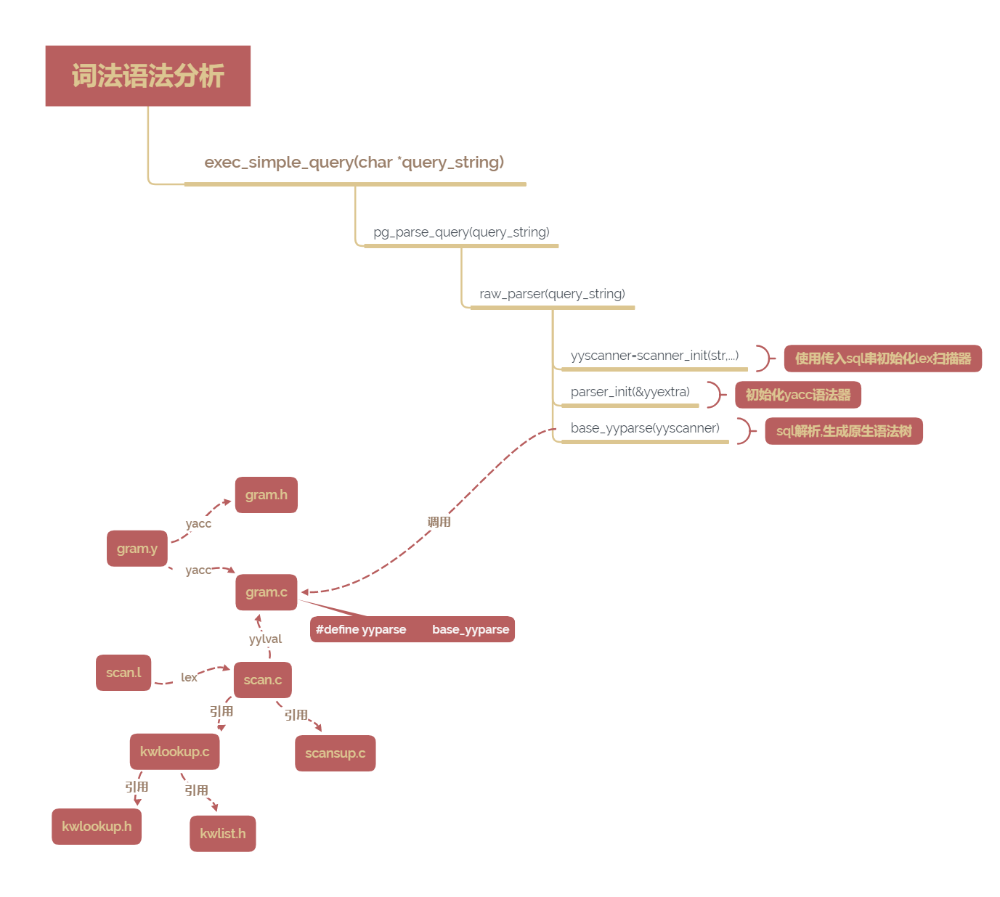
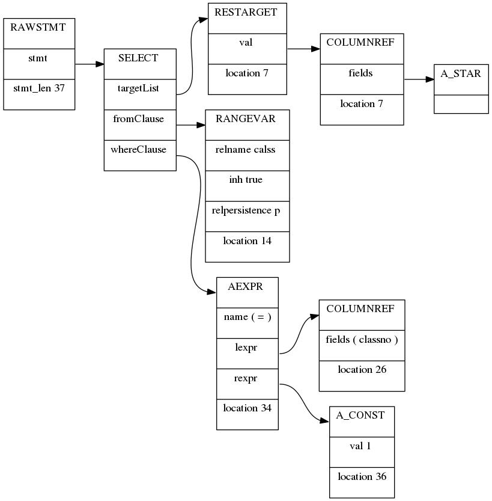

---
layout:	post
title:	"postgres词法语法解析"
date:	2022-04-27 15:58:00 +0800
categories:	[postgres]
---

[TOC]

## 1. 概述

词法语法解析为SQL引擎的重要组成部分，其中词法分析和语法分析分别是借助词法工具lex和语法分析工具bison实现的。其中词法解析器主要把输入字符串分割成一个一个有意义的词块(token)，而语法分析则通过匹配规则将这些词彼此关联，最终形成一棵树形结构。而PG中通过词法和语法解析器的协作将SQL字符串转换成一棵结构化的语法树

## 2. flex

flex程序由三部分组成：定义部分、规则部分和用户子例程。各部分之间通过“%%”进行分隔，前两部分是必须的，但是它们的内容可以为空。第三部分和前面的"%%"可以省略

```tex
... 定义部分 ...
%%
... 规则部分 ...
%%
... 用户子例程 ...
```

### 2.1 定义部分

flex 提供一个机制用来在扫描器的说明中，而不是在flex 命令中控制选项。在扫描器的说明文件（flex 的输入文件）的第一段中使用%option 指令就可以实现。你可以用单个%option 指令指定多个选项，也可以使用多个%option指令。

​    %option 7bit，%option 8bit——指示flex生成一个7bit或8bit的扫描器与-7，-8 选项等价。

​    %option backup——生成一个备份信息到lex.backup，与-b选项等价。

​    %option caseful，%option case-sensitive——区分大小写，与-i相反。

​    %option case-insensitive，%option caseless——忽略大小写，与-i选项等价。

​    %option debug——让生成的扫描器运行在debug模式，与-d选项等价。

​    %option default，%option nodefault——%default与-s选项相反，后者与其等价。-s选项作用：使不匹配的输入回显到输出设备的rule失去作用。在此种情况下，如果扫描器不能匹配到任何规则rule的输入，它会终止并返回错误。在查找扫描器的规则漏洞时，-s和%option nodefault都非常有用

### 2.2 规则部分

规则部分包含模式（pattern）和动作（action），其中模式不能有缩进，而且动作必须在同一行上跟在动作后面。词法分析器从状态0开始，该状态也被称为**INITIAL**。其它状态必须在定义部分通过%s或者%x行来命名。当前起始状态可以通过YY_START（也被称为YYSTATE）获得。其中%s和%x分别为共享模式和独占模式:

```
%s（共享模式）:包含性条件，具有给定开始条件的规则将处于激活状态，那么没有开始的规则将处于被激活状态。
	举例：
		%s example
		%%
		<example>foo   do_something();
		bar            something_else();	
		等价于：
		%x example
		%%
		<example>foo   do_something();
		<INITIAL,example>bar    something_else();
		如果没有`<INITIAL，example>'限定符，则第二个示例中的“bar”模式在启动条件“example”时不会处于活动状态（即，不匹配）。 但是，如果我们只是使用`<example>'来限定`bar'，那么它只会在`example'中而不是在INITIAL中有效，而在第一个例子中它在两个中都是有效的，因为在第一个例子中， 开始条件是包容性（`％s'）开始条件。

共享模式实现左上下文相关实例：
	%s MYSTATE
	%%
	first { BEGIN MYSTATE;}
	...
	<MYSTATE>second { BEGIN INITIAL; }
	该模式中second记号只在first记号匹配后才能被匹配。而且两个记号之间允许存在其他插入的记号，该模式可以用于从一个记号传递上下文信息到另一个单词。
三种右上下文相关方法：
	法1：特殊的行尾模式：在模式末尾的字符$使得该模式在行尾得到匹配
	法2：斜杠操作符：模式中的字符/让你可以包含显示尾部上下文，如，abc/de可以匹配记号abc，但仅仅在后面跟随着de的情况。lex在决定多个模式中哪个具有最长匹配时会计算尾部上下文字符的个数，但是这些字符不会出现在yytext里，也不会被计算在yyleng中
	法3：yyless():函数yyless让lex推回刚刚读到的记号，yyless()的参数表明需要保留的字符个数，如：abcde {yyless(3);}这个例子与abc/de的效果基本一致，因为yyless的调用保留了该记号的三个字符并且回推了另外两个字符。唯一的区别是在这个例子里，yytext包含所有字符和yylengh的值为5而不是3
		
%x（独占模式）:排他性，具有给定开始条件的规则将处于激活状态，而具有其他开始条件的规则将处于非激活状态。--重要

开始一个条件处理块：
		如:BEGIN(XB);        //二进制字符串开始条件
		   BEGIN(INITIAL);         //结束当前条件。休眠所有条件模式，回到开始状态。
PG中独占模式用例：
	%x xb
	%x xc
	%x xd
	%x xh
	%x xq
	%x xqs
	%x xe
	我们可以任意指定独占模式，如%x aaa,在规则段中我们可以指定条件开始用aaa独占模式，如BEGIN(aaa)

```

### 2.3 lex变量及函数

<table border='1'>
    <tr>
        <td>函数名</td>
    	<td>描述</td>
    </tr>
    <tr>
        <td>yytext</td>
        <td>指向当前匹配词法单元的指针，即匹配文本</td>
    </tr>
	<tr>
        <td>yyleng</td>
    	<td>yytext的长度</td>
    </tr>
    <tr>
        <td>ECHO</td>
    	<td>相当于printf，输出当前匹配的词法单元</td>
    </tr>
    <tr>
        <td>BEGIN</td>
    	<td>在起始状态间切换，扫描状态从状态(state)0开始</td>
    </tr>
    <tr>
        <td>yyless(n)</td>
    	<td>推回除标记开头的n个字符以外的所有字符(同unput)，常用于标记之间边界的规则不方便为正则表达式时,或者用于起始状态的规则重新处理标记时，如：token {BEGIN OTHER_STATE;yyless(0);}使用另一个起始状态，推回所有字。</td>
    </tr>
    <tr>
    	<td>unput</td>
    	<td>例程unput将字符c返回给输入流</td>
    </tr>
    <tr>
    	<td>yylex</td>
    	<td>lex创建的扫描程序入口。调用yylex启动或重新开始扫描</td>
    </tr>
    <tr>
    	<td>yymore</td>
    	<td>可以从与规则相关的代码中调用，这条推责使lex给这个标记附加下一个标记，常与yyless一起使用与标记边界正则不方便时</td>
    </tr>
    <tr>
        <td>yywrap</td>
        <td>当词法分析程序与发遇到文件结尾时，调用yywrap()来找出下一步要做什么，返回0就继续扫描，返回1就报告文件结尾的零标记</td>
    </tr>
</table>

### 2.4 词法编译

```
flex xxx(编译为lex.yy.c)
gcc lex.yy.c -lfl(默认为a.out)
./a.out
```

## 3. bison

语法解析器的语法和词法解析器一样由三个部分组成(定义段、规则段和用户子例程段)

### 3.1 规则

定义段通常包括声明和#include行。可能有%union、%start、%token等，在简单的语法分析程序中，定义段也可以是空。在定义符号优先级时，先定义的优先级低，后定义的优先级高，同行优先级相同。

<table border='1'>
    <tr>
        <td>$$、$1、$2...</td>
        <td>动作，$$指冒号左边符号的值，$1表示冒号右边第一个符号的值，以此类推</td>
    </tr>
    <tr>
        <td>%token</td>
        <td>定义终结符，终结符不能再继续推导，被修饰的标记还可以被%left、%right或%nonassoc进行声明，其中标记的值存储于yylval变量中</td>
    </tr>
    <tr>
        <td>%type</td>
        <td>声明非终结符的类型，如:%type <type> name,其中type名字必须由%union定义</td>
    </tr>
    <tr>
        <td>%union</td>
        <td>声明标识符号值的所有可能的C类型</td>
    </tr>
    <tr>
        <td>%left、%right、%nonassoc</td>
        <td>左结合、右结合、非结合(终结符不能连续出现，比如连等，连续大于等)</td>
    </tr>
    <tr>
        <td>%start</td>
        <td>开始声明，通常语法分析程序开始进行分析是在第一个规则里命名的，如果要以其它的规则开始，在声明部分使用 </td>
    </tr>
    <tr>
        <td>YYDEBUG</td>
        <td>用于产生语法调试信息，如打开调试信息：#define YYDEBUG 1</td>
    </tr>
</table>


### 3.2 歧义和冲突

语法分析时可能发生两种冲突：移进/规约和规约/规约。**移进/规约**冲突是当输入的字符串由两种可能的分析，而且其中一个分析完成一个规则，而另一个确没有(移进)时，该冲突就发生了，该类冲突可采用优先级、结合性和操作符声明来解决。**规约/规约**冲突发生在同样的标记可以完成两个不同的规则时，即冒号右边规则一样，左边却有不同规则。

```
--移进/规约冲突，当移进到A时不知道该继续移进x中的R还是该规约A为规则y
start: x
	| y R
x: A R;
y: A ;
--规约/规约冲突,即A不知道规约为x还是y
start: x
	| y ;
x:A;
y:A;
```

### 3.3 冲突解决

解决方法：通过**`bison -d -v xxx.y`**命令编译语法文件，生成xxx.output调试信息，如果有冲突，则在output文件中查找冲突位置，通常解决冲突有一下三个方案：

方案一：修改规则，应该最先考虑这方案

方案二：声明操作符优先级

方案三：使用%expect n声明，当有n个移进/规约冲突时，就不会有警告产生

### 3.4 语法编译

```
bison -d xxx(编译为xxx.tab.c和xxx.tab.h)
gcc xxx.tab.c
./a.out
--语法解析调试
bison -d -v xxx.y(生成xxx.output调试文件)
```

## 4. PG中的词法语法解析

PG中有很多地方用到词法语法解析，后台的SQL词法语法解析，其大体运行框架如下：

<p>
    
</p>

### 4.1 词法解析

pg中词法解析主要由scan.l文件完成，在该词法文件中主要输入的SQL字符串切割为一个一个的词块，有些词块为关键字，数字和操作符等等，所以当我们新增SQL语法时，添加关键字就需要在kwlist.h文件中，然后词法解析器匹配到identifier时然后会查找关键字列表，如果为关键字，则返回关键字符号,一下为词法解析的初始化以及标记和数值的识别过程：

```c
//scan.l
digit			[0-9]
integer			{digit}+
decimal			(({digit}*\.{digit}+)|({digit}+\.{digit}*))
decimalfail		{digit}+\.\.
real			({integer}|{decimal})[Ee][-+]?{digit}+
realfail		({integer}|{decimal})[Ee][-+]
 
ident_start		[A-Za-z\200-\377_]
ident_cont		[A-Za-z\200-\377_0-9\$]
identifier		{ident_start}{ident_cont}*
%%
{integer}		{
					SET_YYLLOC();
					return process_integer_literal(yytext, yylval);
				}
{decimal}		{
					SET_YYLLOC();
					yylval->str = pstrdup(yytext);
					return FCONST;
				}
{decimalfail}	{
					/* throw back the .., and treat as integer */
					yyless(yyleng - 2);
					SET_YYLLOC();
					return process_integer_literal(yytext, yylval);
				}
{real}			{
					SET_YYLLOC();
					yylval->str = pstrdup(yytext);
					return FCONST;
				}
{realfail}		{
					SET_YYLLOC();
					yyerror("trailing junk after numeric literal");
				}
{identifier}	{
					int			kwnum;
					char	   *ident;

					SET_YYLLOC();

					/* 关键字列表中查看是否为关键字 */
					kwnum = ScanKeywordLookup(yytext,
											  yyextra->keywordlist);
					if (kwnum >= 0)
					{//是关键字，返回关键字符号
						yylval->keyword = GetScanKeyword(kwnum,
														 yyextra->keywordlist);
						return yyextra->keyword_tokens[kwnum];
					}

					/*
					 * 不是关键字，将标识符转换为小写，必要时需截断标识符，并返回IDENT
					 */
					ident = downcase_truncate_identifier(yytext, yyleng, true);
					yylval->str = ident;
					return IDENT;
				}
%%
/*
 * 词法解析初始化必须在语法解析前
 */
core_yyscan_t
scanner_init(const char *str,
			 core_yy_extra_type *yyext,
			 const ScanKeywordList *keywordlist,
			 const uint16 *keyword_tokens)
{
	Size		slen = strlen(str);
	yyscan_t	scanner;

	if (yylex_init(&scanner) != 0)//初始化词法解析器
		elog(ERROR, "yylex_init() failed: %m");

	core_yyset_extra(yyext, scanner);

	/* 初始化词法解析器关键字列表 */
	yyext->keywordlist = keywordlist;
	yyext->keyword_tokens = keyword_tokens;

	yyext->backslash_quote = backslash_quote;
	yyext->escape_string_warning = escape_string_warning;
	yyext->standard_conforming_strings = standard_conforming_strings;

	/*
	 * 使用 flex 所需的特殊终止创建扫描缓冲区
	 */
	yyext->scanbuf = (char *) palloc(slen + 2);
	yyext->scanbuflen = slen;
	memcpy(yyext->scanbuf, str, slen);
	yyext->scanbuf[slen] = yyext->scanbuf[slen + 1] = YY_END_OF_BUFFER_CHAR;
	yy_scan_buffer(yyext->scanbuf, slen + 2, scanner);

	/* initialize literal buffer to a reasonable but expansible size */
	yyext->literalalloc = 1024;
	yyext->literalbuf = (char *) palloc(yyext->literalalloc);
	yyext->literallen = 0;

	return scanner;
}
```

当我们输入`select * from calss where classno = 1`;的SQL经过词法解析后输出是`SELECT * FROM IDENT WHERE IDENT=ICONST;`其中select、from和where是关键字，返回关键字，非关键字test和no返回IDENT，数值1经过process_integer_literal函数返回ICONST

### 4.2 语法解析

通过**parser_init**初始化bison分析器，然后执行**base_yyparse**执行语法解析。再看gram.y对select语句的解析：

```
%type <list> parse_toplevel stmtmulti
%type <node>	stmt toplevel_stmt SelectStmt
%type <node>	select_no_parens select_with_parens simple_select
...
%%
/* 所有语法树的根都以RawStmt为结构 */
parse_toplevel:
	stmtmulti
	{
		pg_yyget_extra(yyscanner)->parsetree = $1;
	}
stmtmulti:
	toplevel_stmt
	{
		$$ = list_make1(makeRawStmt($1, 0));
	}
toplevel_stmt:
			stmt;
stmt:	SelectStmt;
SelectStmt: select_no_parens			%prec UMINUS
			| select_with_parens		%prec UMINUS
		;
select_no_parens:
			simple_select						{ $$ = $1; }
simple_select:
			SELECT opt_all_clause opt_target_list
			into_clause from_clause where_clause hierarchical_query_clause
			group_clause having_clause window_clause
				{
					SelectStmt *n = makeNode(SelectStmt);
					n->targetList = $3;
					n->intoClause = $4;
					n->fromClause = $5;
					n->whereClause = $6;
					n->hierarClause = $7;
					n->groupClause = ($8)->list;
					n->groupDistinct = ($8)->distinct;
					n->havingClause = $9;
					n->windowClause = $10;
					$$ = (Node *)n;
				}

/* 解析投影列信息 */
opt_target_list：target_list;
target_list:
			target_el     { $$ = list_make1($1); }
		  | target_list ',' target_el                             { $$ = lappend($1, $3); }
		  ;
target_el:a_expr AS ColLabel
			{
				...
			}
		| '*'
			{
				 ColumnRef *n = makeNode(ColumnRef);
				 n->fields = list_make1(makeNode(A_Star));
				 n->location = @1;
				 $$ = makeNode(ResTarget);
				 $$->name = NULL;
				 $$->indirection = NIL;
				 $$->val = (Node *)n;
				 $$->location = @1;
			}
		;

/* 解析from子句 */
from_clause:
		FROM from_list                 { $$ = $2; } ;
from_list: table_ref                   { $$ = list_make1($1); }
		 | from_list ',' table_ref     { $$ = lappend($1, $3); }
table_ref:   relation_expr opt_alias_clause
		        {
		        	$1->alias = $2; 
		            $$ = (Node *) $1;
                }
          ;
relation_expr: qualified_name
				{
					$$ = $1;
					$$->inh = true;
					$$->alias = NULL;
				}
		   ;
qualified_name:
		       ColId
				{
					$$ = makeRangeVar(NULL, $1, @1);
				}
			;
ColId:          IDENT                   { $$ = $1; }
		      | unreserved_keyword      { $$ = pstrdup($1); }
		      | col_name_keyword        { $$ = pstrdup($1); }
		    ;

/* where子句 */
where_clause:	WHERE a_expr            { $$ = $2; } 
			| /*EMPTY*/                 { $$ = NULL; }
			;
a_expr:         c_expr                  { $$ = $1; }
			| a_expr '=' a_expr
				{
					$$ = (Node *) makeSimpleA_Expr(AEXPR_OP, "=", $1, $3, @2);
				}
c_expr:     columnref                               { $$ = $1; }
            | AexprConst                            { $$ = $1; }
            ;
AexprConst: Iconst
	            {
	                $$ = makeIntConst($1, @1);
	            }
	         | FCONST
	            {
	                $$ = makeFloatConst($1, @1);
	            }
	         | Sconst
	            {
	                $$ = makeStringConst($1, @1);
                }
             ;
```

所以经过词法解析器处理后的`SELECT * FROM IDENT WHERE IDENT=ICONST;`经过语法解析器后变成了一棵语法树,如下所示：

<p>
    
</p>

### 4.3 添加关键字

怎么添加一个关键字，比如添加一个关键字NOORDER：

```
步骤一:在src/include/parser/kwlist.h文件中再合适位置(asccii字节排序)添加NOORDER关键字
/* name, value, category, is-bare-label */
PG_KEYWORD("noorder", NOORDER, UNRESERVED_KEYWORD, AS_LABEL)
步骤二：在src/backend/parser/gram.y的%token <keyword>添加关键字NOORDER
步骤三：在src/backend/parser/gram.y的unreserved_keyword中添加关键字NOORDER
```

## 5. 总结

通过词法语法解析器，PG成功的将SQL字符串转换成了结构化的树结构，结构化后对于编程语言来说带来了极大的便利，为后续的语法解析查询重写打下了基础。
