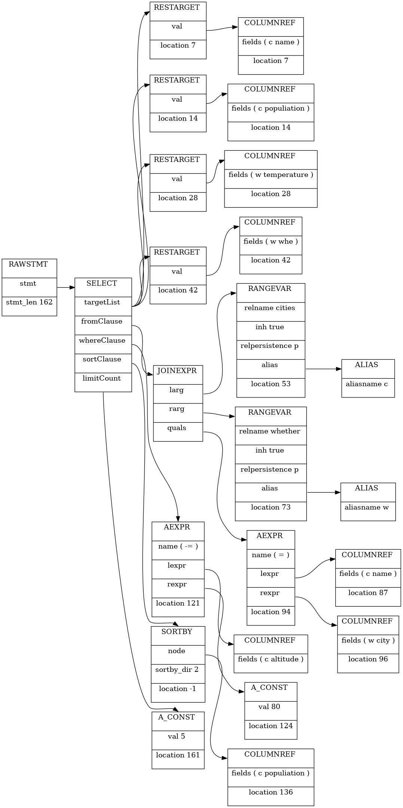
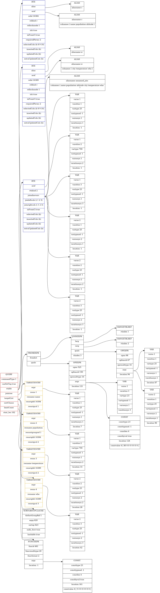
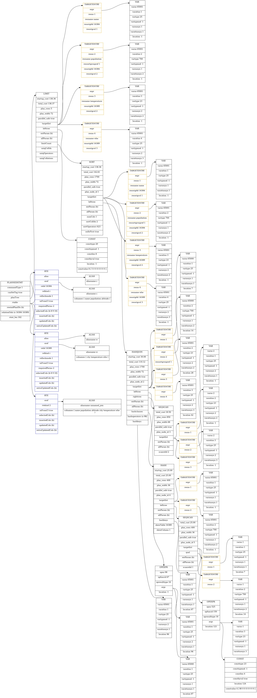

---
layout:	post
title:	"postgres查询处理分析"
date:	2021-07-26 15:58:00 +0800
categories:	[postgres]
---

> 源码解析

```c
static void
exec_simple_query(const char *query_string)
{
    start_xact_command();//开启事务
    parsetree_list = pg_parse_query(query_string);//根据传入字符串生成语法解析树
    foreach(parsetree_item, parsetree_list)
    {//分析语法树
        RawStmt    *parsetree = lfirst_node(RawStmt, parsetree_item);
        querytree_list = pg_analyze_and_rewrite(parsetree, query_string,NULL, 0, NULL);//分析和重写
        {
            /*根据语法解析树生成查询树*/
            query = parse_analyze(parsetree, query_string, paramTypes, numParams,queryEnv);
			querytree_list = pg_rewrite_query(query);//对查询树进行重写
        }
        /*计划器：基于查询树生成一棵执行效率最高的计划树*/
        plantree_list = pg_plan_queries(querytree_list, query_string,CURSOR_OPT_PARALLEL_OK, NULL);
    }
}
```

> 关键结构

```c
//select语法解析树
typedef struct SelectStmt
{
	NodeTag		type;
	
    List	   *distinctClause; /*用于distinct子句*/
	IntoClause *intoClause;		/* SELECT INTO的目标 */
	List	   *targetList;		/* 需显示属性列(of ResTarget) */
	List	   *fromClause;		/* from子句 */
	Node	   *whereClause;	/* WHERE条件限定 */
	List	   *groupClause;	/* GROUP BY 子句 */
	Node	   *havingClause;	/* HAVING 条件子句 */
	List	   *windowClause;	/* WINDOW window_name AS (...), ... */
	List	   *sortClause;		/* sort 子句 */
	Node	   *limitOffset;	/* # of result tuples to skip */
	Node	   *limitCount;		/* # 返回元祖数（limit子句） */
	LimitOption limitOption;	/* limit type */
	List	   *lockingClause;	/* FOR UPDATE (list of LockingClause's) */
	WithClause *withClause;		/* WITH clause */

	SetOperation op;			/* type of set op */
	bool		all;			/* ALL specified? */
	struct SelectStmt *larg;	/* left child */
	struct SelectStmt *rarg;	/* right child */
	/* Eventually add fields for CORRESPONDING spec here */
} SelectStmt;
//语法树解析返回query
typedef struct Query
{
	NodeTag		type;

	CmdType		commandType;	/* select|insert|update|delete|utility */

	QuerySource querySource;	/* where did I come from? */
	uint64		queryId;		/* query identifier (can be set by plugins) */
	bool		canSetTag;		/* do I set the command result tag? */
	Node	   *utilityStmt;	/* non-null if commandType == CMD_UTILITY */

	int			resultRelation; /* rtable index of target relation for
								 * INSERT/UPDATE/DELETE; 0 for SELECT */
	bool		hasAggs;		/* has aggregates in tlist or havingQual */
	bool		hasWindowFuncs; /* has window functions in tlist */
	bool		hasTargetSRFs;	/* has set-returning functions in tlist */
	bool		hasSubLinks;	/* has subquery SubLink */
	bool		hasDistinctOn;	/* distinctClause is from DISTINCT ON */
	bool		hasRecursive;	/* WITH RECURSIVE was specified */
	bool		hasModifyingCTE;	/* has INSERT/UPDATE/DELETE in WITH */
	bool		hasForUpdate;	/* FOR [KEY] UPDATE/SHARE was specified */
	bool		hasRowSecurity; /* rewriter has applied some RLS policy */

	List	   *cteList;		/* WITH list (of CommonTableExpr's) */
	List	   *rtable;			/* list of range table entries */
	FromExpr   *jointree;		/* table join tree (FROM and WHERE clauses) */
	List	   *targetList;		/* target list (of TargetEntry) */
	OverridingKind override;	/* OVERRIDING clause */
	OnConflictExpr *onConflict; /* ON CONFLICT DO [NOTHING | UPDATE] */
	List	   *returningList;	/* return-values list (of TargetEntry) */
	List	   *groupClause;	/* a list of SortGroupClause's */
	List	   *groupingSets;	/* a list of GroupingSet's if present */
	Node	   *havingQual;		/* qualifications applied to groups */
	List	   *windowClause;	/* a list of WindowClause's */
	List	   *distinctClause; /* a list of SortGroupClause's */
	List	   *sortClause;		/* a list of SortGroupClause's */
	Node	   *limitOffset;	/* # of result tuples to skip (int8 expr) */
	Node	   *limitCount;		/* # of result tuples to return (int8 expr) */
	LimitOption limitOption;	/* limit type */
	List	   *rowMarks;		/* a list of RowMarkClause's */
	Node	   *setOperations;	/* set-operation tree if this is top level of
								 * a UNION/INTERSECT/EXCEPT query */
	List	   *constraintDeps; /* a list of pg_constraint OIDs that the query
								 * depends on to be semantically valid */
	List	   *withCheckOptions;	/* a list of WithCheckOption's (added
									 * during rewrite) */
	int			stmt_location;	/* start location, or -1 if unknown */
	int			stmt_len;		/* length in bytes; 0 means "rest of string" */
} Query;

//计划树
typedef struct PlannedStmt
{
	NodeTag		type;

	CmdType		commandType;	/* select|insert|update|delete|utility */

	uint64		queryId;		/* query identifier (copied from Query) */

	bool		hasReturning;	/* is it insert|update|delete RETURNING? */

	bool		hasModifyingCTE;	/* has insert|update|delete in WITH? */

	bool		canSetTag;		/* do I set the command result tag? */

	bool		transientPlan;	/* redo plan when TransactionXmin changes? */

	bool		dependsOnRole;	/* is plan specific to current role? */

	bool		parallelModeNeeded; /* parallel mode required to execute? */

	int			jitFlags;		/* which forms of JIT should be performed */

	struct Plan *planTree;		/* tree of Plan nodes */

	List	   *rtable;			/* list of RangeTblEntry nodes */

	/* rtable indexes of target relations for INSERT/UPDATE/DELETE */
	List	   *resultRelations;	/* integer list of RT indexes, or NIL */

	/*
	 * rtable indexes of partitioned table roots that are UPDATE/DELETE
	 * targets; needed for trigger firing.
	 */
	List	   *rootResultRelations;

	List	   *appendRelations;	/* list of AppendRelInfo nodes */

	List	   *subplans;		/* Plan trees for SubPlan expressions; note
								 * that some could be NULL */

	Bitmapset  *rewindPlanIDs;	/* indices of subplans that require REWIND */

	List	   *rowMarks;		/* a list of PlanRowMark's */

	List	   *relationOids;	/* OIDs of relations the plan depends on */

	List	   *invalItems;		/* other dependencies, as PlanInvalItems */

	List	   *paramExecTypes; /* type OIDs for PARAM_EXEC Params */

	Node	   *utilityStmt;	/* non-null if this is utility stmt */

	/* statement location in source string (copied from Query) */
	int			stmt_location;	/* start location, or -1 if unknown */
	int			stmt_len;		/* length in bytes; 0 means "rest of string" */
} PlannedStmt;
```


> 用例

```sql
Create table cities(
Name text,
Populiation real,
Altitude int
);
create table whether(
city text,
temperature int,
whe text);

insert into cities values ('chengdu',13000000,50);
insert into cities values ('hangzhou',10000000,120);
insert into cities values ('shanghai',22000000,150);
insert into cities values ('shenzhen',20000000,90);

insert into whether values('chengdu',35,'晴');
insert into whether values('hangzhou',36,'晴');
insert into whether values('neimenggu',25,'多云');
insert into whether values('hangzhou',32,'小雨');
insert into whether values('shanghai',38,'雷雨');

select c.name,c.Populiation,w.temperature,w.whe from cities c INNER JOIN whether w ON (c.name = w.city) where c.Altitude >= 80 order by c.Populiation desc limit 5;
```

> 词法语法解析器

其查询语句经过词法语法解析器后生成如下图所示的语法解析树：

<p>
    
</p>


- 返回的每一列被转换成ResTarget结构
- from子句中的join子句被转换为JoinExpr结构，如果是单纯的表则转换为Rangevar结构
- where子句被转换成了A_Expr结构
- sort子句被转换成了SortBy结构
- limit子句被转换成了SelectLimit结构


> 分析器


<p>
    
</p>

Query中重要的几个结构：

- rtable：范围表条目列表，将语法树中的fromClause树拉直，将其各个节点转换成RangeTblEntry水平链表
- jointree：表连接树，来自于whereClause的和fromClause中的join链表：qry->jointree = makeFromExpr(pstate->p_joinlist, qual);
- targetList：为语法树中的targetList的ResTarget列表转换为TargetEntry列表
- sortClause：将SortBy结构转换为SortGroupClause结构
- limitCount：将A_const转换为funcexpr结构


> 重写器

重写器会基于relation->rd_rules中的规则将rangetable节点重写为一个查询子树与查询相对应。在这个查询中不做处理。


> 计划器


<p>
    
</p>

> 计划器

rtable：存储两个表信息和一个join信息

plantree：为一个limit结构

计划器的作用就是选择一种代价最小的执行方案，其中最耗时的是表连接操作，其核心思想是“先做选择操作，后做连接操作”，因为先做选择操作可以减少表连接的数据量。
