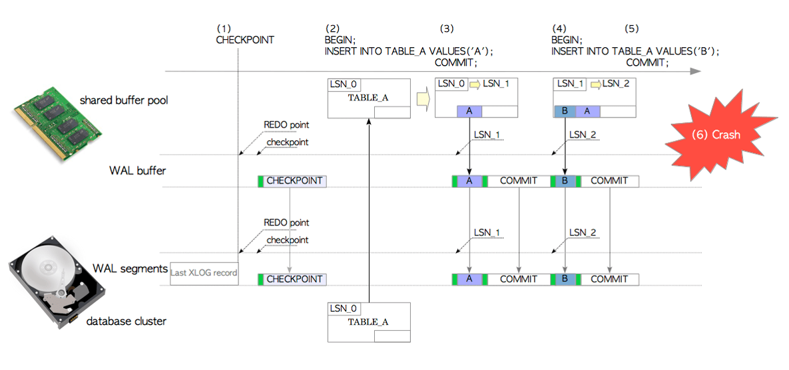

# 预写日志——WAL

## WAL历史

WAL（Write-Ahead logging,预写日志）首先在PG的7.1版本出现，WAL的出现主要是为了保证即使发生故障也不丢失任何数据。在7.0以及更早版本。PG通过每次更改内存中的页面时发出同步系统调用来同步写入磁盘，以确保更改的内容丢失，但是这使INSERT和UPDATE等修改命令的性能非常差。WAL的出现不仅极大的提升了PG的性能，还衍生出即时恢复（PITR）和流复制（SR）技术。

数据库在执行事务的过程中，会首先将对数据的操作过程记录在WAL中，当数据库发生崩溃时，能够使用wal操作记录，将数据恢复到崩溃前的状态。日志有几种记录方式，一是REDO、二是UNDO、还有一种是REDO/UNDO日志，REDO允许我们重新进行对数据的修改，UNDO允许我们撤销对数据的修改，REDO/UNDO日志是上面两种的结合。Postgres中WAL是REDO类型的。（社区的Zheap,该存储引擎使用了新的日志格式，包含UNDO日志，能够很好的解决PG数据库膨胀问题）

> !为什么同样是数据都要落盘，wal落盘就提高PG性能？因为WAL严格按照顺序写，而tuple写为随机写。而且我们可以获得更多的好处。

## WAL概述

### 带wal的插入操作

XLOG记录通过更改操作（例如插入、删除或提交操作）写入内存中的wal缓冲区，当事务提交/中止时，它们会立即写入存储上的wal文件。下图就是带WAL的插入元祖的说明：

<p>
    
</p>

1. checkpointer,一个后台进程，周期性的执行checkpointing。每当检查点启动时，它都会将一个名为**检查点记录**的XLOG记录写入当前WAL段。此记录包含最新REDO点的位置。

2. 发出第一条INSERT语句，PG将TABLE_A的页面加载到共享缓冲池中，在页面中插入元祖，创建该语句的XLOG记录并将其写入位置LSN_1的WAL缓冲区中，并更新TABLE_A的LSN为LSN_1。这个例子中XLOG记录的是一对header-data和元祖whole。

3. 当这个事务提交时，PG会创建这个提交操作的XLOG记录并将其写入WAL缓冲区，然后将WAL缓冲区上所有XLOG记录写入并刷新到WAL段文件。

4. 发出第二条INSERT语句，PG在页面中插入一条新元祖，创建并写入这个元祖的XLOG记录到LSN_2处的WAL缓冲区，并将TABLE_A的LSN从LSN_1更新到LSN_2。

5. 当这个事务提交事，该步骤和第三步操作相同。

6. 无论在何时发生crash，及时共享缓冲池上的所有数据都丢失了，页面的所有操作都已经记录到WAL文件了。

### 使用WAL进行数据库恢复

   <p>
       
   </p>
1.  PG从相应的WAL段文件中读取第一个INSERT语句的XLOG记录，将TABLE_A的页面从数据库集群加载到共享缓冲池中。
2.  在尝试重放WAL记录之前，PG会比较XLOG记录的LSN和对应页面的LSN,重放XLOG记录的规则为：如果XLOG记录的LSN大于页面的LSN，则将XLOG记录的数据部分插入到页面中，并将页面的LSN更新为XLOG记录的LSN。另一方面，如果XLOG记录的LSN较小，则只能读取下一个WAL数据。
3. PG以同样的方式重放剩余的XLOG记录。

## LSN(log sequence number)

LSN(PageXLogRecPtr pd_lsn)表示XLOG记录写入到事务日志中的位置，也是redo位置，记录的LSN被用作XLOG记录的唯一标识符（在表页面中存储着最新LSN号），LSN编号规则：1/21E0498（高32为/低32位），WAL日志文件名称为24个字符（如：000000010000000000000003），由三个部分组成：1）前8位表示timeLine，2）中间8位表示logid，3）后8位表示logseg。

> xlog文件格式如下：
>
> -rw------- 1 postgres postgres 16777216 Nov  2 17:09 000000010000000000000006
>
> -rw------- 1 postgres postgres 16777216 Oct 12 10:50 000000010000000000000007
>
> xlog文件名格式公式：
>
> ​	xlog文件名 = TimeLine + ((LSN - 1)/16M)/256 + ((LSN -1)/16M)%256
>
> **注意：DEFAULT_XLOG_SEG_SIZE默认为16M，当初始化更改日志大小时，上面公式公式中的16M替换为对应大小。**
>
> 怎么根据LSN和timeline推导出对应xlog文件？
>
> ​	例如：LSN为：1/21E0498
>
> ​		根据公式得到logseg只有最后两位有值，即logseg最大为0x000000ff（256），256*16M = 4G，即LSN低32位最大支持4G的日志，超过4G后logid加一，然后logseg继续从0~ff写256个16M的文件，以此类推。
>
> LSN号能求得对应xlog偏移量？
>
> ​	看公式，lsn减一除以16M，16M为2的24次方。相当于21E0498向左移动3个字节，商为logseg(2),余数为1E0498(十进制为1967256)，所以1967256就是lsn号1/21E0498在xlog中的偏移位置。所以LSN号后三个字节代表xlog偏移数量，倒数第四个字节代表logseg，分号前32位代表logid。
>
> PG中可以通过pg_walfile_name_offset函数获取LSN号对应的xlog文件及其偏移：
>
> postgres=# select pg_walfile_name_offset('1/21');
>
> ​       pg_walfile_name_offset       
>
>  (000000010000000100000002,1967256)
> (1 row)

## XLOG日志结构

<p>
    
</p>

### XLOG相关结构

所有XLOG记录都由结构XLogRecord定义通用头部分：

```c
//段文件第一个block都是XLogLongPageHeaderData结构
typedef struct XLogLongPageHeaderData
{
	XLogPageHeaderData std;		/* 标准头信息 */
	uint64		xlp_sysid;		/* 系统标识符来源于 pg_control */
	uint32		xlp_seg_size;	/* 段文件大小*/
	uint32		xlp_xlog_blcksz;	/* 块大小 */
} XLogLongPageHeaderData;

//后续block都使用XLogPageHeaderData结构
typedef struct XLogPageHeaderData
{
	uint16		xlp_magic;		/* 魔数，验证合法性 */
	uint16		xlp_info;		/* 记录属性，用于如何解析页面内容 */
	TimeLineID	xlp_tli;		/* TimeLineID */
	XLogRecPtr	xlp_pageaddr;	/* 定位该页面在wal中的物理位置 */
	uint32		xlp_rem_len;	/* 记录跨页记录的长度 */
} XLogPageHeaderData;
//xlp_info可以为一下值
#define XLP_FIRST_IS_CONTRECORD		0x0001 //如果record跨页了，在新页设置该参数
#define XLP_LONG_HEADER				0x0002 //表示long page header
#define XLP_BKP_REMOVABLE			0x0004 //表示从本页开始的备份块是可选的
#define XLP_FIRST_IS_OVERWRITE_CONTRECORD 0x0008 //替换缺失的记录
#define XLP_ALL_FLAGS				0x000F//所有标志都已打开

/*
 * XLOG record的整体布局如下:
 *		Fixed-size header (XLogRecord struct)
 *		XLogRecordBlockHeader struct
 *		XLogRecordBlockHeader struct
 *		...
 *		XLogRecordDataHeader[Short|Long] struct
 *		block data
 *		block data
 *		...
 *		main data
 */
typedef struct XLogRecord
{
	uint32		xl_tot_len;		/* 整个记录的长度 */
	TransactionId xl_xid;		/* 事务ID */
	XLogRecPtr	xl_prev;		/* 指向log的前一个record指针 */
	uint8		xl_info;		/* 标志位，见下文 */
	RmgrId		xl_rmid;		/* 这条记录的资源管理器 */
	/* 2 bytes of padding here, initialize to zero */
	pg_crc32c	xl_crc;			/* 该记录的CRC */
} XLogRecord;
//xl_info和xl_rmid是相关变量的资源管理器，比如发出INSERT语句，则xl_rmid和xl_info分别设置为“RM_HEAP”和“XLOG_HEAP_INSERT”，恢复数据库集群时，根据xl_info选择RM_HEAP的函数heap_xlog_insert()重放这条xlog记录

typedef struct XLogRecordBlockHeader
{
	uint8		id;				/* block reference ID */
	uint8		fork_flags;		/* fork within the relation, and flags */
	uint16		data_length;	/* number of payload bytes (not including page
								 * image) */

	/* If BKPBLOCK_HAS_IMAGE, an XLogRecordBlockImageHeader struct follows */
	/* If BKPBLOCK_SAME_REL is not set, a RelFileLocator follows */
	/* BlockNumber follows */
} XLogRecordBlockHeader;

typedef struct XLogRecordDataHeaderShort
{
	uint8		id;				/* XLR_BLOCK_ID_DATA_SHORT */
	uint8		data_length;	/* number of payload bytes */
}XLogRecordDataHeaderShort;

#define SizeOfXLogRecordDataHeaderShort (sizeof(uint8) * 2)

typedef struct XLogRecordDataHeaderLong
{
	uint8		id;				/* XLR_BLOCK_ID_DATA_LONG */
	/* followed by uint32 data_length, unaligned */
}XLogRecordDataHeaderLong;
```


### XLOG记录的数据部分

常见的XLOG记录格式：

<p>
    
</p>

> Header部分包含零个或多个**XLogRecordBlockHeader**和零个或一个XLogRecordDataHeaderShort(或XLogRecordDataHeaderLong)；当其记录存储整页图像(即备份块)时，XLogRecordBlockHeader包括XLogRecordBlockImageHeader，如果其块被压缩，则包括XLogRecordBlockCompressHeader。

XLOG记录示例：

<p>
    
</p>

XLOG记录的数据部分分为备份数据块（整个页面）或非备份快（按操作不同数据）

INSERT语句创建的**备份块**如上图（a）所示。它由四种数据结构和一个数据对象组成，如下所示：

```tex
1. 结构XLogRecord(头部分)
2. XLogRecordBlockHeader包括一个XLogRecordBlockImageHeader结构
3. XLogRecordDataHeaderShort结构
4. 一个备份块(块数据)
5. 结构体xl_heap_insert(主数据)
解释：XLogRecordBlockHeader包括用于标识数据库集群中的块的变量(relfilenode、fork号、和块号)，XLogRecordBlockImageHeader包括这个块的长度和偏移量，XLogRecordDataHeaderShort存储xl_heap_insert结构的长度。
```

非备份块（如上图b所示）：

```tex
1. 结构XLogRecord(头部分)
2. XLogRecordBlockHeader
3. XLogRecordDataHeaderShort结构
4. 插入元祖(准确的说，是一个xl_heap_header结构和一个插入的数据整体)
5. 结构体xl_heap_insert(主数据，当为执行命令为update语句时，main data为xl_heap_update)
解释：新的xl_heap_insert只包含两个值：块内此元组的偏移量和可见性标志；它变得非常简单，因为 XLogRecordBlockHeader 存储了旧数据中包含的大部分数据

检查点的结构上如图(c)所示，它组成如下：
1. 结构XLogRecord(头部分)
2. 主数据长度包含的结构XLogRecordDataHeaderShort
3. 结构checkpoint(主数据)
```

## XLOG写入过程

```tex
1. 对要修改的页数据进行Pin和使用排他锁
2. START_CRIT_SECTION()，进入临界区，接下来的任何错误只会造成panic
3. 将所需的更改应用到共享缓冲区
4. MarkBufferDirty(buffer)，将修改的缓存标记为脏页，这个必须在插入wal记录之前
5. 如果关系需要记录在wal中，则执行一下步骤：
    XLogBeginInsert();//检查是否能进行wal插入操作
    XLogRegisterData(...);//将tupel的xl_heap_inser信息插入wal记录链表中(全局变量rdatas)
    XLogRegisterBuffer(...);//使用正在构造的 WAL 记录注册对缓冲区的引用，主要填充XLogRecordBlockHeader结构
    XLogRegisterBufData(...);//将特定于缓冲区的数据添加到正在构造的WALL记录中(更新全局变量rdatas->data) 
    recptr = XLogInsert(RM_HEAP_ID, info);//插入资源管理器信息和xlog的记录，该记录是被前面使用XLogRegister*调用注册的数据
    
    PageSetLSN(page, recptr);//更新页LSN号
6. END_CRIT_SECTION()，结束临界区
7. 解锁和unpin修改的缓存

```

#### WAL生成代码解析

```c
heap_insert()
{
	...
	if (RelationNeedsWAL(relation))
	{
		XLogBeginInsert();
		XLogRegisterData(&xlrec, SizeOfHeapInsert);//注册xl_heap_insert
		XLogRegisterBuffer(0, buffer, REGBUF_STANDARD | bufflags);//注册要修改的page
		XLogRegisterBufData(0, &xlhdr, SizeOfHeapHeader);//注册xl_heap_header
		XLogRegisterBufData(0,
							(char *) heaptup->t_data + SizeofHeapTupleHeader,
							heaptup->t_len - SizeofHeapTupleHeader);//注册插入tuple的数据
		XLogSetRecordFlags(XLOG_INCLUDE_ORIGIN);
		recptr = XLogInsert(RM_HEAP_ID, info);
		{
			do
			{
				GetFullPageWriteInfo(&RedoRecPtr, &doPageWrites);
				/* 将注册的数据和缓冲区组装成XLogRecdata链 */
				rdt = XLogRecordAssemble(rmid, info, RedoRecPtr, doPageWrites,
								 &fpw_lsn, &num_fpi, &topxid_included);
				{
					/* The record begins with the fixed-size header */
					rechdr = (XLogRecord *) scratch;
					scratch += SizeOfXLogRecord;
					hdr_rdt.next = NULL;
					rdt_datas_last = &hdr_rdt;
					hdr_rdt.data = hdr_scratch;
					/* 遍历注册的buffer */
					for (block_id = 0; block_id < max_registered_block_id; block_id++)
					{
						registered_buffer *regbuf = &registered_buffers[block_id];
						/* 拷贝XlogRecordBlockHeader */
						memcpy(scratch, &bkpb, SizeOfXLogRecordBlockHeader);
						scratch += SizeOfXLogRecordBlockHeader;
						if (include_image)
						{
							//fpi
							memcpy(scratch, &bimg, SizeOfXLogRecordBlockImageHeader);
							scratch += SizeOfXLogRecordBlockImageHeader;
							if (cbimg.hole_length != 0 && is_compressed)
							{
								memcpy(scratch, &cbimg,
									SizeOfXLogRecordBlockCompressHeader);
								scratch += SizeOfXLogRecordBlockCompressHeader;
							}
						}
						if (!samerel)
						{
							//拷贝RelFileLocator信息
							memcpy(scratch, &regbuf->rlocator, sizeof(RelFileLocator));
							scratch += sizeof(RelFileLocator);
						}
						memcpy(scratch, &regbuf->block, sizeof(BlockNumber));
						scratch += sizeof(BlockNumber);
					}
					*(scratch++) = (char) XLR_BLOCK_ID_DATA_SHORT;
					*(scratch++) = (uint8) mainrdata_len;//3,xl_heap_insert
					/* 组装Record数据 */
					rechdr->xl_xid = GetCurrentTransactionIdIfAny();
					rechdr->xl_tot_len = (uint32) total_len;
					rechdr->xl_info = info;
					rechdr->xl_rmid = rmid;
					rechdr->xl_prev = InvalidXLogRecPtr;
					rechdr->xl_crc = rdata_crc;
					
					return &hdr_rdt;
				}
				EndPos = XLogInsertRecord(rdt, fpw_lsn, curinsert_flags, num_fpi,
								  topxid_included);
				{
					/* 所有的record数据和头都组装完成，现在准备插入 */
					CopyXLogRecordToWAL(rechdr->xl_tot_len, rdata, StartPos, EndPos, insertTLI);
					{
						/* 获取wal的插入位置 */
						CurrPos = StartPos;
						currpos = GetXLogBuffer(CurrPos, tli);
						freespace = INSERT_FREESPACE(CurrPos);
						while (rdata != NULL)
						{//全部拷贝到currpos中
							const char *rdata_data = rdata->data;
							memcpy(currpos, rdata_data, rdata_len);
							currpos += rdata_len;
							CurrPos += rdata_len;
							freespace -= rdata_len;
							written += rdata_len;
					
							rdata = rdata->next;
						}
					}
					/* 更新全局变量*/
					ProcLastRecPtr = StartPos;
					XactLastRecEnd = EndPos;
					return EndPos;
				}
			}while (EndPos == InvalidXLogRecPtr);
			XLogResetInsertion();//重置WAL的record结构
			return EndPos;
		}
		PageSetLSN(page, recptr);//更新lsn
	}
}
```

关键函数为数据注册(XLogRegisterData,XLogRegisterBuffer和XLogRegisterBufData)，这些函数将注册的数据存储在rdata链表中。XLogRecordAssemble函数负责组装record的头部信息，并组装成XLogRecdata链，CopyXLogRecordToWAL进行最后的拷贝动作

#### WAL后台写入

```c
XLogBackgroundFlush()
{
	now = GetCurrentTimestamp();
	flushblocks =
		WriteRqst.Write / XLOG_BLCKSZ - LogwrtResult.Flush / XLOG_BLCKSZ;
	START_CRIT_SECTION();

	/* now wait for any in-progress insertions to finish and get write lock */
	WaitXLogInsertionsToFinish(WriteRqst.Write);
	LWLockAcquire(WALWriteLock, LW_EXCLUSIVE);
	RefreshXLogWriteResult(LogwrtResult);
	if (WriteRqst.Write > LogwrtResult.Write ||
		WriteRqst.Flush > LogwrtResult.Flush)
	{
		XLogWrite(WriteRqst, insertTLI, flexible);
		{
			while (LogwrtResult.Write < WriteRqst.Write)
			{
				do
				{
					pgstat_report_wait_start(WAIT_EVENT_WAL_WRITE);
					written = pg_pwrite(openLogFile, from, nleft, startoffset);
					pgstat_report_wait_end();
				}
			}
		}
	}
	LWLockRelease(WALWriteLock);
	END_CRIT_SECTION();
}
```


## WAL段文件管理

PG将XLOG文件记录于pg_wal目录下，如果一个文件被填满，则切换到新的文件，WAL文件的数量将根据几个配置参数决定。WAL段切换发生在以下情况之一时：

```
1. WAL段已经填满
2. 手动执行select pg_switch_wal()时
3. archive_mode已启用，并且已超过设置为archive_timeout的时间。
切换后的文件通常会被回收(重命名和重用)以备后来使用，但如果没必要，它可能会在以后删除
```

每当检查点开始时，PG都会估计并准备下一个检查点周期所需的WAL段文件的数量。此类估计是根据先前检查点周期中消耗的文件数进行的。它们是从包含先前REDO点的段开始计算的，其值介于min_wal_size(默认80M，即5个文件)和max_wal_size(默认1GB，即64个文件)之间。如果检查点启动，必要的文件将被保留或回收，而不必要的文件将被删除。

## PG重启时恢复流程

pg启动过程中会执行数据库恢复工作，恢复流程为：

```tex
PostmasterMain --> StartupDataBase() --> StartChildProcess(StartupProcess) --> AuxiliaryProcessMain(ac, av)
                                                                                     |
                                                                                     |                        GetRmgr(xl_rmid).rm_redo<--ApplyWalRecord<--PerformWalRecovery<--StartupXLOG()<-- StartupProcessMain()   
```

   

