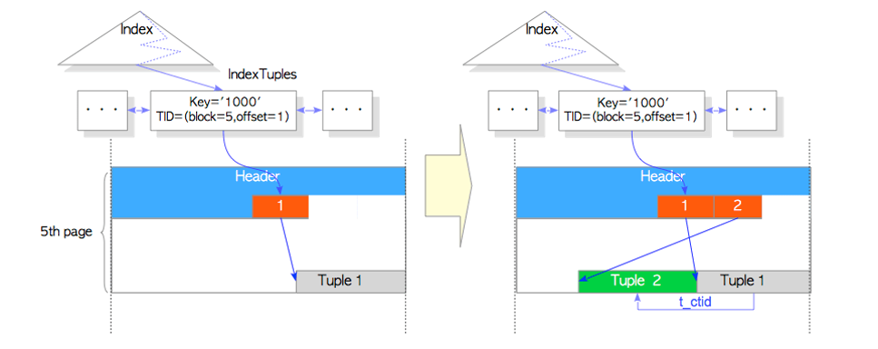
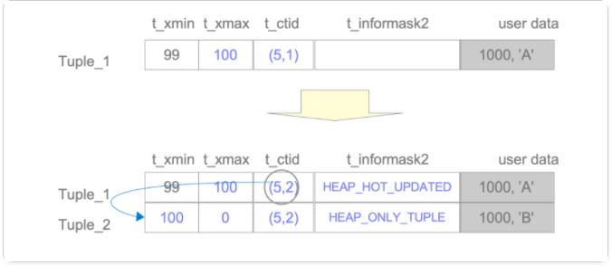
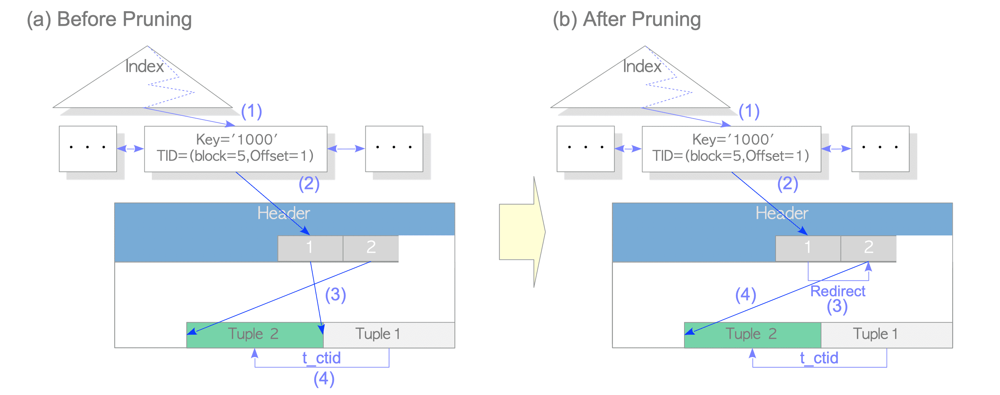
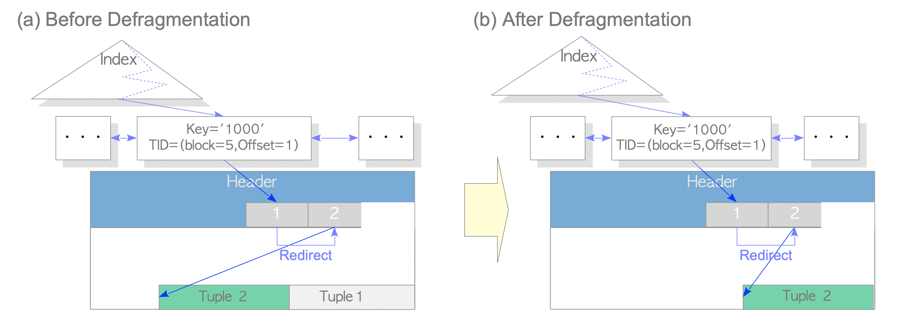

## 什么是HOT

PG中因为多版本功能的原因，当更新一行时，实际上旧行并未被删除，只是插入了一条新行。如果这个表上有索引，而更新的字段不是索引的键值时，由于新行的物理位置发生了变化，因此任然需要更新索引，这将导致性能下降。为了解决这个问题，引入了**HOT(Heap Only Tuple)**技术，**引入HOT技术后，如果更新的新行与旧行在同一个数据块内，旧行会有一个指针，指向新行**，这样就不必更新索引了，当从索引访问到数据行时，索引通过HOT-chain 链来保证找到正确新行。

（注意：HOT技术中的行间指针只能在一个数据块内，即如果在原先的数据块中无法放下新行，就不能使用HOT技术了,所以为了使用HOT技术，应该 在数据块中留出较多的空闲空间，方法是吧表的填充因子(fillfactor)设置为一个较小值，默认为100表示不预留空间）

## HOT实现机制

### 没有HOT之前的更新

创建如下测试表：

```
postgres=# create table tb1(id int primary key,data text);
CREATE TABLE
```

表中存在1000条数据，我们更新id为1000的数据，假如该行数据存储在表的第五页中。最后一个元祖是从对应的索引元祖指向的，其键是'1000',tid是'(5,1)',如下图(左)所示：

<p>
    
</p>

当我们执行了一下更新后：

```
postgres =# UPDATE tbl SET data = 'B' WHERE id = 1000 ;
```

如上图(右)所示，在这种情况下，PG不仅会插入新的表元祖，还会在索引页中插入新的索引元祖。索引元祖不仅会消耗索引页空间，而且索引的插入和清空成本都会很高。

### 带HOT的更新

当一行被更新后，如果更新后的行存储在旧行的同一个表中。PG会在旧行的t_infomask2位标记为**HEAP_HOT_UPDATED** ，在新行的t_infomask2位标记为**HEAP_ONLY_TUPLE**，并且tuple1的ctid指向tuple2，tuple2指向自己。

带HOT更新一行如图所示：

<p>
    
</p>

HEAP_HOT_UPDATED和HEAP_ONLY_TUPLE位：

<p>
    
</p>

### HOT衍生出来的概念和问题

如果vaccume清理了Tuple1元祖后，我们无法通过索引访问到Tuple2？

为了决绝该问题，PG在适当的时候将指向旧元祖的行指针指向新元祖的行指针。在PG中，这种处理方法叫做**pruning**(修剪)，如下图描述了如何在修剪后访问更新的元祖：

<p>
    
</p>

1. 找到索引元祖
2. 访问从获取索引元祖指向的行指针
3. 通过重定向的行指针访问指向“Tuple2”的行指针
4. 读取从行指针[2]指向的“Tuple2”

pruning(修剪)的处理可能在SELECT、UPDATE、INSERT 和 DELETE 等 SQL 命令时,它比较复杂，可参考README.HOT文件，其触发机制大致有两种情况：

- 上一次进行update时无法在本page找到足够的空间
- 当前page上剩余空间小于fill-factor的值，最多小于10%

如果PG在适当的时间删除了死元祖，就像在修剪过程中一样，在PG中这种处理称为**defragmentation**(碎片整理)，如下图所示

<p>
    
</p>

碎片处理的成本低于正常VACCUM处理成本。因为碎片整理不涉及删除索引元祖。因此，使用HOT减少了页索引和表的消耗；这也减少了VACCUM处理必须处理的元祖数量。因此HOT对性能有很好的提升，因为它最终通过更新和VACCUM处理的必要性减少了索引元祖的插入次数。

### HOT使用限制

以下情况下HOT不可用：

- HOT技术中的行间指针只能在一个数据块内，即如果在原先的数据块中无法放下新行，就不能使用HOT技术了。(该问题可以为页预留空间供HOT使用，如预留50%空间：Create table mytest(id int,var text) WITH (fillfactor=50);)
- 当索引元祖的键值更新时，新的索引元祖将被插入到索引页中，即HOT失效。

## HOT代码实现

```c
/* 新增HOT之后的UPDATE操作 */
TM_Result heap_update(...)
{
    if(newbuf == buffer)
    {//判断newtup是否存储于相同页，和查看索引列是否被改变
        if (hot_attrs_checked && !bms_overlap(modified_attrs, hot_attrs))
           use_hot_update = true; 
    }
    PageSetPrunable(page, xid);//标记该页为候选pruning对象，page->pd_prune_xid = xid
    if (use_hot_update)
	{
		HeapTupleSetHotUpdated(&oldtup);//将旧tuple标记为HOT-updated
		HeapTupleSetHeapOnly(heaptup);//将新tuple标记为heap-only
		HeapTupleSetHeapOnly(newtup);//将拷贝新的tuple也标记为heap-only，避免与heaptup不一样
	}
	else
	{
		/* 清楚tupel的HOT标记 */
		HeapTupleClearHotUpdated(&oldtup);
		HeapTupleClearHeapOnly(heaptup);
		HeapTupleClearHeapOnly(newtup);
	}
    RelationPutHeapTuple(relation, newbuf, heaptup, false); //插入新元祖
    ...
	oldtup.t_data->t_ctid = heaptup->t_self;//将旧行的CTID指向新行的CTID
}

//可选地修剪和修复指定页面中的碎片 
void heap_page_prune_opt(Relation relation, Buffer buffer)
{
    if (!PageIsPrunable(page, OldestXmin))//判断页是否需要被修剪，return page->pd_prune_xid < OldestXmin
		return;
    /*当新元祖update未能在页面上找到足够的空间，或者当前可用空间低于fill-factor(且不低于10%)时，触发修剪功能 */
    minfree = RelationGetTargetPageFreeSpace(relation,HEAP_DEFAULT_FILLFACTOR);
	minfree = Max(minfree, BLCKSZ / 10);
    if (PageIsFull(page) || PageGetHeapFreeSpace(page) < minfree)
    {
        if (!ConditionalLockBufferForCleanup(buffer))//获取独占buffer锁
			return;
        if (PageIsFull(page) || PageGetHeapFreeSpace(page) < minfree)//获取独占锁后再次判断是否触发修剪
        {
            TransactionId ignore = InvalidTransactionId;
            heap_page_prune(relation, buffer, OldestXmin, true, &ignore);//做修剪
        }
        LockBuffer(buffer, BUFFER_LOCK_UNLOCK);//释放独占锁
    }
}
int heap_page_prune(Relation relation, Buffer buffer, TransactionId OldestXmin,
				bool report_stats, TransactionId *latestRemovedXid)
{
    Page		page = BufferGetPage(buffer);
    maxoff = PageGetMaxOffsetNumber(page);//扫描page
    for (offnum = FirstOffsetNumber;offnum <= maxoff;offnum = OffsetNumberNext(offnum))
    {
        itemid = PageGetItemId(page, offnum);
		if (!ItemIdIsUsed(itemid) || ItemIdIsDead(itemid))
			continue;//如果槽为空或者已经是死元祖，不需要修剪
        /*计算*/
        ndeleted += heap_prune_chain(relation, buffer, offnum,OldestXmin,&prstate);
    }
    START_CRIT_SECTION();
    if (prstate.nredirected > 0 || prstate.ndead > 0 || prstate.nunused > 0)
    {//有需要修剪的item
        heap_page_prune_execute(buffer,
								prstate.redirected, prstate.nredirected,
								prstate.nowdead, prstate.ndead,
								prstate.nowunused, prstate.nunused);
    }
}
// 真正的执行prune
void heap_page_prune_execute(Buffer buffer,OffsetNumber *redirected, int nredirected,
						OffsetNumber *nowdead, int ndead,
						OffsetNumber *nowunused, int nunused)
{
    Page		page = (Page) BufferGetPage(buffer);
	OffsetNumber *offnum;
    for (i = 0; i < nredirected; i++)
	{
		OffsetNumber fromoff = *offnum++;
		OffsetNumber tooff = *offnum++;
		ItemId		fromlp = PageGetItemId(page, fromoff);

		ItemIdSetRedirect(fromlp, tooff);//prune将fromlp->lp_flags = LP_REDIRECT,fromlp->lp_off = tooff
	}
    ...
    //释放page上的碎片空间
	PageRepairFragmentation(page);
}
void PageRepairFragmentation(Page page)
{
    nline = PageGetMaxOffsetNumber(page);//计算page中有多少个元祖
    for (i = FirstOffsetNumber; i <= nline; i++)
    {//遍历行指针，统计指针数组live item数据
        lp = PageGetItemId(page, i);
        if (ItemIdIsUsed(lp))
        {
            if (ItemIdHasStorage(lp))
            {
                itemidptr++;
            }
        }
        else
        {
            ItemIdSetUnused(lp);
            nunused++;
        }
    }
    nstorage = itemidptr - itemidbase;
    if (nstorage == 0)
    {
        ((PageHeader) page)->pd_upper = pd_special;//page完全为空了，则更新upper指针
    }
    else
    {
        /* 页面中有有效数据，需要整理page碎片 */
        compactify_tuples(itemidbase, nstorage, page);//循环对page->upper进行memmove操作
    }
    if (nunused > 0)
		PageSetHasFreeLinePointers(page);//设置hint表示该页有未使用tuple
	else
		PageClearHasFreeLinePointers(page);
}


//通过HOT-chain获取满足快照的元祖,找到返回true，否则返回false
bool heap_hot_search_buffer(ItemPointer tid, Relation relation, Buffer buffer,
					   Snapshot snapshot, HeapTuple heapTuple,
					   bool *all_dead, bool first_call)
{
    Page		dp = (Page) BufferGetPage(buffer);
    blkno = ItemPointerGetBlockNumber(tid);
    offnum = ItemPointerGetOffsetNumber(tid);
    for (;;)//扫描可能的多个 HOT-chain 成员 
    {
        ItemId		lp;
        lp = PageGetItemId(dp, offnum);
        if (!ItemIdIsNormal(lp))//检查unused,dead或者redirect条目
        {
            if (ItemIdIsRedirected(lp) && at_chain_start)//我们应该只在链的开头看到重定向
            {
                offnum = ItemIdGetRedirect(lp);
                at_chain_start = false;
                continue;
            }
            break;//否则必须是链尾
        }
        /*  
         * 更新heaptuple以指向HOT-chain，正确的设置t_self很重要，因为SSI检查
         *  和Satisfies例程用于历史记录MVCC快照需要正确的TID来决定可见性
         */
        heapTuple->t_data = (HeapTupleHeader) PageGetItem(dp, lp);
        heapTuple->t_len = ItemIdGetLength(lp);
        heapTuple->t_tableOid = RelationGetRelid(relation);
        ItemPointerSet(&heapTuple->t_self, blkno, offnum);
        
        if (at_chain_start && HeapTupleIsHeapOnly(heapTuple))//我们不能在链开始有HEAP_ONLY元祖
			break;
        /* xmin必须匹配前一个xmax，否则chain已经破裂 */
        if (TransactionIdIsValid(prev_xmax) &&
			!TransactionIdEquals(prev_xmax,
								 HeapTupleHeaderGetXmin(heapTuple->t_data)))
            break;
        /*
		 * 检查 HOT 链是否继续经过这个元组； 如果是这样获取下一个offnum并循环
		 */
		if (HeapTupleIsHotUpdated(heapTuple))
		{
			Assert(ItemPointerGetBlockNumber(&heapTuple->t_data->t_ctid) ==
				   blkno);
			offnum = ItemPointerGetOffsetNumber(&heapTuple->t_data->t_ctid);
			at_chain_start = false;
			prev_xmax = HeapTupleHeaderGetUpdateXid(heapTuple->t_data);
		}
		else
			break;
    }
    return false;
}

```

## 总结

- 带HOT更新元祖时，需要将新旧元祖的t_infomask2的值改为HEAP_HOT_UPDATED和HEAP_ONLY_TUPLE，并将页中pd_prune_xid标记为该事务id，最后再将旧元祖的CTID指向新行的CTID。
- pruning(修剪)时，将ItemId的lp_flags置为LP_REDIRECT，并修改其偏移位置lp_off。
- Defragmentation(碎片整理)，循环将有效元祖移动到页尾(将有效item进行循环对page->upper进行memmove操作).

参考：https://www.interdb.jp/pg/pgsql07.html

​			https://foucus.blog.csdn.net/article/details/121336372

