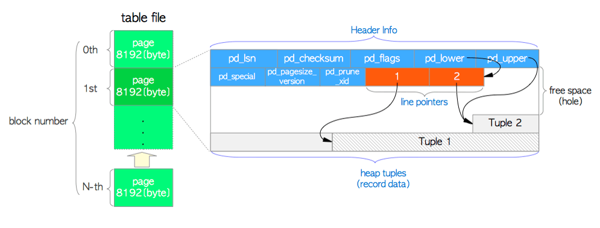

## page概述

PG中的数据文件内部(堆表和索引，以及空闲空间映射和可见性映射)，它被分成固定大小的**pages**(或**blocks**)。每个文件中的那些页从0开始顺序编号，这些编号称为**块编号**。PG中page的默认大小为8K，当一个page写满时就会在该page的尾部追加一个新的page。单张数据表的数据文件理论最大值为8K*2^32(31T)。

## page结构

<p>
    
</p>

如图，表中的页面包含三种数据：

<table border='1'>
<tr>
    <td>数据名</td>
    <td>描述</td>
</tr>
<tr>
    <td>page header</td>
    <td>数据页页头，该结构有24个字节长度，包含了页面的一般信息，参考结构:PageHeaderData</td>
</tr>
<tr>
    <td>ItemId</td>
    <td>行指针(4字节)，指向实际的tuple,每个行指针由偏移、标志位、tuple长度三部分组成，参考结构:ItemIdData</td>
</tr>
<tr>
    <td>heap tuples</td>
    <td>堆元祖本身是一个记录数据。它们从页面底部按顺序堆叠，元祖的内部结构由HeapTupleHeaderData、NULL位图和用户数据组成</td>
</tr>
</table>

### 相关结构体定义

```c
/* ==============================page header定义如下=============================*/
typedef struct PageHeaderData
{
	PageXLogRecPtr pd_lsn;                     /* LSN,此块最近一次操作的LSN号，用于XLOG(8bytes) */		
	uint16		pd_checksum;	               /* Page校验和(2bytes)  */
	uint16		pd_flags;	                   /* 标志位,标志该页有空闲行、页满和所有行可见(2bytes) */
	LocationIndex pd_lower;		               /* Page空闲空间起始位置(2bytes) */
	LocationIndex pd_upper;		               /* Page空闲空间结束位置(2bytes) */
	LocationIndex pd_special;	               /* Page中特殊(索引页)空间的起始位置(2bytes) */
	uint16		pd_pagesize_version;           /* Page版本号(8.3版本后为4)(2bytes) */
	TransactionId pd_prune_xid;                /* 没有被清理的最老的xid(4bytes) */
	ItemIdData	pd_linp[FLEXIBLE_ARRAY_MEMBER];  /* 行指针数组（柔性数组） */
} PageHeaderData;
//pd_flags可以为以下标志：
#define PD_HAS_FREE_LINES	0x0001	/* 表明有未使用的行指针 */
#define PD_PAGE_FULL		0x0002	/* 没有足够的空间存放元祖 */
#define PD_ALL_VISIBLE		0x0004	/* 页面上所有元祖都可见 */
typedef PageHeaderData *PageHeader;


/* ===============================ItemId行指针定义如下==============================*/
typedef struct ItemIdData
{
	unsigned	lp_off:15,		/* 元祖偏移量 (从页开始位置计算) */
				lp_flags:2,		/* 行指针状态, 值见如下 */
				lp_len:15;		/* 元祖长度 */
} ItemIdData;
typedef ItemIdData *ItemId;
//lp_flags可以为如下标志：
#define LP_UNUSED		0		/* 还未使用的 (lp_len=0) */
#define LP_NORMAL		1		/* 已经使用的 (lp_len>0) */
#define LP_REDIRECT		2		/* HOT重定向的 (lp_len=0) */
#define LP_DEAD			3		/* 无效的, 无法确定是否已存储 */


/* ===============================tuple定义如下====================================*/
typedef struct HeapTupleData
{
	uint32		t_len;			/* length of *t_data */
	ItemPointerData t_self;		/* SelfItemPointer */
	Oid			t_tableOid;		/* table the tuple came from */
#define FIELDNO_HEAPTUPLEDATA_DATA 3
	HeapTupleHeader t_data;		/* -> tuple header and data */
} HeapTupleData;
typedef HeapTupleData *HeapTuple;

typedef struct HeapTupleFields
{
	TransactionId t_xmin;		/* 插入元祖的事务号 */
	TransactionId t_xmax;		/* 删除或锁定元祖的事务号 */
	union
	{
		CommandId	t_cid;		/* 插入或删除元祖命令号 */
		TransactionId t_xvac;	/* 旧版本VACUUM FULL事务号 */
	}			t_field3;
} HeapTupleFields;
typedef struct DatumTupleFields
{
	int32		datum_len_;		/* varlena头 */
	int32		datum_typmod;	/* -1, 或记录类型的标识符 */
	Oid			datum_typeid;	/* 复合类型OID或RECORDOID */
}
struct HeapTupleHeaderData
{
	union
	{
		HeapTupleFields t_heap;
		DatumTupleFields t_datum;
	}			t_choice;
	ItemPointerData t_ctid;		/* 新元祖的当前CTID */
	uint16		t_infomask2;	/* tuple的一些属性加上多个标志位，低11位表示元祖属性个数 */
	uint16		t_infomask;		/* 多属性,见下 */
	uint8		t_hoff;			/* 到用户数据的偏移量 */
	/* ^ - 23 bytes - ^ */
	bits8		t_bits[FLEXIBLE_ARRAY_MEMBER];	/* NULL位图 */
	/* 更多的数据添加在该结构后面 */
};
//t_infomask2可以为以下值
#define HEAP_NATTS_MASK			0x07FF	/* 低11位用于元祖属性数 */
/* bits 0x1800 are available */
#define HEAP_KEYS_UPDATED		0x2000	/* 元组已更新，键列已修改，或元组已删除 */
#define HEAP_HOT_UPDATED		0x4000	/* 元祖是HOT-updated */
#define HEAP_ONLY_TUPLE			0x8000	/* 这是heap-only元祖 */

#define HEAP2_XACT_MASK			0xE000	/* 可见性相关位 */

//t_infomask可为以下值
#define HEAP_HASNULL			0x0001	/* 有null属性 */
#define HEAP_HASVARWIDTH		0x0002	/* 有变长属性列 */
#define HEAP_HASEXTERNAL		0x0004	/* 具有外部存储属性列 */
#define HEAP_HASOID_OLD			0x0008	/* 有一个对象ID字段 */
#define HEAP_XMAX_KEYSHR_LOCK	0x0010	/* xmax是一个秘钥共享锁 */
#define HEAP_COMBOCID			0x0020	/* t_cid 是一个组合cid */
#define HEAP_XMAX_EXCL_LOCK		0x0040	/* xmax是一个独占锁 */
#define HEAP_XMAX_LOCK_ONLY		0x0080	/* xmax, 如果有效, 仅仅是一个锁 */
 /* xmax is a shared locker */
#define HEAP_XMAX_SHR_LOCK	(HEAP_XMAX_EXCL_LOCK | HEAP_XMAX_KEYSHR_LOCK)

#define HEAP_LOCK_MASK	(HEAP_XMAX_SHR_LOCK | HEAP_XMAX_EXCL_LOCK | \
						 HEAP_XMAX_KEYSHR_LOCK)
#define HEAP_XMIN_COMMITTED		0x0100	/* t_xmin committed */
#define HEAP_XMIN_INVALID		0x0200	/* t_xmin invalid/aborted */
#define HEAP_XMIN_FROZEN		(HEAP_XMIN_COMMITTED|HEAP_XMIN_INVALID)
#define HEAP_XMAX_COMMITTED		0x0400	/* t_xmax committed */
#define HEAP_XMAX_INVALID		0x0800	/* t_xmax invalid/aborted */
#define HEAP_XMAX_IS_MULTI		0x1000	/* t_xmax is a MultiXactId */
#define HEAP_UPDATED			0x2000	/* this is UPDATEd version of row */
#define HEAP_MOVED_OFF			0x4000	/* moved to another place by pre-9.0
										 * VACUUM FULL; kept for binary
										 * upgrade support */
#define HEAP_MOVED_IN			0x8000	/* moved from another place by pre-9.0
										 * VACUUM FULL; kept for binary
										 * upgrade support */
#define HEAP_MOVED (HEAP_MOVED_OFF | HEAP_MOVED_IN)

#define HEAP_XACT_MASK			0xFFF0	/* visibility-related bits */
```

其中比较重要的几个信息：

<table border='1'>
<tr>
    <td>字段名</td>
    <td>描述</td>
</tr>
<tr>
    <td>pd_flags</td>
    <td>几个描述该页tuple基础信息的标志位(用于判断页空间是否充足和是否全部可见等)</td>
</tr>
<tr>
    <td>pd_lower、pd_upper</td>
    <td>决定空闲空间的起始和结束位置</td>
</tr>
<tr>
    <td>pd_linp(最重要)</td>
    <td>行指针数组,每个元素占4字节，每个元素中包含元祖在页中的偏移、状态和元祖长度信息</td>
</tr>
<tr>
    <td>t_xmin、t_xmax</td>
    <td>插入和删除元祖的shiwu号</td>
</tr>
<tr>
    <td>t_infomask、t_infomast2</td>
    <td>当前元祖的属性标志位</td>
</tr>
<tr>
    <td>t_bits</td>
    <td>用于存放null值的列</td>
</tr>
</table>

### 通过pageinspect差page结构

验证一下以上表格中重要字段的信息：

```tex
postgres=# create table test(id int default null,name text default null);
CREATE TABLE
postgres=# insert into test values (1,'bob');
INSERT 0 1
postgres=# select * from heap_page_items(get_raw_page('test',0));
 lp | lp_off | lp_flags | lp_len | t_xmin | t_xmax | t_field3 | t_ctid | t_infomask2 | t_infomask | t_hoff | t_bits | t_oi
d |       t_data       
----+--------+----------+--------+--------+--------+----------+--------+-------------+------------+--------+--------+-----
--+--------------------
  1 |   8160 |        1 |     32 |    515 |      0 |        0 | (0,1)  |           2 |       2050 |     24 |        |     
  | \x0100000009626f62
(1 row)
postgres=# insert into test values (2);
INSERT 0 1
//查看元祖信息
postgres=# select * from heap_page_items(get_raw_page('test',0));
 lp | lp_off | lp_flags | lp_len | t_xmin | t_xmax | t_field3 | t_ctid | t_infomask2 | t_infomask | t_hoff |  t_bits  | t_
oid |       t_data       
----+--------+----------+--------+--------+--------+----------+--------+-------------+------------+--------+----------+---
----+--------------------
  1 |   8160 |        1 |     32 |    515 |      0 |        0 | (0,1)  |           2 |       2050 |     24 |          |   
    | \x0100000009626f62
  2 |   8128 |        1 |     28 |    516 |      0 |        0 | (0,2)  |           2 |       2049 |     24 | 10000000 |   
    | \x02000000
(2 rows)
//查看page信息
postgres=# select * from page_header(get_raw_page('test',0));
    lsn    | checksum | flags | lower | upper | special | pagesize | version | prune_xid 
-----------+----------+-------+-------+-------+---------+----------+---------+-----------
 0/9063520 |        0 |     0 |    32 |  8128 |    8192 |     8192 |       4 |         0
(1 row)
=========================
lp_flags = 1:表示为普通元祖
lp_off:8160 = 8192(upper) - lp_len(32)
		为什么第二条元祖中lp_off:8128 != 8160(upper) - lp_len(28)?因为28字节内容需要按8字节对齐，28字节按8字节对齐大小		  为32字节
lp_len:这个值才代表元祖的真正长度
真正数据长度:data_len = lp_len - t_hoff
获取数据:memcpy(VARDATA(tuple_data_bytea), (char *) tuphdr + tuphdr->t_hoff, data_len);
t_xmin和t_xmax:因为只有插入操作，事务号只有在t_xmin中体现
pd_lower和pd_upper:pd_lower从页头结束位置(24字节)开始，每增加一条元祖，pg_lower增加一个行指针(4字节)，所以插入两条数据后	pd_lower为24 + 4 * 2 = 32，pd_upper从页尾开始，每增加一条元祖，pd_upper都要减去lp_len字节对齐后的长度，如：8160 - 		28(32) = 8128 
t_infomask = 2050(0X0802):0X0802 = 0x0800 | 0x0002,表示元祖有变长属性(text),同理2049(0x0801) = 0x0800 | 0x0001,	表示有null值。
t_infomask2 = 2:其低11位表示当前元祖属性个数(这里为2表示表有2个属性列)，其它位则用于包括用于HOT技术以及元祖可见性的标志位
pd_special:在普通表中不使用该参数，普通表中指向页尾，该属性用于索引页。
t_cid:(0,1),(0,2)代表两个元祖分别位于0页偏移量为1和2的位置
```

## page相关代码

```c
/*=====================================page初始化==========================================*/

void PageInit(Page page, Size pageSize, Size specialSize)
{
	PageHeader	p = (PageHeader) page;

	specialSize = MAXALIGN(specialSize);

	Assert(pageSize == BLCKSZ);
	Assert(pageSize > specialSize + SizeOfPageHeaderData);

	MemSet(p, 0, pageSize);//初始化为0，表示均未使用

	p->pd_flags = 0;
	p->pd_lower = SizeOfPageHeaderData;//pg_lower指向页头结束的地方:24
	p->pd_upper = pageSize - specialSize;//普通表的specialSize为0
	p->pd_special = pageSize - specialSize;//普通表一直指向页尾
	PageSetPageSizeAndVersion(page, pageSize, PG_PAGE_LAYOUT_VERSION);//设置页版本号
}


/*====================================向page中插入元祖=======================================*/

OffsetNumber PageAddItemExtended(Page page,Item item,Size size,OffsetNumber offsetNumber,int flags)
{
	PageHeader	phdr = (PageHeader) page;
	Size		alignedSize;
	int			lower;
	int			upper;
	ItemId		itemId;
	OffsetNumber limit;
	bool		needshuffle = false;

	/*
	 * 找到已有的行指针数(pd_lower/sizeof(ItemIdData))，并向后偏移1位放置新元祖
	 */
	limit = OffsetNumberNext(PageGetMaxOffsetNumber(page));

	/* offsetNumber 传入了吗？offsetNumber在插入元祖时传入参数为InvalidOffsetNumber  */
	if (OffsetNumberIsValid(offsetNumber))
	{
		/* yes, check it */
		if ((flags & PAI_OVERWRITE) != 0)
		{
			if (offsetNumber < limit)
			{
				itemId = PageGetItemId(phdr, offsetNumber);
				if (ItemIdIsUsed(itemId) || ItemIdHasStorage(itemId))
				{
					elog(WARNING, "will not overwrite a used ItemId");
					return InvalidOffsetNumber;
				}
			}
		}
		else
		{
			if (offsetNumber < limit)
				needshuffle = true; /* need to move existing linp's */
		}
	}
	else
	{
		/* offsetNumber没有被传入, 所以找到一个空闲的slot */
		/* 如果没有空闲的slot, 我们将把它放入limit (1st open slot) */
		if (PageHasFreeLinePointers(phdr))//pd_flags & PG_HAS_FREE_LINES
		{
			/*
			 * 寻找“可回收”（未使用）的 ItemId . 我们也检查没有存储，只是为了偏执——未使用的项目不应该有存储。 
			 */
			for (offsetNumber = 1; offsetNumber < limit; offsetNumber++)
			{
				itemId = PageGetItemId(phdr, offsetNumber);//pd_linp[offsetNumber - 1]
				if (!ItemIdIsUsed(itemId) && !ItemIdHasStorage(itemId))//查询没有使用和没有存储的行指针
					break;
			}
			if (offsetNumber >= limit)//正常情况offsetNumber应该小于limit一个位置
			{
				PageClearHasFreeLinePointers(phdr);//清除page还有空闲空间的标志pd_flags &= ~PG_HAS_REE_LINES
			}
		}
		else
		{
			/* 如果提示说没有空闲插槽，就不用费心搜索  */
			offsetNumber = limit;
		}
	}

	if (offsetNumber > limit)//不能将items放置在一个未使用的行指针外
	{
		elog(WARNING, "specified item offset is too large");
		return InvalidOffsetNumber;
	}

	/* 拒绝将items放置在heap的边缘 */
	if ((flags & PAI_IS_HEAP) != 0 && offsetNumber > MaxHeapTuplesPerPage)
	{
		elog(WARNING, "can't put more than MaxHeapTuplesPerPage items in a heap page");
		return InvalidOffsetNumber;
	}

	/*
	 * 重新计算page的lower和upper，看是否合适
	 */
	if (offsetNumber == limit || needshuffle)
		lower = phdr->pd_lower + sizeof(ItemIdData);
	else
		lower = phdr->pd_lower;

	alignedSize = MAXALIGN(size);//将数据做8字节对齐

	upper = (int) phdr->pd_upper - (int) alignedSize;//重新计算upper

	if (lower > upper)//没有空闲空间，且数据和行指针有重合
		return InvalidOffsetNumber;

	itemId = PageGetItemId(phdr, offsetNumber);//pd_linp[offsetNumber - 1]

	if (needshuffle)//是否需要重新整理行指针?
		memmove(itemId + 1, itemId,
				(limit - offsetNumber) * sizeof(ItemIdData));

	/* 设置新元祖的行指针(lp_flags = LP_NORMAR,lp_off = upper,lp_len = size) */
	ItemIdSetNormal(itemId, upper, size);

	memcpy((char *) page + upper, item, size);//将元祖拷贝到page中

	/* 调整page的基础信息 */
	phdr->pd_lower = (LocationIndex) lower;
	phdr->pd_upper = (LocationIndex) upper;

	return offsetNumber;
}
```

## 总结

page和heap是PG中非常重要的两个结构，它代表了PG中堆表文件的布局。理解了page和heap的结构，对了解PG的mvcc和vaccume等都有很好的帮助。

## 参考链接

https://www.interdb.jp/pg/pgsql01.html

https://foucus.blog.csdn.net/article/details/117078983