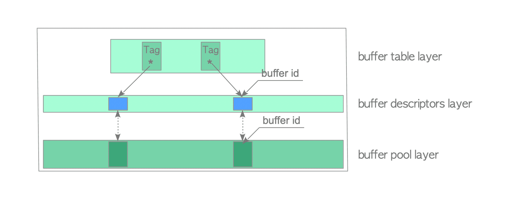

---

layout: post
title:  "PG之Bufferpool"
date:   2022-03-31 11:06:00 +0700
categories: [postgres]

---

## Bufferpool概述

数据库中常常需要频繁地存取数据，为了减少对磁盘读写，引入了缓冲池概念。缓冲池主要起缓冲的作用，数据存储在缓冲池中(即内存中)，对数据的读写操作都在缓冲池中.缓冲池的出现对DBMS的性能产生了重大影响，所以缓冲池的设计对数据库而言是非常重要的，本篇文章就探索一下postgres中缓冲池的实现。

### 缓冲区管理组成与原理

Postgres中缓冲区管理器由缓冲区表，缓冲区描述符和缓冲池三层结构组成(如下图)，由于缓冲区是和磁盘文件做文件传输的，所以postgres中缓冲区管理器还和磁盘管理器(SMRG)搭配使用(用于定位磁盘数据存储在缓冲池位置)，缓冲池其实就是一块连续的共享存储空间，该空间被分成了连续的page(8k)数组，为了管理这个数组，postgres为每个缓存数组增加了一一对应的缓存描述符数组，缓存描述符中主要记录磁盘信息和缓冲池数组下标以及缓冲池状态等等。为了快速定位缓冲池的位置，postgres引入了缓冲表(hash表)。这就是postgres所谓的缓冲区三层结构。

<p>
    
</p>


### 关键数据结构

```c
//缓冲区描述符(即缓冲区管理结构第二层)
typedef struct BufferDesc
{
	BufferTag	tag;			/* ID of page contained in buffer */
	int			buf_id;			/* buffer's index number (from 0) */

	//state由三部分组成：(10 bits flags)+(4 bits usage count)+(18 bits refcount)
	pg_atomic_uint32 state;

	int			wait_backend_pid;	/* backend PID of pin-count waiter */
	int			freeNext;		/* link in freelist chain */
	LWLock		content_lock;	/* to lock access to buffer contents */
} BufferDesc;
//refcount:保存当前访问相关存储页面的Postgres进程数(pin count)，当进程访问存储的页面时，refcount加1，访问后减1，当     refcount为0时，即当前未访问关联的存储页面时，该页面被取消固定(unpinned),否则被固定
//usage_count:保存关联的存储页面自加载到相应的缓冲槽后被访问的次数，usage_count用于页面替换算法

//state高十位flags可以为以下值
#define BM_LOCKED				(1U << 22)	/* buffer header is locked */
#define BM_DIRTY				(1U << 23)	/* data needs writing */
#define BM_VALID				(1U << 24)	/* data is valid */
#define BM_TAG_VALID			(1U << 25)	/* tag已分配 */
#define BM_IO_IN_PROGRESS		(1U << 26)	/* 正在进行读取或写入 */
#define BM_IO_ERROR				(1U << 27)	/* previous I/O failed */
#define BM_JUST_DIRTIED			(1U << 28)	/* dirtied since write started */
#define BM_PIN_COUNT_WAITER		(1U << 29)	/* have waiter for sole pin */
#define BM_CHECKPOINT_NEEDED	(1U << 30)	/* must write for checkpoint */
#define BM_PERMANENT			(1U << 31)	/* permanent buffer (not unlogged,
											 * or init fork) */
typedef struct buftag
{
	RelFileNode rnode;			/* physical relation identifier */
	ForkNumber	forkNum;
	BlockNumber blockNum;		/* blknum relative to begin of reln */
} BufferTag;

//共享空闲链表控制信息
typedef struct
{
	/* Spinlock: protects the values below */
	slock_t		buffer_strategy_lock;

	/*
	 * Clock sweep hand: index of next buffer to consider grabbing. Note that
	 * this isn't a concrete buffer - we only ever increase the value. So, to
	 * get an actual buffer, it needs to be used modulo NBuffers.
	 */
	pg_atomic_uint32 nextVictimBuffer;

	int			firstFreeBuffer;	/* Head of list of unused buffers */
	int			lastFreeBuffer; /* Tail of list of unused buffers */

	/*
	 * NOTE: lastFreeBuffer is undefined when firstFreeBuffer is -1 (that is,
	 * when the list is empty)
	 */

	/*
	 * Statistics.  These counters should be wide enough that they can't
	 * overflow during a single bgwriter cycle.
	 */
	uint32		completePasses; /* Complete cycles of the clock sweep */
	pg_atomic_uint32 numBufferAllocs;	/* Buffers allocated since last reset */

	/*
	 * 如果bgwprocno不为-1，则下次调用StrategyGetBuffer将设置latch. 传递-1以清除它之前的的
	 * 待处理通知发生，此功能有bgwriter进程用于将自己从休眠中唤醒，参考函数StrategyNotifyBgWriter
	 */
	int			bgwprocno;
} BufferStrategyControl;
```


### 代码实现

```c
//bufferpool初始化
void
InitBufferPool(void)
{
    //申请NBUFFERS个buffer description，即缓冲区管理器第二层
    BufferDescriptors = (BufferDescPadded *)
		ShmemInitStruct("Buffer Descriptors",
						NBuffers * sizeof(BufferDescPadded),
						&foundDescs);
    //bufferpool空间申请(NBUFFERS*BLOCKS)，缓冲区管理器第三层
    BufferBlocks = (char *)
		ShmemInitStruct("Buffer Blocks",
						NBuffers * (Size) BLCKSZ, &foundBufs);
    //初始化bufferdesc数组
    for (i = 0; i < NBuffers; i++)
    {
        BufferDesc *buf = GetBufferDescriptor(i);
        CLEAR_BUFFERTAG(buf->tag);
        pg_atomic_init_u32(&buf->state, 0);
        buf->wait_backend_pid = 0;
        buf->buf_id = i;
        buf->freeNext = i + 1;
        LWLockInitialize(BufferDescriptorGetContentLock(buf),
							 LWTRANCHE_BUFFER_CONTENT);
        ConditionVariableInit(BufferDescriptorGetIOCV(buf));
    }
    GetBufferDescriptor(NBuffers - 1)->freeNext = FREENEXT_END_OF_LIST;
    //初始化缓冲池管理工作
    StrategyInitialize(!foundDescs);
    {
        //缓冲表初始化，即缓冲器管理器第一层
        InitBufTable(NBuffers + NUM_BUFFER_PARTITIONS);
        {
            //设置key和桶的大小
            info.keysize = sizeof(BufferTag);
            info.entrysize = sizeof(BufferLookupEnt);
            info.num_partitions = NUM_BUFFER_PARTITIONS;
            //创建hash表，返回全局变量(HTAB*)SharedBufHash
            SharedBufHash = ShmemInitHash("Shared Buffer Lookup Table",
								  size, size,
								  &info,
								  HASH_ELEM | HASH_BLOBS | HASH_PARTITION);
        }
        //获取或创建共享策略控制块(freelist控制器，时钟扫描器)
        StrategyControl = (BufferStrategyControl *)
			ShmemInitStruct("Buffer Strategy Status",
							sizeof(BufferStrategyControl),
							&found);
        //初始化策略块信息
        SpinLockInit(&StrategyControl->buffer_strategy_lock);
        StrategyControl->firstFreeBuffer = 0;
        StrategyControl->lastFreeBuffer = NBuffers - 1;
        pg_atomic_init_u32(&StrategyControl->nextVictimBuffer, 0);
        StrategyControl->completePasses = 0;
        pg_atomic_init_u32(&StrategyControl->numBufferAllocs, 0);
        StrategyControl->bgwprocno = -1;
    }
}
```

### 缓冲区管理器工作原理

完成缓冲区的初始化后，当后端进程想要访问所需的页面时，它会调用**ReadBufferExtended**函数

```c
Buffer
ReadBufferExtended(Relation reln, ForkNumber forkNum, BlockNumber blockNum,
				   ReadBufferMode mode, BufferAccessStrategy strategy)
{
    RelationOpenSmgr(reln);//打开存储管理器(SMGR)
	buf = ReadBuffer_common(reln->rd_smgr, reln->rd_rel->relpersistence,
							forkNum, blockNum, mode, strategy, &hit);
    {
        BufferDesc *bufHdr;
        //查找缓存区，如果请求块不在内存中，则设置IO_IN_PROGRESS
        bufHdr = BufferAlloc(smgr, relpersistence, forkNum, blockNum,
							 strategy, &found);
        {
            //生成tag信息，用于hash计算获取缓存位置
            INIT_BUFFERTAG(newTag, smgr->smgr_rnode.node, forkNum, blockNum);
            //使用SharedBufHash->hash函数(tag_hash)生成hash值
            newHash = BufTableHashCode(&newTag);
            //根据上面的hash值获取缓冲在bufferpool中的位置(buf_id)
			buf_id = BufTableLookup(&newTag, newHash);
            if(buf_id >= 0)
            {//在缓冲池中找到了，pin住buffer以防起被偷走
                buf = GetBufferDescriptor(buf_id);
                valid = PinBuffer(buf, strategy);
                //当pin住buffer后可以释放映射锁了
                LWLockRelease(newPartitionLock);
                *foundPtr = true;
                return buf;
            }
            //若到这里，表明数据没有在缓冲池中，我们必须找个新的buffer
            LWLockRelease(newPartitionLock);
            for (;;)
            {
                //选择一个受害者缓存(首先会在freelist中查找，如果freelist中什么也没有，则使用始终扫描替换法)
                buf = StrategyGetBuffer(strategy, &buf_state);
                //当持有自旋锁时，必须复制缓冲区标志
                oldFlags = buf_state & BUF_FLAG_MASK;
                //pin住buffer，并且释放buffer的spinlock
                PinBuffer_Locked(buf);
                if (oldFlags & BM_DIRTY)
                {//如果选择的buffer是脏块，试着将buffer写到磁盘
                    if(LWLockConditionalAcquire(BufferDescriptorGetContentLock(buf),LW_SHARED))
                    {//需要持有共享锁
                        FlushBuffer(buf, NULL);
						LWLockRelease(BufferDescriptorGetContentLock(buf));
						ScheduleBufferTagForWriteback(&BackendWritebackContext,&buf->tag);
                    }else{
                        //buffer已经被别的锁住，放弃该buffer再循环获取下一个
                        UnpinBuffer(buf, true);
                        continue;
                    }
                }
                if (oldFlags & BM_TAG_VALID)//如果标签已经被分配
                {//BM_TAG_VALID以为着有个缓冲区hashtable条目与buffer的tag相关联
                    
                }else{
                    LWLockAcquire(newPartitionLock, LW_EXCLUSIVE);
                    oldPartitionLock = NULL;
                    oldHash = 0;
                }
                //尝试在其新标签下为缓冲区创建一个新的hashtable entry，成功插入返回-1，冲突返回对应buf_id
                buf_id = BufTableInsert(&newTag, newHash, buf->buf_id);
                if (buf_id >= 0)
                {//发生了碰撞
                    UnpinBuffer(buf, true);
                    buf = GetBufferDescriptor(buf_id);
                    valid = PinBuffer(buf, strategy);
                    return buf;
                }
                //为了修改tag值，我们需要所处buffer头
                buf_state = LockBufHdr(buf);//获取自旋锁
                oldFlags = buf_state & BUF_FLAG_MASK;
                //如果有人已经被固定住或重新有人标记该buffer为脏，我们不能回收这个buffer
                if (BUF_STATE_GET_REFCOUNT(buf_state) == 1 && !(oldFlags & BM_DIRTY))
					break;//表示buffer可用,退出循环
                UnlockBufHdr(buf, buf_state);//释放自旋锁
                BufTableDelete(&newTag, newHash);//删除已经被固定或被重脏的buff，重新再找下一个合适的buffer
                LWLockRelease(newPartitionLock);
                UnpinBuffer(buf, true);
            }
            //最后，安全的重命名buffer
            buf->tag = newTag;
            //清理标志位
            buf_state &= ~(BM_VALID | BM_DIRTY | BM_JUST_DIRTIED |
				   BM_CHECKPOINT_NEEDED | BM_IO_ERROR | BM_PERMANENT |BUF_USAGECOUNT_MASK);
            if (relpersistence == RELPERSISTENCE_PERMANENT || forkNum == INIT_FORKNUM)
				buf_state |= BM_TAG_VALID | BM_PERMANENT | BUF_USAGECOUNT_ONE;
			else
				buf_state |= BM_TAG_VALID | BUF_USAGECOUNT_ONE;
            UnlockBufHdr(buf, buf_state);
            if (oldPartitionLock != NULL)
            LWLockRelease(newPartitionLock);
            //如果BM_IO_IN_PROGRESS被设置，则阻塞等待I/O
            if (StartBufferIO(buf, true))
                *foundPtr = false;
            else
                *foundPtr = true;
            return buf;
        }
    }
}

//缓存替换策略(也就是时常听说的时钟扫描器)
BufferDesc *
StrategyGetBuffer(BufferAccessStrategy strategy, uint32 *buf_state)
{
    if (strategy != NULL)
    {//如果strategy不为空，则使用缓冲环
        buf = GetBufferFromRing(strategy, buf_state);
        if (buf != NULL)
            return buf;
    }
    bgwprocno = INT_ACCESS_ONCE(StrategyControl->bgwprocno);
    if (bgwprocno != -1)
    {//设置latch
        StrategyControl->bgwprocno = -1;
        SetLatch(&ProcGlobal->allProcs[bgwprocno].procLatch);
    }
    //计算缓冲区分配请求，一遍bgwriter可以估计缓冲区消耗率
    pg_atomic_fetch_add_u32(&StrategyControl->numBufferAllocs, 1);
    //查看freelist中是否有buffer
    if (StrategyControl->firstFreeBuffer >= 0)
    {
        while (true)
        {
            //获取自旋锁以从freelist中删除元素
            SpinLockAcquire(&StrategyControl->buffer_strategy_lock);
            if (StrategyControl->firstFreeBuffer < 0)
            {
                SpinLockRelease(&StrategyControl->buffer_strategy_lock);
                break;
            }
            buf = GetBufferDescriptor(StrategyControl->firstFreeBuffer);
            //无条件冲freelist中删除buffer
            StrategyControl->firstFreeBuffer = buf->freeNext;
            buf->freeNext = FREENEXT_NOT_IN_LIST;
            SpinLockRelease(&StrategyControl->buffer_strategy_lock);
            //如果buffer已经被pin住，或usage_count不为零，我们不能使用
            local_buf_state = LockBufHdr(buf);
            if (BUF_STATE_GET_REFCOUNT(local_buf_state) == 0
				&& BUF_STATE_GET_USAGECOUNT(local_buf_state) == 0)
            {//buffer可用
                *buf_state = local_buf_state;
                return buf;
            }
            UnlockBufHdr(buf, local_buf_state);//buffer不可用，释放锁
        }
    }
    //freelist中没有buffer，所以执行时钟扫描算法
    trycounter = NBuffers;
    for (;;)
    {
        buf = GetBufferDescriptor(ClockSweepTick());//获取下一个nextVictimBuffer
        {//ClockSweepTick使用时钟扫描
            //原子的使StrategyControl->nextVictimBuffer加1
            victim = pg_atomic_fetch_add_u32(&StrategyControl->nextVictimBuffer, 1);
            if (victim >= NBuffers)
            {
                uint32		originalVictim = victim;
                victim = victim % NBuffers;//时钟循环查找BufferDescriptors
                /*
                 *发生回绕，增加completePasses，需要自旋锁以便strategySyncStart可以返回nextVictimBuffer
                 *和completePasses组成的一致值
                 */
                if (victim == 0)
                {
                    bool		success = false;
                    expected = originalVictim + 1;
                    while (!success)
                    {
                        SpinLockAcquire(&StrategyControl->buffer_strategy_lock);
                        wrapped = expected % NBuffers;
                        //比较nextVictimBuffer和expected，如果相等则将wrapped赋值给nextVictimBuffer并返回true
                        success = pg_atomic_compare_exchange_u32(&StrategyControl->nextVictimBuffer,
														 &expected, wrapped);
                        if (success)
                            StrategyControl->completePasses++;
                        SpinLockRelease(&StrategyControl->buffer_strategy_lock);
                    }
                }
            }
            return victim;
        }
        //如果buffer已经被pin住，或usage_count不为零，我们不能使用,减少usage_count，并继续扫描
        local_buf_state = LockBufHdr(buf);
        if (BUF_STATE_GET_REFCOUNT(local_buf_state) == 0)
        {
            if (BUF_STATE_GET_USAGECOUNT(local_buf_state) != 0)
            {//
                local_buf_state -= BUF_USAGECOUNT_ONE;//usage_count减1
                trycounter = NBuffers;
            }else{//找到合适的buffer
                *buf_state = local_buf_state;
                return buf;
            }
        }else if(--trycounter == 0){//扫描所有buffer也没有合适的
            UnlockBufHdr(buf, local_buf_state);
            elog(ERROR, "no unpinned buffers available");
        }
        UnlockBufHdr(buf, local_buf_state);
}
```

## 总结

当想访问页面时，流程如下：

1. 根据已有Tag使用tag_hash函数生成hash值，根据tag和hash值查找hash缓冲表，并返回buffer_id
2. 判断buffer_id的值大小，如果大于等于0，说明找到了对应缓存，pin住buffer并返回，这样访问结束，如果小于0，则表示hash表中不存在，则走步骤3
3. 从freelist中获取空缓冲区描述符，并pin住它，创建一个buffer_tag和对应buff_id的新条目，并插入到缓冲表中，如果freelist为空，则需要使用时钟扫描法选择一个受害者缓冲槽，如果缓冲槽数据为脏，则刷新受害者页面数据，并创建新条目插入到缓冲表中
