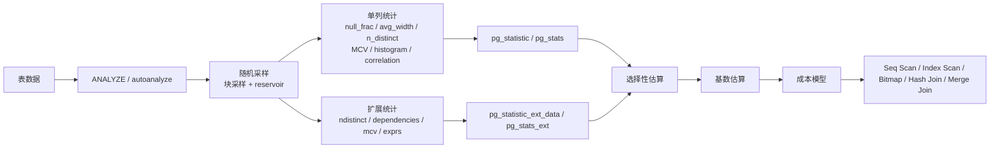

# PostgreSQL 统计信息深度研究报告

## 执行摘要

在 PostgreSQL 14–15 中，查询优化器依赖两类“统计”：一类是**规划统计**，即列分布与多列相关性，主要落在 `pg_statistic` / `pg_stats`、`pg_statistic_ext` / `pg_stats_ext` 中；另一类是**监控统计**，如 `pg_stat_user_tables`，用于观察表是否久未分析、修改量是否过大，但它本身不保存列分布。快速理解可抓住一句话：**等值谓词主要看 MCV，范围谓词主要看 histogram，分组/去重主要看 n_distinct，索引代价还会看 correlation，多列相关则看 extended statistics**。citeturn16view1turn32view0turn17view1turn25view0turn9view0

统计由 `ANALYZE` 通过随机采样生成。默认统计目标 `default_statistics_target=100` 决定 MCV 与直方图的最大精度；源码中，单列分析通常要求最少约 `300 × statistics_target` 的样本行，采样使用“两阶段块采样 + Vitter 水库抽样”。自动分析由 autovacuum 触发，阈值近似为 `analyze_threshold = base_threshold + scale_factor × reltuples`。对 14–15 来说，最实用的运维动作是：**批量导入后手工 `ANALYZE`，偏斜列提高统计目标，相关列建 `CREATE STATISTICS`，分区父表单独 `ANALYZE`**。PG14 还新增了**表达式统计**，可显著改善函数/表达式谓词的估算。citeturn33view2turn31view0turn7view2turn15view3turn40view0turn38view4

## 统计信息是什么

规划统计是优化器对“数据长什么样”的近似模型。`pg_statistic` 是底层系统表，统计值是近似的、由 `ANALYZE` 生成；`pg_stats` 是其更易读、且对普通读权限更安全的视图。扩展统计则分为定义表 `pg_statistic_ext` 与数据表 `pg_statistic_ext_data`，对应可读视图 `pg_stats_ext`、`pg_stats_ext_exprs`。与之不同，`pg_stat_user_tables` 属于累计监控统计，记录最近一次 analyze、自动 analyze、修改行数等，用来判断“统计是否可能过期”。citeturn16view1turn16view0turn16view2turn17view0turn17view1turn17view2turn25view0turn26view0

下表按官方 `pg_stats` / `pg_stats_ext` 视图整理了最常用字段。citeturn32view0turn17view1

| 字段 | 含义 | 常见场景 |
|---|---|---|
| `null_frac` | 空值占比 | `IS NULL` / `IS NOT NULL`、连接空值影响 |
| `avg_width` | 平均字节宽度 | 行宽、排序/Hash 内存与传输代价估算 |
| `n_distinct` | 去重值估算；正值=固定个数，负值=“distinct/总行数”的负比例 | `GROUP BY`、`DISTINCT`、等值过滤、连接基数 |
| `most_common_vals` / `most_common_freqs` | 最常见值及其频率 | 偏斜列、等值谓词、`IN (...)` |
| `histogram_bounds` | 等频边界；**不包含 MCV 部分** | `<`、`<=`、`BETWEEN` 等范围谓词 |
| `correlation` | 物理行顺序与列逻辑顺序的相关系数，范围 -1 到 1 | 索引扫描与顺序扫描代价比较 |
| `most_common_elems` / `elem_count_histogram` | 数组元素级统计 | 数组列、包含查询 |

一个很容易忽略的点是：列统计之外，优化器还先从 `pg_class.reltuples` / `relpages` 读取表的总行数与页数，再做当前基数缩放；所以“表有多大”和“列值如何分布”是两层不同信息。citeturn9view0

## 生成、采样与存储

`ANALYZE` 可以针对整库、单表，甚至单列执行；它把结果写入 `pg_statistic`，并在有扩展统计对象时写入 `pg_statistic_ext_data`。对大表，`ANALYZE` 不会全表扫描，而是随机采样。文档说明统计目标控制 MCV 列表长度与直方图 bin 数；源码进一步表明，单列典型最少样本数是 `300 × attstattarget`，并且真正采样过程是“**先随机挑块，再在块内用 Vitter 水库抽样**”，这样既快，又能保持样本行的物理顺序以便后续计算 `correlation`。citeturn33view1turn33view2turn31view0turn7view2turn6view1

下图可作为理解主链路的最短路径。其内容依据官方文档与 `analyze.c` 的实现注释整理。citeturn33view1turn31view0turn7view2turn17view1



`CREATE STATISTICS` 只创建“定义”，真正的数据要到后续 `ANALYZE` 才会计算。14–15 中可建的核心种类是 `ndistinct`、`dependencies`、`mcv`；PG14 起又支持**表达式统计**，因此 `pg_stats_ext_exprs` 在 14+ 很有价值。需要特别注意：**14–15 的 extended statistics 仍不用于表连接的 join selectivity**，它主要修正单表上的多谓词、分组与表达式估算。citeturn16view2turn17view0turn38view4turn38view2turn40view0

持久化方面，**规划统计**保存在系统目录表里，是磁盘上的数据库对象；而**监控统计**在 PG15 改为共享内存累计，并在正常关机时落到 `pg_stat` 子目录，非正常恢复会清零。对 PG14 及更早版本，监控统计仍依赖统计收集器与 `pg_stat_tmp` 临时文件。换言之：`pg_stats`/`pg_stats_ext` 是“给优化器看的数据模型”，`pg_stat_user_tables` 是“给 DBA 看的运行足迹”。citeturn16view1turn17view0turn25view0turn42view0

## 统计量如何计算

`n_distinct` 的文档语义并不复杂，但源码很关键：若估算 distinct 值较固定，就存正数；若认为 distinct 会随表增长而近似线性增长，就存负比例。源码中单列估算核心可写成  
`stadistinct = (n × d) / ((n - f1) + f1 × n / N)`，其中 `n` 是样本中非空行数，`d` 是观测 distinct 数，`f1` 近似表示样本中只出现一次的值的个数，`N` 是估算的全表非空行数。随后若 distinct 估算超过总行数的 10%，PostgreSQL 会把它改写成负比例存储，这就是 `-1`、`-0.5` 这类值出现的原因。citeturn29view0turn32view0turn43view0

`most_common_vals` 与直方图都来自排序后的样本。源码先找重复值并决定哪些值“值得留下为 MCV”：如果列域很小且样本足以完整覆盖，就尽量完整保留；否则只保留**显著高于其余值**的部分。直方图则只在“去掉 MCV 后仍至少有两个 distinct 值”时构建，并且从**剩余非 MCV 的有序值**里等距抽取边界，所以 `histogram_bounds` 本质是“非热门值部分”的等频近似。citeturn29view1turn30view2turn30view4turn32view0turn9view0

`correlation` 的意义常被低估。源码明确指出样本元组保持物理顺序，是为了之后计算“逻辑排序位置”和“物理元组位置”的相关系数；文档则说明当它接近 `±1` 时，索引扫描更便宜，因为堆访问更接近顺序读；接近 `0` 则随机 I/O 惩罚更大。这个统计尤其影响“有索引但优化器仍偏向顺序扫”的解释。citeturn7view2turn29view2turn32view0

扩展统计有三类最实用：`dependencies` 记录列间函数依赖强度，修正“谓词独立”假设；多列 `n_distinct` 记录组合 distinct 数，主要改善 `GROUP BY` / `DISTINCT`；多列 `mcv` 则直接保存高频组合及其 `base_frequency`（按独立性假设计算的基线频率），适合处理“单列都不算罕见，但组合很特殊”的情况。citeturn17view1turn10view0

## 规划器如何使用

优化器先用 `pg_class.reltuples` / `relpages` 得到关系基数，再调用运算符对应的选择性函数。官方示例显示：等值条件通常走 `eqsel` 思路，若常量落在 MCV 里就直接取对应频率；若不在 MCV 里，则把“非 MCV、非 NULL 的剩余概率质量”均摊给剩余 distinct 值。范围条件则读取 `histogram_bounds`，按值落在哪个 bucket 内来估算其覆盖比例；对非唯一列，还会把满足条件的 MCV 频率单独加回去。citeturn9view0

多谓词时，**默认假设独立**，即把各个选择性相乘；这正是很多误估的根源。扩展统计的意义就在于告诉规划器“这些列不是独立的”。但在 14–15，extended statistics 仍**不参与 join selectivity**，因此它更擅长修正单表过滤、表达式过滤、分组 distinct，而不是直接修正跨表连接的选择性。citeturn9view0turn38view2turn10view0

计划选择上，`EXPLAIN` 文档明确说明优化器用估计的 `rows`、`width`、`cost` 在顺序扫描、索引扫描、位图扫描以及各种连接算法之间做成本比较；再结合 `correlation` 对索引堆访问的随机性惩罚进行修正。由此可直接推知：**低估行数**更容易把计划推向参数化索引扫描、Nested Loop 等“假设结果集很小”的路径；**高估行数**则更容易偏向 Seq Scan、Hash Join、HashAgg 等“大批量”路径。这不是经验规则，而是成本模型对错误基数的自然响应。citeturn27view0turn32view0turn9view0

## 查看、刷新与诊断

以下对象与工具是最实用的“第一现场”。其中 `pg_stats`/`pg_stats_ext` 看的是**规划统计内容**，`pg_stat_user_tables` 看的是**统计新鲜度**，`EXPLAIN (ANALYZE, BUFFERS)` 看的是“估算是否贴近现实”，而 `pgstattuple`、HypoPG、`pg_repack` 分别负责膨胀体检、假想索引、在线重写。citeturn16view0turn17view1turn26view0turn27view0turn21view0turn19view1turn20view0

| 对象/命令 | 主要用途 | 备注 |
|---|---|---|
| `pg_stats` | 看单列分布统计 | 首选入口，安全、可读 |
| `pg_statistic` | 看底层槽位 | 更原始，通常只在深挖时用 |
| `pg_stats_ext` / `pg_stats_ext_exprs` | 看多列/表达式统计 | PG14+ 表达式统计很重要 |
| `pg_stat_user_tables` | 看 `n_mod_since_analyze`、`last_autoanalyze` 等 | 判断统计是否可能过期 |
| `EXPLAIN (ANALYZE, BUFFERS)` | 对比估算行数与实际行数，观察缓存/I/O | 诊断误估的核心工具 |
| `pgstattuple` | 看 live/dead/free 空间占比 | 诊断膨胀与是否值得重写 |
| HypoPG | 不真正建索引，试探规划器是否会使用 | 仅影响当前会话的 `EXPLAIN` |
| `pg_repack` | 在线去膨胀/可选恢复聚簇顺序 | 重写后宜重跑 `ANALYZE` |

```sql
-- 单列统计
SELECT attname, null_frac, n_distinct, most_common_vals,
       most_common_freqs, histogram_bounds, correlation
FROM pg_stats
WHERE schemaname = 'public' AND tablename = 'orders';

-- 扩展统计（多列/表达式）
SELECT statistics_name, attnames, exprs, kinds,
       n_distinct, dependencies,
       most_common_vals, most_common_freqs, most_common_base_freqs
FROM pg_stats_ext
WHERE schemaname = 'public' AND tablename = 'orders';

-- 统计是否过期
SELECT relname, n_live_tup, n_mod_since_analyze,
       last_analyze, last_autoanalyze
FROM pg_stat_user_tables
WHERE relname = 'orders';

-- 估算 vs 实际
EXPLAIN (ANALYZE, BUFFERS)
SELECT * FROM orders WHERE customer_id = 42 AND status = 'paid';

-- 物理膨胀
SELECT * FROM pgstattuple('public.orders');

-- 假想索引
SELECT * FROM hypopg_create_index(
  'CREATE INDEX ON orders (customer_id, status)'
);
EXPLAIN SELECT * FROM orders WHERE customer_id = 42 AND status = 'paid';
SELECT hypopg_reset();
```

判断顺序通常是：先看 `pg_stat_user_tables.n_mod_since_analyze` 与 `last_autoanalyze` 是否提示陈旧；再看 `pg_stats`/`pg_stats_ext` 是否缺失关键字段或明显失真；最后用 `EXPLAIN (ANALYZE, BUFFERS)` 对比 `rows=` 与 `actual rows=`。若 `pgstattuple` 显示 dead/free 比例很高，可考虑去膨胀；若只是在验证索引价值，优先用 HypoPG。需要注意，HypoPG 的假想索引只在**当前 backend** 生效，且只有**不带 `ANALYZE` 的 `EXPLAIN`** 会采用假想索引。citeturn26view0turn27view0turn21view0turn19view1

刷新与维护上，`ANALYZE` 只需读锁，可并发运行；`VACUUM ANALYZE` 则是日常脚本中的组合拳。autovacuum 的 autoanalyze 触发公式是“阈值 + 比例 × `reltuples`”；对 bulk load、数据分布突变、分区父表、继承父表、外表，手工 `ANALYZE` 往往更可靠。统计精度调优应优先**按列**做：`ALTER TABLE ... ALTER COLUMN ... SET STATISTICS 500`；如果 distinct 长期被低估/高估到影响计划，可直接用 `ALTER TABLE ... ALTER COLUMN ... SET (n_distinct = ...)` 覆盖。citeturn33view1turn37view0turn15view3turn14view0turn12view0turn12view1

## 调优策略与案例

最有效的策略通常不是“盲目加索引”，而是按以下顺序推进：先确认统计新鲜度；再确认问题是**单列分布**还是**多列相关性/表达式**；随后再决定是提高统计目标、创建 extended statistics、覆写 `n_distinct`，还是仅用 HypoPG 评估索引。若表与索引本身已膨胀明显，可用 `pg_repack` 在线重写；重写改变了物理布局后，最好立刻 `ANALYZE` 更新 `correlation`、MCV 与 histogram。citeturn12view0turn38view4turn20view0turn32view0

**案例 A：相关列被当成独立，过滤行数被低估**

```sql
CREATE TABLE t (a INT, b INT);
INSERT INTO t
SELECT i % 100, i % 100
FROM generate_series(1, 10000) AS s(i);

ANALYZE t;

-- 修复前
EXPLAIN (ANALYZE, TIMING OFF)
SELECT * FROM t WHERE a = 1 AND b = 1;

CREATE STATISTICS stts (dependencies) ON a, b FROM t;
ANALYZE t;

-- 修复后
EXPLAIN (ANALYZE, TIMING OFF)
SELECT * FROM t WHERE a = 1 AND b = 1;
```

下面按官方示例概括关键 EXPLAIN 差异。citeturn10view0

| 阶段 | 计划摘要 | 解读 |
|---|---|---|
| 修复前 | `Seq Scan`；估算 `rows=1`，实际 `rows=100` | 规划器把 `a=1` 与 `b=1` 视为独立，选择性相乘，低估 100 倍 |
| 修复后 | `Seq Scan`；估算 `rows=100`，实际 `rows=100` | `dependencies` 告诉规划器两列完全相关，估算恢复准确 |

这个例子里计划形状未变，但**基数误差已被纠正**。在真实多表查询中，这类 100× 低估通常会继续向上传播，影响 join order、参数化索引扫描与 Nested Loop 选择。citeturn10view0turn27view0

**案例 B：组合 distinct 数被高估，`GROUP BY` 结果行数失真**

```sql
-- 仍使用上面的 t
EXPLAIN (ANALYZE, TIMING OFF)
SELECT COUNT(*) FROM t GROUP BY a, b;

DROP STATISTICS stts;
CREATE STATISTICS stts (dependencies, ndistinct) ON a, b FROM t;
ANALYZE t;

EXPLAIN (ANALYZE, TIMING OFF)
SELECT COUNT(*) FROM t GROUP BY a, b;
```

官方示例中的关键信息如下。citeturn10view0

| 阶段 | 计划摘要 | 解读 |
|---|---|---|
| 修复前 | `HashAggregate`；估算 `rows=1000`，实际 `rows=100` | 规划器按独立性高估 `(a,b)` 组合数 |
| 修复后 | `HashAggregate`；估算 `rows=100`，实际 `rows=100` | 多列 `ndistinct` 直接修正组合去重数 |

这类问题在报表 SQL、预聚合、去重流水线中很常见。若再叠加上游 join，过高的 group count 估算会让 HashAgg、工作内存需求和 join 顺序判断一起偏离。citeturn10view0turn27view0

常见误区有四个：把 `pg_stat_user_tables` 当成列分布；只加索引不修统计；全局拉高 `default_statistics_target` 却不做按列聚焦；以及忽略分区父表不会被 autovacuum 自动 analyze 的事实。对 14–15，表达式谓词若长期误估，应优先考虑 **PG14+ 的 expression statistics**，而不是一上来就建表达式索引。citeturn25view0turn14view0turn40view0turn38view4

## 快速参考清单

- **看单列是否失真**：`SELECT ... FROM pg_stats`，重点看 `n_distinct`、MCV、`histogram_bounds`、`correlation`。citeturn32view0
- **看多列/表达式是否该建扩展统计**：`SELECT ... FROM pg_stats_ext` / `pg_stats_ext_exprs`。PG14 起可直接对表达式建统计。citeturn17view1turn17view2turn40view0
- **看统计是否过期**：`pg_stat_user_tables.n_mod_since_analyze`、`last_analyze`、`last_autoanalyze`。citeturn26view0
- **刷新统计**：`ANALYZE VERBOSE tbl;`；日常维护可用 `VACUUM (ANALYZE) tbl;`。citeturn33view1turn37view0
- **调整精度**：优先按列 `ALTER TABLE ... ALTER COLUMN ... SET STATISTICS 500`，不要先全局拉高。目标值控制 MCV/直方图精度，样本量近似随其线性增加。citeturn12view0turn33view2turn31view0
- **修复相关列误估**：`CREATE STATISTICS ... (dependencies, ndistinct, mcv) ON c1, c2 ...; ANALYZE;`。citeturn38view4turn10view0
- **修复表达式误估**：对 `date_trunc(...)`、`jsonb ->> ...` 等常用表达式建 expression statistics；14–15 中这是比表达式索引更轻量的第一选择。citeturn38view4turn44view0turn40view0
- **验证是否值得建索引**：用 HypoPG；注意只影响当前会话、只对不带 `ANALYZE` 的 `EXPLAIN` 生效。citeturn19view1
- **排查膨胀与物理布局**：`pgstattuple` 查 dead/free；若膨胀严重可用 `pg_repack` 在线重写，重写后立即 `ANALYZE`。citeturn21view0turn20view0turn32view0
- **分区场景**：子分区变化不会自动触发父分区 analyze；父表需手工 `ANALYZE`。citeturn14view0turn33view2