# 👁️ PostgreSQL MVCC 可见性函数实现与调用栈分析

> 📌 文档类型：源码分析 / 技术说明
> ✨ 核心主题：聚焦 PostgreSQL 中 heap tuple 的可见性判断，以及该判断在执行器调用栈中的具体位置。
> 👥 适用对象：数据库内核开发人员、事务系统学习者、PostgreSQL 源码阅读者。
> 🧭 阅读方式：建议按“速读导图 -> 关键数据结构 -> 可见性判断 -> 调用栈 -> 总结”的顺序阅读。

## 🧭 快速导航

- 📄 0. 文档信息
- 🧭 1. 速读导图
- 🌟 2. 总览
- 🧩 3. 关键数据结构
- 📄 4. 可见性函数分发
- ⚙️ 5. HeapTupleSatisfiesMVCC 详细实现
- 📄 6. XidInMVCCSnapshot
- 🔗 7. 可见性函数在调用栈中的位置
- 📄 8. Hint Bits 的副作用
- 📄 9. 为什么 xmax 不能简单理解为删除事务
- 📄 10. 普通 SELECT 的完整可见性链路
- 📚 11. 阅读源码时的主线
- ✅ 12. 总结

---

## 📄 0. 文档信息

- **主题**: PostgreSQL MVCC visibility implementation
- **代码版本**: PostgreSQL 14.13 / IvorySQL Pro 分支
- **目标读者**: 数据库内核开发人员、事务系统学习者、PostgreSQL 源码阅读者
- **核心源码**:
  - `src/backend/access/heap/heapam_visibility.c`
  - `src/backend/access/heap/heapam.c`
  - `src/backend/access/heap/heapam_handler.c`
  - `src/backend/executor/nodeSeqscan.c`
  - `src/include/access/tableam.h`
  - `src/backend/utils/time/snapmgr.c`
  - `src/include/utils/snapshot.h`

## 🧭 1. 速读导图

普通查询最终是否返回某条 heap tuple，取决于 tuple header 和 snapshot 的组合判断。

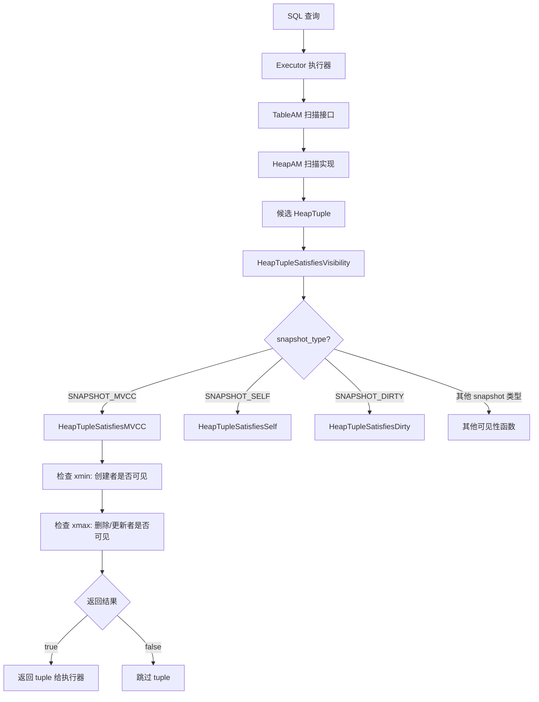

可以把 MVCC 可见性函数理解成一个二维判断：

| 判断对象 | 判断问题 | 对结果的影响 |
|---|---|---|
| `xmin` | 创建这个版本的事务是否对当前 snapshot 可见 | 不可见则 tuple 一定不可见 |
| `xmax` | 删除或更新这个版本的事务是否对当前 snapshot 可见 | 可见则 tuple 不可见 |
| `infomask` | 是否已有事务状态缓存或锁语义 | 减少 CLOG/ProcArray 查询，区分锁和删除 |
| `curcid` | 同一事务内命令先后顺序 | 区分当前事务内“本语句之前/之后”的修改 |

## 🌟 2. 总览

PostgreSQL 的 MVCC 可见性判断回答一个问题：**某个 heap tuple 对当前 snapshot 是否可见**。

这个判断不是执行器直接完成的。执行器只负责驱动扫描，真正的判断在 heap access method 中完成，入口通常是：

```c
HeapTupleSatisfiesVisibility(tuple, snapshot, buffer)
```

该函数再根据 `snapshot type` 分发到不同的可见性函数。普通 SQL 查询使用 `SNAPSHOT_MVCC`，最终进入：

```c
HeapTupleSatisfiesMVCC(tuple, snapshot, buffer)
```

核心关系如下：

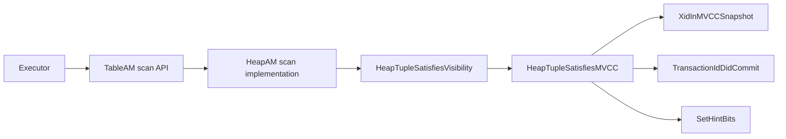

## 🧩 3. 关键数据结构

### 3.1 SnapshotData

`SnapshotData` 定义在 `src/include/utils/snapshot.h`。普通 MVCC snapshot 的核心字段是：

```c
typedef struct SnapshotData
{
    SnapshotType snapshot_type;

    TransactionId xmin;   /* all XID < xmin are visible to me */
    TransactionId xmax;   /* all XID >= xmax are invisible to me */

    TransactionId *xip;
    uint32        xcnt;

    TransactionId *subxip;
    int32         subxcnt;
    bool          suboverflowed;

    bool          takenDuringRecovery;
    CommandId     curcid;
} SnapshotData;
```

它的基本语义是：

| 判断条件 | 含义 |
|---|---|
| `xid < snapshot->xmin` | 该事务在快照看来已经结束 |
| `xid >= snapshot->xmax` | 该事务在快照看来还未结束，不可见 |
| `xmin <= xid < xmax && xid in xip array` | 快照创建时该事务仍在运行 |
| `xmin <= xid < xmax && xid not in xip array` | 快照创建前该事务已经结束 |

Snapshot 的边界可以画成下面这样：

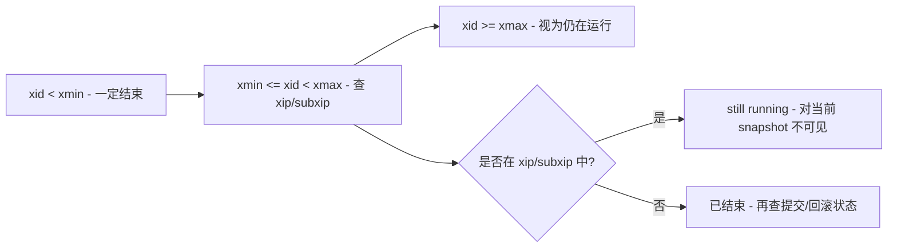

### 3.2 HeapTupleHeaderData

tuple header 定义在 `src/include/access/htup_details.h`，MVCC 相关字段包括：

```c
struct HeapTupleHeaderData
{
    union
    {
        HeapTupleFields t_heap;
        DatumTupleFields t_datum;
    } t_choice;

    ItemPointerData t_ctid;
    uint16          t_infomask2;
    uint16          t_infomask;
    uint8           t_hoff;
    bits8           t_bits[FLEXIBLE_ARRAY_MEMBER];
};
```

其中：

| 字段 | 作用 |
|---|---|
| `xmin` | 创建该 tuple 版本的事务 ID |
| `xmax` | 删除、更新或锁定该 tuple 的事务 ID / MultiXactId |
| `t_ctid` | 指向自身或更新后的新版本 |
| `t_infomask` | hint bits、锁标记、事务状态缓存 |
| `t_infomask2` | HOT、key update、属性数量等扩展信息 |

常见 hint bits：

| 标志 | 含义 |
|---|---|
| `HEAP_XMIN_COMMITTED` | 插入事务已提交 |
| `HEAP_XMIN_INVALID` | 插入事务无效或已回滚 |
| `HEAP_XMAX_COMMITTED` | 删除或更新事务已提交 |
| `HEAP_XMAX_INVALID` | `xmax` 无效，tuple 未被删除或删除事务回滚 |
| `HEAP_XMAX_LOCK_ONLY` | `xmax` 只表示锁，不表示删除 |
| `HEAP_XMAX_IS_MULTI` | `xmax` 是 MultiXactId |
| `HEAP_UPDATED` | 当前 tuple 是 UPDATE 产生的新版本 |
| `HEAP_HOT_UPDATED` | 旧 tuple 发生 HOT update |

tuple 版本链的关键字段关系：

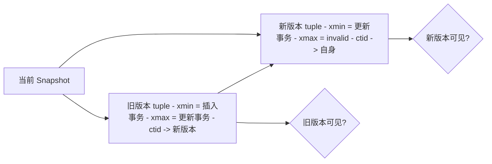

## 📄 4. 可见性函数分发

`HeapTupleSatisfiesVisibility()` 位于 `src/backend/access/heap/heapam_visibility.c:1714`。

源码结构如下：

```c
bool
HeapTupleSatisfiesVisibility(HeapTuple tup, Snapshot snapshot, Buffer buffer)
{
    switch (snapshot type)
    {
        case SNAPSHOT_MVCC:
            return HeapTupleSatisfiesMVCC(tup, snapshot, buffer);
        case SNAPSHOT_SELF:
            return HeapTupleSatisfiesSelf(tup, snapshot, buffer);
        case SNAPSHOT_ANY:
            return HeapTupleSatisfiesAny(tup, snapshot, buffer);
        case SNAPSHOT_TOAST:
            return HeapTupleSatisfiesToast(tup, snapshot, buffer);
        case SNAPSHOT_DIRTY:
            return HeapTupleSatisfiesDirty(tup, snapshot, buffer);
        case SNAPSHOT_HISTORIC_MVCC:
            return HeapTupleSatisfiesHistoricMVCC(tup, snapshot, buffer);
        case SNAPSHOT_NON_VACUUMABLE:
            return HeapTupleSatisfiesNonVacuumable(tup, snapshot, buffer);
    }

    return false;
}
```

各函数职责：

| 函数 | 位置 | 使用场景 |
|---|---:|---|
| `HeapTupleSatisfiesMVCC` | `heapam_visibility.c:907` | 普通 MVCC 查询 |
| `HeapTupleSatisfiesSelf` | `heapam_visibility.c:117` | 需要看到当前事务自身修改的场景 |
| `HeapTupleSatisfiesAny` | `heapam_visibility.c:287` | 忽略可见性，任何 tuple 都可见 |
| `HeapTupleSatisfiesToast` | `heapam_visibility.c:309` | TOAST tuple 可见性 |
| `HeapTupleSatisfiesDirty` | `heapam_visibility.c:690` | 包含未提交事务影响，并返回冲突 XID |
| `HeapTupleSatisfiesHistoricMVCC` | `heapam_visibility.c:1534` | 逻辑解码历史快照 |
| `HeapTupleSatisfiesNonVacuumable` | `heapam_visibility.c:1376` | 判断 tuple 是否仍可能被某事务看到 |
| `HeapTupleSatisfiesUpdate` | `heapam_visibility.c:405` | UPDATE/DELETE 冲突判断，返回 `TM_Result` |
| `HeapTupleSatisfiesVacuum` | `heapam_visibility.c:1109` | VACUUM 死元组判断 |

分发流程图：

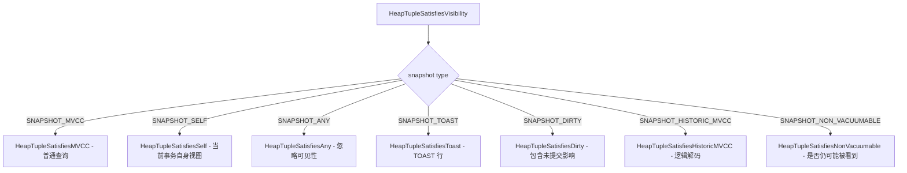

## ⚙️ 5. HeapTupleSatisfiesMVCC 详细实现

`HeapTupleSatisfiesMVCC()` 的整体逻辑分两段：

1. 判断 `xmin`：创建 tuple 的事务对当前 snapshot 是否可见。
2. 判断 `xmax`：删除或更新 tuple 的事务对当前 snapshot 是否可见。

只有 `xmin` 可见且 `xmax` 不可见，tuple 才对当前 snapshot 可见。

整体决策模型：

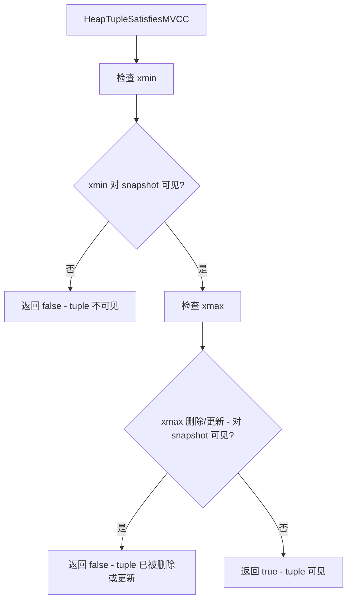

### 5.1 入口约束

函数入口：

```c
static bool
HeapTupleSatisfiesMVCC(HeapTuple htup, Snapshot snapshot, Buffer buffer)
{
    HeapTupleHeader tuple = htup->t_data;

    Assert(ItemPointerIsValid(&htup->t_self));
    Assert(htup->t_tableOid != InvalidOid);
    ...
}
```

调用方必须保证：

- `HeapTuple` 指向有效 tuple。
- `buffer` 至少持有 shared lock。
- `snapshot` 是 `SNAPSHOT_MVCC` 类型。

该函数可能设置 hint bits，并把 buffer 标记为 dirty。

### 5.2 xmin 判断

第一大段逻辑处理插入事务 `xmin`。

#### 5.2.1 xmin 已知未提交

```c
if (!HeapTupleHeaderXminCommitted(tuple))
{
    if (HeapTupleHeaderXminInvalid(tuple))
        return false;
    ...
}
```

如果 tuple header 已经标记 `HEAP_XMIN_INVALID`，说明插入事务回滚或无效，该 tuple 从未对任何正常 MVCC snapshot 可见，直接返回 `false`。

#### 5.2.2 xmin 是当前事务

```c
else if (TransactionIdIsCurrentTransactionId(HeapTupleHeaderGetRawXmin(tuple)))
{
    if (HeapTupleHeaderGetCmin(tuple) >= snapshot->curcid)
        return false;
    ...
}
```

如果 tuple 是当前事务插入的，还要比较 command id：

| 条件 | 结果 |
|---|---|
| `cmin >= snapshot->curcid` | 当前命令开始后才插入，不可见 |
| `cmin < snapshot->curcid` | 当前命令之前插入，继续判断 `xmax` |

这解释了同一事务内部“当前语句是否能看到自己刚插入的数据”的细节。PostgreSQL 不只靠 XID 判断，还需要 `CommandId` 区分同一事务内不同命令的先后关系。

当前事务插入路径：

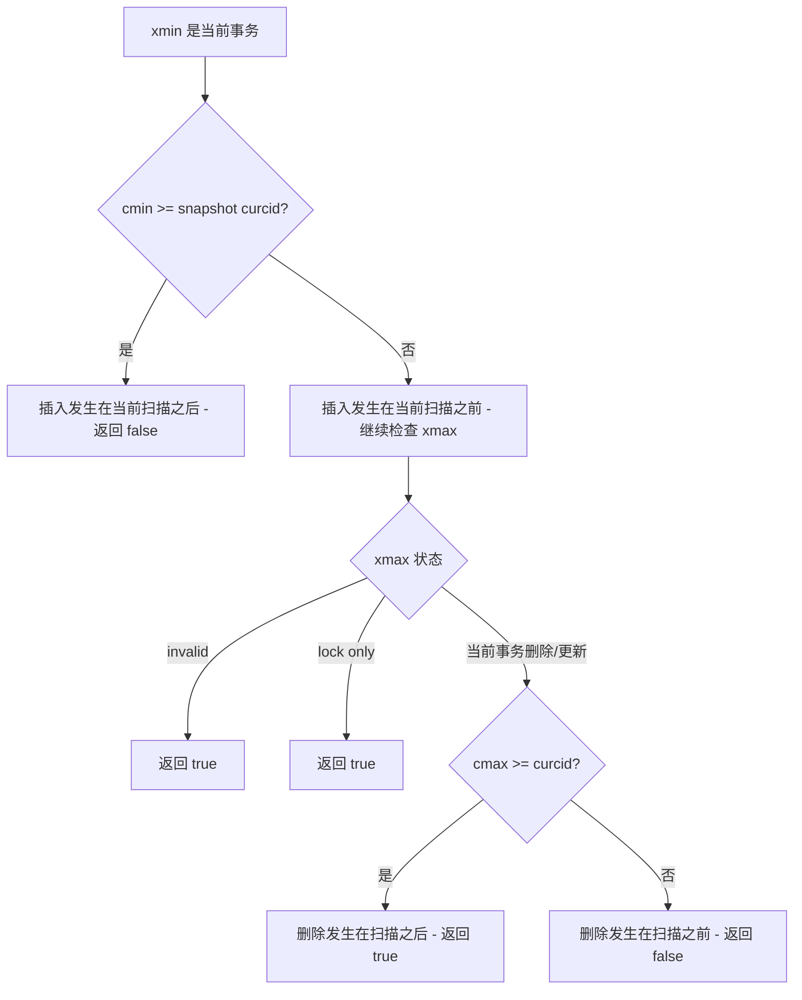

如果当前事务随后又更新或删除了该 tuple，还会检查 `xmax/cmax`：

```text
xmax invalid                 -> 可见
xmax lock only               -> 可见
xmax 是当前事务且 cmax >= curcid -> 可见，删除发生在当前扫描之后
xmax 是当前事务且 cmax < curcid  -> 不可见，删除发生在当前扫描之前
```

#### 5.2.3 xmin 在当前 snapshot 中仍运行

```c
else if (XidInMVCCSnapshot(HeapTupleHeaderGetRawXmin(tuple), snapshot))
    return false;
```

如果插入事务在当前 snapshot 看来仍在运行，那么这条 tuple 对当前 snapshot 不可见。

注意：这里不去查询最新事务状态。即使该事务在函数调用时已经提交，只要它在 snapshot 创建时还在运行，就仍然不可见。这是 MVCC snapshot 稳定性的核心。

#### 5.2.4 xmin 已经提交或回滚

```c
else if (TransactionIdDidCommit(HeapTupleHeaderGetRawXmin(tuple)))
    SetHintBits(tuple, buffer, HEAP_XMIN_COMMITTED,
                HeapTupleHeaderGetRawXmin(tuple));
else
{
    SetHintBits(tuple, buffer, HEAP_XMIN_INVALID,
                InvalidTransactionId);
    return false;
}
```

如果 `xmin` 不在 snapshot 的运行集合中，函数会查询事务提交状态：

| 事务状态 | 动作 |
|---|---|
| committed | 设置 `HEAP_XMIN_COMMITTED` hint bit，继续判断 `xmax` |
| aborted/crashed | 设置 `HEAP_XMIN_INVALID` hint bit，返回不可见 |

`xmin` 判断完整流程：

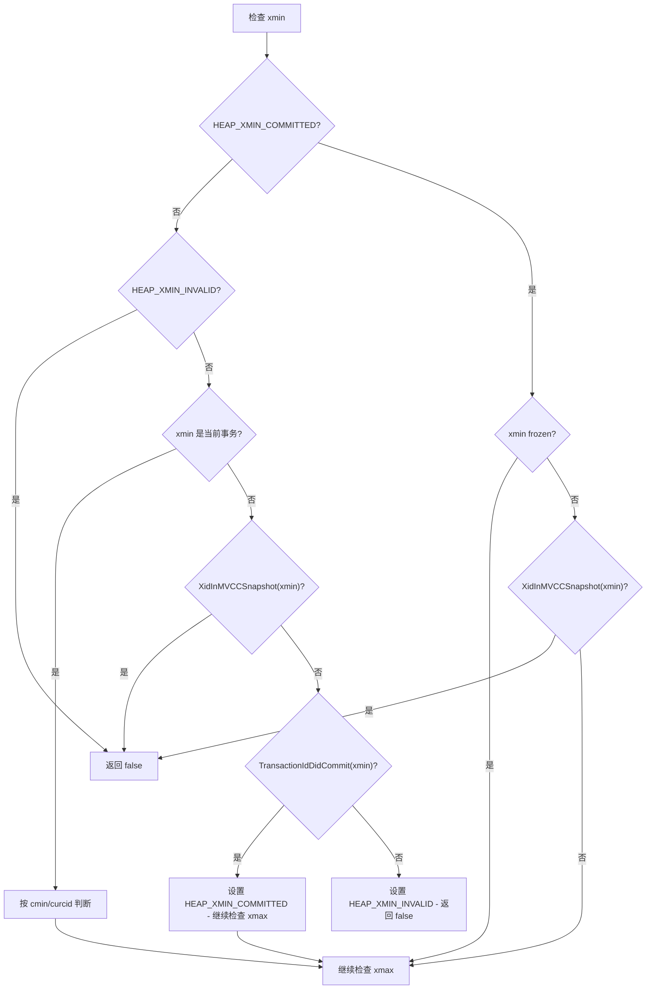

### 5.3 xmin hint bit 已经提交时的二次 snapshot 检查

如果 tuple header 已有 `HEAP_XMIN_COMMITTED`，仍然不能立即认为它对当前 snapshot 可见：

```c
else
{
    if (!HeapTupleHeaderXminFrozen(tuple) &&
        XidInMVCCSnapshot(HeapTupleHeaderGetRawXmin(tuple), snapshot))
        return false;
}
```

原因是 hint bit 只说明事务最终提交了，不说明它在当前 snapshot 创建之前提交。若 `xmin` 存在于当前 snapshot 的 running XID 集合里，必须把它当作仍在运行，因此不可见。

### 5.4 xmax 判断

当执行到这里，说明插入事务已经对当前 snapshot 可见。接下来判断删除或更新事务 `xmax`。

#### 5.4.1 xmax 无效

```c
if (tuple->t_infomask & HEAP_XMAX_INVALID)
    return true;
```

`xmax` 无效表示该 tuple 没有被有效删除或更新，因此可见。

#### 5.4.2 xmax 只是锁

```c
if (HEAP_XMAX_IS_LOCKED_ONLY(tuple->t_infomask))
    return true;
```

`xmax` 不一定是删除者。行级锁、`SELECT FOR UPDATE`、外键检查等场景会把锁信息写入 `xmax`。如果标志说明它只是锁，不代表新版本或删除，该 tuple 仍然可见。

`xmax` 的判断目标是确认“删除/更新是否已经对当前 snapshot 生效”：

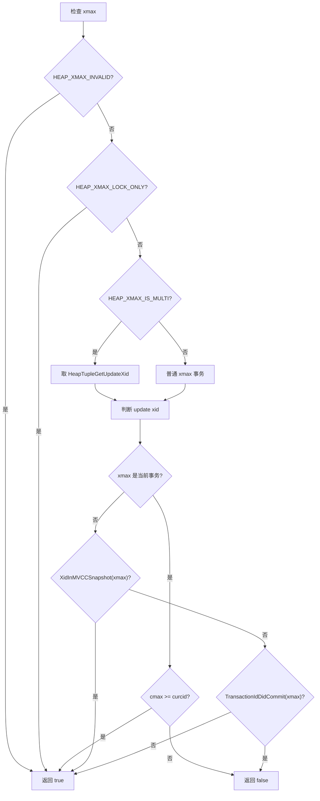

#### 5.4.3 xmax 是 MultiXact

```c
if (tuple->t_infomask & HEAP_XMAX_IS_MULTI)
{
    TransactionId xmax = HeapTupleGetUpdateXid(tuple);
    ...
}
```

MultiXact 可能包含多个 locker，也可能包含真正的 updater。MVCC 可见性只关心更新或删除该 tuple 的那个 XID：

| 条件 | 结果 |
|---|---|
| update XID 是当前事务，且 `cmax >= curcid` | 删除发生在扫描之后，可见 |
| update XID 是当前事务，且 `cmax < curcid` | 删除发生在扫描之前，不可见 |
| update XID 在 snapshot 中仍运行 | 删除未对当前 snapshot 生效，可见 |
| update XID 已提交 | 删除或更新对当前 snapshot 生效，不可见 |
| update XID 回滚 | 删除无效，可见 |

#### 5.4.4 xmax 是普通事务

如果 `xmax` 不是 MultiXact，逻辑类似：

```text
xmax 是当前事务:
    cmax >= curcid -> 可见
    cmax < curcid  -> 不可见

xmax 在 snapshot 中仍运行:
    -> 可见

xmax 未提交或回滚:
    -> 设置 HEAP_XMAX_INVALID，返回可见

xmax 已提交:
    -> 设置 HEAP_XMAX_COMMITTED，返回不可见
```

### 5.5 MVCC 可见性决策表

简化决策表如下：

| xmin 状态 | xmax 状态 | tuple 是否可见 |
|---|---|---|
| `xmin` 回滚/无效 | 任意 | 不可见 |
| `xmin` 在 snapshot 中运行 | 任意 | 不可见 |
| `xmin` 当前事务插入，但插入 command 晚于 snapshot command | 任意 | 不可见 |
| `xmin` 已提交且对 snapshot 可见 | `xmax` 无效 | 可见 |
| `xmin` 已提交且对 snapshot 可见 | `xmax` 仅表示锁 | 可见 |
| `xmin` 已提交且对 snapshot 可见 | `xmax` 在 snapshot 中运行 | 可见 |
| `xmin` 已提交且对 snapshot 可见 | `xmax` 回滚 | 可见 |
| `xmin` 已提交且对 snapshot 可见 | `xmax` 已提交且对 snapshot 可见 | 不可见 |
| `xmin` 当前事务插入 | 当前事务删除发生在当前扫描之后 | 可见 |
| `xmin` 当前事务插入 | 当前事务删除发生在当前扫描之前 | 不可见 |

## 📄 6. XidInMVCCSnapshot

`XidInMVCCSnapshot()` 位于 `src/backend/utils/time/snapmgr.c:2259`，用于判断某个 XID 是否在 snapshot 看来仍在运行。

核心流程：

```c
if (TransactionIdPrecedes(xid, snapshot->xmin))
    return false;

if (TransactionIdFollowsOrEquals(xid, snapshot->xmax))
    return true;

if (!snapshot->takenDuringRecovery)
{
    if (!snapshot->suboverflowed)
        search snapshot->subxip array;
    else
        xid = SubTransGetTopmostTransaction(xid);

    search snapshot->xip array;
}
else
{
    if (snapshot->suboverflowed)
        xid = SubTransGetTopmostTransaction(xid);

    search snapshot->subxip array;
}

return false;
```

这个函数的性能设计很明确：

- 先用 `xmin/xmax` 做快速范围过滤。
- 普通快照下先查子事务数组，再查顶层事务数组。
- 如果子事务数组溢出，需要查 `pg_subtrans` 找顶层事务。
- recovery snapshot 使用 `subxip array` 存放所有相关 XID，因为恢复期间通常不知道哪个是顶层事务、哪个是子事务。

流程图如下：

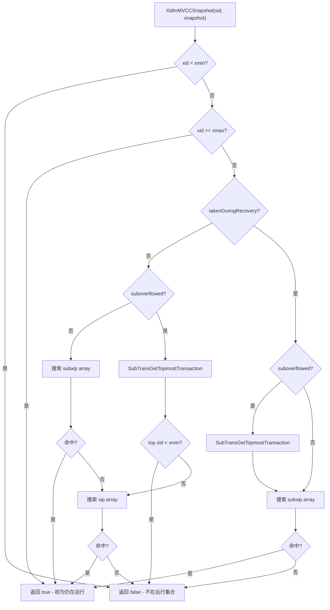

## 🔗 7. 可见性函数在调用栈中的位置

### 7.1 普通顺序扫描

顺序扫描从执行器节点 `ExecSeqScan()` 开始。

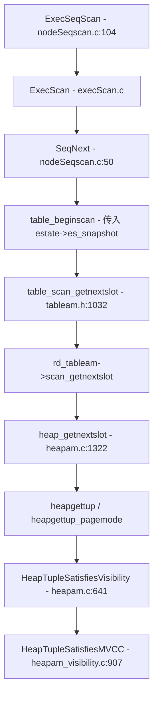

调用位置在 `heapgettup()` 中：

```c
valid = HeapTupleSatisfiesVisibility(tuple,
                                     snapshot,
                                     scan->rs_cbuf);
```

这说明普通表扫描时，执行器拿到的 tuple 已经经过 heap 层可见性过滤。

### 7.2 Page-at-a-time 顺序扫描

当扫描允许 pagemode 时，路径略有不同：

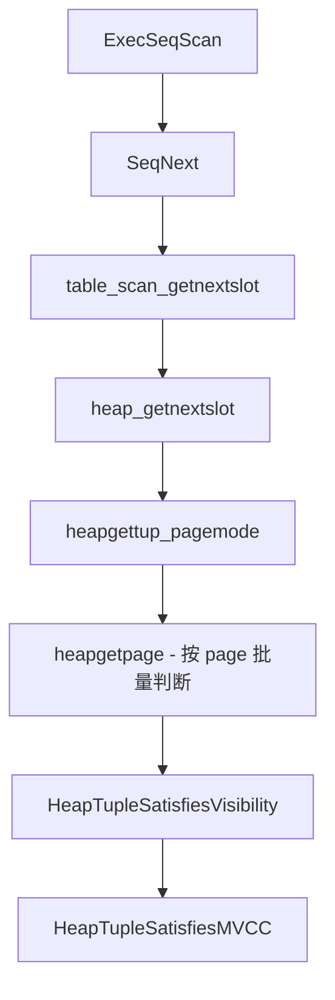

`heapgetpage()` 会在页面级别批量检查 tuple 可见性，把可见 tuple 的 offset 记录到扫描描述符中。这样可以减少逐 tuple 的锁操作成本。

源码位置：

```text
src/backend/access/heap/heapam.c:297   heapgetpage()
src/backend/access/heap/heapam.c:399   HeapTupleSatisfiesVisibility()
```

### 7.3 HOT 链扫描

索引扫描命中 HOT 链根 tuple 后，需要沿 HOT 链找到对当前 snapshot 可见的版本。

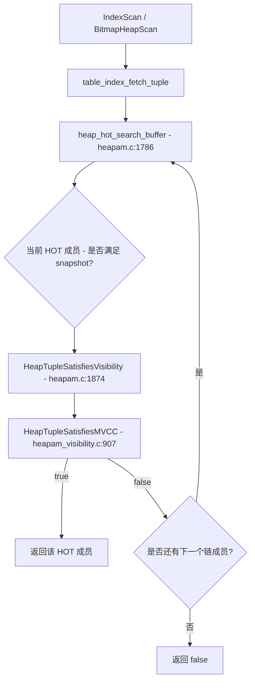

`heap_hot_search_buffer()` 中的关键调用：

```c
valid = HeapTupleSatisfiesVisibility(heapTuple, snapshot, buffer);
```

HOT 链场景的额外约束：

- 链起点不能是 `HEAP_ONLY` tuple。
- 当前版本的 `xmin` 必须等于上一版本的 `xmax`，否则链断裂。
- 找到第一个对 snapshot 可见的版本后返回。
- 如果 `all_dead` 参数非空，还会判断链上不可见版本是否都已经全局 dead，供 pruning 使用。

HOT 版本链示意：

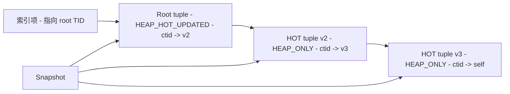

### 7.4 索引扫描回表

索引扫描本身只返回 TID。真正的数据可见性仍然要回 heap 检查。

典型路径：

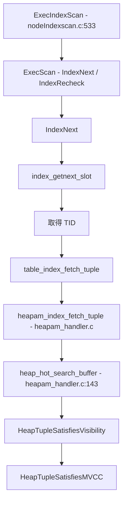

在 `heapam_handler.c` 中也能看到直接可见性判断，例如：

```text
src/backend/access/heap/heapam_handler.c:254
src/backend/access/heap/heapam_handler.c:2270
src/backend/access/heap/heapam_handler.c:2591
```

这解释了一个常见问题：**为什么 PostgreSQL 索引项不直接决定行是否可见？**

因为索引项没有完整 MVCC 状态。最终可见性必须回到 heap tuple header，根据 `xmin/xmax/infomask/snapshot` 判断。

### 7.5 系统表扫描和重检

系统表扫描既可能走 heap scan，也可能走 index scan。入口在 `src/backend/access/index/genam.c`：

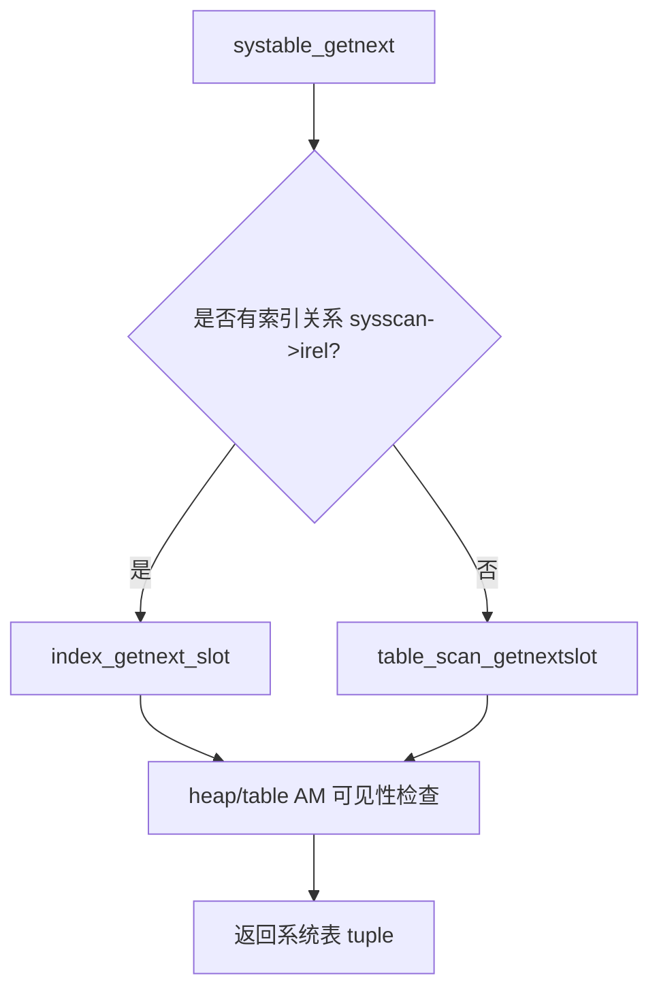

系统表重检路径：

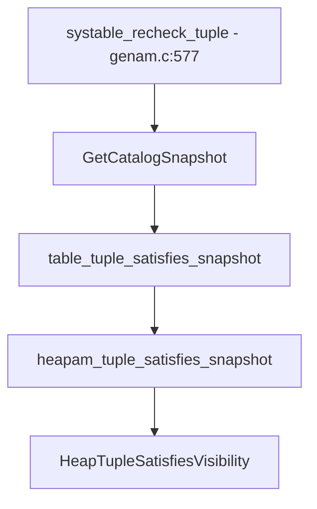

它用于确认某个系统对象在等待锁之后是否仍然对新的 catalog snapshot 可见。

### 7.6 UPDATE/DELETE 路径中的可见性判断

UPDATE/DELETE 不只需要普通 MVCC 可见性，还需要知道 tuple 是否正被其他事务修改、是否已经被更新、是否被当前事务自己修改。因此它主要使用：

```c
HeapTupleSatisfiesUpdate()
```

典型 UPDATE 调用栈：

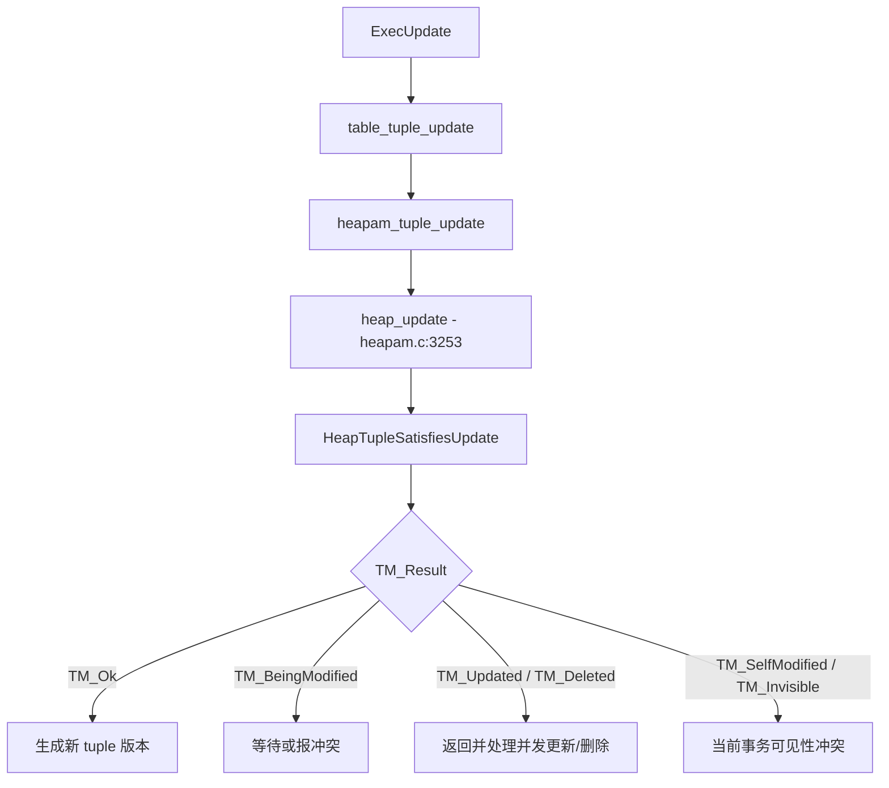

`heap_update()` 中还有 `crosscheck` 场景会调用普通可见性判断：

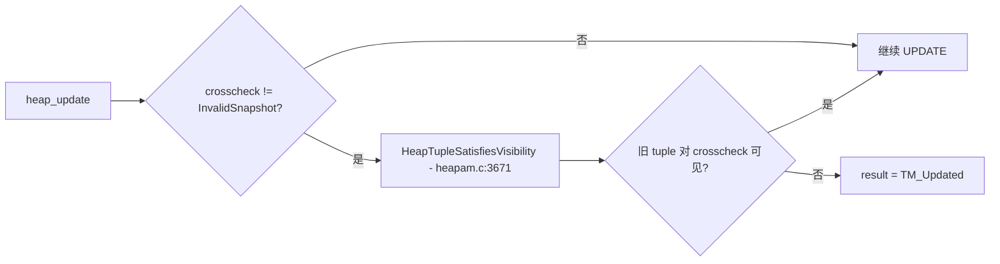

`HeapTupleSatisfiesUpdate()` 返回更细粒度的 `TM_Result`：

| 返回值 | 含义 |
|---|---|
| `TM_Invisible` | tuple 对当前命令不可见 |
| `TM_Ok` | tuple 可被更新 |
| `TM_SelfModified` | 当前事务已经修改过该 tuple |
| `TM_Updated` | 其他已提交事务更新了该 tuple |
| `TM_Deleted` | 其他已提交事务删除了该 tuple |
| `TM_BeingModified` | 其他运行中事务正在修改该 tuple |

## 📄 8. Hint Bits 的副作用

可见性函数不是纯只读函数。它可能通过 `SetHintBits()` 修改 tuple header：

```text
HEAP_XMIN_COMMITTED
HEAP_XMIN_INVALID
HEAP_XMAX_COMMITTED
HEAP_XMAX_INVALID
```

这样做的目标是避免后续访问反复查询 CLOG/pg_xact。

需要注意：

- hint bits 不改变事务语义，只缓存已经确定的事务状态。
- 设置 hint bits 会把 buffer 标记为 dirty。
- 在 `HeapTupleSatisfiesMVCC()` 中，如果某事务在当前 snapshot 看来仍在运行，即使它实际上刚刚提交，也不会急着设置 hint bit。这是为了避免不必要的 ProcArray 争用，并保持当前 snapshot 语义稳定。

hint bits 的作用链路：

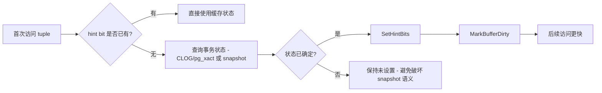

## 📄 9. 为什么 xmax 不能简单理解为删除事务

`xmax` 有三种常见含义：

1. 删除或更新该 tuple 的事务 ID。
2. 锁住该 tuple 的事务 ID。
3. MultiXactId，表示多个 locker 或 updater 的组合。

因此判断 tuple 是否被删除，不能只看 `xmax` 是否有效，还必须结合：

```text
HEAP_XMAX_INVALID
HEAP_XMAX_LOCK_ONLY
HEAP_XMAX_IS_MULTI
HEAP_XMAX_COMMITTED
t_ctid
HeapTupleGetUpdateXid()
```

例如：

```text
xmax 有值 + HEAP_XMAX_LOCK_ONLY
```

表示 tuple 被锁过，但并不表示 tuple 被删除或更新。对普通 MVCC 查询来说，它仍然可见。

`xmax` 语义拆分：

```mermaid
graph TB
    Xmax["xmax 有值"] --> LockOnly{"HEAP_XMAX_LOCK_ONLY?"}
    LockOnly -->|是| Lock["只表示锁 - tuple 仍可见"]
    LockOnly -->|否| Multi{"HEAP_XMAX_IS_MULTI?"}
    Multi -->|是| MultiXact["MultiXactId - 需取 update xid"]
    Multi -->|否| UpdateXid["普通删除/更新 XID"]
    MultiXact --> CommitCheck["判断 update xid 是否对 snapshot 可见"]
    UpdateXid --> CommitCheck
    CommitCheck -->|可见| Dead["tuple 不可见"]
    CommitCheck -->|不可见或回滚| Live["tuple 可见"]
```

## 📄 10. 普通 SELECT 的完整可见性链路

以最普通的 `SELECT * FROM t` 为例：

```mermaid
sequenceDiagram
    participant Q as SELECT
    participant E as Executor
    participant T as TableAM
    participant H as HeapAM
    participant V as Visibility
    participant S as Snapshot

    Q->>E: 启动 SeqScan
    E->>T: table_beginscan(relation, snapshot)
    E->>T: table_scan_getnextslot()
    T->>H: heap_getnextslot()
    H->>H: 扫描 page / line pointer
    H->>V: HeapTupleSatisfiesVisibility(tuple, snapshot, buffer)
    V->>V: HeapTupleSatisfiesMVCC()
    V->>S: XidInMVCCSnapshot(xmin/xmax)
    S-->>V: running / not running
    V-->>H: visible true/false
    H-->>E: visible tuple -> TupleTableSlot
    E->>E: qual / projection
    E-->>Q: 返回结果行
```

可见性函数的位置非常靠近 heap 存储层。执行器后续看到的，通常已经是满足 snapshot 的 tuple。

## 📚 11. 阅读源码时的主线

建议按下面顺序阅读：

1. `src/include/utils/snapshot.h`
   - 理解 `SnapshotData` 的 `xmin/xmax/xip/subxip`。

2. `src/backend/storage/ipc/procarray.c`
   - 阅读 `GetSnapshotData()`，理解 snapshot 如何从 ProcArray 构造。

3. `src/backend/utils/time/snapmgr.c`
   - 阅读 `XidInMVCCSnapshot()`，理解 snapshot 如何判断 XID 是否 still running。

4. `src/include/access/htup_details.h`
   - 理解 tuple header、`xmin/xmax/ctid/infomask`。

5. `src/backend/access/heap/heapam_visibility.c`
   - 阅读 `HeapTupleSatisfiesVisibility()` 和 `HeapTupleSatisfiesMVCC()`。

6. `src/backend/access/heap/heapam.c`
   - 阅读 `heapgettup()`、`heap_hot_search_buffer()`、`heap_update()`。

7. `src/backend/executor/nodeSeqscan.c`
   - 从执行器入口反向理解普通查询如何触发可见性判断。

## ✅ 12. 总结

PostgreSQL MVCC 可见性判断的核心可以概括为：

```text
tuple header 描述版本的出生和消亡；
snapshot 描述当前事务能看到的时间边界；
HeapTupleSatisfiesMVCC() 把二者组合成 true/false；
HeapTupleSatisfiesVisibility() 是不同 snapshot 类型的统一分发入口。
```

在调用栈中，可见性函数位于执行器和存储之间的 heap access method 层。普通顺序扫描、索引扫描回表、HOT 链搜索、系统表扫描和 UPDATE/DELETE 冲突检测都会在不同位置调用这些函数或其变体。

理解 `HeapTupleSatisfiesMVCC()` 的关键不是背分支，而是抓住两个判断：

1. **创建者 `xmin` 是否对当前 snapshot 可见。**
2. **删除者或更新者 `xmax` 是否对当前 snapshot 可见。**

只有创建者可见，并且删除者不可见，tuple 才是当前查询应该返回的版本。
