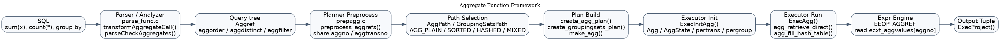
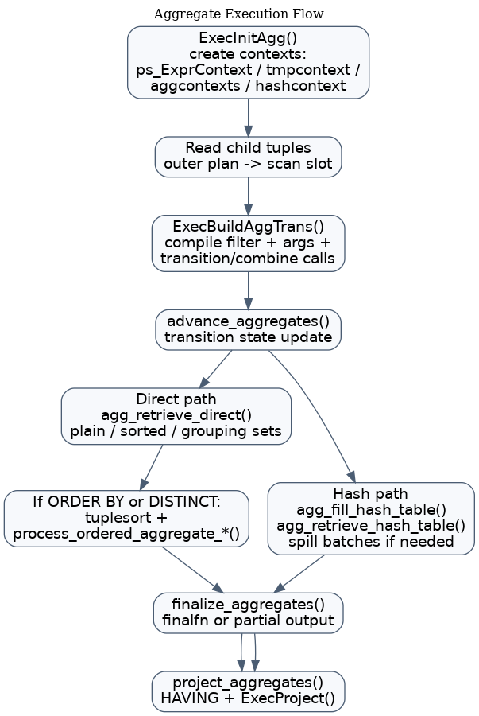
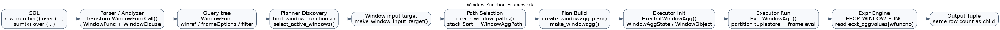
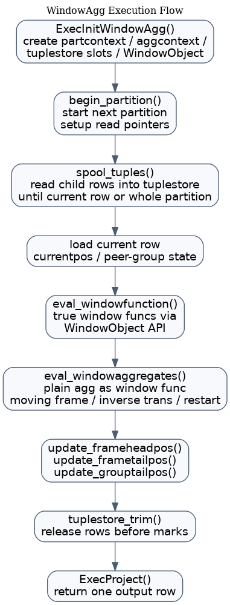

# 🧮 PostgreSQL/IvorySQL 聚集函数与窗口函数实现技术分享

> 📌 文档类型：技术分享 / 源码级实现分析
> 👥 适用对象：数据库内核开发者、执行器与优化器源码阅读者。
> 🧭 阅读方式：建议先看总体框架图，再进入聚集函数与窗口函数两条实现主线。

## 🧭 快速导航

- 🎯 1. 文档目标
- ✅ 2. 总体结论
- 🗺️ 3. 总体框架图
- 🏗️ 4. 聚集函数实现框架
- 🧩 4.1 关键数据结构
- 🛠️ 4.2 解析阶段：把 SQL 变成 `Aggref`
- 🛠️ 4.3 规划阶段：共享、拆分与路径选择
- ⚙️ 4.4 执行阶段：`nodeAgg.c`
- 🏗️ 5. 窗口函数实现框架
- 🧩 5.1 关键数据结构
- 🛠️ 5.2 解析阶段：把 SQL `OVER (...)` 变成 `WindowFunc`
- 🛠️ 5.3 规划阶段：窗口发现、重排与堆叠
- ⚙️ 5.4 执行阶段：`nodeWindowAgg.c`
- ⚖️ 6. 两类能力的关键差异
- 🔭 7. 一个统一的源码理解视角
- 💡 8. 源码阅读建议
- ⭐ 9. 技术分享时可以强调的重点
- 📚 10. 关键源码索引
- ✅ 11. 总结

---

## 🎯 1. 文档目标

本文基于当前仓库源码，从“语法解析 -> 规划优化 -> 执行器 -> 表达式求值”四个阶段，系统说明 PostgreSQL/IvorySQL 中：

1. 聚集函数（Aggregate Function, `Agg`）的实现框架
2. 窗口函数（Window Function, `WindowAgg`）的实现框架
3. 两类能力在源码中的关键数据结构、核心函数与执行流程
4. 聚集函数与窗口函数在执行模型上的共性与差异

本文重点不是 SQL 用法，而是回答三个源码级问题：

1. 解析器如何把 SQL 变成 `Aggref` / `WindowFunc`
2. 优化器如何把它们组织成 `AggPath` / `WindowAggPath` 并生成 `Agg` / `WindowAgg`
3. 执行器如何维护状态、推进 frame、调用 `transfn` / `finalfn` / `WindowObject API`

---

## ✅ 2. 总体结论

先给结论，再看源码：

- 聚集函数的核心是“**多行输入，维护一份或多份 transition state，最后做 finalize**”。
- 窗口函数的核心是“**不减少行数，在分区内按 frame 重复求值**”。
- `nodeAgg.c` 负责“按组归并后输出”，因此它会减少行数。
- `nodeWindowAgg.c` 负责“对每一行附加窗口结果”，因此它不减少行数。
- 普通窗口函数（如 `row_number()`、`rank()`）通过 `WindowObject` API 访问分区数据。
- “聚集函数作为窗口函数”这类场景（如 `sum(x) over (...)`）不是走 `nodeAgg.c`，而是由 `nodeWindowAgg.c` 内部模拟一套 moving aggregate 框架。

一句话概括：

> `Agg` 是“归并输出一行/一组”，`WindowAgg` 是“保留每一行并在分区上重复计算”。

---

## 🗺️ 3. 总体框架图

### 3.1 聚集函数总体框架



### 3.2 聚集函数执行流程



### 3.3 窗口函数总体框架



### 3.4 WindowAgg 执行流程



---

## 🏗️ 4. 聚集函数实现框架

## 🧩 4.1 关键数据结构

### 4.1.1 `Aggref`

源码摘录：

```c
typedef struct Aggref
{
    Expr        xpr;
    Oid         aggfnoid;       /* pg_proc Oid of the aggregate */
    Oid         aggtype;        /* type Oid of result of the aggregate */
    Oid         aggcollid;      /* OID of collation of result */
    Oid         inputcollid;    /* OID of collation that function should use */
    Oid         aggtranstype;   /* type Oid of aggregate's transition value */
    List       *aggargtypes;    /* type Oids of direct and aggregated args */
    List       *aggdirectargs;  /* direct arguments, if an ordered-set agg */
    List       *args;           /* aggregated arguments and sort expressions */
    List       *aggorder;       /* ORDER BY (list of SortGroupClause) */
    List       *aggdistinct;    /* DISTINCT (list of SortGroupClause) */
    Expr       *aggfilter;      /* FILTER expression, if any */
    bool        aggstar;
    bool        aggvariadic;
    char        aggkind;
    Index       agglevelsup;
    AggSplit    aggsplit;
    int         aggno;          /* unique ID within the Agg node */
    int         aggtransno;     /* unique ID of transition state in the Agg */
    bool        has_outer_join;
    int         location;
} Aggref;
```

`Aggref` 是解析/规划阶段对聚集调用的抽象，关键字段有：

- `aggfnoid`：聚集函数在 `pg_proc` 中的 OID
- `aggtype`：SQL 层结果类型
- `aggtranstype`：transition state 类型
- `aggdirectargs`：ordered-set aggregate 的 direct args
- `args`：参与聚集的参数
- `aggorder`：`ORDER BY` 子句
- `aggdistinct`：`DISTINCT` 子句
- `aggfilter`：`FILTER` 子句
- `aggsplit`：partial aggregation 模式
- `aggno`：聚集结果编号
- `aggtransno`：transition state 编号

这里最关键的是两个编号：

- `aggno`：多个完全相同的 `Aggref` 可以共用同一个结果
- `aggtransno`：多个不同 `Aggref` 可以共用同一个 transition state

这两个编号不是 parser 决定的，而是在规划期由 `prepagg.c` 填好。

### 4.1.2 `AggPath` / `GroupingSetsPath`

源码摘录：

```c
typedef struct AggPath
{
    Path        path;
    Path       *subpath;        /* path representing input source */
    AggStrategy aggstrategy;    /* basic strategy, see nodes.h */
    AggSplit    aggsplit;       /* agg-splitting mode, see nodes.h */
    double      numGroups;      /* estimated number of groups in input */
    uint64      transitionSpace;/* for pass-by-ref transition data */
    List       *groupClause;    /* a list of SortGroupClause's */
    List       *qual;           /* quals (HAVING quals), if any */
} AggPath;

typedef struct GroupingSetsPath
{
    Path        path;
    Path       *subpath;        /* path representing input source */
    AggStrategy aggstrategy;    /* basic strategy */
    List       *rollups;        /* list of RollupData */
    List       *qual;           /* quals (HAVING quals), if any */
    uint64      transitionSpace;/* for pass-by-ref transition data */
} GroupingSetsPath;
```

它们描述的是“要怎么做聚集”，而不是“具体怎么执行”：

- `aggstrategy`：`AGG_PLAIN` / `AGG_SORTED` / `AGG_HASHED` / `AGG_MIXED`
- `aggsplit`：普通、部分聚集、合并聚集等模式
- `groupClause`：分组列
- `qual`：`HAVING`
- `transitionSpace`：transition state 估算空间

### 4.1.3 `Agg`

源码摘录：

```c
typedef struct Agg
{
    Plan        plan;
    AggStrategy aggstrategy;    /* basic strategy, see nodes.h */
    AggSplit    aggsplit;       /* agg-splitting mode, see nodes.h */
    int         numCols;        /* number of grouping columns */
    AttrNumber *grpColIdx;      /* their indexes in the target list */
    Oid        *grpOperators;   /* equality operators to compare with */
    Oid        *grpCollations;
    long        numGroups;      /* estimated number of groups in input */
    uint64      transitionSpace;/* for pass-by-ref transition data */
    Bitmapset  *aggParams;      /* IDs of Params used in Aggref inputs */
    List       *groupingSets;   /* grouping sets to use */
    List       *chain;          /* chained Agg/Sort nodes */
} Agg;
```

`Agg` 是计划树节点。它本身不直接列出“有哪些聚集函数”，而是依赖 targetlist/qual 中的 `Aggref`。

这点非常重要，因为它决定了执行器初始化时必须再次扫描表达式树，把 `Aggref` 收集进 `AggState->aggs`。

### 4.1.4 `AggState`

源码摘录：

```c
typedef struct AggState
{
    ScanState       ss;
    List           *aggs;           /* all Aggref nodes in targetlist & quals */
    int             numaggs;
    int             numtrans;
    AggStrategy     aggstrategy;
    AggSplit        aggsplit;
    AggStatePerPhase phase;
    int             numphases;
    int             current_phase;
    AggStatePerAgg  peragg;
    AggStatePerTrans pertrans;
    ExprContext    *hashcontext;
    ExprContext   **aggcontexts;
    ExprContext    *tmpcontext;
    ExprContext    *curaggcontext;
    AggStatePerAgg  curperagg;
    AggStatePerTrans curpertrans;
    bool            input_done;
    bool            agg_done;
    int             projected_set;
    int             current_set;
    ...
    AggStatePerGroup *pergroups;
    bool            table_filled;
    int             num_hashes;
    AggStatePerHash perhash;
    ProjectionInfo *combinedproj;
} AggState;
```

`AggState` 是执行期状态机，关键成员有：

- `aggs` / `numaggs`
- `peragg`：每个 `Aggref` 的 finalize 级状态
- `pertrans`：每个 transition state 的执行状态
- `aggcontexts`：每个 grouping set 的长生命周期内存
- `tmpcontext`：每行输入时的短生命周期内存
- `hashcontext`：HashAgg 的哈希表内存
- `pergroups`：分组聚集状态
- `perhash`：哈希聚集状态
- `phases`：grouping sets / mixed agg 的 phase 信息

从状态设计上看，`AggState` 的核心就是两层拆分：

1. `peragg`：面向“最终结果”
2. `pertrans`：面向“中间 transition state”

这正好对应 `aggno` 与 `aggtransno` 的设计。

---

## 🛠️ 4.2 解析阶段：把 SQL 变成 `Aggref`

核心文件：`src/backend/parser/parse_agg.c`

### 4.2.1 `transformAggregateCall()`

源码摘录：

```c
/*
 * transformAggregateCall -
 *      Finish initial transformation of an aggregate call
 *
 * Here we separate the args list into direct and aggregated args, storing the
 * former in agg->aggdirectargs and the latter in agg->args.
 * ...
 * We must also determine which query level the aggregate actually belongs to,
 * set agglevelsup accordingly, and mark p_hasAggs true in the corresponding
 * pstate level.
 */
void
transformAggregateCall(ParseState *pstate, Aggref *agg,
                       List *args, List *aggorder, bool agg_distinct)
{
    ...
}
```

它完成几件事：

1. 把普通参数转成 targetlist
2. 拆分 ordered-set aggregate 的 `direct args` 与 aggregated args
3. 处理 `ORDER BY`
4. 处理 `DISTINCT`
5. 生成 `aggargtypes`
6. 调用 `check_agglevels_and_constraints()`

重点细节：

- 普通 aggregate 没有 `aggdirectargs`
- `ORDER BY` 可能补进 resjunk target entries
- `DISTINCT` aggregate 需要可排序的类型，否则直接报错

也就是说，`Aggref` 在 parser 阶段就已经不是一个简单的“函数调用节点”了，而是被扩展成了 executor 可用的结构化调用描述。

### 4.2.2 聚集层级与合法性检查

源码摘录：

```c
static int
check_agg_arguments(ParseState *pstate,
                    List *directargs,
                    List *args,
                    Expr *filter)
{
    ...
    if (agglevel == context.min_agglevel)
        ereport(ERROR,
                (errcode(ERRCODE_GROUPING_ERROR),
                 errmsg("aggregate function calls cannot be nested"),
                 ...));
    ...
}

/*
 * parseCheckAggregates
 *  Check for aggregates where they shouldn't be and improper grouping.
 */
void
parseCheckAggregates(ParseState *pstate, Query *qry)
{
    ...
}
```

这里负责：

- 计算聚集所在的 query level
- 检查不合法位置，例如 `JOIN` 条件、`WHERE`、`CHECK` 约束等
- 检查 grouping 语义是否正确
- 检查 recursive term 中禁止 aggregate

因此，语义规则大头其实在 parser/analyzer 阶段就收紧了，执行器基本默认输入是合法的。

---

## 🛠️ 4.3 规划阶段：共享、拆分与路径选择

### 4.3.1 `preprocess_aggrefs()`：聚集去重与共享

核心文件：`src/backend/optimizer/prep/prepagg.c`

源码摘录：

```c
/* -----------------
 * Resolve the transition type of all Aggrefs, and determine which Aggrefs
 * can share aggregate or transition state.
 *
 * Information about the aggregates and transition functions are collected
 * in the root->agginfos and root->aggtransinfos lists.  The 'aggtranstype',
 * 'aggno', and 'aggtransno' fields of each Aggref are filled in.
 * ...
 * We try to optimize by detecting duplicate aggregate functions so that
 * their state and final values are re-used, rather than needlessly being
 * re-calculated independently.  We also detect aggregates that are not
 * the same, but which can share the same transition state.
 * -----------------
 */
void
preprocess_aggrefs(PlannerInfo *root, Node *clause)
{
    (void) preprocess_aggrefs_walker(clause, root);
}
```

这个文件非常关键，经常被忽略。它负责：

1. 解析 `pg_aggregate` 获取 `transfn` / `finalfn` / `combinefn` / `serialfn` / `deserialfn`
2. 解析 `agginitval`
3. 解析并回填 `aggtranstype`
4. 判断两个 `Aggref` 是否完全相同，可否共用 `aggno`
5. 判断不同 `Aggref` 是否可以共用 transition state，可否共用 `aggtransno`

源码注释已经直接写明了两类优化：

- 完全相同的聚集调用，共享同一 `aggno`
- 不同聚集调用，只要 transition 阶段完全兼容，就共享同一 `aggtransno`

这一步完成后，规划器已经知道：

- 最终需要几个结果
- 实际需要维护几份 transition state

这直接影响 `AggState->numaggs` 和 `AggState->numtrans`。

### 4.3.2 为什么 `aggno` 和 `aggtransno` 要分开

一个非常典型的源码设计点：

- `aggno` 解决“结果能不能复用”
- `aggtransno` 解决“状态能不能复用”

因此在 executor 中，`finalize_aggregate()` 是按 `peragg` 走的，而 `advance_transition_function()` 是按 `pertrans` 走的。

### 4.3.3 聚集策略选择

关键路径：

- `planner.c` 中根据分组和排序条件生成 `AggPath`

源码摘录：

```c
if (rollups)
{
    add_path(grouped_rel, (Path *)
             create_groupingsets_path(root,
                                      grouped_rel,
                                      path,
                                      (List *) parse->havingQual,
                                      AGG_MIXED,
                                      rollups,
                                      agg_costs,
                                      dNumGroups));
}

if (!gd->unsortable_sets)
    add_path(grouped_rel, (Path *)
             create_groupingsets_path(root,
                                      grouped_rel,
                                      path,
                                      (List *) parse->havingQual,
                                      AGG_SORTED,
                                      gd->rollups,
                                      agg_costs,
                                      dNumGroups));
```

PostgreSQL 会在几种策略间选择：

- `AGG_PLAIN`：无 `GROUP BY`
- `AGG_SORTED`：输入已按分组键排序
- `AGG_HASHED`：使用哈希表分组
- `AGG_MIXED`：grouping sets 等场景下混合 sorted/hash

grouping sets 的额外复杂度在于：

- 不同 grouping set 可能需要不同 phase
- `Agg` 计划节点通过 `chain` 挂接额外的 Agg/Sort 描述
- executor 以 `phase` 方式推进

### 4.3.4 `create_agg_plan()`

源码摘录：

```c
static Agg *
create_agg_plan(PlannerInfo *root, AggPath *best_path)
{
    Plan *subplan;
    List *tlist;
    List *quals;

    subplan = create_plan_recurse(root, best_path->subpath, CP_LABEL_TLIST);
    tlist = build_path_tlist(root, &best_path->path);
    quals = order_qual_clauses(root, best_path->qual);

    plan = make_agg(tlist, quals,
                    best_path->aggstrategy,
                    best_path->aggsplit,
                    list_length(best_path->groupClause),
                    extract_grouping_cols(best_path->groupClause,
                                          subplan->targetlist),
                    ...,
                    best_path->transitionSpace,
                    subplan);
    ...
}
```

职责非常直接：

1. 递归生成子计划
2. 构造 tlist 与 `HAVING`
3. 提取 grouping 列、操作符、collation
4. 通过 `make_agg()` 生成 `Agg`

### 4.3.5 `create_groupingsets_plan()`

源码摘录：

```c
static Plan *
create_groupingsets_plan(PlannerInfo *root, GroupingSetsPath *best_path)
{
    ...
    chain = NIL;
    if (list_length(rollups) > 1)
    {
        ...
        agg_plan = (Plan *) make_agg(NIL,
                                     NIL,
                                     strat,
                                     AGGSPLIT_SIMPLE,
                                     ...,
                                     rollup->gsets,
                                     NIL,
                                     rollup->numGroups,
                                     best_path->transitionSpace,
                                     sort_plan);
        chain = lappend(chain, agg_plan);
    }

    plan = make_agg(build_path_tlist(root, &best_path->path),
                    best_path->qual,
                    best_path->aggstrategy,
                    AGGSPLIT_SIMPLE,
                    ...,
                    rollup->gsets,
                    chain,
                    rollup->numGroups,
                    best_path->transitionSpace,
                    subplan);
    ...
}
```

这部分是理解 `nodeAgg.c` phase/chained Agg 的关键：

- 顶层 `Agg` 代表真正参与主计划树执行的节点
- 额外 grouping sets 通过 `chain` 挂在旁边
- 每个 rollup/hashed grouping 会生成额外的逻辑描述节点

这也是为什么 `nodeAgg.c` 顶部注释专门花大段篇幅解释 `phase`、`chain`、`AGG_MIXED`。

---

## ⚙️ 4.4 执行阶段：`nodeAgg.c`

核心文件：`src/backend/executor/nodeAgg.c`

### 4.4.1 顶层执行模型

源码摘录：

```text
transvalue = initcond
foreach input_tuple:
    transvalue = transfunc(transvalue, input_value(s))
result = finalfunc(transvalue, direct_argument(s))
```

扩展能力包括：

- `combinefunc`：partial aggregation 合并
- `serializefunc` / `deserializefunc`
- `ORDER BY` / `DISTINCT`
- ordered-set aggregate
- grouping sets
- hash spill

### 4.4.2 `ExecInitAgg()`

源码摘录：

```c
AggState *
ExecInitAgg(Agg *node, EState *estate, int eflags)
{
    AggState *aggstate;
    ...

    aggstate = makeNode(AggState);
    aggstate->ss.ps.plan = (Plan *) node;
    aggstate->ss.ps.state = estate;
    aggstate->ss.ps.ExecProcNode = ExecAgg;

    aggstate->aggs = NIL;
    aggstate->numaggs = 0;
    aggstate->numtrans = 0;
    aggstate->aggstrategy = node->aggstrategy;
    aggstate->aggsplit = node->aggsplit;
    ...
}
```

它完成的事情很多，但主线可以概括为：

1. 创建 `AggState`
2. 建立多层 `ExprContext`
3. 初始化子计划
4. 通过 `ExecInitQual()` 和 projection 初始化表达式树
5. 借助 `execExpr.c` 收集所有 `Aggref`
6. 计算 `numaggs` / `numtrans`
7. 构造 phase、grouping set、hash table 元数据
8. 为 transition/final/combine 构造 fmgr 调用信息
9. 调用 `ExecBuildAggTrans()` 编译 transition 执行表达式

有两个非常关键的设计点：

#### 设计点 A：多内存上下文

源码摘录：

```c
/*
 * We compute aggregate input expressions and run the transition functions
 * in a temporary econtext (aggstate->tmpcontext).
 * ...
 * We store transvalues in another set of econtexts, aggstate->aggcontexts
 * (one per grouping set, see below), which are also used for the hashtable
 * structures in AGG_HASHED mode.
 *
 * The node's regular econtext (aggstate->ss.ps.ps_ExprContext) is used to
 * run finalize functions and compute the output tuple.
 */
```

- `tmpcontext`：每行输入计算参数与 `transfn`
- `aggcontexts[]`：每个 grouping set 的长生命周期 transition state
- `ps_ExprContext`：每行输出、执行 finalfunc 与投影

这是 `Agg` 内存模型的核心。

#### 设计点 B：收集 `Aggref` 并不是 planner 做完就结束

源码摘录：

```c
case T_Aggref:
{
    Aggref *aggref = (Aggref *) node;

    scratch.opcode = EEOP_AGGREF;
    scratch.d.aggref.aggno = aggref->aggno;

    if (state->parent && IsA(state->parent, AggState))
    {
        AggState *aggstate = (AggState *) state->parent;
        aggstate->aggs = lappend(aggstate->aggs, aggref);
    }
    ...
}
```

也就是说，编译表达式时遇到 `Aggref`，会：

- 把它加入 `AggState->aggs`
- 生成 `EEOP_AGGREF`

对应的求值阶段源码如下：

```c
EEO_CASE(EEOP_AGGREF)
{
    int aggno = op->d.aggref.aggno;

    Assert(econtext->ecxt_aggvalues != NULL);

    *op->resvalue = econtext->ecxt_aggvalues[aggno];
    *op->resnull = econtext->ecxt_aggnulls[aggno];

    EEO_NEXT();
}
```

这表明求值阶段并不重新执行 aggregate，而是直接从：

- `econtext->ecxt_aggvalues[aggno]`
- `econtext->ecxt_aggnulls[aggno]`

取出预先算好的结果。

所以 `Aggref` 在表达式引擎里更像“结果引用节点”，不是“现场执行节点”。

### 4.4.3 `ExecBuildAggTrans()`：transition 调用编译成一段大表达式

源码摘录：

```c
ExprState *
ExecBuildAggTrans(AggState *aggstate, AggStatePerPhase phase,
                  bool doSort, bool doHash, bool nullcheck)
{
    ...
    for (int transno = 0; transno < aggstate->numtrans; transno++)
    {
        AggStatePerTrans pertrans = &aggstate->pertrans[transno];

        expr_setup_walker((Node *) pertrans->aggref->aggdirectargs, &deform);
        expr_setup_walker((Node *) pertrans->aggref->args, &deform);
        expr_setup_walker((Node *) pertrans->aggref->aggorder, &deform);
        expr_setup_walker((Node *) pertrans->aggref->aggdistinct, &deform);
        expr_setup_walker((Node *) pertrans->aggref->aggfilter, &deform);
    }
    ...
}
```

这是理解新版 executor 性能设计的关键点。

对应的设计注释如下：

```c
/*
 * For performance reasons transition functions, including combine
 * functions, aren't invoked one-by-one from nodeAgg.c after computing
 * arguments using the expression evaluation engine. Instead
 * ExecBuildAggTrans() builds one large expression that does both argument
 * evaluation and transition function invocation.
 */
```

- 不再为每个聚集逐个解释执行“算参数 -> 调 transfn”
- 而是由 `ExecBuildAggTrans()` 生成一整段表达式程序
- 把 filter、参数求值、strict 检查、deserialize、transition/combine 调用串成一个整体
- 这样可以减少解释器往返，并支持 JIT

因此 `advance_aggregates()` 本身非常短：

```c
static void
advance_aggregates(AggState *aggstate)
{
    bool dummynull;

    ExecEvalExprSwitchContext(aggstate->phase->evaltrans,
                              aggstate->tmpcontext,
                              &dummynull);
}
```

换句话说，真正热路径不在 C 层一个个 if/for 手写调用，而是被编译成表达式执行程序。

### 4.4.4 `advance_transition_function()`

源码摘录：

```c
static void
advance_transition_function(AggState *aggstate,
                            AggStatePerTrans pertrans,
                            AggStatePerGroup pergroupstate)
{
    FunctionCallInfo fcinfo = pertrans->transfn_fcinfo;
    ...
    if (pertrans->transfn.fn_strict)
    {
        ...
        if (pergroupstate->noTransValue)
        {
            pergroupstate->transValue = datumCopy(fcinfo->args[1].value,
                                                  pertrans->transtypeByVal,
                                                  pertrans->transtypeLen);
            ...
            return;
        }
    }

    fcinfo->args[0].value = pergroupstate->transValue;
    fcinfo->args[0].isnull = pergroupstate->transValueIsNull;
    newVal = FunctionCallInvoke(fcinfo);
    ...
}
```

职责是推进一份 transition state：

1. 处理 strict transfn 的 NULL 语义
2. 首次非空输入时可直接作为初始 transition value
3. 在 `tmpcontext` 中调用 `FunctionCallInvoke()`
4. 若返回值是 pass-by-ref，则转移/复制到长生命周期 `aggcontext`

这里还有一个经典优化：

- 如果 transition function 直接返回其第一个参数地址，就避免额外复制
- 对 expanded object 也有专门优化

### 4.4.5 `ORDER BY` / `DISTINCT` aggregate

相关函数：

```c
static void
process_ordered_aggregate_single(AggState *aggstate,
                                 AggStatePerTrans pertrans,
                                 AggStatePerGroup pergroupstate)
{
    tuplesort_performsort(pertrans->sortstates[aggstate->current_set]);
    while (tuplesort_getdatum(...))
    {
        ...
        if (isDistinct && haveOldVal && ...)
            ...
        else
            advance_transition_function(aggstate, pertrans, pergroupstate);
    }
}

static void
process_ordered_aggregate_multi(AggState *aggstate,
                                AggStatePerTrans pertrans,
                                AggStatePerGroup pergroupstate)
{
    tuplesort_performsort(pertrans->sortstates[aggstate->current_set]);
    while (tuplesort_gettupleslot(...))
    {
        ...
        advance_transition_function(aggstate, pertrans, pergroupstate);
    }
}
```

逻辑是：

1. 先把聚集输入放入 tuplesort
2. `tuplesort_performsort()`
3. 排序后顺序读取
4. 若有 `DISTINCT`，先做去重判断
5. 再调用 transition function

这也是为什么 parser 在 `transformAggregateCall()` 中要求 `DISTINCT aggregate` 必须可排序。

### 4.4.6 `finalize_aggregate()` 与 `finalize_aggregates()`

相关函数：

```c
static void
finalize_aggregate(AggState *aggstate,
                   AggStatePerAgg peragg,
                   AggStatePerGroup pergroupstate,
                   Datum *resultVal, bool *resultIsNull)
{
    ...
    if (OidIsValid(peragg->finalfn_oid))
    {
        InitFunctionCallInfoData(*fcinfo, &peragg->finalfn, ...);
        fcinfo->args[0].value =
            MakeExpandedObjectReadOnly(pergroupstate->transValue,
                                       pergroupstate->transValueIsNull,
                                       pertrans->transtypeLen);
        ...
    }
}

static void
finalize_aggregates(AggState *aggstate,
                    AggStatePerAgg peraggs,
                    AggStatePerGroup pergroup)
{
    ...
    if (pertrans->numSortCols > 0)
        process_ordered_aggregate_single(...) / process_ordered_aggregate_multi(...);
    ...
    finalize_aggregate(...);
}
```

这里完成两件事：

1. 若存在 ordered/distinct aggregate，先做排序输入回放
2. 对每个 `peragg` 运行 finalfn，或直接返回 transition value

注意：

- `peragg` 面向结果
- `pergroup[transno]` 面向状态

这正是 `aggno` / `aggtransno` 拆开的价值所在。

### 4.4.7 `ExecAgg()`

源码摘录：

```c
static TupleTableSlot *
ExecAgg(PlanState *pstate)
{
    AggState *node = castNode(AggState, pstate);
    TupleTableSlot *result = NULL;

    if (!node->agg_done)
    {
        switch (node->phase->aggstrategy)
        {
            case AGG_HASHED:
                if (!node->table_filled)
                    agg_fill_hash_table(node);
                /* FALLTHROUGH */
            case AGG_MIXED:
                result = agg_retrieve_hash_table(node);
                break;
            case AGG_PLAIN:
            case AGG_SORTED:
                result = agg_retrieve_direct(node);
                break;
        }
    }
    ...
}
```

它只是顶层调度：

- `AGG_HASHED`：先 `agg_fill_hash_table()`，再 `agg_retrieve_hash_table()`
- `AGG_MIXED`：先输出 sorted 部分，再切回 hash phase
- `AGG_PLAIN` / `AGG_SORTED`：走 `agg_retrieve_direct()`

### 4.4.8 `agg_retrieve_direct()`

源码摘录：

```c
static TupleTableSlot *
agg_retrieve_direct(AggState *aggstate)
{
    ExprContext *econtext;
    ExprContext *tmpcontext;
    ...
    while (!aggstate->agg_done)
    {
        ReScanExprContext(econtext);
        ...
        initialize_aggregates(aggstate, pergroups, numReset);
        ...
    }
}
```

这是 plain/sorted/grouping sets 主流程：

1. 在 group 边界重置对应 `aggcontexts`
2. 初始化新的 grouping set 状态
3. 拉取输入元组
4. `advance_aggregates()`
5. 遇到 group 边界时执行 `finalize_aggregates()`
6. `project_aggregates()` 做 `HAVING` + `ExecProject()`

### 4.4.9 HashAgg 与 spill

源码摘录：

```c
static void
build_hash_tables(AggState *aggstate)
{
    for (setno = 0; setno < aggstate->num_hashes; ++setno)
    {
        ...
        nbuckets = hash_choose_num_buckets(...);
        build_hash_table(aggstate, setno, nbuckets);
    }
}
```

HashAgg 不是“边聚集边马上输出”，而是：

1. 先建立 group key -> pergroup state 的哈希表
2. 全部输入读完后再遍历哈希表输出

当内存超限时会进入 spill mode。相关注释如下：

```c
/*
 * When performing hash aggregation, if the hash table memory exceeds the
 * limit, we enter "spill mode". In spill mode, we advance the transition
 * states only for groups already in the hash table.
 * For tuples that would need to create a new hash table entries, we instead
 * spill them to disk to be processed later.
 */
```

- 内存中的 group 继续推进
- 新 group 不再直接建 entry，而是分区写到磁带
- 后续按 batch 重新处理

这也是 PostgreSQL HashAgg 能在大数据量下继续运行的重要原因。

### 4.4.10 Partial Aggregation

相关注释如下：

```c
/*
 * Other behaviors can be selected by the "aggsplit" mode:
 *  * Skip running the finalfunc
 *  * Substitute the combinefunc for the transfunc
 *  * Apply the serializefunc to the output values
 *  * Apply the deserializefunc to the input values
 */
```

- 跳过 finalfunc
- 用 combinefunc 替代 transfunc
- 可附带 serialize/deserialize

这使 PostgreSQL 可以把聚集拆成：

- Partial Agg
- Final Agg

在并行聚集、分布式聚合或多阶段计划中都很重要。

---

## 🏗️ 5. 窗口函数实现框架

## 🧩 5.1 关键数据结构

### 5.1.1 `WindowFunc`

源码摘录：

```c
typedef struct WindowFunc
{
    Expr        xpr;
    Oid         winfnoid;       /* pg_proc Oid of the function */
    Oid         wintype;        /* type Oid of result of the window function */
    Oid         wincollid;      /* OID of collation of result */
    Oid         inputcollid;    /* OID of collation that function should use */
    List       *args;           /* arguments to the window function */
    Expr       *aggfilter;      /* FILTER expression, if any */
    Index       winref;         /* index of associated WindowClause */
    bool        winstar;
    bool        winagg;         /* is function a simple aggregate? */
    int         location;
} WindowFunc;
```

关键字段：

- `winfnoid`
- `args`
- `aggfilter`
- `winref`
- `winagg`

其中 `winagg` 很关键：

- `false`：真正的窗口函数，如 `row_number()`、`rank()`
- `true`：把普通 aggregate 当成 window function 使用，如 `sum(x) over (...)`

### 5.1.2 `WindowAggPath`

源码摘录：

```c
typedef struct WindowAggPath
{
    Path          path;
    Path         *subpath;      /* path representing input source */
    WindowClause *winclause;    /* WindowClause we'll be using */
} WindowAggPath;
```

只包含：

- `subpath`
- `winclause`

说明窗口函数路径的复杂度更多不在 Path 结构体本身，而在 planner 生成“多层 WindowAgg + Sort”的方式上。

### 5.1.3 `WindowAgg`

源码摘录：

```c
typedef struct WindowAgg
{
    Plan        plan;
    Index       winref;
    int         partNumCols;
    AttrNumber *partColIdx;
    Oid        *partOperators;
    Oid        *partCollations;
    int         ordNumCols;
    AttrNumber *ordColIdx;
    Oid        *ordOperators;
    Oid        *ordCollations;
    int         frameOptions;
    Node       *startOffset;
    Node       *endOffset;
    Oid         startInRangeFunc;
    Oid         endInRangeFunc;
    Oid         inRangeColl;
    bool        inRangeAsc;
    bool        inRangeNullsFirst;
} WindowAgg;
```

包含窗口执行真正需要的元信息：

- partition 列及比较操作符
- order 列及比较操作符
- frameOptions
- `startOffset` / `endOffset`
- `inRange` 相关函数与排序方向信息

### 5.1.4 `WindowAggState`

源码摘录：

```c
typedef struct WindowAggState
{
    ScanState          ss;
    List              *funcs;          /* all WindowFunc nodes in targetlist */
    int                numfuncs;
    int                numaggs;
    WindowStatePerFunc perfunc;
    WindowStatePerAgg  peragg;
    Tuplestorestate   *buffer;         /* stores rows of current partition */
    int                current_ptr;
    int                framehead_ptr;
    int                frametail_ptr;
    int                grouptail_ptr;
    int64              spooled_rows;
    int64              currentpos;
    int64              frameheadpos;
    int64              frametailpos;
    struct WindowObjectData *agg_winobj;
    int64              aggregatedbase;
    int64              aggregatedupto;
    int                frameOptions;
    MemoryContext      partcontext;
    MemoryContext      aggcontext;
    ExprContext       *tmpcontext;
    bool               all_first;
    bool               all_done;
    ...
} WindowAggState;
```

关键成员：

- `funcs` / `numfuncs`
- `numaggs`：多少个窗口函数其实是 plain aggregate
- `perfunc` / `peragg`
- `buffer`：当前 partition 的 tuplestore
- `currentpos` / `frameheadpos` / `frametailpos`
- `aggregatedbase` / `aggregatedupto`
- `partcontext` / `aggcontext` / `tmpcontext`
- `framehead_ptr` / `frametail_ptr` / `grouptail_ptr`

这是一个典型的“分区 + frame + 缓存指针”状态机。

### 5.1.5 `WindowObject`

源码摘录：

```c
typedef struct WindowObjectData
{
    NodeTag         type;
    WindowAggState *winstate;   /* parent WindowAggState */
    List           *argstates;  /* ExprState trees for fn's arguments */
    void           *localmem;   /* WinGetPartitionLocalMemory's chunk */
    int             markptr;    /* tuplestore mark pointer for this fn */
    int             readptr;    /* tuplestore read pointer for this fn */
    int64           markpos;    /* row that markptr is positioned on */
    int64           seekpos;    /* row that readptr is positioned on */
} WindowObjectData;
```

窗口函数不会直接拿参数数组逐个求值，而是通过 `WindowObject` 从 partition/frame 中按需取值。它保存：

- 对父 `WindowAggState` 的引用
- 每个函数自己的 mark/read 指针
- `markpos` / `seekpos`
- 本地缓存内存

这套 API 是窗口函数与 executor 的契约面。

---

## 🛠️ 5.2 解析阶段：把 SQL `OVER (...)` 变成 `WindowFunc`

核心文件：`src/backend/parser/parse_agg.c`

### 5.2.1 `transformWindowFuncCall()`

源码摘录：

```c
/*
 * transformWindowFuncCall -
 *      Finish initial transformation of a window function call
 */
void
transformWindowFuncCall(ParseState *pstate, WindowFunc *wfunc,
                        WindowDef *windef)
{
    ...
    if (pstate->p_hasWindowFuncs &&
        contain_windowfuncs((Node *) wfunc->args))
        ereport(ERROR,
                (errcode(ERRCODE_WINDOWING_ERROR),
                 errmsg("window function calls cannot be nested"),
                 ...));
    ...
}
```

它主要做两件事：

1. 把当前 `WindowFunc` 绑定到某个 `WindowClause`，设置 `winref`
2. 标记 `p_hasWindowFuncs = true`

并做严格的合法性检查：

- 禁止窗口函数嵌套窗口函数
- 禁止出现在 `WHERE`、`HAVING`、`GROUP BY`、`CHECK` 等非法位置
- 禁止出现在窗口定义内部

一个重要区别是：

- aggregate 可以有“outer aggregate”概念，要计算 query level
- window function 没有 outer window 概念，只属于当前 query level

---

## 🛠️ 5.3 规划阶段：窗口发现、重排与堆叠

### 5.3.1 `find_window_functions()`

核心文件：`src/backend/optimizer/util/clauses.c`

源码摘录：

```c
WindowFuncLists *
find_window_functions(Node *clause, Index maxWinRef)
{
    WindowFuncLists *lists = palloc(sizeof(WindowFuncLists));

    lists->numWindowFuncs = 0;
    lists->maxWinRef = maxWinRef;
    lists->windowFuncs = (List **) palloc0((maxWinRef + 1) * sizeof(List *));
    (void) find_window_functions_walker(clause, lists);
    return lists;
}
```

作用是扫描表达式树，把 `WindowFunc` 按 `winref` 归类到 `WindowFuncLists`。

注意它只扫描 targetlist，就够了，因为：

- 参与 `ORDER BY` 的表达式已经在 targetlist 中
- parser 已经保证不会在 arguments/filter 里再嵌套 window function

### 5.3.2 `select_active_windows()`

核心文件：`src/backend/optimizer/plan/planner.c`

源码摘录：

```c
static List *
select_active_windows(PlannerInfo *root, WindowFuncLists *wflists)
{
    ...
    foreach(lc, windowClause)
    {
        WindowClause *wc = lfirst_node(WindowClause, lc);
        if (wflists->windowFuncs[wc->winref] == NIL)
            continue;

        actives[nActive].wc = wc;
        actives[nActive].uniqueOrder =
            list_concat_unique(list_copy(wc->partitionClause),
                               wc->orderClause);
        nActive++;
    }

    qsort(actives, nActive, sizeof(WindowClauseSortData), common_prefix_cmp);
    ...
}
```

这是窗口规划中很精妙的一步。它会：

1. 只保留真正被引用的 `WindowClause`
2. 按 partition/order 需求排序
3. 让排序需求相同或前缀兼容的窗口相邻

目的非常明确：

- 尽量复用排序结果
- 避免插入多余 Sort
- 符合 SQL 标准对等价窗口 peer row 顺序一致性的要求

### 5.3.3 `make_window_input_target()`

源码摘录：

```c
static PathTarget *
make_window_input_target(PlannerInfo *root,
                         PathTarget *final_target,
                         List *activeWindows)
{
    ...
    foreach(lc, activeWindows)
    {
        WindowClause *wc = lfirst_node(WindowClause, lc);
        ...
        foreach(lc2, wc->partitionClause)
            sgrefs = bms_add_member(sgrefs, sortcl->tleSortGroupRef);
        foreach(lc2, wc->orderClause)
            sgrefs = bms_add_member(sgrefs, sortcl->tleSortGroupRef);
    }
    ...
}
```

这个函数负责生成“第一个 WindowAgg 下面那层节点必须输出什么”的 target。

关键原则：

- 保留 window `PARTITION BY` / `ORDER BY` 所需表达式
- 不展开 `Aggref`
- 尽量避免重复计算 volatile 表达式

这意味着：窗口层之下，聚集结果已经应当被算好并像普通列一样向上传递。

### 5.3.4 `create_window_paths()` / `create_one_window_path()`

源码摘录：

```c
static RelOptInfo *
create_window_paths(PlannerInfo *root,
                    RelOptInfo *input_rel,
                    PathTarget *input_target,
                    PathTarget *output_target,
                    bool output_target_parallel_safe,
                    WindowFuncLists *wflists,
                    List *activeWindows)
{
    ...
    foreach(lc, input_rel->pathlist)
        create_one_window_path(root, window_rel, path, input_target,
                               output_target, wflists, activeWindows);
}

static void
create_one_window_path(PlannerInfo *root,
                       RelOptInfo *window_rel,
                       Path *path,
                       PathTarget *input_target,
                       PathTarget *output_target,
                       WindowFuncLists *wflists,
                       List *activeWindows)
{
    ...
    /* stack Sort + WindowAgg as needed */
    path = (Path *) create_windowagg_path(root, window_rel, path,
                                          window_target,
                                          wflists->windowFuncs[wc->winref],
                                          wc);
}
```

核心策略：

1. 为每个 active window 计算需要的 pathkeys
2. 若输入没按要求排序，就插入 `Sort` 或 `Incremental Sort`
3. 每个窗口子句堆一个 `WindowAggPath`
4. 多个窗口子句会形成 `Sort -> WindowAgg -> Sort -> WindowAgg ...` 的栈

这里也解释了为什么 `nodeWindowAgg.c` 文件开头就写：

> 一个 `WindowAgg` 只处理一个 window specification，但可以处理多个共享同一 specification 的窗口函数。

### 5.3.5 `create_windowagg_plan()`

源码摘录：

```c
static WindowAgg *
create_windowagg_plan(PlannerInfo *root, WindowAggPath *best_path)
{
    WindowClause *wc = best_path->winclause;
    ...
    foreach(lc, wc->partitionClause)
    {
        SortGroupClause *sgc = (SortGroupClause *) lfirst(lc);
        TargetEntry *tle = get_sortgroupclause_tle(sgc, subplan->targetlist);
        partColIdx[partNumCols] = tle->resno;
        partOperators[partNumCols] = sgc->eqop;
        ...
    }
    ...
    plan = make_windowagg(tlist, wc->winref, partNumCols, partColIdx,
                          partOperators, partCollations,
                          ordNumCols, ordColIdx, ordOperators, ordCollations,
                          wc->frameOptions, wc->startOffset, wc->endOffset,
                          wc->startInRangeFunc, wc->endInRangeFunc,
                          wc->inRangeColl, wc->inRangeAsc,
                          wc->inRangeNullsFirst, subplan);
    ...
}
```

它把 `WindowClause` 转换成 executor 需要的数组形式：

- `partColIdx`
- `partOperators`
- `ordColIdx`
- `ordOperators`
- frame 相关元信息

最后通过 `make_windowagg()` 生成 `WindowAgg` 计划节点。

---

## ⚙️ 5.4 执行阶段：`nodeWindowAgg.c`

核心文件：`src/backend/executor/nodeWindowAgg.c`

### 5.4.1 顶层模型

源码摘录：

```c
/*
 * A WindowAgg node evaluates "window functions" across suitable partitions
 * of the input tuple set.  Any one WindowAgg works for just a single window
 * specification, though it can evaluate multiple window functions sharing
 * identical window specifications.
 * ...
 * Since window functions can require access to any or all of the rows in
 * the current partition, we accumulate rows of the partition into a
 * tuplestore.  The window functions are called using the WindowObject API.
 */
```

- 每个 `WindowAgg` 只处理一个 window specification
- 输入必须已经按 `PARTITION BY` 和 `ORDER BY` 排好序
- 当前分区的所有元组会放进 `tuplestore`
- 普通窗口函数通过 `WindowObject API` 访问任意行
- aggregate 作为窗口函数时，按 SQL frame 语义求值

### 5.4.2 `ExecInitWindowAgg()`

源码摘录：

```c
WindowAggState *
ExecInitWindowAgg(WindowAgg *node, EState *estate, int eflags)
{
    WindowAggState *winstate;
    ...
    winstate = makeNode(WindowAggState);
    winstate->ss.ps.plan = (Plan *) node;
    winstate->ss.ps.state = estate;
    winstate->ss.ps.ExecProcNode = ExecWindowAgg;

    winstate->frameOptions = frameOptions;
    ...
    winstate->partcontext = AllocSetContextCreate(..., "WindowAgg Partition", ...);
    winstate->aggcontext = AllocSetContextCreate(..., "WindowAgg Aggregates", ...);
    ...
}
```

它主要做：

1. 创建 `WindowAggState`
2. 初始化 `tmpcontext` 与输出 context
3. 创建 `partcontext` 和 `aggcontext`
4. 初始化子计划与 scan slot
5. 收集 `WindowFunc`
6. 为每个函数创建 `WindowStatePerFunc`
7. 对 plain aggregate 窗口函数创建 `WindowStatePerAgg`
8. 初始化比较函数、frame 偏移表达式、tuplestore 辅助 slot

和 `Agg` 相比，`WindowAgg` 的初始化重心不在 hash/sorted/grouping set，而在：

- partition 生命周期
- frame 边界维护
- 随机访问 read pointer

### 5.4.3 `ExecWindowAgg()`

源码摘录：

```c
static TupleTableSlot *
ExecWindowAgg(PlanState *pstate)
{
    WindowAggState *winstate = castNode(WindowAggState, pstate);
    ...
    if (winstate->buffer == NULL)
        begin_partition(winstate);
    else
        winstate->currentpos++;

    spool_tuples(winstate, winstate->currentpos);
    ...
    eval_windowfunction(...);
    if (winstate->numaggs > 0)
        eval_windowaggregates(winstate);
    ...
    return ExecProject(winstate->ss.ps.ps_ProjInfo);
}
```

主流程如下：

1. 首次调用时计算 frame offset 常量值
2. 若没有当前 partition，则 `begin_partition()`
3. 否则推进 `currentpos`
4. `spool_tuples()` 至少把当前行之前的数据写进 tuplestore
5. 若当前 partition 已结束，则切换到下一个 partition
6. 从 tuplestore 取出当前行
7. 先求普通窗口函数 `eval_windowfunction()`
8. 再求 aggregate-as-window `eval_windowaggregates()`
9. 更新 frame/head/tail/group 边界
10. `tuplestore_trim()`
11. `ExecProject()` 输出一行

注意：

- `WindowAgg` 不丢行
- 输出行数与子计划输入行数一致

### 5.4.4 `begin_partition()`：建立分区缓冲区

源码摘录：

```c
static void
begin_partition(WindowAggState *winstate)
{
    ...
    winstate->partition_spooled = false;
    winstate->spooled_rows = 0;
    winstate->currentpos = 0;
    ...
    winstate->buffer = tuplestore_begin_heap(false, false, work_mem);
    ...
    if (winstate->numaggs > 0)
    {
        agg_winobj->readptr = tuplestore_alloc_read_pointer(...);
        winstate->aggregatedbase = 0;
        winstate->aggregatedupto = 0;
    }
}
```

这里完成：

- 初始化分区内位置计数器
- 创建 `tuplestore`
- 为每个真实窗口函数分配 mark/read 指针
- 为 aggregate-as-window 准备专用读指针
- 在需要时创建 framehead/frametail/grouptail 指针
- 写入当前 partition 的第一行

这一步非常关键，因为之后所有窗口函数都不再直接依赖 outer plan 的当前输出，而是依赖当前 partition 的缓存数据。

### 5.4.5 `spool_tuples()`

源码摘录：

```c
static void
spool_tuples(WindowAggState *winstate, int64 pos)
{
    if (!winstate->buffer)
        return;
    if (winstate->partition_spooled)
        return;

    if (!tuplestore_in_memory(winstate->buffer))
        pos = -1;
    ...
}
```

作用：

- 把 outer plan 的元组持续写入当前 partition 的 `tuplestore`
- 可以只缓存到某个位置，也可以一次性缓存完整分区

源码里还有一个实用优化：

- 如果 `tuplestore` 已经落盘，则干脆把整个分区一次性 spool 完，避免频繁读写切换

### 5.4.6 普通窗口函数：`eval_windowfunction()`

源码摘录：

```c
static void
eval_windowfunction(WindowAggState *winstate, WindowStatePerFunc perfuncstate,
                    Datum *result, bool *isnull)
{
    LOCAL_FCINFO(fcinfo, FUNC_MAX_ARGS);

    InitFunctionCallInfoData(*fcinfo, &(perfuncstate->flinfo),
                             perfuncstate->numArguments,
                             perfuncstate->winCollation,
                             (void *) perfuncstate->winobj, NULL);
    for (int argno = 0; argno < perfuncstate->numArguments; argno++)
        fcinfo->args[argno].isnull = true;

    *result = FunctionCallInvoke(fcinfo);
    *isnull = fcinfo->isnull;
    ...
}
```

和普通函数调用最大的区别：

- 不直接对参数列表逐个求值
- 只把 `WindowObject` 作为 `fcinfo->context` 传给函数

因此窗口函数内部可通过 API：

- `WinGetCurrentPosition()`
- `WinGetPartitionRowCount()`
- `WinRowsArePeers()`
- `WinGetFuncArgCurrent()`
- `WinGetFuncArgInPartition()`

等访问任意位置的数据。

`src/backend/utils/adt/windowfuncs.c` 就是这套 API 的标准示例：

```c
Datum
window_row_number(PG_FUNCTION_ARGS)
{
    WindowObject winobj = PG_WINDOW_OBJECT();
    int64 curpos = WinGetCurrentPosition(winobj);

    WinSetMarkPosition(winobj, curpos);
    PG_RETURN_INT64(curpos + 1);
}

Datum
window_rank(PG_FUNCTION_ARGS)
{
    WindowObject winobj = PG_WINDOW_OBJECT();
    ...
    up = rank_up(winobj);
    ...
}

Datum
window_dense_rank(PG_FUNCTION_ARGS)
{
    WindowObject winobj = PG_WINDOW_OBJECT();
    ...
    up = rank_up(winobj);
    ...
}
```

例如 `window_row_number()` 的实现几乎就是：

1. 取 `curpos = WinGetCurrentPosition(winobj)`
2. 返回 `curpos + 1`

这说明“窗口函数语义”大量由 `WindowObject API` 承载，而不是写死在执行器里。

### 5.4.7 聚集作为窗口函数：`eval_windowaggregates()`

源码摘录：

```c
/*
 * eval_windowaggregates
 * evaluate plain aggregates being used as window functions
 *
 * This differs from nodeAgg.c in two ways.  First, if the window's frame
 * start position moves, we use the inverse transition function (if it exists)
 * to remove rows from the transition value.  And second, we expect to be
 * able to call aggregate final functions repeatedly after aggregating more
 * data onto the same transition value.
 */
static void
eval_windowaggregates(WindowAggState *winstate)
{
    ...
}
```

这是窗口函数实现里最值得细看的部分。上面的源码注释已经完整说明了设计思想：

- frame 只往前扩展时，增量推进 transition state
- frame head 前移时，尽量调用 inverse transition function 删除旧行
- 如果没有 inverse transfn，或者删除失败，则重新从 frame head 重算
- 若多个相邻行共享同一 frame，则缓存结果直接复用

这里与 `nodeAgg.c` 最大的区别是：

- `nodeAgg.c` 的 transition state 通常单调推进一次，最后 finalize
- `nodeWindowAgg.c` 的 transition state 必须应对 frame 滑动、回退、重启

### 5.4.8 moving aggregate 的三个位置变量

`WindowAggState` 中有三个特别关键的坐标：

- `aggregatedbase`：当前 transition state 已经“从哪一行开始算”
- `aggregatedupto`：已经累计到哪一行之前
- `frameheadpos` / `frametailpos`：当前行对应 frame 的逻辑边界

`eval_windowaggregates()` 的本质就是不断让：

- transition state 覆盖区间

尽量贴近：

- 当前行需要的 frame 区间

如果能通过 inverse transfn 调整，就增量调整；否则整段重算。

### 5.4.9 `update_frameheadpos()` / `update_frametailpos()`

源码摘录：

```c
static void
update_frameheadpos(WindowAggState *winstate)
{
    if (frameOptions & FRAMEOPTION_START_UNBOUNDED_PRECEDING)
        winstate->frameheadpos = 0;
    else if (frameOptions & FRAMEOPTION_START_CURRENT_ROW)
        ...
}

static void
update_frametailpos(WindowAggState *winstate)
{
    if (frameOptions & FRAMEOPTION_END_UNBOUNDED_FOLLOWING)
        winstate->frametailpos = winstate->spooled_rows;
    else if (frameOptions & FRAMEOPTION_END_CURRENT_ROW)
        ...
}
```

这两个函数负责把 SQL frame 语义翻译成“分区中的物理位置”。

它们需要分别处理：

- `ROWS`
- `RANGE`
- `GROUPS`
- `UNBOUNDED`
- `CURRENT ROW`
- `OFFSET PRECEDING/FOLLOWING`
- peer group
- nulls ordering
- 升序/降序

这里可以把 PostgreSQL 的窗口 frame 实现理解为：

> 用 tuplestore + read pointer + 比较函数，把声明式 frame 语义翻译成可推进的物理边界。

### 5.4.10 表达式引擎中的 `WindowFunc`

和 `Aggref` 一样，`WindowFunc` 在表达式引擎里也不是“临时现算”：

```c
case T_WindowFunc:
{
    WindowFunc *wfunc = (WindowFunc *) node;
    WindowFuncExprState *wfstate = makeNode(WindowFuncExprState);
    ...
    winstate->funcs = lappend(winstate->funcs, wfstate);
    ...
    scratch.opcode = EEOP_WINDOW_FUNC;
    scratch.d.window_func.wfstate = wfstate;
    ExprEvalPushStep(state, &scratch);
}
```

```c
EEO_CASE(EEOP_WINDOW_FUNC)
{
    WindowFuncExprState *wfunc = op->d.window_func.wfstate;

    Assert(econtext->ecxt_aggvalues != NULL);

    *op->resvalue = econtext->ecxt_aggvalues[wfunc->wfuncno];
    *op->resnull = econtext->ecxt_aggnulls[wfunc->wfuncno];
    EEO_NEXT();
}
```

这意味着：

- 真正计算窗口值的地方是 `ExecWindowAgg()`
- targetlist 里只是结果引用

---

## ⚖️ 6. 两类能力的关键差异

| 维度 | 聚集函数 `Agg` | 窗口函数 `WindowAgg` |
| --- | --- | --- |
| 行数 | 可能减少 | 不减少 |
| 输入要求 | 可排序、可哈希、或无分组 | 必须按 partition/order 排序 |
| 状态推进 | 通常单向推进到 group 结束 | 要适应 frame 滑动 |
| 核心状态 | `pertrans` / `pergroup` | `perfunc` / `peragg` + `tuplestore` |
| 边界模型 | group boundary | partition + frame boundary |
| 结果暴露 | `aggno -> ecxt_aggvalues` | `wfuncno -> ecxt_aggvalues` |
| 增量优化 | partial agg, combine, hash | moving aggregate, inverse transition |

最本质的区别是：

- `Agg` 面向“组”
- `WindowAgg` 面向“行”

---

## 🔭 7. 一个统一的源码理解视角

如果把两类节点统一起来看，可以得到一个很稳定的理解框架：

### 7.1 parser 负责“把 SQL 规则编码进节点”

- aggregate -> `Aggref`
- window -> `WindowFunc` + `WindowClause`

### 7.2 planner 负责“决定复用和排序策略”

- `prepagg.c`：共享 `aggno` / `aggtransno`
- `select_active_windows()`：复用排序结果

### 7.3 createplan 负责“把逻辑节点变成 executor 友好的数组参数”

- grouping columns
- partition/order columns
- frame 元信息

### 7.4 executor 负责“真正维护状态机”

- `nodeAgg.c`：维护 group state / hash state
- `nodeWindowAgg.c`：维护 partition buffer / frame pointers

### 7.5 execExpr 负责“让 targetlist 引用预计算结果”

- `EEOP_AGGREF`
- `EEOP_WINDOW_FUNC`

因此从架构边界看：

> 解析器决定“是什么”，规划器决定“怎么组织”，执行器决定“怎么维护状态”，表达式引擎决定“怎么取结果”。

---

## 💡 8. 源码阅读建议

如果要按最短路径读懂这套实现，建议顺序如下：

### 8.1 聚集函数

1. `src/include/nodes/primnodes.h`
   看 `Aggref`
2. `src/backend/parser/parse_agg.c`
   看 `transformAggregateCall()`
3. `src/backend/optimizer/prep/prepagg.c`
   看 `preprocess_aggrefs()`
4. `src/backend/optimizer/plan/createplan.c`
   看 `create_agg_plan()`
5. `src/backend/executor/nodeAgg.c`
   看文件头注释、`ExecInitAgg()`、`ExecAgg()`、`advance_transition_function()`、`finalize_aggregates()`
6. `src/backend/executor/execExpr.c` / `execExprInterp.c`
   看 `EEOP_AGGREF`

### 8.2 窗口函数

1. `src/include/nodes/primnodes.h`
   看 `WindowFunc`
2. `src/backend/parser/parse_agg.c`
   看 `transformWindowFuncCall()`
3. `src/backend/optimizer/util/clauses.c`
   看 `find_window_functions()`
4. `src/backend/optimizer/plan/planner.c`
   看 `select_active_windows()`、`make_window_input_target()`、`create_window_paths()`
5. `src/backend/optimizer/plan/createplan.c`
   看 `create_windowagg_plan()`
6. `src/backend/executor/nodeWindowAgg.c`
   看文件头注释、`ExecWindowAgg()`、`begin_partition()`、`eval_windowfunction()`、`eval_windowaggregates()`
7. `src/backend/utils/adt/windowfuncs.c`
   看 `row_number` / `rank` / `dense_rank`

---

## ⭐ 9. 技术分享时可以强调的重点

如果要拿这份内容做内部技术分享，我建议重点讲以下 8 个结论：

1. 聚集函数不是“调用一次函数”，而是“执行器维护一份 transition state”。
2. `Aggref` 在 executor 里不是现算，而是通过 `aggno` 取预计算结果。
3. `prepagg.c` 是 aggregate 架构里最容易被忽略但最关键的优化入口。
4. `ExecBuildAggTrans()` 体现了 PostgreSQL 聚集热路径的表达式编译思路。
5. `HashAgg` 与 `SortAgg` 的差异，本质是“状态按 key 存在哈希表里”还是“按有序输入推进 group 边界”。
6. 窗口函数的核心不是函数调用，而是 partition/frame 状态维护。
7. `sum(x) over (...)` 不走 `nodeAgg.c`，而走 `nodeWindowAgg.c` 的 moving aggregate 逻辑。
8. PostgreSQL 用 `tuplestore + read pointer + WindowObject API` 解耦了窗口语义与具体函数实现。

---

## 📚 10. 关键源码索引

| 模块 | 文件 | 重点入口 |
| --- | --- | --- |
| 聚集解析 | `src/backend/parser/parse_agg.c` | `transformAggregateCall()` |
| 窗口解析 | `src/backend/parser/parse_agg.c` | `transformWindowFuncCall()` |
| 聚集规划预处理 | `src/backend/optimizer/prep/prepagg.c` | `preprocess_aggrefs()` |
| 窗口发现 | `src/backend/optimizer/util/clauses.c` | `find_window_functions()` |
| 窗口重排 | `src/backend/optimizer/plan/planner.c` | `select_active_windows()` |
| 聚集计划生成 | `src/backend/optimizer/plan/createplan.c` | `create_agg_plan()` |
| 窗口计划生成 | `src/backend/optimizer/plan/createplan.c` | `create_windowagg_plan()` |
| 聚集执行 | `src/backend/executor/nodeAgg.c` | `ExecInitAgg()` / `ExecAgg()` |
| 窗口执行 | `src/backend/executor/nodeWindowAgg.c` | `ExecInitWindowAgg()` / `ExecWindowAgg()` |
| 表达式桥接 | `src/backend/executor/execExpr.c` | `EEOP_AGGREF` / `EEOP_WINDOW_FUNC` |
| 标准窗口函数实现 | `src/backend/utils/adt/windowfuncs.c` | `window_row_number()` 等 |

---

## ✅ 11. 总结

PostgreSQL 对聚集函数和窗口函数的实现，并不是“两个独立功能点”，而是一套很完整的层次化设计：

- parser 把 SQL 规则收紧并生成强语义节点
- planner 决定共享、排序和计划分层
- createplan 把逻辑信息落成 executor 需要的数组参数
- executor 维护状态机
- expression engine 统一把结果暴露给 targetlist

从源码设计质量看，最值得学习的不是某一个具体函数，而是两条主线：

1. **状态与结果分离**：`aggtransno` / `aggno`
2. **语义与访问分离**：`WindowObject API`

这两点几乎就是理解 PostgreSQL 聚集与窗口实现的总钥匙。
