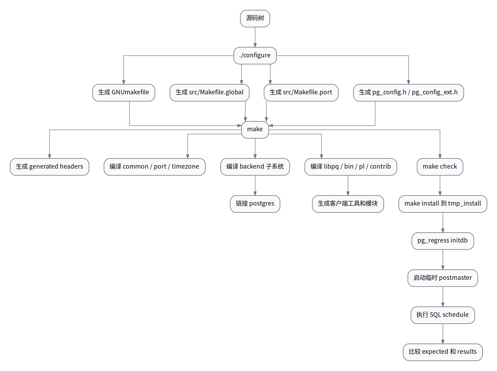
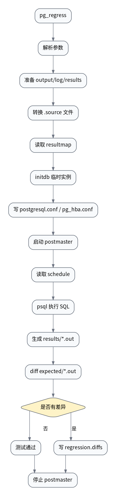

# 🛠️ PostgreSQL 编译系统设计与流程解析

> 📌 适用版本：PostgreSQL 14.13 / 当前 IvorySQL Pro 代码基线  
> 👥 适用对象：数据库内核开发者、源码阅读者、需要维护构建与回归测试流程的工程师  
> 🎯 阅读目标：理解 PostgreSQL 传统 `configure + make` 链路的执行方式，以及 Meson 路线的框架和原理实现，进而把握这套构建系统背后的设计框架与工程理念。
> 🧭 阅读方式：建议先看目录或总览，再进入实现细节、源码摘录和总结部分。

## 🧭 目录

- [🌟 1. 总览](#1-总览)
- [🧠 2. 一句话理解 PostgreSQL 构建系统](#2-一句话理解-postgresql-构建系统)
- [🧭 3. 源码地图](#3-源码地图)
- [⚙️ 4. configure 阶段](#4-configure-阶段)
- [⚙️ 5. make 阶段](#5-make-阶段)
- [📄 6. 后端 postgres 的构建模型](#6-后端-postgres-的构建模型)
- [📄 7. 共享库、扩展和 PGXS](#7-共享库扩展和-pgxs)
- [🏗️ 8. Meson 编译框架与原理](#8-meson-编译框架与原理)
- [⚙️ 9. make check 阶段](#9-make-check-阶段)
- [📄 10. IvorySQL 当前仓库的测试扩展](#10-ivorysql-当前仓库的测试扩展)
- [⌨️ 11. 常用命令](#11-常用命令)
- [🏗️ 12. 设计框架与理念](#12-设计框架与理念)
- [📄 13. 排查构建和测试问题](#13-排查构建和测试问题)
- [💡 14. 分享建议结构](#14-分享建议结构)
- [✅ 15. 总结](#15-总结)

---

<a id="1-总览"></a>
## 🌟 1. 总览

PostgreSQL 的传统构建系统由三层组成：

| 层次 | 关键工具 | 主要职责 |
| --- | --- | --- |
| 配置层 | Autoconf / `configure` | 探测平台、编译器、库、头文件、函数、系统能力，生成可移植的构建配置 |
| 构建层 | GNU Make | 递归进入各源码目录，按模块编译对象文件、静态库、共享库和可执行文件 |
| 测试层 | `pg_regress` / TAP / isolation tests | 构造临时安装、启动临时实例或连接已有实例，执行 SQL 回归测试并比较输出 |

另外，PostgreSQL 上游近年的源码已经引入了 **Meson + Ninja** 这条现代构建链。  
但从**当前 IvorySQL Pro 仓库**来看，仍然是 `configure + make` 主导；本仓库仅能看到局部 Meson 文件，例如 `contrib/ora_btree_gist/meson.build`，还看不到顶层 `meson.build` / `meson_options.txt` 入口。

整体流程如下：



这套系统的核心特点是：**传统链路里，configure 负责把平台差异固化成变量和头文件，make 根据这些变量完成可重复构建，测试驱动再复用构建产物创建最小可运行环境；而 Meson 路线则把这几个阶段收敛为统一的配置与依赖图描述。**

---

<a id="2-一句话理解-postgresql-构建系统"></a>
## 🧠 2. 一句话理解 PostgreSQL 构建系统

PostgreSQL 没有把所有源码交给一个巨大的编译脚本，而是采用“每个目录声明自己产物，公共 Makefile 提供规则，顶层 Makefile 负责递归调度”的模型。

一个典型目录 Makefile 只需要做三件事：

```makefile
subdir = src/backend/access/heap
top_builddir = ../../../..
include $(top_builddir)/src/Makefile.global

OBJS = \
    heapam.o \
    heapam_handler.o \
    heapam_visibility.o

include $(top_srcdir)/src/backend/common.mk
```

含义是：

- `subdir` 告诉公共规则“当前模块在源码树中的相对位置”。
- `top_builddir` 告诉当前目录如何回到构建根目录。
- `Makefile.global` 提供编译器、路径、平台、安装目录、测试命令等全局变量。
- `OBJS` 声明当前目录要贡献哪些对象文件。
- `common.mk` 把这些对象文件汇总成 `objfiles.txt`，供上层 backend 最终链接。

---

<a id="3-源码地图"></a>
## 🧭 3. 源码地图

当前仓库中和传统 PostgreSQL 构建系统最相关的文件如下：

| 文件 | 作用 |
| --- | --- |
| `configure.ac` | Autoconf 源文件，维护平台探测逻辑和输出文件列表 |
| `configure` | 由 `configure.ac` 生成的 shell 脚本，用户直接执行 |
| `GNUmakefile.in` | 顶层 Makefile 模板，`configure` 后生成 `GNUmakefile` |
| `src/Makefile.global.in` | 全局 Makefile 模板，`configure` 后生成 `src/Makefile.global` |
| `src/makefiles/Makefile.*` | 各平台专用 Makefile 片段，例如 Linux、Darwin、FreeBSD、Win32 |
| `src/Makefile.shlib` | 构建共享库和动态加载模块的公共规则 |
| `src/backend/common.mk` | backend 子目录对象文件汇总规则 |
| `src/backend/Makefile` | 后端服务端主程序 `postgres` 的链接入口 |
| `src/test/regress/GNUmakefile` | SQL 回归测试驱动构建和执行入口 |
| `src/test/regress/pg_regress.c` | 回归测试主驱动，负责 initdb、启动 postmaster、执行 SQL、比较结果 |

当前仓库中和 Meson 相关的文件很少：

| 文件 | 作用 |
| --- | --- |
| `contrib/ora_btree_gist/meson.build` | 一个局部 contrib 模块的 Meson 构建描述，展示共享模块、安装文件和回归测试如何声明 |

这说明当前分支的 Meson 仍处于“局部适配”状态，而不是“整棵源码树由 Meson 驱动”的状态。

IvorySQL 在 PostgreSQL 基础上扩展了若干构建和测试目标，例如：

- 顶层默认构建包含 `contrib/ivorysql_ora`、`contrib/ivorysql_my` 等目录。
- `src/Makefile.global.in` 增加了 `oracle-check`、`mysql-check`、`oracle-pg-check`、`mysql-pg-check` 等目标。
- `src/test/regress/GNUmakefile` 除 `pg_regress` 外，还构建 `ora_pg_regress`、`mys_pg_regress`。
- 仓库包含 `src/oracle_test`、`src/mysql_test` 两套兼容模式测试目录。

---

<a id="4-configure-阶段"></a>
## ⚙️ 4. configure 阶段

### 4.1 configure 的输入和输出

用户常见入口是：

```bash
./configure --prefix=/path/to/install --enable-debug --enable-cassert
```

`configure` 的输入包括：

- 用户传入的 `--with-*`、`--enable-*`、`CC`、`CFLAGS`、`LDFLAGS` 等选项。
- 当前系统的 host triplet、操作系统、CPU 架构、编译器行为。
- 系统库、头文件、函数、类型、线程、SSL、ICU、LLVM、readline 等依赖能力。
- PostgreSQL 自己的 `src/template` 和 `src/makefiles/Makefile.*` 平台模板。

它的主要输出包括：

| 输出 | 来源 | 作用 |
| --- | --- | --- |
| `GNUmakefile` | `GNUmakefile.in` | 顶层构建入口 |
| `src/Makefile.global` | `src/Makefile.global.in` | 全局构建变量和公共规则 |
| `src/Makefile.port` | `src/makefiles/Makefile.${template}` | 平台专用规则 |
| `src/include/pg_config.h` | Autoconf header | C 代码中的平台能力宏 |
| `src/include/pg_config_ext.h` | Autoconf header | 外部接口相关配置宏 |
| `src/include/pg_config_os.h` | `src/include/port/${template}.h` | 平台专用头文件链接 |
| `config.status` | Autoconf | 记录配置结果，可重新生成输出文件 |
| `config.log` | Autoconf | 记录探测过程和失败原因 |

### 4.2 configure 的内部步骤

`configure.ac` 顶部明确建议维护者按以下顺序组织探测：

1. 初始化和选项处理。
2. 查找程序。
3. 查找库。
4. 查找头文件。
5. 检查类型。
6. 检查结构体。
7. 检查编译器特性。
8. 检查函数、全局变量和系统服务。

这个顺序很重要。它让后续检查可以复用前面的结果。例如先确定编译器，再用该编译器测试头文件和函数；先确定平台模板，再链接 `src/Makefile.port` 和 `pg_config_os.h`。

### 4.3 平台模板选择

`configure` 会根据 `host_os` 自动选择模板：

| host_os 示例 | template |
| --- | --- |
| `linux*` / `gnu*` | `linux` |
| `darwin*` | `darwin` |
| `freebsd*` | `freebsd` |
| `mingw*` | `win32` |
| `cygwin*` / `msys*` | `cygwin` |

也可以使用 `--with-template=NAME` 手动覆盖。

模板选择后，`configure` 会生成或链接：

```text
src/Makefile.port -> src/makefiles/Makefile.${template}
src/include/pg_config_os.h -> src/include/port/${template}.h
```

这就是 PostgreSQL 处理平台差异的关键：**平台差异尽量在 configure 阶段归一化，C 代码和普通 Makefile 不直接散落大量系统判断。**

### 4.4 VPATH 构建

PostgreSQL 支持源码目录和构建目录分离：

```bash
mkdir build
cd build
../configure --prefix=/path/to/install
make
```

如果 `configure` 判断当前目录不是源码目录，就设置：

```makefile
vpath_build = yes
top_srcdir = $(abs_top_srcdir)
srcdir = $(top_srcdir)/$(subdir)
VPATH = $(srcdir)
```

这样编译产物留在 build 目录，源码树保持干净。PostgreSQL 这类大型 C 项目非常重视 VPATH，因为它允许同一份源码同时维护多套构建配置，例如 debug、release、不同依赖组合。

---

<a id="5-make-阶段"></a>
## ⚙️ 5. make 阶段

### 5.1 顶层 GNUmakefile 的职责

顶层 `GNUmakefile` 由 `GNUmakefile.in` 生成。它本身不直接编译 C 文件，而是组织递归目标：

```makefile
subdir =
top_builddir = .
include $(top_builddir)/src/Makefile.global

$(call recurse,all install,src config contrib/...)
```

也就是说，顶层做的是：

- 引入 `src/Makefile.global`。
- 定义默认构建目录。
- 定义 `world`、`install-world`、`check-world` 等全局目标。
- 把 `check` 转发到 `src/test/regress`。
- 在 IvorySQL 当前仓库中，把 Oracle/MySQL 兼容模式测试目标也挂到顶层。

### 5.2 Makefile.global 的职责

`src/Makefile.global` 是整个构建系统的中枢。它由 `src/Makefile.global.in` 经 `configure` 替换变量生成。

它负责提供：

- 版本号：`VERSION`、`MAJORVERSION`、`VERSION_NUM`。
- 源码和构建路径：`top_srcdir`、`srcdir`、`VPATH`、`abs_top_builddir`。
- 安装路径：`bindir`、`libdir`、`pkglibdir`、`includedir_server`、`pgxsdir`。
- 功能开关：`with_icu`、`with_ssl`、`with_llvm`、`enable_debug`、`enable_nls` 等。
- 编译工具：`CC`、`CPP`、`AR`、`LD`、`INSTALL`、`TAR` 等。
- 编译和链接参数：`CFLAGS`、`CPPFLAGS`、`LDFLAGS`、`LIBS`。
- 公共目标：`all`、`install`、`clean`、`distclean`、`check`、`installcheck`。
- 递归函数：`recurse`、`recurse_always`。
- 测试包装命令：`pg_regress_check`、`pg_regress_installcheck` 等。

普通子目录 Makefile 不需要知道平台细节，只要声明当前目录要构建什么。

### 5.3 递归构建模型

PostgreSQL 使用 GNU Make 的 `$(call recurse,...)` 生成递归目标。其核心思想是：

```makefile
target: target-subdir-recurse
target-subdir-recurse:
    $(MAKE) -C subdir target
```

这样 `make all` 会变成一系列子目录中的 `make all`。

`src/Makefile` 中的 `SUBDIRS` 展示了主要构建顺序：

```text
common
port
timezone
backend
include
interfaces
fe_utils
bin
pl
test/regress
test/isolation
...
```

当前仓库还包含：

```text
oracle_test/regress
oracle_test/isolation
mysql_test/regress
mysql_test/isolation
backend/oracle_parser
backend/mysql_parser
```

需要注意，`src/Makefile` 标记了 `.NOTPARALLEL`，因为 PostgreSQL 源码树内部有不少跨目录依赖。外层递归顺序保持保守，目录内部仍可利用局部并行。

### 5.4 generated headers

很多目录都依赖生成头文件，例如 parser、catalog、utils 相关头文件。为了避免并行构建时多个子目录同时生成同一批文件，`Makefile.global` 在顶层统一处理：

```makefile
all install check installcheck: submake-generated-headers
```

`submake-generated-headers` 在顶层调用：

```bash
make -C src/backend generated-headers
```

`src/backend/Makefile` 再负责生成或链接：

- `src/include/parser/gram.h`
- `src/include/storage/lwlocknames.h`
- catalog 生成头文件
- utils 生成头文件

这是 PostgreSQL 构建系统里一个典型的并行安全设计：**跨目录共享的生成物集中生成，普通目录只消费它们。**

---

<a id="6-后端-postgres-的构建模型"></a>
## 📄 6. 后端 postgres 的构建模型

PostgreSQL 后端主程序不是简单地把所有 `.o` 平铺在一个 Makefile 中，而是采用子系统汇总模型。

### 6.1 子目录声明 OBJS

以 `src/backend/access/heap/Makefile` 为例：

```makefile
OBJS = \
    heapam.o \
    heapam_handler.o \
    heapam_visibility.o \
    heaptoast.o \
    hio.o \
    pruneheap.o \
    rewriteheap.o \
    vacuumlazy.o \
    visibilitymap.o

include $(top_srcdir)/src/backend/common.mk
```

### 6.2 common.mk 汇总 objfiles.txt

`src/backend/common.mk` 会把当前目录和子目录的对象文件汇总成：

```text
objfiles.txt
```

每个 backend 子目录贡献一份 `objfiles.txt`。上层目录再把子目录的 `objfiles.txt` 继续汇总。

### 6.3 backend/Makefile 链接 postgres

`src/backend/Makefile` 中：

```makefile
SUBDIRS = access bootstrap catalog parser commands executor ...

OBJS = \
    $(LOCALOBJS) \
    $(SUBDIROBJS) \
    $(top_builddir)/src/common/libpgcommon_srv.a \
    $(top_builddir)/src/port/libpgport_srv.a
```

最终链接时通过 `expand_subsys` 展开各子系统的 `objfiles.txt`：

```makefile
postgres: $(OBJS)
    $(CC) $(CFLAGS) $(call expand_subsys,$^) ... -o $@
```

这套设计的好处是：

- 各目录只维护自己的对象列表。
- 顶层 backend 不需要知道每个子目录有哪些 `.c` 文件。
- 链接命令仍能得到完整对象文件列表，便于平台链接器处理。
- 子系统边界清晰，源码组织和构建组织保持一致。

---

<a id="7-共享库扩展和-pgxs"></a>
## 📄 7. 共享库、扩展和 PGXS

### 7.1 Makefile.shlib

`src/Makefile.shlib` 提供构建共享库和动态加载模块的通用规则。

一个模块 Makefile 通常声明：

```makefile
NAME = regress
OBJS = regress.o

include $(top_srcdir)/src/Makefile.shlib

all: all-lib
```

`Makefile.shlib` 根据平台设置：

- 动态库后缀：Linux 通常是 `.so`，macOS 的可链接库是 `.dylib`。
- 链接命令：`$(CC) -shared`、`$(CC) -bundle`、AIX/HPUX 特殊规则等。
- soname、版本号、导出符号表。
- `all-lib`、`install-lib`、`clean-lib` 等公共目标。

### 7.2 PGXS

PGXS，全称通常理解为 PostgreSQL Extension Building Infrastructure，是 PostgreSQL 提供给扩展使用的 Makefile 框架。它的目标是让扩展作者不需要复制 PostgreSQL 内部复杂的编译、链接、安装规则，只需要声明“我要构建什么”，然后复用 PostgreSQL 已安装版本自带的构建规则。

PGXS 主要解决三个问题：

| 问题 | PGXS 的做法 |
| --- | --- |
| 扩展如何找到 PostgreSQL 的头文件、库和安装目录 | 通过 `pg_config` 查询当前 PostgreSQL 安装的路径 |
| 扩展如何构建 `.so` / `.dll` 动态库 | 复用 `Makefile.global` 和 `Makefile.shlib` 中的平台规则 |
| 扩展如何把 control、SQL、动态库安装到正确位置 | 由 `pgxs.mk` 根据变量自动生成 `install`、`uninstall`、`clean` 等目标 |

PGXS 的核心文件是：

```text
src/makefiles/pgxs.mk
```

安装 PostgreSQL 时，这套规则会被安装到：

```text
$(pkglibdir)/pgxs/src/makefiles/pgxs.mk
```

外部扩展通过 `pg_config --pgxs` 找到它。

#### 7.2.1 典型 PGXS Makefile

一个最小扩展 Makefile 通常长这样：

```makefile
EXTENSION = my_ext
MODULES = my_ext
DATA = my_ext--1.0.sql
REGRESS = my_ext

PG_CONFIG = pg_config
PGXS := $(shell $(PG_CONFIG) --pgxs)
include $(PGXS)
```

其中：

- `EXTENSION` 表示扩展名，要求存在 `my_ext.control`。
- `MODULES` 表示要从同名 `my_ext.c` 编译出一个动态加载模块。
- `DATA` 表示要安装到 `share/extension` 或指定目录的 SQL 文件。
- `REGRESS` 表示 `make installcheck` 时要运行的 SQL 回归测试名。
- `PG_CONFIG` 指定要面向哪个 PostgreSQL 安装构建。
- `PGXS` 是 `pg_config --pgxs` 返回的 `pgxs.mk` 路径。

当前仓库中的 `contrib/pg_visibility/Makefile` 展示了 PostgreSQL contrib 模块常见写法：

```makefile
MODULE_big = pg_visibility
OBJS = \
    $(WIN32RES) \
    pg_visibility.o

EXTENSION = pg_visibility
DATA = pg_visibility--1.1.sql pg_visibility--1.1--1.2.sql \
    pg_visibility--1.0--1.1.sql

REGRESS = pg_visibility

ifdef USE_PGXS
PG_CONFIG = pg_config
PGXS := $(shell $(PG_CONFIG) --pgxs)
include $(PGXS)
else
subdir = contrib/pg_visibility
top_builddir = ../..
include $(top_builddir)/src/Makefile.global
include $(top_srcdir)/contrib/contrib-global.mk
endif
```

这个 Makefile 同时支持两种模式：

| 模式 | 触发方式 | 使用场景 |
| --- | --- | --- |
| 源码树内构建 | 默认 | PostgreSQL / IvorySQL 源码一起编译 contrib |
| PGXS 外部构建 | `make USE_PGXS=1` | contrib 或第三方扩展面向已安装 PostgreSQL 单独编译 |

#### 7.2.2 PGXS 构建什么

`pgxs.mk` 要求扩展至少声明下面三类变量之一：

| 变量 | 用途 | 示例 |
| --- | --- | --- |
| `MODULES` | 每个 `.c` 文件生成一个同名动态库 | `MODULES = auto_explain` |
| `MODULE_big` + `OBJS` | 多个对象文件链接成一个动态库 | `MODULE_big = pg_visibility` |
| `PROGRAM` + `OBJS` | 构建一个可执行程序 | `PROGRAM = my_tool` |

差异在于：

- `MODULES = foo bar` 会假定存在 `foo.c`、`bar.c`，分别生成 `foo.so`、`bar.so`。
- `MODULE_big = foo` 更适合复杂扩展，使用 `OBJS = a.o b.o c.o` 生成一个 `foo.so`。
- `PROGRAM` 用于构建客户端工具，不是服务端加载模块。

如果启用了 LLVM bitcode，PGXS 还会根据 PostgreSQL 本身的 `with_llvm` 配置生成和安装 `.bc` 文件。

#### 7.2.3 PGXS 常用变量

PGXS 的变量可以按用途分为几组。

构建产物：

| 变量 | 含义 |
| --- | --- |
| `MODULES` | 简单 C 扩展模块列表 |
| `MODULE_big` | 单个大型扩展模块名 |
| `OBJS` | `MODULE_big` 或 `PROGRAM` 需要链接的对象文件 |
| `PROGRAM` | 要构建的可执行程序 |

扩展元数据和 SQL 文件：

| 变量 | 含义 |
| --- | --- |
| `EXTENSION` | 扩展名，对应 `$EXTENSION.control` |
| `DATA` | 需要安装的 SQL 或其他数据文件 |
| `DATA_built` | 构建后生成、再安装的数据文件 |
| `MODULEDIR` | `DATA` 和 `DOCS` 的安装子目录，默认根据是否设置 `EXTENSION` 决定 |

测试：

| 变量 | 含义 |
| --- | --- |
| `REGRESS` | SQL 回归测试列表，不带 `.sql` 后缀 |
| `REGRESS_OPTS` | 传给 `pg_regress` 的附加参数 |
| `TAP_TESTS` | 启用 TAP 测试 |
| `ISOLATION` | isolation test 列表 |

安装辅助：

| 变量 | 含义 |
| --- | --- |
| `DOCS` | 安装到文档目录的文件 |
| `SCRIPTS` | 安装到 `bindir` 的脚本 |
| `HEADERS` | 安装到 server include 目录的头文件 |
| `NO_INSTALL` | 不生成安装目标 |
| `NO_INSTALLCHECK` | 不生成安装测试目标 |

编译和链接参数：

| 变量 | 含义 |
| --- | --- |
| `PG_CPPFLAGS` | 追加到预处理参数前部 |
| `PG_CFLAGS` | 追加到 C 编译参数 |
| `PG_CXXFLAGS` | 追加到 C++ 编译参数 |
| `PG_LDFLAGS` | 追加到链接参数前部 |
| `PG_LIBS` | 加到 `PROGRAM` 链接命令 |
| `SHLIB_LINK` | 加到 `MODULE_big` 共享库链接命令 |

#### 7.2.4 PGXS 如何找到 PostgreSQL

PGXS 的关键入口是：

```makefile
PG_CONFIG = pg_config
PGXS := $(shell $(PG_CONFIG) --pgxs)
include $(PGXS)
```

`pg_config` 是 PostgreSQL 安装后提供的配置查询工具。PGXS 通过它获得：

```makefile
bindir := $(shell $(PG_CONFIG) --bindir)
datadir := $(shell $(PG_CONFIG) --sharedir)
libdir := $(shell $(PG_CONFIG) --libdir)
pkglibdir := $(shell $(PG_CONFIG) --pkglibdir)
includedir := $(shell $(PG_CONFIG) --includedir)
pkgincludedir := $(shell $(PG_CONFIG) --pkgincludedir)
pgxsdir := $(pkglibdir)/pgxs
```

因此，同一份扩展源码可以通过切换 `PG_CONFIG` 面向不同 PostgreSQL 安装构建：

```bash
make PG_CONFIG=/opt/pgsql14/bin/pg_config
make PG_CONFIG=/opt/ivorysql/bin/pg_config
```

这点非常重要。扩展不是“面向源码树”编译，而是“面向某个已安装的 PostgreSQL 实例”编译。头文件、ABI、库路径、扩展安装目录都来自这个 `pg_config`。

#### 7.2.5 PGXS 的构建和安装流程

执行：

```bash
make
```

PGXS 会根据变量生成 `all` 目标，典型内容包括：

```text
构建 PROGRAM
构建 DATA_built
构建 SCRIPTS_built
构建 MODULES 对应的动态库
构建 MODULE_big 对应的动态库
检查 EXTENSION 对应的 .control 文件
```

执行：

```bash
make install
```

PGXS 会安装到 PostgreSQL 约定目录：

| 文件类型 | 安装位置 |
| --- | --- |
| `$EXTENSION.control` | `$(datadir)/extension/` |
| `DATA` / `DATA_built` | `$(datadir)/$(datamoduledir)/`，扩展通常是 `$(datadir)/extension/` |
| `MODULES` / `MODULE_big` 动态库 | `$(pkglibdir)/` |
| `PROGRAM` | `$(bindir)/` |
| `SCRIPTS` | `$(bindir)/` |
| `DOCS` | `$(docdir)/$(docmoduledir)/` |
| `HEADERS` | `$(includedir_server)/...` |

执行：

```bash
make uninstall
```

PGXS 会按相同变量删除安装文件。

执行：

```bash
make clean
```

PGXS 会清理对象文件、动态库、bitcode、构建生成的数据文件，以及 `EXTRA_CLEAN` 中声明的文件。

#### 7.2.6 PGXS 的测试方式

PGXS 扩展常用：

```bash
make install
make installcheck
```

原因是外部扩展通常不是 PostgreSQL 源码树的一部分，PGXS 中显式设置：

```makefile
NO_GENERATED_HEADERS = yes
NO_TEMP_INSTALL = yes
```

含义是：

- 外部扩展假设 PostgreSQL 安装时已经准备好了生成头文件。
- 外部扩展不能使用源码树内的 `temp-install` 机制。
- 扩展测试通常连接一个已经安装并启动的 PostgreSQL 实例。

因此，PGXS 下的 `installcheck` 更常见，而不是源码树内的 `make check`。

典型流程是：

```bash
make PG_CONFIG=/path/to/pg_config
make PG_CONFIG=/path/to/pg_config install
make PG_CONFIG=/path/to/pg_config installcheck
```

如果设置了：

```makefile
REGRESS = my_ext
```

PGXS 会使用 `pg_regress` 执行：

```text
sql/my_ext.sql
expected/my_ext.out
```

并比较输出差异。

#### 7.2.7 PGXS 和源码树内构建的区别

内部构建时，`Makefile.global` 使用当前源码树和构建树中的变量。PGXS 构建时，扩展不在 PostgreSQL 源码树内，因此 `Makefile.global` 会改为通过 `pg_config` 获取安装路径：

```makefile
bindir := $(shell $(PG_CONFIG) --bindir)
pkglibdir := $(shell $(PG_CONFIG) --pkglibdir)
includedir := $(shell $(PG_CONFIG) --includedir)
pgxsdir := $(pkglibdir)/pgxs
```

二者可以这样对比：

| 维度 | 源码树内构建 | PGXS 外部构建 |
| --- | --- | --- |
| 入口 | 顶层 `make` 递归到子目录 | 扩展目录直接 `make` |
| 配置来源 | 当前 build tree 的 `src/Makefile.global` | `pg_config --pgxs` 指向的已安装规则 |
| 头文件来源 | 源码树和构建树 | 已安装的 include 目录 |
| 库来源 | 构建树中的库 | 已安装的 lib 目录 |
| 测试方式 | 可使用 `make check` 和 `tmp_install` | 通常使用 `make installcheck` |
| 适用对象 | PostgreSQL 内置模块、contrib、源码树内测试 | 第三方扩展、单独编译的 contrib 模块 |

这体现了 PostgreSQL 的一个重要理念：**内部构建和外部扩展构建使用同一套规则，但变量来源不同。**

---

<a id="8-meson-编译框架与原理"></a>
## 🏗️ 8. Meson 编译框架与原理

### 8.1 先看当前仓库现状

从当前仓库实际文件分布看：

- 存在大量 `Makefile`、`GNUmakefile.in`、`configure.ac`
- 不存在顶层 `meson.build`
- 不存在顶层 `meson_options.txt`
- 仅存在一个局部模块文件：`contrib/ora_btree_gist/meson.build`

因此要先明确一个边界：

> **当前 IvorySQL Pro 仓库并不能直接在根目录执行 `meson setup build` 来完成整树构建。**

下面这一节的目的，不是说“当前仓库已经全面支持 Meson”，而是把两件事讲清楚：

1. PostgreSQL 上游 Meson 构建框架的设计和实现思路是什么。
2. 当前仓库里的局部 `meson.build` 是如何接入这套框架的。

### 8.2 Meson 在 PostgreSQL 里的定位

Meson 可以理解为把传统 `configure + Makefile` 两阶段模型，收敛成“一个统一的配置与构建描述层”：

| 传统链路 | Meson 链路 |
| --- | --- |
| `./configure` 探测平台 | `meson setup` 探测平台 |
| 生成 `Makefile.global`、`pg_config.h` | 生成 Ninja 文件、配置头文件、配置数据 |
| `make` 递归进入子目录 | `meson compile` / `ninja` 执行全局依赖图 |
| `make install` | `meson install` |
| `make check` / `make installcheck` | `meson test` 或自定义 test target |

它解决的核心问题是：

- 用统一 DSL 描述平台探测、目标、依赖、安装、测试
- 把“递归 Make”改为“显式依赖图”
- 让增量构建、并行构建和 IDE/工具链集成更稳定

但 PostgreSQL 并没有因为引入 Meson 就丢掉原有工程约束。相反，Meson 版仍然保留了 PostgreSQL 的几个基本原则：

- 强调 out-of-source build
- 强调集中生成共享头文件
- 强调平台差异在配置阶段统一收敛
- 强调后续目录只声明自己的目标，不重复写平台逻辑

### 8.3 顶层 Meson 的总体框架

PostgreSQL 上游顶层 `meson.build` 的入口首先声明：

```meson
project('postgresql', ['c'],
  meson_version: '>=0.57.2',
  default_options: [
    'warning_level=1',
    'b_pch=false',
    'buildtype=debugoptimized',
    'default_library=both',
    'prefix=/usr/local/pgsql',
  ]
)
```

这部分对应传统构建中的“全局构建策略”：

- 项目名和语言
- 最低 Meson 版本
- 默认优化级别
- 默认库策略
- 默认安装前缀

也就是说，`project()` 在 Meson 里扮演的角色，接近于 `configure.ac` 顶部的初始化逻辑加一部分 `Makefile.global` 的默认变量。

### 8.4 Meson 版如何替代 configure

Meson 版 PostgreSQL 并不是简单把 `configure` 翻译成几个 if/else，而是把平台探测收敛成一组脚本内变量和 `configuration_data()`：

```meson
cdata = configuration_data()
cc = meson.get_compiler('c')
thread_dep = dependency('threads')
```

然后再逐步做：

1. 平台识别：`host_system`、`host_cpu`
2. 编译器能力探测：是否支持 C11、C++11、特定警告参数
3. 系统头文件探测：`cc.has_header()`
4. 系统函数探测：`cc.has_function()`
5. 类型与结构体成员探测：`cc.has_type()`、`cc.has_member()`
6. 外部库探测：`dependency()`、`find_library()`
7. 配置宏写入：`cdata.set(...)`

这跟 Autoconf 的本质是一致的，只是写法不同：

| Autoconf | Meson |
| --- | --- |
| `AC_CHECK_HEADER` | `cc.has_header()` |
| `AC_CHECK_FUNC` | `cc.has_function()` |
| `AC_CHECK_LIB` | `cc.find_library()` / `dependency()` |
| `AC_DEFINE` | `cdata.set()` |
| `AC_SUBST` | 普通 Meson 变量 |

所以可以这样理解：

> Meson 在 PostgreSQL 里不是“跳过配置阶段”，而是“把配置阶段内建到了构建描述语言本身”。

### 8.5 为什么 Meson 强制干净的 out-of-source build

PostgreSQL 上游 `meson.build` 一开始就检查源码树里是否存在传统 `./configure` 风格生成的 `src/include/pg_config.h`。如果存在，就直接拒绝继续。

原因很直接：

- `configure` 风格构建会在源码树内留下生成文件
- Meson 也会生成同名或相关配置产物
- 两套系统混用时，编译器可能会读到错误版本的 `pg_config.h`

这和本文前面分析的 VPATH 构建理念完全一致，只是 Meson 比传统 Make 更严格。

也就是说，在 PostgreSQL 世界里：

- `configure + make` 可以源码树内构建，也可以 VPATH 构建
- Meson 明确鼓励并基本要求 out-of-source build

这属于工程一致性优先，而不是功能限制。

### 8.6 Meson 的目录组织方式

上游顶层 `meson.build` 并不是把所有目标堆在一个文件里，而是继续按源码子系统拆分，然后用：

```meson
subdir('src/include')
subdir('config')
subdir('src/port')
subdir('src/common')
```

逐级递归进入子目录。

这和 PostgreSQL 传统 Make 的组织哲学高度一致：

- 顶层负责组织顺序和公共变量
- 子目录负责声明自己的目标
- 共性规则不在每个模块里重复写

差异在于，Meson 的递归不是“子 make 进程”，而是把各子目录的声明收集到**同一个全局依赖图**里。

所以从实现原理上说：

- 传统 Make：递归调度目录
- Meson：递归收集声明，统一生成 Ninja 图

### 8.7 Meson 里的目标收集模型

上游 `meson.build` 有一组很关键的列表变量：

```meson
backend_targets = []
bin_targets = []
libpq_targets = []
pl_targets = []
contrib_targets = []
tests = []
```

每个子目录进入后，不是直接“马上编译”，而是先把自己的目标追加到这些集合里。后续顶层再统一为：

- 构建目标
- install 目标
- alias 目标
- test 目标

生成 Ninja 文件。

这和传统 Make 的 `SUBDIRS + OBJS + objfiles.txt` 很像，但表达能力更强：

| 传统 Make | Meson |
| --- | --- |
| 目录声明 `OBJS` | 目录声明 `executable()` / `shared_module()` / `static_library()` |
| 顶层收集 `objfiles.txt` | 顶层收集 target 对象列表 |
| `make all` 时按递归顺序触发 | `ninja` 按全局依赖图触发 |

### 8.8 Meson 里的“配置层 + 构建层 + 安装层”

Meson 版 PostgreSQL 仍然保留了三层思维，只是边界不再靠不同工具区分：

#### 8.8.1 配置层

由 `project()`、`get_option()`、`get_compiler()`、`dependency()`、`configuration_data()` 负责。

输出包括：

- 平台变量
- 编译选项
- 依赖结果
- `pg_config.h` 等配置宏输入

#### 8.8.2 构建层

由：

- `static_library()`
- `shared_library()`
- `shared_module()`
- `executable()`
- `generator()`
- `custom_target()`

负责描述真正的产物和生成动作。

#### 8.8.3 安装层

由：

- `install: true`
- `install_dir`
- `install_data()`

把产物放到 PostgreSQL 约定目录。

因此，Meson 版并不是取消了 PostgreSQL 原有“配置、构建、安装”的分层，而是把三层写进了一套统一 DSL。

### 8.9 generated headers 在 Meson 下如何处理

PostgreSQL 构建系统最麻烦的一部分之一，是跨目录共享的生成头文件，比如 parser、catalog、错误码、关键字表等。

Meson 版延续了“集中生成，再让全树依赖”的思想。上游顶层 `meson.build` 中可以看到：

- `generated_headers = []`
- `generated_backend_headers = []`
- `configure_files = []`
- 先 `subdir('src/include')`
- 再进入其他几乎所有依赖这些头文件的目录

这背后的原理和传统 `submake-generated-headers` 很接近：

- 先处理公共生成物
- 再让 backend、frontend、contrib 消费这些生成物
- 避免并发时多处重复生成

换句话说，Meson 并没有否定 PostgreSQL 原来对 generated headers 的谨慎处理，只是把它从 Make 规则改成了显式 target 依赖。

### 8.10 Meson 如何描述一个 contrib 模块

当前仓库唯一可见的局部 Meson 文件是：

```text
contrib/ora_btree_gist/meson.build
```

这个文件非常有代表性。它完整展示了 Meson 版 contrib 模块通常怎么写。

#### 8.10.1 先声明源文件

```meson
ora_btree_gist_sources = files(
  'btree_binary_double.c',
  'btree_binary_float.c',
  ...
)
```

这对应 Makefile 里的：

```makefile
OBJS = a.o b.o c.o
```

#### 8.10.2 Windows 条件处理

```meson
if host_system == 'windows'
  ...
endif
```

这相当于 Make 时代常见的 `ifdef WIN32` 分支，但 Meson 把它放在统一语法里。

#### 8.10.3 构建共享模块

```meson
ora_btree_gist = shared_module('ora_btree_gist',
  ora_btree_gist_sources,
  c_pch: pch_postgres_h,
  kwargs: contrib_mod_args,
)
contrib_targets += ora_btree_gist
```

这里的关键点是：

- 使用 `shared_module()` 而不是 `shared_library()`
- 模块名就是最终扩展装载名
- `contrib_mod_args` 提供 PostgreSQL contrib 统一的编译、链接、安装参数
- 构建出的 target 再追加到 `contrib_targets`

这就是 Meson 下 PostgreSQL 扩展构建的核心模式：

> 子目录声明目标，顶层收集目标，公共参数由统一变量注入。

#### 8.10.4 安装 control 和 SQL 文件

```meson
install_data(
  'ora_btree_gist.control',
  'ora_btree_gist--1.0.sql',
  kwargs: contrib_data_args,
)
```

这相当于 Make / PGXS 中的：

```makefile
EXTENSION = ora_btree_gist
DATA = ora_btree_gist--1.0.sql
```

只是 Meson 里不再通过变量隐式推导安装规则，而是显式调用 `install_data()`。

#### 8.10.5 声明回归测试

```meson
tests += {
  'name': 'ora_btree_gist',
  'sd': meson.current_source_dir(),
  'bd': meson.current_build_dir(),
  'regress': {
    'sql': [
      'init',
      'number',
      ...
    ],
  },
}
```

这说明 Meson 版测试不是简单“执行一个 shell 命令”，而是把 PostgreSQL 自己的测试语义结构化了：

- 测试名
- 源码目录
- 构建目录
- `pg_regress` 用到的 SQL 列表

这类结构化描述比 Make 变量更容易被顶层统一分发和组合。

### 8.11 Meson 与 PGXS 的关系

这一点很容易混淆。

PGXS 解决的是：

- 已安装 PostgreSQL 如何给外部扩展提供构建框架

Meson 解决的是：

- PostgreSQL 源码树自身如何进行现代化构建

两者并不等价：

| 机制 | 解决的问题 |
| --- | --- |
| PGXS | 外部扩展如何复用 PostgreSQL 已安装版本的构建规则 |
| Meson | PostgreSQL 源码树自身如何描述和执行构建 |

因此在 PostgreSQL 里，Meson 更像是对 `configure + make` 的现代替代；而 PGXS 更像是对“外部扩展构建接口”的稳定承诺。

即便源码树将来全面切到 Meson，扩展生态层面也仍然需要一种 PGXS 等价物，或者兼容保留现有 PGXS。

### 8.12 当前仓库可以怎么理解 Meson 支持

把当前仓库的状态概括成一句话就是：

> **Meson 在当前分支里已经出现，但还没有成为根构建系统。**

更准确地说：

- 可以看到 Meson 风格的模块声明已经开始存在
- 说明这条代码线与上游 Meson 方向并不冲突
- 但由于缺少顶层 `meson.build`、`meson_options.txt` 和全树子目录接入，当前仓库的实际可执行构建链仍然是 `configure + make`

所以对当前仓库的工程判断应该是：

- **主系统：Autoconf + GNU Make**
- **局部适配：Meson contrib 模块**
- **未来方向：若继续跟进上游，Meson 可能逐步补全**

### 8.13 如果未来补齐顶层 Meson，典型流程会是什么

如果这棵仓库未来补齐了上游 Meson 入口，那么典型操作会是：

```bash
meson setup build
meson compile -C build
meson install -C build
meson test -C build
```

其角色对应关系大致如下：

| 命令 | 对应传统流程 |
| --- | --- |
| `meson setup build` | `./configure` |
| `meson compile -C build` | `make` |
| `meson install -C build` | `make install` |
| `meson test -C build` | `make check` / 部分测试驱动 |

但请注意，这只是**完整 Meson 化之后**的预期流程，不是当前仓库现状。

---

<a id="9-make-check-阶段"></a>
## ⚙️ 9. make check 阶段

### 9.1 check 和 installcheck 的区别

| 目标 | 是否启动临时实例 | 是否需要已有数据库实例 | 典型用途 |
| --- | --- | --- | --- |
| `make check` | 是 | 否 | 开发阶段验证源码树构建产物 |
| `make installcheck` | 否 | 是 | 验证已安装版本，连接已有实例 |
| `make check-world` | 是 | 否 | 更大范围测试，包含更多子系统 |
| `make installcheck-world` | 否 | 是 | 更大范围安装后测试 |

`make check` 的核心是临时安装和临时实例。它尽量不污染用户机器上的真实安装目录和已有数据库。

### 9.2 顶层 make check 如何转发

顶层 `GNUmakefile` 定义：

```makefile
check check-tests installcheck installcheck-parallel installcheck-tests: submake-generated-headers
    $(MAKE) -C src/test/regress $@
```

同时 `Makefile.global` 定义：

```makefile
check: temp-install
```

因此顶层 `make check` 的关键链路是：

```text
make check
  -> submake-generated-headers
  -> temp-install
  -> make -C src/test/regress check
  -> pg_regress_check
```

### 9.3 temp-install 做了什么

`temp-install` 在顶层 Make 进程中只执行一次：

```makefile
rm -rf $(abs_top_builddir)/tmp_install
mkdir -p $(abs_top_builddir)/tmp_install/log
make DESTDIR=$(abs_top_builddir)/tmp_install install > tmp_install/log/install.log
make -j1 checkprep >> tmp_install/log/install.log
```

它把当前构建产物安装到：

```text
tmp_install/
```

注意这里使用的是 `DESTDIR`，不是改变 `--prefix`。实际路径形态通常类似：

```text
tmp_install/usr/local/pgsql/bin/postgres
tmp_install/usr/local/pgsql/bin/initdb
tmp_install/usr/local/pgsql/lib/postgresql/
```

随后 `pg_regress` 通过 `with_temp_install` 设置运行时环境，让测试使用这套临时安装中的二进制和库。

### 9.4 src/test/regress/GNUmakefile

`src/test/regress/GNUmakefile` 做两类事情：

第一，构建测试驱动和测试用动态库：

```makefile
all: pg_regress$(X) ora_pg_regress$(X) mys_pg_regress$(X)

NAME = regress
OBJS = regress.o
include $(top_srcdir)/src/Makefile.shlib
all: all-lib
```

第二，定义测试目标：

```makefile
REGRESS_OPTS = --dlpath=. --max-concurrent-tests=20 --make-testtablespace-dir

check: all
    $(pg_regress_check) $(REGRESS_OPTS) --schedule=$(srcdir)/parallel_schedule
```

### 9.5 pg_regress_check 包装命令

`Makefile.global` 中的 `pg_regress_check` 大致展开为：

```text
with_temp_install
src/test/regress/pg_regress
  --temp-instance=./tmp_check
  --inputdir=$(srcdir)
  --bindir=
  $(TEMP_CONF)
  $(pg_regress_locale_flags)
```

关键参数含义：

| 参数 | 含义 |
| --- | --- |
| `--temp-instance=./tmp_check` | 在当前测试目录下创建临时数据目录和日志目录 |
| `--inputdir=$(srcdir)` | SQL、expected、schedule 等输入文件所在目录 |
| `--bindir=` | 配合临时安装环境使用二进制 |
| `--schedule=parallel_schedule` | 按调度文件执行测试 |
| `--dlpath=.` | 让测试能加载当前目录构建出的动态库 |
| `--max-concurrent-tests=20` | 限制 schedule 中并行测试数量 |

### 9.6 pg_regress 的执行流程

`pg_regress.c` 是 SQL 回归测试的核心驱动。`make check` 下它大致执行：

1. 解析命令行参数，确定输入目录、输出目录、临时实例目录、schedule、端口、locale 等。
2. 创建输出文件：
   - `regression.out`
   - `regression.diffs`
   - `results/`
   - `log/`
3. 处理 `input/*.source` 和 `output/*.source`，生成实际 `sql/*.sql` 和 `expected/*.out`。
4. 扫描 `resultmap`，选择平台相关 expected 文件。
5. 执行 `initdb -D tmp_check/data`。
6. 修改临时实例配置，例如端口、socket、shared_buffers、max_prepared_transactions 等。
7. 启动临时 `postmaster`。
8. 等待实例可连接。
9. 按 `parallel_schedule` 执行 SQL 测试。
10. 把每个测试的实际输出写入 `results/*.out`。
11. 用 `diff` 比较 `expected/*.out` 和 `results/*.out`。
12. 汇总失败到 `regression.diffs`。
13. 停止临时 `postmaster`。

流程图如下：



### 9.7 schedule 的作用

`parallel_schedule` 控制测试执行顺序和并行度。典型格式是：

```text
test: boolean char name
test: varchar text int2 int4 int8
```

同一行的测试可以并行执行，不同行之间按顺序执行。这样既能提升测试速度，又能避免有依赖关系或容易互相影响的测试被错误并发。

### 9.8 expected、results 和 resultmap

SQL 回归测试的判断方式是“文本输出比较”：

| 目录或文件 | 含义 |
| --- | --- |
| `sql/*.sql` | 测试 SQL 输入 |
| `expected/*.out` | 期望输出 |
| `results/*.out` | 实际输出 |
| `regression.out` | 测试执行日志 |
| `regression.diffs` | 失败测试的 diff 汇总 |
| `resultmap` | 针对平台、locale、编码差异选择替代 expected 文件 |

这种机制看起来朴素，但非常适合数据库系统：SQL 是输入，文本结果是可审阅的行为契约。只要 expected 文件可读，reviewer 就能直接判断行为变化是否合理。

---

<a id="10-ivorysql-当前仓库的测试扩展"></a>
## 📄 10. IvorySQL 当前仓库的测试扩展

当前仓库在 PostgreSQL 原生测试之外增加了兼容模式目标。

### 10.1 顶层目标

常见目标包括：

| 目标 | 含义 |
| --- | --- |
| `make check` | PostgreSQL 主回归测试 |
| `make oracle-check` | Oracle 兼容测试 |
| `make mysql-check` | MySQL 兼容测试 |
| `make oracle-pg-check` | 使用 Oracle 兼容 pg_regress 驱动跑 PostgreSQL 主测试目录 |
| `make mysql-pg-check` | 使用 MySQL 兼容 pg_regress 驱动跑 PostgreSQL 主测试目录 |
| `make all-check` | 顺序执行 `check oracle-check mysql-check` |
| `make all-check-world` | 更大范围的兼容测试集合 |

### 10.2 测试目录

| 目录 | 作用 |
| --- | --- |
| `src/test/regress` | PostgreSQL 主回归测试 |
| `src/oracle_test/regress` | Oracle 兼容模式回归测试 |
| `src/mysql_test/regress` | MySQL 兼容模式回归测试 |
| `src/test/isolation` | PostgreSQL isolation 测试 |
| `src/oracle_test/isolation` | Oracle 兼容 isolation 测试 |
| `src/mysql_test/isolation` | MySQL 兼容 isolation 测试 |

### 10.3 三套 pg_regress 驱动

`src/test/regress/GNUmakefile` 会构建：

```text
pg_regress
ora_pg_regress
mys_pg_regress
```

对应 `Makefile.global` 中的包装变量：

```text
pg_regress_check
ora_pg_regress_check
mys_pg_regress_check
oracle_regress_check
mysql_regress_check
```

可以理解为：PostgreSQL 原生测试框架仍是基础，IvorySQL 在其上增加了不同兼容语义的测试入口和测试目录。

---

<a id="11-常用命令"></a>
## ⌨️ 11. 常用命令

### 11.1 配置

```bash
./configure --prefix="$PWD/install" --enable-debug --enable-cassert
```

常见开发配置：

```bash
./configure \
  --prefix="$PWD/install" \
  --enable-debug \
  --enable-cassert \
  CFLAGS="-O0 -g3"
```

查看配置失败原因：

```bash
less config.log
```

重新生成 Makefile：

```bash
./config.status GNUmakefile src/Makefile.global
```

### 11.2 编译

```bash
make -j8
```

只编译某个目录：

```bash
make -C src/backend/access/heap
make -C src/backend
make -C src/bin/psql
```

清理：

```bash
make clean
make distclean
```

区别是：

- `clean` 删除编译产物。
- `distclean` 还会删除 `configure` 生成的文件，例如 `GNUmakefile`、`src/Makefile.global`、`src/Makefile.port`。

### 11.3 安装

```bash
make install
```

临时安装到打包根目录：

```bash
make DESTDIR="$PWD/pkgroot" install
```

### 11.4 回归测试

```bash
make check
make check-world
make installcheck
make installcheck-world
```

只跑指定 SQL 测试：

```bash
make -C src/test/regress check-tests TESTS="select insert update"
```

传递额外 pg_regress 参数：

```bash
make check EXTRA_REGRESS_OPTS="--debug"
```

IvorySQL 兼容测试：

```bash
make oracle-check
make mysql-check
make all-check
```

---

<a id="12-设计框架与理念"></a>
## 🏗️ 12. 设计框架与理念

### 12.1 可移植性优先

PostgreSQL 支持大量 Unix-like 平台和 Windows 变体。构建系统的第一目标不是“写起来最短”，而是“在不同平台上行为可预测”。

因此它采用：

- Autoconf 探测真实系统能力，而不是只按操作系统名字猜测。
- `pg_config.h` 把能力结果暴露给 C 代码。
- `Makefile.port` 和 `pg_config_os.h` 承载平台专用差异。
- `Makefile.shlib` 集中处理共享库平台差异。

### 12.2 目录自治，公共规则复用

每个目录维护自己的 `OBJS`、`SUBDIRS`、安装文件和测试入口。公共规则放在：

- `src/Makefile.global`
- `src/backend/common.mk`
- `src/Makefile.shlib`
- `src/nls-global.mk`

这样新增模块时，不需要修改一个巨大的中央构建脚本，只需要在父目录 `SUBDIRS` 中挂入新目录，并在本目录声明产物。

### 12.3 生成物集中管理

parser、catalog、utils 等生成头文件被许多目录依赖。如果每个目录各自触发生成，很容易在并行构建下出现竞争。

PostgreSQL 的做法是：

- 顶层目标先执行 `submake-generated-headers`。
- backend 统一生成或链接头文件。
- 子目录把这些头文件当作稳定输入。

这是大型 C 项目中非常实用的并行构建策略。

### 12.4 构建和测试解耦

`make` 只保证产物能编译、链接、安装。`make check` 通过 `tmp_install` 模拟安装后的运行环境。

这种设计有两个好处：

- 测试尽量接近真实安装后的行为。
- 测试不污染用户指定的 `--prefix` 安装目录。

### 12.5 文本回归测试是行为契约

PostgreSQL 大量测试使用 SQL 输入和 expected 输出比较。这不是因为它缺少更复杂的测试框架，而是因为数据库内核行为天然适合这种表达：

- SQL 是稳定、用户可见的接口。
- 输出文本便于 review。
- expected 文件可以精确记录错误消息、排序、类型显示、执行结果。
- `resultmap` 可以处理平台差异，避免测试过度脆弱。

### 12.6 保守递归胜过隐式魔法

现代项目常使用 Ninja、CMake、Meson 之类的全局依赖图构建系统。PostgreSQL 传统构建系统更保守：

- Makefile 显式表达目录边界。
- 递归构建易于局部调试。
- 平台兼容策略经过多年沉淀。
- 外部扩展可以通过 PGXS 复用规则。

代价是：跨目录依赖需要维护者理解构建顺序，部分地方不能充分并行，Makefile 宏也比较难读。

### 12.7 Meson 是现代化实现，不是理念替换

Meson 路线的价值，不在于推翻 PostgreSQL 原有工程理念，而在于：

- 保留原有目录边界和模块自治
- 把平台探测、依赖图、安装和测试统一到一套 DSL
- 让并行构建、增量构建和工具链集成更稳定
- 减少递归 Make 在大型工程中的隐式依赖问题

也就是说，Meson 改变的是**实现载体**，不是 PostgreSQL 构建系统“可移植、可审计、可局部维护”的核心哲学。

---

<a id="13-排查构建和测试问题"></a>
## 📄 13. 排查构建和测试问题

### 13.1 configure 失败

优先看：

```bash
config.log
```

常见问题：

| 现象 | 可能原因 |
| --- | --- |
| 找不到头文件 | 缺少开发包，或 `CPPFLAGS` 未包含 include 路径 |
| 找不到库 | 缺少开发包，或 `LDFLAGS` / `LIBS` 未包含库路径 |
| 编译器测试失败 | `CC`、`CFLAGS` 不可用，或交叉编译配置不完整 |
| 平台模板错误 | `host_os` 未匹配，需检查 `--with-template` |

### 13.2 make 失败

常用定位方法：

```bash
make -C src/backend/access/heap
make -C src/backend V=1
make -n
```

排查顺序：

1. 看失败目录，不要只看顶层 `make` 的最后一行。
2. 找到实际失败的编译或链接命令。
3. 检查该目录 Makefile 的 `OBJS`、`SUBDIRS`、include 的公共规则。
4. 如果是生成头文件缺失，先确认 `make -C src/backend generated-headers` 是否成功。
5. 如果是链接失败，检查对象是否进入 `objfiles.txt`，库是否进入 `LIBS` 或 `SHLIB_LINK`。

### 13.3 make check 失败

优先看这些文件：

```text
src/test/regress/regression.diffs
src/test/regress/regression.out
src/test/regress/log/initdb.log
src/test/regress/log/postmaster.log
src/test/regress/results/*.out
tmp_install/log/install.log
```

常见问题：

| 现象 | 可能原因 |
| --- | --- |
| `temp-install` 失败 | 构建产物无法安装，查看 `tmp_install/log/install.log` |
| `initdb failed` | initdb 运行失败，查看 `log/initdb.log` |
| `postmaster failed` | 临时实例启动失败，查看 `log/postmaster.log` |
| expected diff | 行为变化、输出顺序变化、错误消息变化、locale 差异 |
| 并发测试偶发失败 | schedule 并行度、测试间对象冲突、端口或 socket 冲突 |

如果只想重跑少量失败项：

```bash
make -C src/test/regress check-tests TESTS="failed_test_name"
```

---

<a id="14-分享建议结构"></a>
## 💡 14. 分享建议结构

如果把本文整理成一次 45 到 60 分钟技术分享，可以按下面节奏展开：

| 时间 | 内容 |
| --- | --- |
| 5 分钟 | 为什么数据库内核需要复杂构建系统 |
| 10 分钟 | `configure`：平台探测、模板选择、生成文件 |
| 15 分钟 | `make`：顶层递归、`Makefile.global`、backend 对象汇总 |
| 15 分钟 | `make check`：`tmp_install`、`pg_regress`、schedule、expected diff |
| 10 分钟 | 设计理念、IvorySQL 扩展目标、常见排查方法 |

建议现场演示三个命令：

```bash
./configure --prefix="$PWD/install" --enable-debug --enable-cassert
make -C src/backend/access/heap
make -C src/test/regress check-tests TESTS="select"
```

配合展示三个文件：

```text
src/Makefile.global
src/backend/access/heap/Makefile
src/test/regress/regression.diffs
```

这样听众可以同时看到“配置变量从哪里来”“一个模块如何接入构建”“测试失败如何定位”。

---

<a id="15-总结"></a>
## ✅ 15. 总结

PostgreSQL 的编译系统可以概括为四句话：

- `configure` 负责把平台差异、依赖能力和用户选项固化为 Makefile 变量与 C 宏。
- `make` 通过顶层递归和公共规则，让每个目录声明自己的产物，同时复用统一的编译、链接、安装逻辑。
- backend 使用 `objfiles.txt` 汇总子系统对象，最终由 `src/backend/Makefile` 链接成 `postgres`。
- `make check` 先构造 `tmp_install`，再由 `pg_regress` 创建临时实例、执行 SQL、比较 expected 输出。

如果把 Meson 路线一起纳入视角，那么还可以补上一句：

- Meson 不是否定 PostgreSQL 传统构建理念，而是把同样的分层和依赖关系，用更现代的全局依赖图方式重新表达。

它的工程理念不是追求构建脚本短小，而是追求可移植、可审计、可局部调试、可被外部扩展复用。对数据库内核这种生命周期长、平台跨度大、行为兼容性要求高的项目来说，这种保守而清晰、同时又能逐步现代化的构建框架非常适合。
