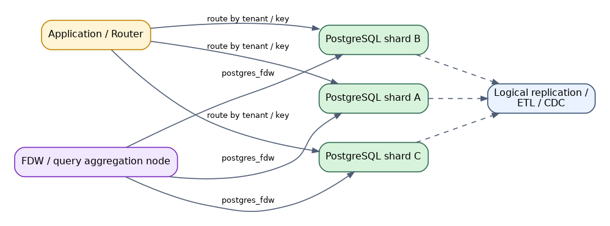
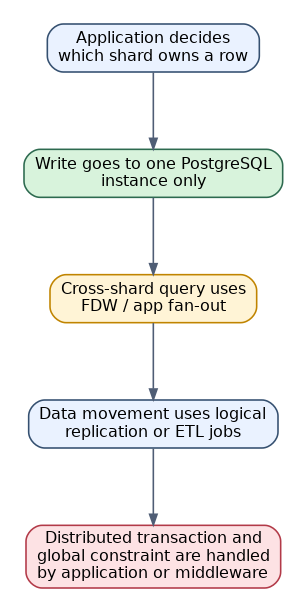
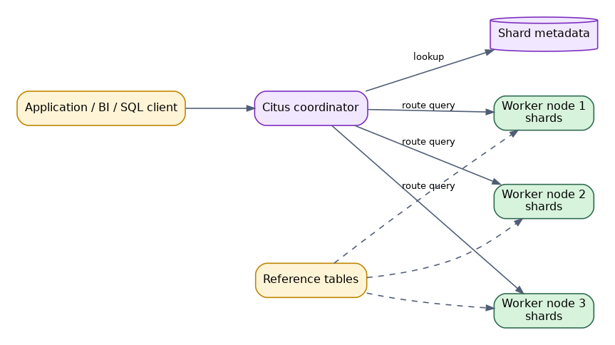
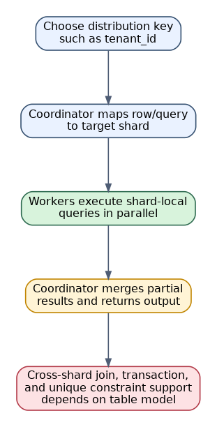
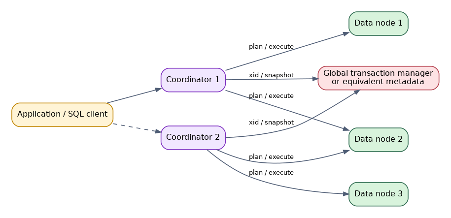
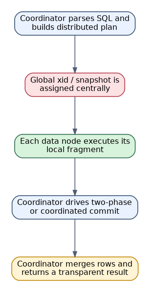
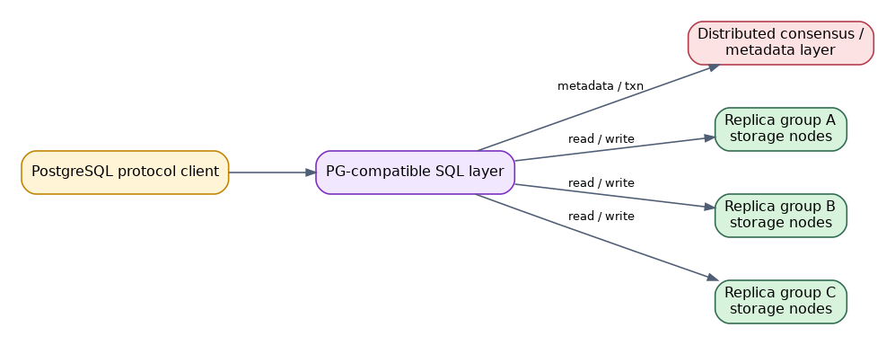
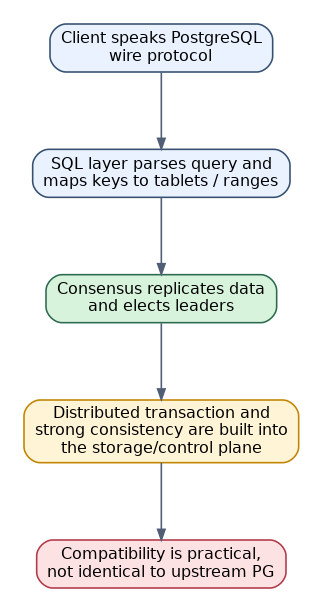
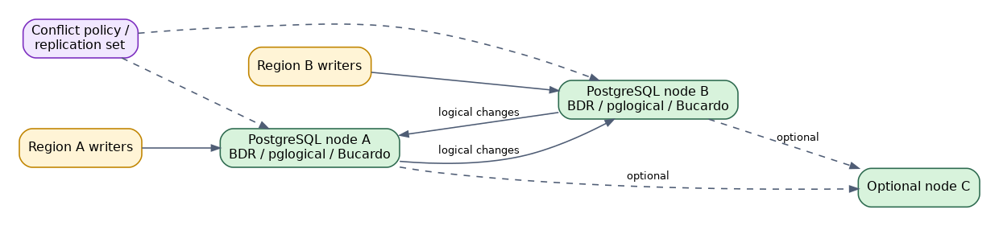
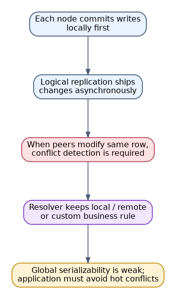

# 🌐 PostgreSQL 分布式方案技术分享

> 📌 文档类型：方案对比 / 技术分享
> 👥 适用对象：数据库内核工程师、架构师、DBA、平台工程师、需要基于 PostgreSQL 做分布式设计的后端工程师  
> 🎯 阅读目标：理解 PostgreSQL 生态中几条常见分布式路线的架构边界、实现原理、适用场景和选型重点。
> 🧭 阅读方式：建议先看目录或总览，再进入实现细节、源码摘录和总结部分。

## 🧭 目录

- [📄 1. PostgreSQL 做分布式时要先回答什么问题](#1-postgresql-做分布式时要先回答什么问题)
- [🌟 2. 方案总览](#2-方案总览)
- [📄 3. 原生能力拼装方案：应用分片 + FDW + Logical Replication](#3-原生能力拼装方案应用分片--fdw--logical-replication)
- [📄 4. Citus：PostgreSQL 扩展式分布式分片](#4-cituspostgresql-扩展式分布式分片)
- [📄 5. Postgres-XC / Postgres-XL 类路线：坐标节点 + 数据节点](#5-postgres-xc--postgres-xl-类路线坐标节点--数据节点)
- [📄 6. PostgreSQL 兼容分布式数据库路线](#6-postgresql-兼容分布式数据库路线)
- [📄 7. 多主 / 双向复制路线：BDR / pglogical / Bucardo](#7-多主--双向复制路线bdr--pglogical--bucardo)
- [💡 8. 选型建议](#8-选型建议)
- [🛠️ 9. 各方案部署复杂度 / 适用规模对比](#9-各方案部署复杂度--适用规模对比)
- [📄 10. 实施与运维注意事项](#10-实施与运维注意事项)
- [✅ 11. 总结](#11-总结)

---

## 📄 1. PostgreSQL 做分布式时要先回答什么问题

PostgreSQL 本体首先是单机关系数据库。所谓“利用 PostgreSQL 实现分布式”，实际上可能是在做完全不同的事情：

- 只是把数据拆到多台 PostgreSQL 上，应用自己路由。
- 在 PostgreSQL 上加扩展，让 SQL 层具备分片执行能力。
- 采用 PostgreSQL 衍生分支，在内核里加入分布式事务与节点协同。
- 采用兼容 PostgreSQL 协议的分布式数据库，用 PostgreSQL 接口换取分布式存储和一致性。
- 用逻辑复制做多主或近似多活，而不是透明分布式数据库。

因此在选型前，至少要明确：

| 问题 | 典型选项 | 对方案影响 |
| --- | --- | --- |
| 目标是扩容还是多活 | 水平扩容 / 多地域写入 / 读扩展 / 统一查询 | 决定是分片、复制还是多主 |
| 一致性要求多强 | 最终一致 / 会话级一致 / 强一致事务 | 决定能否接受异步复制 |
| 业务是否可分片 | 按租户 / 按用户 / 按地区 / 难分片 | 决定应用分片是否现实 |
| 是否接受新数据库 | 接受兼容数据库 / 必须保留原生 PostgreSQL | 决定是否能选 YugabyteDB、CockroachDB 等 |
| 负载类型 | OLTP / HTAP / OLAP / 多租户 SaaS | 决定更适合 Citus、MPP 还是复制路线 |
| 运维能力 | 应用可配合 / 平台可接入中间件 / 只能最小改造 | 决定方案复杂度上限 |

---

## 🌟 2. 方案总览

| 路线 | 代表实现 | 架构核心 | 分布式事务 | 透明分片能力 | 适合场景 | 风险点 |
| --- | --- | --- | --- | --- | --- | --- |
| 原生能力拼装 | `postgres_fdw`、Logical Replication、应用分片 | 多个独立 PostgreSQL + 应用路由 | 弱，通常靠应用 | 弱到中 | 低成本分库分表、增量迁移 | 全局事务和跨分片约束弱 |
| 扩展式分布式分片 | Citus | Coordinator + Worker + shard metadata | 有限支持 | 强 | 多租户、并行查询、分片 OLTP/HTAP | 分布键设计决定成败 |
| 内核改造式分布式 PG | Postgres-XC / Postgres-XL 类 | Coordinator + DataNode + 全局事务管理 | 强于应用分片 | 强 | 需要透明分布式 SQL | 生态成熟度与版本同步压力 |
| PG 兼容分布式数据库 | YugabyteDB、CockroachDB、Greenplum 等 | PG 协议层 + 分布式存储/共识 | 一般较强 | 强 | 想要原生分布式能力 | 兼容度不是 100% 等同上游 |
| 多主 / 双向复制 | BDR、pglogical、Bucardo | 多节点逻辑复制 + 冲突处理 | 弱或特定实现 | 不是主目标 | 多地域写入、近似多活 | 冲突处理与一致性复杂 |

### 2.1 一句话理解

- 如果你的业务天然能按租户或用户切开，原生拼装路线往往是成本最低的。
- 如果希望尽量保留 PostgreSQL 生态，同时获得较强的分片能力，Citus 是最典型路线。
- 如果希望 SQL 层更透明地看到一个分布式 PostgreSQL 集群，需要看 XC/XL 一类内核改造路线。
- 如果你真正需要分布式一致性存储和多副本容灾，往往已经接近“选择一套 PG 兼容的分布式数据库”。
- 如果你的重点是多地域写入而不是透明分片，那么多主复制路线更接近需求本质。

---

## 📄 3. 原生能力拼装方案：应用分片 + FDW + Logical Replication

### 3.1 适用思路

这是最常见、也最容易被误解的一条路线。它不是“把 PostgreSQL 变成透明分布式数据库”，而是把多台 PostgreSQL 组合成一个分布式系统：

- 应用按某个 key 选择目标库。
- `postgres_fdw` 用于跨库查询或汇聚视图。
- Logical Replication 用于数据同步、迁移或只读副本构建。
- ETL / CDC 用于离线聚合与搜索索引构建。

### 3.2 架构特征

- 每个分片本质上仍是独立 PostgreSQL。
- 路由逻辑由应用、代理层或自定义中间件承担。
- 跨分片 join 往往变成 fan-out 查询，成本和复杂度都较高。
- 每个分片可以独立做备份、HA、扩容和升级。

### 3.3 优点

- 基于 PostgreSQL 原生能力，侵入性最小。
- 业务可以逐步拆分，不必一次性迁移到全新数据库。
- 运维模型清晰，每个节点仍是标准 PostgreSQL。
- 很适合按租户、按业务线、按地域拆库。

### 3.4 缺点

- 没有统一的全局执行器。
- 全局事务、全局唯一约束、跨分片外键支持弱。
- 跨分片查询需要额外优化，否则性能不稳定。
- 数据热点和分片不均衡要由应用层长期治理。

### 3.5 典型场景

- SaaS 业务按租户拆分。
- 存量单库向多库平滑迁移。
- 某些表做逻辑复制分发到不同业务域。
- 不希望引入新的数据库产品，只接受原生 PostgreSQL。

---

## 📄 4. Citus：PostgreSQL 扩展式分布式分片

### 4.1 核心思路

Citus 是 PostgreSQL 扩展路线中最典型的分布式方案。它在 PostgreSQL 上引入：

- coordinator 节点
- worker 节点
- shard 元数据
- 分布表、引用表、本地表的不同模型

### 4.2 运行方式

- 客户端通常连到 coordinator。
- coordinator 根据分布键和 shard 元数据决定去哪几个 worker。
- shard-local 查询在 worker 并行执行。
- partial result 回到 coordinator 聚合。
- 某些维度表会作为 reference table 复制到各 worker，减少跨分片 join 成本。

### 4.3 优点

- 保持 PostgreSQL 体验，SQL 和生态迁移成本相对可控。
- 对多租户和按键分布的数据模型非常友好。
- 并行查询和分片扩容能力较强。
- 在 PostgreSQL 扩展路线里成熟度较高。

### 4.4 缺点

- 分布键设计错误时，后续代价很高。
- 跨 shard join、跨 shard 事务和全局唯一约束存在边界。
- coordinator 容量规划、元数据管理和 rebalance 需要经验。
- 并不是所有 PostgreSQL 特性都能在分布模式下完全等价工作。

### 4.5 典型场景

- 多租户 SaaS。
- 大表并行分析。
- 单机 PostgreSQL 写入、存储、查询都接近瓶颈，但业务仍能按主键或租户切分。

---

## 📄 5. Postgres-XC / Postgres-XL 类路线：坐标节点 + 数据节点

### 5.1 核心思路

这条路线的目标是把 PostgreSQL 做成更“透明”的 shared-nothing 分布式数据库。典型架构包括：

- coordinator 节点，负责 SQL 入口和分布式计划
- data node，负责存储和局部执行
- 全局事务管理或等价组件，负责 xid / snapshot 协调

### 5.2 与 Citus 的区别

- Citus 更像 PostgreSQL 上的分片执行扩展。
- XC/XL 路线更强调“整个集群在 SQL 层像一套数据库”。
- 这种透明性来自更深的内核改造，而不是只做扩展层路由。

### 5.3 优点

- 对使用者来说，分布式特性更接近数据库内建能力。
- 分布式计划和提交协议通常更系统化。
- 某些场景下比应用分片更容易统一开发模型。

### 5.4 缺点

- 实现复杂，系统部件多。
- 对上游 PostgreSQL 版本演进的跟随成本高。
- 生态、社区和第三方工具支持通常弱于主线 PostgreSQL 扩展路线。
- 全局事务协调组件可能成为复杂度和稳定性的关键点。

### 5.5 典型场景

- 组织内部可接受特定分支或发行版。
- 更关注透明分布式 SQL，而不是应用层改造最小化。
- 团队具备较强数据库平台与源码维护能力。

---

## 📄 6. PostgreSQL 兼容分布式数据库路线

### 6.1 核心思路

这条路线往往不再是“给原生 PostgreSQL 加几个组件”，而是选择一套：

- 提供 PostgreSQL 协议兼容
- 支持 PostgreSQL 方言或大部分常用 SQL
- 底层自带分布式存储、复制和一致性控制

常见代表可以按风格区分：

- 强一致 OLTP 风格：YugabyteDB、CockroachDB
- MPP / 分析风格：Greenplum 等
- 云产品风格：某些托管 PG 兼容分布式数据库

### 6.2 关键特征

- SQL 接口尽量接近 PostgreSQL。
- 真正的分布式事务、数据复制和节点故障恢复由底层系统负责。
- 应用可能可以复用 PG 驱动、ORM 和部分 SQL。
- 但内核行为、系统表、扩展能力和某些边缘语义不等同于上游 PostgreSQL。

### 6.3 优点

- 原生具备分布式一致性、自动副本管理和水平扩展能力。
- 比应用拼装方案更适合强一致多节点系统。
- 对业务方来说，通常能减少自己处理分布式事务的负担。

### 6.4 缺点

- 这本质上是在选择新数据库，不只是 PostgreSQL 扩容。
- 兼容度需要逐项验证，不能只看“兼容 PostgreSQL 协议”。
- 某些 PostgreSQL 扩展、运维脚本和内核级习惯无法直接复用。
- 团队需要接受新的故障模型和新的运维体系。

### 6.5 典型场景

- 需要强一致分布式事务。
- 需要跨多节点自动容灾和弹性扩容。
- 可以接受从“原生 PostgreSQL”迁移到“PG 兼容数据库”。

---

## 📄 7. 多主 / 双向复制路线：BDR / pglogical / Bucardo

### 7.1 核心思路

这条路线最容易和“分布式数据库”混淆。它的本质不是透明分片，而是：

- 多个 PostgreSQL 节点各自可以写入
- 节点之间通过逻辑复制同步数据
- 系统依赖冲突检测与冲突解决策略维持最终收敛

### 7.2 优点

- 适合多地域写入或局部自治场景。
- 可以把多个站点组织成近似多活系统。
- 对某些跨地域容灾需求很有吸引力。

### 7.3 缺点

- 冲突处理是长期成本，不是一次性配置问题。
- 序列、唯一约束、DDL、触发器、副作用函数都很容易成为复杂点。
- 通常不能提供严格的全局串行化语义。
- 业务设计必须配合，例如避免多个站点同时改同一业务实体。

### 7.4 典型场景

- 多地域边缘写入。
- 对局部站点可写性要求高于全局强一致。
- 应用可以接受最终一致，并能显式设计冲突规避策略。

---

## 💡 8. 选型建议

### 8.1 如果目标是“尽量保留原生 PostgreSQL”

优先考虑：

- 应用分片 + Logical Replication
- `postgres_fdw` 做汇聚查询
- 必要时再看 Citus

适合：

- 团队已经非常熟悉标准 PostgreSQL
- 愿意在应用层承担部分复杂度
- 不急于引入全新数据库产品

### 8.2 如果目标是“获得真正的分布式能力”

优先考虑：

- Citus
- PostgreSQL 兼容分布式数据库

区别在于：

- 想尽量延续 PostgreSQL 扩展路线，先看 Citus。
- 想获得更完整的分布式一致性和副本管理，优先看兼容数据库路线。

### 8.3 如果目标是“多地域写入”

优先考虑：

- BDR / pglogical 一类多主复制方案
- 或者直接选择具备全局一致性能力的分布式数据库

不建议误用：

- 单纯依靠主备复制去实现多活
- 把异步双向复制当成透明强一致数据库

### 8.4 简化判断

| 需求 | 更适合的路线 |
| --- | --- |
| 最低改造成本分库分表 | 原生能力拼装 |
| 多租户分片 + PostgreSQL 生态延续 | Citus |
| 透明分布式 SQL、接受特定分支 | XC / XL 类路线 |
| 强一致分布式事务、接受新数据库 | PG 兼容分布式数据库 |
| 多地域写入、最终一致 | 多主 / 双向复制 |

---

## 🛠️ 9. 各方案部署复杂度 / 适用规模对比

这一章不再只看“功能上能不能做”，而是把几条路线放到同一张表里，比较它们的实施门槛、适合的团队能力边界，以及通常覆盖的业务规模。

### 9.1 一页总表

| 路线 | 部署复杂度 | 运维复杂度 | 对应用改造要求 | 适用规模 | 最适合的场景 | 主要门槛 |
| --- | --- | --- | --- | --- | --- | --- |
| 原生能力拼装 | 低到中 | 中 | 高 | 小到中 | 业务天然可分片、希望渐进式演进 | 路由、跨分片查询、数据治理主要靠应用承担 |
| Citus | 中 | 中 | 中 | 中到大 | 多租户 SaaS、按分布键扩容、希望保留 PG 生态 | 分布键设计、rebalance、跨 shard 能力边界 |
| XC / XL 类路线 | 高 | 高 | 低到中 | 中到大 | 想要更透明的分布式 SQL、可接受特定分支 | 版本跟进、全局事务协调、生态成熟度 |
| PG 兼容分布式数据库 | 中到高 | 中到高 | 中 | 中到超大 | 强一致分布式事务、自动副本管理、水平扩展 | 兼容性验证、迁移成本、运维模型切换 |
| 多主 / 双向复制 | 高 | 高 | 高 | 中到大 | 多地域写入、站点自治、近似多活 | 冲突治理、唯一约束、DDL 和副作用控制 |

### 9.2 部署复杂度对比

#### 9.2.1 按实施门槛分层

| 复杂度等级 | 路线 | 典型原因 | 团队要求 |
| --- | --- | --- | --- |
| 低到中 | 原生能力拼装 | 不需要引入全新数据库内核，先拆库、再补路由和同步 | 熟悉 PostgreSQL 的应用团队和 DBA 即可起步 |
| 中 | Citus | 需要引入 coordinator / worker、分布表模型和 rebalance 机制 | DBA 需要理解分片模型，应用需要配合分布键设计 |
| 中到高 | PG 兼容分布式数据库 | 部署集群本身通常不难，但数据库语义验证和迁移切换成本高 | 需要平台团队、测试团队和业务方共同验证兼容性 |
| 高 | XC / XL 类路线 | 内核改造深、组件多、事务协调复杂 | 需要较强的平台工程能力和长期维护投入 |
| 高 | 多主 / 双向复制 | 难点不在安装，而在冲突模型、收敛策略和长期治理 | 业务、DBA、平台团队都要参与设计和演练 |

#### 9.2.2 一个直接判断方法

- 如果团队最强的能力是标准 PostgreSQL 运维，而不是数据库平台研发，优先从原生能力拼装或 Citus 开始。
- 如果真正困难的是“兼容性和迁移”，而不是“集群怎么搭”，那就要把 PG 兼容分布式数据库视为新数据库选型，而不是 PostgreSQL 普通扩容。
- 如果方案需要解释大量“冲突怎么处理、哪个站点赢、序列怎么分配、DDL 怎么同步”的问题，它通常已经进入高复杂度区间。

### 9.3 适用规模对比

#### 9.3.1 按业务规模选择

| 业务规模 | 常见特征 | 更优先的路线 | 备选路线 | 说明 |
| --- | --- | --- | --- | --- |
| 小规模 | 单库开始接近瓶颈，但业务边界清晰，团队偏应用研发 | 原生能力拼装 | Citus | 先解决拆库和路由问题，通常比一步到位上分布式数据库更稳妥 |
| 中等规模 | 多租户、业务可按租户或主键切分，希望减少应用侧分片负担 | Citus | 原生能力拼装、PG 兼容分布式数据库 | 这是 Citus 最有代表性的适用区间 |
| 大规模 | 集群数量多、容量增长快、对强一致和自动恢复要求更高 | PG 兼容分布式数据库 | Citus、XC / XL 类路线 | 更关注统一扩容、容灾和一致性，而不是单纯分库 |
| 超大规模 / 平台化场景 | 需要数据库平台标准化交付、跨机房容灾、持续弹性扩展 | PG 兼容分布式数据库 | Citus 平台化 | 平台收益通常高于单集群最优解 |
| 多地域写入场景 | 核心诉求是多个站点都能写，而不是透明分片 | 多主 / 双向复制 | PG 兼容分布式数据库 | 这是“多活问题”，不应和普通分片扩容混为一谈 |

#### 9.3.2 容易选错的地方

- 把“需要水平扩容”误判成“需要多主写入”，会把系统复杂度抬得过高。
- 把“想保留 PostgreSQL 协议”误判成“和上游 PostgreSQL 完全等价”，会低估兼容性验证工作量。
- 把“SQL 看起来透明”误判成“运维也会更简单”，往往会低估 coordinator、元数据和全局事务组件的维护成本。

---

## 📄 10. 实施与运维注意事项

无论选择哪条路线，都建议先把以下事情做清楚：

### 10.1 先设计分布键，而不是先搭集群

- 数据热点是否集中在少数租户、用户、订单号或时间区间。
- 是否存在必须跨分片 join 的核心链路。
- 是否需要全局唯一约束。
- 是否存在跨库事务强依赖。

### 10.2 统一高可用方案

分布式不是高可用的替代品。每个路线仍要单独回答：

- 单节点宕机怎么切换。
- 元数据节点怎么高可用。
- 客户端连接入口怎么切换。
- 故障恢复后如何 rejoin。

### 10.3 统一观测项

建议至少监控：

- 节点健康状态
- 延迟和复制滞后
- 分片均衡度
- 热点 key / 热点 shard
- 后台 rebalance 或数据迁移进度
- 事务冲突与重试率

### 10.4 先做演练再做生产切换

- 扩容演练
- 节点故障演练
- 元数据故障演练
- 网络分区演练
- 跨机房切换演练
- 回滚和数据校验演练

---

## ✅ 11. 总结

PostgreSQL 生态里的“分布式”并不是单一路线，而是五种不同问题的五种答案：

- 原生能力拼装，解决低成本拆分与渐进演进。
- Citus，解决 PostgreSQL 扩展式分片与并行执行。
- XC / XL 类路线，解决更透明的分布式 SQL。
- PG 兼容分布式数据库，解决强一致分布式存储与事务。
- 多主 / 双向复制，解决多地域写入和近似多活。

真正的选型关键不在“哪个名字更响”，而在于你到底要解决：

- 水平扩容
- 强一致事务
- 多活写入
- 分析并行
- 还是低改造成本迁移

如果目标不清晰，再先进的“分布式 PostgreSQL”方案也会被用错。相反，如果业务边界清晰，哪怕只是应用分片 + 标准 PostgreSQL，也可能是最正确、最稳定的工程解。
