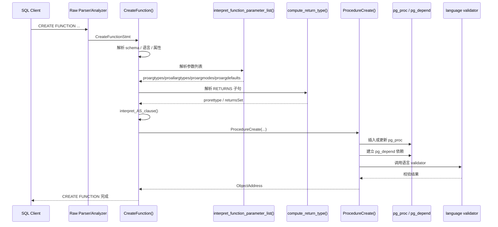
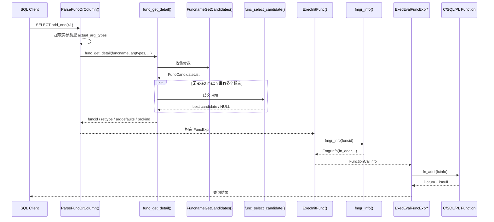

# 🧠 PostgreSQL/IvorySQL 函数与自定义函数机制技术说明

> 📌 文档类型：技术说明 / 源码阅读笔记
> 👥 适用对象：函数机制开发者、Parser/Fmgr 相关源码阅读者。
> 🧭 阅读方式：建议按“创建函数 -> 解析调用 -> 候选选择 -> 执行框架”的顺序阅读。

## 🧭 快速导航

- 🎯 1. 文档目标
- 🏗️ 2. 总体架构
- 🧩 3. 关键数据结构
- ⚙️ 4. `CREATE FUNCTION` 的实现主线
- ⚙️ 5. 自定义函数的实现方式
- 🛠️ 6. 函数调用的解析主线
- 📄 7. 候选收集规则：`FuncnameGetCandidates()`
- 📄 8. 候选选择规则：`func_get_detail()` + `func_select_candidate()`
- ✅ 9. 函数调用候选规则总结
- 🏗️ 10. 执行期调用框架：fmgr
- ⚖️ 11. SQL 函数与 C 函数在执行机制上的差异
- 📄 12. 一个完整调用链示例
- 📄 13. IvorySQL 在该机制上的扩展点
- 📄 14. 工程上应如何理解这套机制
- 🕒 15. 时序图
- 📄 16. 结合具体 SQL 示例逐步走调用链
- ✅ 17. 结论

---

## 🎯 1. 文档目标

本文基于当前仓库源码，系统说明 PostgreSQL/IvorySQL 中“函数”这一能力的实现框架，覆盖以下内容：

1. 函数定义与 `CREATE FUNCTION` 的落库机制
2. 自定义函数的实现方式，尤其是 C 语言函数的 fmgr 调用约定
3. 函数调用时解析、候选收集、候选裁剪、歧义消解的规则
4. 执行期函数调用框架：`FmgrInfo`、`FunctionCallInfo`、执行器如何真正调用函数
5. 结合本仓库源码给出实现路径和示例

本文以 PostgreSQL 主机制为主线，同时指出 IvorySQL 在 Oracle/PLISQL 兼容场景下增加的扩展逻辑。

---

## 🏗️ 2. 总体架构

从系统视角看，函数机制分成四层：

1. **定义层**  
   SQL `CREATE FUNCTION`/`CREATE PROCEDURE` 被解析成 `CreateFunctionStmt`，随后经 `CreateFunction()` 转换为 `pg_proc` 元组并写入系统目录。

2. **目录层**  
   函数元数据集中存放在 `pg_proc`，包括：
   - 名字、schema、语言、所有者
   - 返回类型、参数类型
   - `strict`、`volatile`、`security definer`、`parallel` 等属性
   - 源代码文本 `prosrc`
   - C 语言函数的动态库路径 `probin`
   - SQL 函数已解析后的 `prosqlbody`

3. **解析层**  
   SQL 中出现函数调用时，解析器通过 `ParseFuncOrColumn()` 进入函数解析流程，再经 `func_get_detail()`、`FuncnameGetCandidates()`、`func_select_candidate()` 确定最终目标函数 OID。

4. **执行层**  
   执行器通过 `ExecInitFunc()` 初始化调用环境，借助 fmgr (`fmgr_info`, `FmgrInfo`, `FunctionCallInfo`) 找到函数入口并执行。

一句话总结：

> `CREATE FUNCTION` 解决“把函数定义成数据库对象”，解析器解决“我该调用哪一个函数”，fmgr 解决“我如何真正调用它”。

---

## 🧩 3. 关键数据结构

### 3.1 `CreateFunctionStmt`

定义于 [`src/include/nodes/parsenodes.h`](/usr1/V9/ivorysql-pro/src/include/nodes/parsenodes.h:3266)。

它是 `CREATE FUNCTION` 的原始语法树节点，包含：

- `funcname`: 函数名
- `parameters`: 参数列表
- `returnType`: 返回类型
- `options`: 语言、strict、volatility、cost 等属性
- `sql_body`: SQL 函数体

### 3.2 `FmgrInfo`

定义于 [`src/include/fmgr.h`](/usr1/V9/ivorysql-pro/src/include/fmgr.h:56)。

它表示“某个函数已经完成目录查找后的调用信息”：

- `fn_addr`: 最终调用入口
- `fn_oid`: 被调用函数 OID
- `fn_nargs`: 输入参数个数
- `fn_strict`: 是否 strict
- `fn_retset`: 是否返回集合
- `fn_extra`: 供 handler 缓存私有信息
- `fn_expr`: 调用表达式树

这是“函数查找结果”的缓存体。

### 3.3 `FunctionCallInfo`

定义于 [`src/include/fmgr.h`](/usr1/V9/ivorysql-pro/src/include/fmgr.h:90)。

它表示“一次具体函数调用”的实参上下文：

- `flinfo`: 指向 `FmgrInfo`
- `fncollation`: 调用使用的排序规则
- `isnull`: 返回值是否为 NULL
- `nargs`: 本次实参个数
- `args[]`: 参数数组

这是“调用现场”。

### 3.4 `FuncCandidateList`

定义在 namespace 相关头文件中，由 `FuncnameGetCandidates()` 构建。它表示同名函数候选集合，每个元素至少包含：

- 候选函数 OID
- 按本次调用顺序重排后的参数类型数组
- `nvargs`: 变长参数展开出的参数数
- `ndargs`: 由默认值补出的参数数
- `argnumbers`: 命名参数映射表
- `pathpos`: schema 在 search_path 中的位置

这是“候选集合”的载体。

---

## ⚙️ 4. `CREATE FUNCTION` 的实现主线

### 4.1 入口：`CreateFunction()`

核心入口在 [`src/backend/commands/functioncmds.c`](/usr1/V9/ivorysql-pro/src/backend/commands/functioncmds.c:1499)。

它做的事情可以概括为：

1. 解析函数名和目标 schema
2. 校验 schema `CREATE` 权限
3. 解析并校验语言
4. 解析参数列表
5. 解析返回类型
6. 解析 `AS`/SQL body
7. 计算 `cost`/`rows` 等属性默认值
8. 调用 `ProcedureCreate()` 真正写目录

对应源码关键点：

- 名字与 schema 解析：[`functioncmds.c:1571`](/usr1/V9/ivorysql-pro/src/backend/commands/functioncmds.c:1571)
- 语言与权限校验：[`functioncmds.c:1633`](/usr1/V9/ivorysql-pro/src/backend/commands/functioncmds.c:1633)
- 参数解析：[`functioncmds.c:1698`](/usr1/V9/ivorysql-pro/src/backend/commands/functioncmds.c:1698)
- 返回类型解析：[`functioncmds.c:1722`](/usr1/V9/ivorysql-pro/src/backend/commands/functioncmds.c:1722)
- 进入目录层：[`functioncmds.c:1836`](/usr1/V9/ivorysql-pro/src/backend/commands/functioncmds.c:1836)

### 4.2 参数解析：`interpret_function_parameter_list()`

这个阶段会把 SQL 层参数定义转换成目录层存储结构：

- `proargtypes`: 仅输入参数类型
- `proallargtypes`: 所有参数类型
- `proargmodes`: 参数模式（`IN/OUT/INOUT/VARIADIC/TABLE`）
- `proargnames`: 参数名
- `proargdefaults`: 默认值表达式列表

它还会完成一批定义期约束检查：

- `VARIADIC` 必须放在最后
- 参数名不能重复
- 默认参数之后的输入参数，在 PG 规则下也必须有默认值
- `OUT` 参数会影响最终返回类型推导

### 4.3 返回类型解析：`compute_return_type()`

入口在 [`src/backend/commands/functioncmds.c`](/usr1/V9/ivorysql-pro/src/backend/commands/functioncmds.c:124)。

职责：

- 把 `RETURNS xxx` 转成返回类型 OID
- 识别 `SETOF`
- 处理 shell type、伪类型限制
- 在 IvorySQL 的 Oracle/PLISQL 模式下处理 package type、`%TYPE`、`%ROWTYPE`

### 4.4 真正建目录对象：`ProcedureCreate()`

核心实现位于 [`src/backend/catalog/pg_proc.c`](/usr1/V9/ivorysql-pro/src/backend/catalog/pg_proc.c:82)。

这是函数定义机制的核心目录写入器。它不仅用于 function，也用于 procedure、window function、aggregate 的相关目录写入。

其处理流程如下：

1. 校验参数数组、模式数组、返回类型合法性  
   例如多态返回类型必须能由输入参数推导，`internal` 返回类型也有限制。见 [`pg_proc.c:199`](/usr1/V9/ivorysql-pro/src/backend/catalog/pg_proc.c:199)。

2. 组装 `pg_proc` 元组字段  
   见 [`pg_proc.c:320`](/usr1/V9/ivorysql-pro/src/backend/catalog/pg_proc.c:320) 之后：
   - `proname`
   - `pronamespace`
   - `proowner`
   - `prolang`
   - `prorettype`
   - `proargtypes`
   - `proallargtypes`
   - `proargmodes`
   - `proargnames`
   - `proargdefaults`
   - `prosrc`
   - `probin`
   - `prosqlbody`

3. 检查是否已存在同签名函数  
   见 [`pg_proc.c:413`](/usr1/V9/ivorysql-pro/src/backend/catalog/pg_proc.c:413)。

4. 如果是 `CREATE OR REPLACE`，执行替换规则检查  
   不能随便改：
   - routine kind
   - 返回类型
   - `OUT` 形成的 rowtype
   - 已存在输入参数名
   - 既有默认值的类型兼容性  
   见 [`pg_proc.c:438`](/usr1/V9/ivorysql-pro/src/backend/catalog/pg_proc.c:438) 起。

5. 插入或更新 `pg_proc`  
   - 新建：`CatalogTupleInsert()`，见 [`pg_proc.c:687`](/usr1/V9/ivorysql-pro/src/backend/catalog/pg_proc.c:687)
   - 替换：`CatalogTupleUpdate()`，见 [`pg_proc.c:651`](/usr1/V9/ivorysql-pro/src/backend/catalog/pg_proc.c:651)

6. 建立依赖关系  
   见 [`pg_proc.c:695`](/usr1/V9/ivorysql-pro/src/backend/catalog/pg_proc.c:695) 起：
   - schema 依赖
   - 语言依赖
   - 返回类型依赖
   - 参数类型依赖
   - transform 依赖
   - support 函数依赖
   - SQL body / 默认表达式依赖
   - owner / ACL / extension 依赖

7. 调用 validator 校验函数体  
   见 [`pg_proc.c:793`](/usr1/V9/ivorysql-pro/src/backend/catalog/pg_proc.c:793)。

### 4.5 validator 的作用

典型 validator：

- C 语言函数校验：[`pg_proc.c:982`](/usr1/V9/ivorysql-pro/src/backend/catalog/pg_proc.c:982)
  - 检查动态库是否存在
  - 检查符号是否存在
  - 检查是否提供 `PG_FUNCTION_INFO_V1`

- SQL 语言函数校验：[`pg_proc.c:1030`](/usr1/V9/ivorysql-pro/src/backend/catalog/pg_proc.c:1030)
  - 检查参数/返回类型是否允许
  - 原始 SQL parse
  - analyze + rewrite
  - 校验返回值是否与声明兼容

因此，`CREATE FUNCTION` 不是只写一条目录记录，它还会尽可能提前把“未来运行时会炸掉的问题”提前在定义期报出来。

---

## ⚙️ 5. 自定义函数的实现方式

PostgreSQL 的“自定义函数”本质上是：

1. 先按某种语言实现函数体
2. 再通过 `CREATE FUNCTION` 把它注册为数据库对象

常见语言：

- `LANGUAGE internal`
- `LANGUAGE C`
- `LANGUAGE SQL`
- 其他 PL（如 PL/pgSQL，IvorySQL 中还有 `plisql`）

### 5.1 C 语言自定义函数的调用约定

fmgr 要求所有可直接调用的 C 函数使用统一签名：

```c
Datum function_name(PG_FUNCTION_ARGS)
```

对应定义见 [`src/include/fmgr.h`](/usr1/V9/ivorysql-pro/src/include/fmgr.h:33) 和 [`src/include/fmgr.h`](/usr1/V9/ivorysql-pro/src/include/fmgr.h:204)。

关键点：

- 实参不以普通 C 形参传递，而是统一从 `fcinfo` 取
- 返回值统一是 `Datum`
- 用 `PG_GETARG_xxx()` 取参数
- 用 `PG_RETURN_xxx()` 返回结果

### 5.2 `PG_FUNCTION_INFO_V1`

对 C 函数来说，除了实现函数本体，还要声明：

```c
PG_FUNCTION_INFO_V1(funcname);
```

这个宏会导出 `pg_finfo_funcname` 符号，供 fmgr 校验 API 版本。若缺失，会在载入时被 `fetch_finfo_record()` 拒绝，见 [`src/backend/utils/fmgr/fmgr.c`](/usr1/V9/ivorysql-pro/src/backend/utils/fmgr/fmgr.c:562)。

### 5.3 仓库中的 C 函数示例

教程示例位于 [`src/tutorial/funcs.c`](/usr1/V9/ivorysql-pro/src/tutorial/funcs.c:1)。

最简单的例子：

```c
PG_FUNCTION_INFO_V1(add_one);

Datum
add_one(PG_FUNCTION_ARGS)
{
    int32 arg = PG_GETARG_INT32(0);
    PG_RETURN_INT32(arg + 1);
}
```

源码位置：[`src/tutorial/funcs.c:21`](/usr1/V9/ivorysql-pro/src/tutorial/funcs.c:21)

这说明 C 自定义函数的最小实现单元是：

1. `PG_MODULE_MAGIC`
2. `PG_FUNCTION_INFO_V1`
3. `Datum func(PG_FUNCTION_ARGS)`

### 5.4 典型 SQL 注册方式

对于上面的 C 函数，数据库侧通常会这样注册：

```sql
CREATE FUNCTION add_one(int4)
RETURNS int4
AS 'mysharedlib', 'add_one'
LANGUAGE C STRICT;
```

其中：

- `probin = 'mysharedlib'`
- `prosrc = 'add_one'`

定义期由 `fmgr_c_validator()` 校验，运行期由 `fmgr_info_C_lang()` 动态装载并缓存符号地址。

### 5.5 SQL 语言函数

SQL 函数与 C 函数的差异在于：

- `prosrc` 存的是 SQL 文本
- `fn_addr` 不会指向用户 SQL 文本，而是统一指向 `fmgr_sql`
- 实际执行逻辑由 SQL 函数执行器处理，代码在 [`src/backend/executor/functions.c`](/usr1/V9/ivorysql-pro/src/backend/executor/functions.c:1039)

也就是说，SQL 函数不是“直接调用某个 C 符号”，而是“调用 SQL-language handler”。

---

## 🛠️ 6. 函数调用的解析主线

### 6.1 入口：`ParseFuncOrColumn()`

入口在 [`src/backend/parser/parse_func.c`](/usr1/V9/ivorysql-pro/src/backend/parser/parse_func.c:106)。

它负责处理：

- 普通函数调用
- 过程调用（`CALL`）
- 聚合函数、窗口函数
- 列投影语法与函数调用歧义
- 命名参数、默认参数、变长参数

它的处理步骤大致是：

1. 抽取实参类型数组 `actual_arg_types`
2. 抽取命名参数列表 `argnames`
3. 处理“是否可能是列投影”
4. 调用 `func_get_detail()` 查找目标
5. 根据结果类型继续构造：
   - `FuncExpr`
   - `Aggref`
   - `WindowFunc`
   - 或类型强制转换节点

### 6.2 列投影和函数调用的歧义

PostgreSQL 有历史兼容语法：

- `tab.col`
- `col(tab)`

在某些情况下会被看成等价表达。如果是“单参数 + 复杂类型 + 名字未限定”，`ParseFuncOrColumn()` 会先尝试把它当作列投影。见 [`parse_func.c:287`](/usr1/V9/ivorysql-pro/src/backend/parser/parse_func.c:287)。

### 6.3 真正查找：`func_get_detail()`

入口在 [`src/backend/parser/parse_func.c`](/usr1/V9/ivorysql-pro/src/backend/parser/parse_func.c:1862)。

它是函数解析的核心控制器，逻辑可以概括为：

1. 从命名空间里收集所有候选 `FuncnameGetCandidates()`
2. 先找 exact match
3. 如果没有 exact match，尝试把它解释成“类型强制转换”
4. 否则做隐式类型转换匹配
5. 如果仍然多个候选，执行歧义消解 `func_select_candidate()`
6. 确定后回读 `pg_proc`，得到：
   - `funcid`
   - `rettype`
   - `retset`
   - `vatype`
   - 默认参数列表
   - `prokind` 对应的 `FUNCDETAIL_*`

---

## 📄 7. 候选收集规则：`FuncnameGetCandidates()`

入口在 [`src/backend/catalog/namespace.c`](/usr1/V9/ivorysql-pro/src/backend/catalog/namespace.c:1073)。

它做的是“**收集所有可能可调用的候选**”，不是最终拍板。

### 7.1 按名字和 schema/search_path 搜索

规则：

1. 若函数名显式带 schema，只在该 schema 内查
2. 否则沿 `search_path` 查找
3. 在多 schema 场景下，前面的 schema 可以屏蔽后面的同签名函数

相关代码：

- 解析限定名：[`namespace.c:1088`](/usr1/V9/ivorysql-pro/src/backend/catalog/namespace.c:1088)
- search_path 搜索：[`namespace.c:1162`](/usr1/V9/ivorysql-pro/src/backend/catalog/namespace.c:1162)

### 7.2 命名参数规则

若调用使用命名参数：

- 候选函数必须包含所有这些参数名
- 命名参数必须位于所有位置参数之后
- 命名参数不能与已占用的位置参数冲突
- 缺失参数必须能由默认值补齐

匹配逻辑在 [`MatchNamedCall()`](/usr1/V9/ivorysql-pro/src/backend/catalog/namespace.c:1785)。

### 7.3 变长参数规则

若 `expand_variadic = true`：

- `VARIADIC` 参数会按元素类型展开
- 例如声明是 `foo(VARIADIC int[])`，调用 `foo(1,2,3)` 时候选参数签名会被看成 `foo(int,int,int)`

相关逻辑：

- 判断 variadic：[`namespace.c:1267`](/usr1/V9/ivorysql-pro/src/backend/catalog/namespace.c:1267)
- 展开元素类型：[`namespace.c:1496`](/usr1/V9/ivorysql-pro/src/backend/catalog/namespace.c:1496)

### 7.4 默认参数规则

若 `expand_defaults = true`：

- 候选函数允许实参数量少于声明参数量
- 前提是缺失参数都能由默认值补齐
- `ndargs` 记录补上的参数个数

相关逻辑：

- 位置参数场景：[`namespace.c:1282`](/usr1/V9/ivorysql-pro/src/backend/catalog/namespace.c:1282)
- 命名参数场景：[`namespace.c:1235`](/usr1/V9/ivorysql-pro/src/backend/catalog/namespace.c:1235)

### 7.5 `OUT` 参数参与匹配

通常函数解析只看输入参数；但在过程调用或某些兼容模式下，`OUT` 参数也会被纳入匹配。实现上通过 `include_out_arguments` 切换：

- 使用 `proargtypes`
- 或使用 `proallargtypes`

代码见 [`namespace.c:1193`](/usr1/V9/ivorysql-pro/src/backend/catalog/namespace.c:1193)。

### 7.6 同一“展开后签名”的冲突处理

这是很关键的一层。

由于 variadic/default/named argument 会改变“调用视角下的签名”，可能出现多个不同目录对象展开后变成同一签名，例如：

- `foo(int)`
- `foo(int, int default 0)`
- `foo(variadic int[])`

此时 `FuncnameGetCandidates()` 会先做一轮冲突规约：

1. 优先选择 search_path 更靠前的 schema
2. 同一 schema 下，普通函数优先于 variadic 展开函数
3. 若仍无法区分，则把该候选标成 `oid = InvalidOid`

这意味着：

> 有些“歧义”在候选收集阶段已经被编码进候选列表了，后续一旦挑中这种候选，调用方必须报 ambiguous。

冲突处理逻辑见 [`namespace.c:1509`](/usr1/V9/ivorysql-pro/src/backend/catalog/namespace.c:1509)。

---

## 📄 8. 候选选择规则：`func_get_detail()` + `func_select_candidate()`

这一部分是函数调用中最重要、最容易出错、也是最值得读源码的地方。

### 8.1 第 1 级：精确匹配优先

`func_get_detail()` 先扫描候选列表，看是否存在参数类型完全一致的函数。见 [`parse_func.c:1925`](/usr1/V9/ivorysql-pro/src/backend/parser/parse_func.c:1925)。

这是最高优先级。

例如：

```sql
foo(int4)
foo(numeric)

SELECT foo(1::int4);
```

会直接命中 `foo(int4)`，不会进入后续歧义消解。

### 8.2 第 2 级：单参数时尝试解释为类型转换

若没有 exact match，且满足：

- 只有 1 个参数
- 不是命名参数调用
- 函数名恰好也是一个类型名

则 `typename(arg)` 可能被解释为显式类型强转，而不是函数调用。见 [`parse_func.c:1980`](/usr1/V9/ivorysql-pro/src/backend/parser/parse_func.c:1980)。

例如：

```sql
text(varchar_col)
```

优先被当作 cast，而不是调用名为 `text` 的普通函数。

### 8.3 第 3 级：筛掉不能隐式转换的候选

`func_match_argtypes()` 会去掉那些在隐式转换规则下根本不可能匹配的候选。

这里只留下“理论上可以通过隐式 cast 调用”的函数。

### 8.4 第 4 级：`func_select_candidate()` 做歧义消解

入口在 [`src/backend/parser/parse_func.c`](/usr1/V9/ivorysql-pro/src/backend/parser/parse_func.c:1405)。

它的规则是分层递进的。

#### 规则 A：精确匹配个数最多者优先

先比较每个候选有多少个参数与输入类型完全一致。见 [`parse_func.c:1463`](/usr1/V9/ivorysql-pro/src/backend/parser/parse_func.c:1463)。

保留“exact match 数最多”的候选。

#### 规则 B：偏好类型优先

如果还不唯一，则在需要转换的位置，优先保留使用“同类别 preferred type”的候选。见 [`parse_func.c:1508`](/usr1/V9/ivorysql-pro/src/backend/parser/parse_func.c:1508)。

例如字符串类别里，`text` 常常比某些非 preferred 类型更容易被选中。

#### 规则 C：处理 `unknown` 字面量

如果参数里有 `unknown`（典型是未显式类型化的字符串字面量），则进一步做类别推导。见 [`parse_func.c:1606`](/usr1/V9/ivorysql-pro/src/backend/parser/parse_func.c:1606)。

其子规则是：

1. 若某位置存在 STRING 类别候选，则优先把该位置看成 STRING
2. 否则要求所有候选在该位置的类别一致
3. 若某类别里存在 preferred type，则淘汰该位置非 preferred 的候选

这是 PostgreSQL 对 `'abc'` 这类字面量进行函数解析的关键启发式。

#### 规则 D：最后一搏，同化 unknown 为唯一已知类型

若参数同时包含 known 和 unknown，并且所有 known 类型都相同，则把所有 unknown 也假设成该 known 类型，再试一次是否能得到唯一候选。见 [`parse_func.c:1742`](/usr1/V9/ivorysql-pro/src/backend/parser/parse_func.c:1742)。

#### 规则 E：仍无法区分则报歧义

如果上述步骤之后依然无法唯一确定，则返回 `NULL`，由上层报：

- `function ... is not unique`
- `Could not choose a best candidate function`

### 8.5 命名参数 + variadic 的额外约束

即使函数被选中了，`func_get_detail()` 还会做一层校验：

- 命名参数调用时，如果 `VARIADIC` 并未真正对应到最后一个 variadic 形参，则视为不匹配

见 [`parse_func.c:2089`](/usr1/V9/ivorysql-pro/src/backend/parser/parse_func.c:2089)。

### 8.6 默认参数的补齐

若候选依赖默认参数才成立，`func_get_detail()` 会从 `proargdefaults` 中解析默认表达式，并只返回本次调用实际需要补齐的那一部分。见 [`parse_func.c:2155`](/usr1/V9/ivorysql-pro/src/backend/parser/parse_func.c:2155)。

这一步之后，调用方就可以把默认参数补进调用表达式树中。

---

## ✅ 9. 函数调用候选规则总结

把上面的规则压缩成调用判定顺序，可以写成：

1. 按名字在指定 schema 或 `search_path` 中收集候选
2. 根据参数个数先做粗筛
3. 若有命名参数，要求参数名可映射且未冲突
4. 若允许 variadic，按元素类型展开
5. 若允许默认值，尝试补齐缺失参数
6. 若展开后签名冲突：
   - 先看 search_path
   - 再看普通函数是否优先于 variadic
   - 仍冲突则记为 ambiguous 候选
7. 先找 exact match
8. 单参数时尝试解释为类型强制转换
9. 过滤掉不能隐式转换的候选
10. 用 `func_select_candidate()` 按以下顺序消歧：
   - exact match 数最多
   - preferred type 优先
   - `unknown` 类别推断
   - 将 `unknown` 同化为统一已知类型
11. 仍不唯一，则报 ambiguous

这就是 PostgreSQL 函数调用候选规则的主框架。

---

## 🏗️ 10. 执行期调用框架：fmgr

### 10.1 `ExecInitFunc()`

执行器在初始化表达式时，会为函数调用建立执行步骤，入口在 [`src/backend/executor/execExpr.c`](/usr1/V9/ivorysql-pro/src/backend/executor/execExpr.c:2723)。

它做的事：

1. 做 `EXECUTE` 权限检查
2. 分配 `FmgrInfo`
3. 分配 `FunctionCallInfo`
4. 调用 `fmgr_info()` 找到目标函数入口
5. 初始化 `fcinfo`
6. 为每个实参建立求值步骤
7. 根据 strict/stats 选择不同 opcode

### 10.2 `fmgr_info()` 如何找到真正入口

核心在 [`src/backend/utils/fmgr/fmgr.c`](/usr1/V9/ivorysql-pro/src/backend/utils/fmgr/fmgr.c:136) 和 [`fmgr.c:239`](/usr1/V9/ivorysql-pro/src/backend/utils/fmgr/fmgr.c:239)。

分支逻辑如下：

1. **builtin 快路径**  
   若 OID 在 builtin 表中，直接得到 `fn_addr`。见 [`fmgr.c:260`](/usr1/V9/ivorysql-pro/src/backend/utils/fmgr/fmgr.c:260)。

2. **internal 语言**  
   用 `prosrc` 作为内部函数名，到内建表里查函数指针。见 [`fmgr.c:310`](/usr1/V9/ivorysql-pro/src/backend/utils/fmgr/fmgr.c:310)。

3. **C 语言**  
   由 `probin + prosrc` 动态装载共享库和符号，并缓存到哈希表。见 [`fmgr.c:452`](/usr1/V9/ivorysql-pro/src/backend/utils/fmgr/fmgr.c:452)。

4. **SQL 语言**  
   `fn_addr = fmgr_sql`，见 [`fmgr.c:346`](/usr1/V9/ivorysql-pro/src/backend/utils/fmgr/fmgr.c:346)。

5. **其他 PL 语言**  
   通过语言的 call handler 间接调用。见 [`fmgr.c:525`](/usr1/V9/ivorysql-pro/src/backend/utils/fmgr/fmgr.c:525)。

### 10.3 `security definer` 的特殊处理

若函数带：

- `prosecdef`
- 或 `SET` 配置
- 或 hook 需要拦截

则 `fmgr_info()` 不直接把 `fn_addr` 设为函数实现，而是改成 `fmgr_security_definer`。见 [`fmgr.c:298`](/usr1/V9/ivorysql-pro/src/backend/utils/fmgr/fmgr.c:298)。

这说明：

> 执行时并不是所有函数都直接调用“用户实现”；有的会先经过安全/配置包装器。

### 10.4 真正执行：`ExecEvalFuncExpr*`

执行阶段最终会走到 [`src/backend/executor/execExprInterp.c`](/usr1/V9/ivorysql-pro/src/backend/executor/execExprInterp.c:2395)。

普通流程非常直接：

```c
fcinfo->isnull = false;
d = op->d.func.fn_addr(fcinfo);
*op->resvalue = d;
*op->resnull = fcinfo->isnull;
```

strict 版本会先检查是否存在 NULL 输入，若有则直接返回 NULL。见 [`execExprInterp.c:2426`](/usr1/V9/ivorysql-pro/src/backend/executor/execExprInterp.c:2426)。

因此 strict 的语义本质上是：

> 不是函数自己判断“有 NULL 就返回 NULL”，而是执行器在调用前短路。

---

## ⚖️ 11. SQL 函数与 C 函数在执行机制上的差异

### 11.1 C 函数

- `fn_addr` 直接指向 C 符号
- 参数由 `fcinfo->args[]` 提供
- 返回 `Datum`
- 运行开销低

### 11.2 SQL 函数

- `fn_addr` 指向 `fmgr_sql`
- `fmgr_sql` 内部维护 `SQLFunctionCache`
- 首次调用时 parse/analyze/rewrite/plan
- 后续复用缓存

实现见 [`src/backend/executor/functions.c`](/usr1/V9/ivorysql-pro/src/backend/executor/functions.c:1)。

所以 SQL 函数表面上是“函数调用”，底层其实是“把 SQL 函数体当成一段可缓存执行的查询计划来运行”。

---

## 📄 12. 一个完整调用链示例

以调用：

```sql
SELECT add_one(41);
```

为例，主链路是：

1. 解析成 `FuncCall`
2. `ParseFuncOrColumn()` 收集实参类型为 `int4`
3. `func_get_detail()` 通过 `FuncnameGetCandidates()` 找到 `add_one(int4)`
4. 生成 `FuncExpr`
5. 执行器 `ExecInitFunc()` 初始化 `FmgrInfo` 与 `fcinfo`
6. `fmgr_info()` 找到 `add_one` 的 C 函数地址
7. `ExecEvalFuncExpr...` 调用 `fn_addr(fcinfo)`
8. `add_one(PG_FUNCTION_ARGS)` 取参、返回 `42`

这条链路把“SQL 名字”最终落到了“C 函数符号”。

---

## 📄 13. IvorySQL 在该机制上的扩展点

相较上游 PostgreSQL，本仓库在函数机制上可以看到几个明显扩展：

1. **package / subproc / plisql 扩展解析**  
   `ParseFuncOrColumn()` 在标准 `func_get_detail()` 前先尝试 package/subproc 解析。见 [`parse_func.c:337`](/usr1/V9/ivorysql-pro/src/backend/parser/parse_func.c:337)。

2. **package 类型与 Oracle `%TYPE/%ROWTYPE` 支持**  
   `CreateFunction()`、`compute_return_type()`、`FuncnameGetCandidates()` 都增加了 package type 相关逻辑。

3. **Oracle 模式下 `OUT` 参数和默认参数规则调整**  
   候选匹配时 `include_out_arguments` 的行为被增强，默认参数规则也有兼容层差异。

4. **PLISQL 的 `integer -> number` 兼容**  
   `func_get_detail()` 中会基于 `prointisnumber` 修改候选类型比较。见 [`parse_func.c:1897`](/usr1/V9/ivorysql-pro/src/backend/parser/parse_func.c:1897)。

5. **package / subproc 的 fmgr 扩展入口**  
   `ExecInitFunc()` 和 `fmgr_subproc_info_cxt()` 增加了非 `pg_proc` 来源函数的处理逻辑。见 [`execExpr.c:2782`](/usr1/V9/ivorysql-pro/src/backend/executor/execExpr.c:2782) 与 [`fmgr.c:147`](/usr1/V9/ivorysql-pro/src/backend/utils/fmgr/fmgr.c:147)。

也就是说，IvorySQL 并没有重写 PostgreSQL 函数框架，而是在：

- 定义层
- 解析层
- 候选匹配层
- fmgr 初始化层

四个点上做兼容扩展。

---

## 📄 14. 工程上应如何理解这套机制

如果从开发者角度理解，最重要的是分清下面四个问题：

### 14.1 “函数对象”是什么？

是 `pg_proc` 中的一条目录记录，而不是一段源码文本。

### 14.2 “函数实现”是什么？

取决于语言：

- internal: 内建函数名
- C: 动态库符号
- SQL: SQL 文本/已分析函数体
- PL: 语言 handler

### 14.3 “函数解析”在做什么？

不是执行函数，而是在重载、默认参数、命名参数、variadic、隐式转换之间选出**唯一目标**。

### 14.4 “fmgr”在做什么？

它是统一调用框架，把不同语言的函数都收敛到：

```c
Datum (*PGFunction)(FunctionCallInfo fcinfo)
```

这个统一 ABI 上。

---

## 🕒 15. 时序图

### 15.1 `CREATE FUNCTION` 定义期时序图

下面的时序图对应“把一个函数定义写进系统目录”的主链路：



对应源码入口：

- [`CreateFunction()`](/usr1/V9/ivorysql-pro/src/backend/commands/functioncmds.c:1499)
- [`ProcedureCreate()`](/usr1/V9/ivorysql-pro/src/backend/catalog/pg_proc.c:82)

### 15.2 函数调用解析与执行期时序图

下面的时序图对应 `SELECT add_one(41)` 这一类普通函数调用：



这张图里最关键的分界线是：

- `ParseFuncOrColumn()` 之前，系统还在处理 SQL 语法
- `func_get_detail()` 结束后，系统已经确定“到底要调哪个函数”
- `fmgr_info()` 结束后，系统已经确定“到底要跳到哪个入口地址”

---

## 📄 16. 结合具体 SQL 示例逐步走调用链

下面挑 6 个典型例子，覆盖最常见也最容易混淆的路径。

### 16.1 例 1：精确匹配，直接调用 C 函数

先看教程里的 C 函数 [`add_one()`](/usr1/V9/ivorysql-pro/src/tutorial/funcs.c:21)：

```c
PG_FUNCTION_INFO_V1(add_one);

Datum
add_one(PG_FUNCTION_ARGS)
{
    int32 arg = PG_GETARG_INT32(0);
    PG_RETURN_INT32(arg + 1);
}
```

假设数据库中已经注册：

```sql
CREATE FUNCTION add_one(int4)
RETURNS int4
AS 'mysharedlib', 'add_one'
LANGUAGE C STRICT;
```

调用：

```sql
SELECT add_one(41);
```

逐步展开：

1. 原始语法树里这是一个 `FuncCall`
2. `ParseFuncOrColumn()` 提取实参类型，得到 `actual_arg_types = [INT4OID]`
3. 调用 [`func_get_detail()`](/usr1/V9/ivorysql-pro/src/backend/parser/parse_func.c:1862)
4. [`FuncnameGetCandidates()`](/usr1/V9/ivorysql-pro/src/backend/catalog/namespace.c:1073) 在 `search_path` 中找到 `add_one(int4)`
5. `func_get_detail()` 在 exact match 扫描阶段直接命中，见 [`parse_func.c:1925`](/usr1/V9/ivorysql-pro/src/backend/parser/parse_func.c:1925)
6. 解析器构造 `FuncExpr(funcid=..., rettype=int4)`
7. 执行器进入 [`ExecInitFunc()`](/usr1/V9/ivorysql-pro/src/backend/executor/execExpr.c:2723)
8. `ExecInitFunc()` 调 [`fmgr_info()`](/usr1/V9/ivorysql-pro/src/backend/utils/fmgr/fmgr.c:136)
9. 因为是 `LANGUAGE C`，进入 [`fmgr_info_C_lang()`](/usr1/V9/ivorysql-pro/src/backend/utils/fmgr/fmgr.c:452)
10. 用 `probin='mysharedlib'` 和 `prosrc='add_one'` 动态加载符号
11. 执行期 [`ExecEvalFuncExpr...`](/usr1/V9/ivorysql-pro/src/backend/executor/execExprInterp.c:2395) 调用 `fn_addr(fcinfo)`
12. `add_one()` 从 `fcinfo->args[0]` 读出 41，返回 42

这个例子体现的是最标准路径：

> 精确匹配成功，解析阶段没有任何歧义消解，执行阶段直接进入 C 符号。

### 16.2 例 2：命名参数 + 默认参数补齐

假设定义：

```sql
CREATE FUNCTION demo_named(a int, b int DEFAULT 10, c int DEFAULT 20)
RETURNS int
LANGUAGE SQL
AS $$ SELECT a + b + c $$;
```

调用：

```sql
SELECT demo_named(1, c => 30);
```

逐步展开：

1. `ParseFuncOrColumn()` 看到两个实参：
   - 位置参数 `1`
   - 命名参数 `c => 30`

2. 提取：
   - `actual_arg_types = [INT4OID, INT4OID]`
   - `argnames = ['c']`

3. `func_get_detail()` 调 `FuncnameGetCandidates(..., expand_defaults=true, ...)`

4. `FuncnameGetCandidates()` 发现候选函数有 3 个声明参数，而调用只给了 2 个  
   因为 `b` 和 `c` 都有默认值，所以候选仍可保留，见 [`namespace.c:1235`](/usr1/V9/ivorysql-pro/src/backend/catalog/namespace.c:1235)

5. `MatchNamedCall()` 检查：
   - 第 1 个调用参数按位置绑定到 `a`
   - `c => 30` 绑定到第 3 个形参
   - 中间缺失的 `b` 允许由默认值补齐  
   代码在 [`namespace.c:1785`](/usr1/V9/ivorysql-pro/src/backend/catalog/namespace.c:1785)

6. 候选条目里会带上 `argnumbers`，逻辑上映射大致是：
   - 调用第 0 位 -> 形参 `a`
   - 调用第 1 位 -> 形参 `c`
   - 默认补上的参数 -> 形参 `b`

7. `func_get_detail()` 选中候选后，从 `proargdefaults` 里抽出这次真正需要补的默认表达式，只补 `b = 10`，见 [`parse_func.c:2155`](/usr1/V9/ivorysql-pro/src/backend/parser/parse_func.c:2155)

8. 最终运行时等价于：

```sql
demo_named(1, 10, 30)
```

这个例子最重要的点是：

> 命名参数匹配和默认参数补齐不是执行期临时猜的，而是在解析阶段已经确定好了。

### 16.3 例 3：`VARIADIC` 展开

假设定义：

```sql
CREATE FUNCTION demo_va(VARIADIC xs int[])
RETURNS int
LANGUAGE SQL
AS $$ SELECT coalesce(sum(x), 0) FROM unnest(xs) AS x $$;
```

调用：

```sql
SELECT demo_va(1, 2, 3);
```

逐步展开：

1. `ParseFuncOrColumn()` 提取调用参数类型：

```text
[INT4OID, INT4OID, INT4OID]
```

2. `func_get_detail()` 传入 `expand_variadic = true`

3. `FuncnameGetCandidates()` 看到目标函数声明是 `VARIADIC int[]`，因此把末尾 variadic 形参按元素类型展开，见 [`namespace.c:1496`](/usr1/V9/ivorysql-pro/src/backend/catalog/namespace.c:1496)

4. 候选签名在“调用视角”下变成：

```text
demo_va(int4, int4, int4)
```

5. 同时记录：
   - `nvargs = 3`
   - `vatype = INT4ARRAYOID`

6. 后续 exact match / coercion / 歧义消解都基于展开后的参数数组进行

这个例子说明：

> `VARIADIC` 在解析阶段会先被“摊平”为普通参数序列，后面的候选规则并不需要专门知道原始 SQL 写的是不是 variadic。

### 16.4 例 4：被解释成类型转换，而不是普通函数调用

调用：

```sql
SELECT text(varchar 'abc');
```

逐步展开：

1. `ParseFuncOrColumn()` 看到这是单参数函数样式调用
2. `func_get_detail()` 先尝试 exact match，若没有合适函数，则进入“类型转换解释”分支
3. 因为：
   - 只有 1 个参数
   - 函数名 `text` 也是一个类型名
   - `varchar -> text` 存在显式 coercion 路径

4. 所以它返回 `FUNCDETAIL_COERCION`，见 [`parse_func.c:1980`](/usr1/V9/ivorysql-pro/src/backend/parser/parse_func.c:1980)
5. `ParseFuncOrColumn()` 不再构造普通 `FuncExpr`，而是直接调用 `coerce_type(...)` 生成类型转换节点，见 [`parse_func.c:724`](/usr1/V9/ivorysql-pro/src/backend/parser/parse_func.c:724)

这个例子体现的是：

> `typename(expr)` 并不总是函数调用；对于单参数场景，PostgreSQL 会优先把它理解为 cast。

### 16.5 例 5：`unknown` 字面量遇到重载，preferred type 决策

假设定义：

```sql
CREATE FUNCTION demo_over(text) RETURNS text LANGUAGE SQL AS $$ SELECT 'text' $$;
CREATE FUNCTION demo_over(varchar) RETURNS text LANGUAGE SQL AS $$ SELECT 'varchar' $$;
```

调用：

```sql
SELECT demo_over('abc');
```

逐步展开：

1. 字面量 `'abc'` 在解析早期通常是 `UNKNOWNOID`
2. `FuncnameGetCandidates()` 会同时返回：
   - `demo_over(text)`
   - `demo_over(varchar)`

3. exact match 阶段不会成功，因为输入参数当前还是 `unknown`
4. `func_match_argtypes()` 认为两个候选都可以通过隐式转换接受
5. 于是进入 [`func_select_candidate()`](/usr1/V9/ivorysql-pro/src/backend/parser/parse_func.c:1405)
6. 在处理 `unknown` 参数的分支里，它会看该位置的 type category 和 preferred type，见 [`parse_func.c:1606`](/usr1/V9/ivorysql-pro/src/backend/parser/parse_func.c:1606)
7. 两个候选都属于 STRING 类别，但 `text` 是 preferred type，于是 `demo_over(text)` 胜出

这个例子体现的是：

> PostgreSQL 不是简单地“随便挑一个能转的”，而是有一套基于 type category 和 preferred type 的启发式。

### 16.6 例 6：默认参数展开后形成歧义

假设同一 schema 中定义：

```sql
CREATE FUNCTION demo_amb(int) RETURNS int LANGUAGE SQL AS $$ SELECT 1 $$;
CREATE FUNCTION demo_amb(int, int DEFAULT 0) RETURNS int LANGUAGE SQL AS $$ SELECT 2 $$;
```

调用：

```sql
SELECT demo_amb(1);
```

逐步展开：

1. `FuncnameGetCandidates()` 会找到两个候选：
   - `demo_amb(int)`
   - `demo_amb(int, int DEFAULT 0)`

2. 对第二个候选，因 `expand_defaults = true`，它也能匹配单参数调用
3. 从“本次调用视角”看，这两个候选的前 `nargs=1` 个参数签名完全一样
4. `FuncnameGetCandidates()` 在去重/冲突规约时识别到这种情况，注释里就明确列出了这个例子，见 [`namespace.c:1594`](/usr1/V9/ivorysql-pro/src/backend/catalog/namespace.c:1594)
5. 由于它既不是不同 schema 的遮蔽关系，也不是普通函数优先于 variadic 的关系，所以无法判定，候选会被标记成 ambiguous
6. 上层若最终命中这个候选，会报：

```text
function demo_amb(integer) is not unique
```

这个例子很重要，因为它说明：

> 默认参数会改变“调用可见签名”，因此某些歧义不是 `func_select_candidate()` 才发现的，而是在候选收集阶段就已经形成了。

### 16.7 把这些例子和源码函数对应起来

如果想对照源码逐个验证，建议按下面的顺序读：

1. 例 2、例 3、例 6  
   重点看 [`FuncnameGetCandidates()`](/usr1/V9/ivorysql-pro/src/backend/catalog/namespace.c:1073) 与 [`MatchNamedCall()`](/usr1/V9/ivorysql-pro/src/backend/catalog/namespace.c:1785)

2. 例 4、例 5  
   重点看 [`func_get_detail()`](/usr1/V9/ivorysql-pro/src/backend/parser/parse_func.c:1862) 和 [`func_select_candidate()`](/usr1/V9/ivorysql-pro/src/backend/parser/parse_func.c:1405)

3. 例 1  
   重点看 [`ExecInitFunc()`](/usr1/V9/ivorysql-pro/src/backend/executor/execExpr.c:2723)、[`fmgr_info()`](/usr1/V9/ivorysql-pro/src/backend/utils/fmgr/fmgr.c:136)、[`ExecEvalFuncExprFusage()`](/usr1/V9/ivorysql-pro/src/backend/executor/execExprInterp.c:2395)

---

## ✅ 17. 结论

PostgreSQL 的函数机制之所以稳固，是因为它把问题拆得非常清楚：

1. `CREATE FUNCTION` 只负责“定义成目录对象”
2. 解析器只负责“从多个重载里选出唯一目标”
3. fmgr 只负责“用统一 ABI 调用函数”
4. 各语言 handler 只负责“解释各自语言如何执行”

这套设计带来的直接收益是：

- 支持重载
- 支持多语言函数
- 支持运行时缓存
- 支持统一权限与依赖管理
- 支持在兼容层之上做增量扩展

对阅读源码的人来说，建议把函数机制按下面顺序掌握：

1. 先读 `CreateFunction()` 和 `ProcedureCreate()`
2. 再读 `ParseFuncOrColumn()`、`func_get_detail()`、`FuncnameGetCandidates()`
3. 最后读 `fmgr_info()`、`ExecInitFunc()`、`ExecEvalFuncExpr*`

只要这三条链读通，PostgreSQL/IvorySQL 函数框架的主体就基本掌握了。
