# 🛡️ PostgreSQL 常用高可用方案技术配置文档

> 📌 适用版本：PostgreSQL 12+ / PostgreSQL 14.x / 当前 IvorySQL Pro 代码基线  
> 👥 适用对象：DBA、数据库内核工程师、平台运维工程师、需要设计 PostgreSQL 高可用架构的后端工程师  
> 🎯 阅读目标：理解 PostgreSQL 常见 HA 方案的实现原理、部署配置、维护方法、适用场景和优缺点。
> 🧭 阅读方式：建议先看目录或总览，再进入实现细节、源码摘录和总结部分。

## 🧭 目录

- [🎯 1. 高可用目标与基础概念](#1-高可用目标与基础概念)
- [🌟 2. 方案总览与选型建议](#2-方案总览与选型建议)
- [📄 3. 原生 Streaming Replication 主备方案](#3-原生-streaming-replication-主备方案)
- [📄 4. Patroni + etcd/Consul/ZooKeeper 方案](#4-patroni--etcdconsulzookeeper-方案)
- [📄 5. repmgr 方案](#5-repmgr-方案)
- [📄 6. Pacemaker + Corosync 方案](#6-pacemaker--corosync-方案)
- [📄 7. pgpool-II 方案](#7-pgpool-ii-方案)
- [📄 8. Keepalived + VIP + 流复制方案](#8-keepalived--vip--流复制方案)
- [📄 9. 原生 Logical Replication 方案](#9-原生-logical-replication-方案)
- [📄 10. BDR / pglogical / 双向复制方案](#10-bdr--pglogical--双向复制方案)
- [📄 11. Kubernetes Operator 方案](#11-kubernetes-operator-方案)
- [📄 12. 云厂商托管 PostgreSQL HA](#12-云厂商托管-postgresql-ha)
- [🛡️ 13. 通用维护清单](#13-通用维护清单)
- [🛡️ 14. 故障演练清单](#14-故障演练清单)
- [✅ 15. 总结](#15-总结)

---

<a id="1-高可用目标与基础概念"></a>
## 🎯 1. 高可用目标与基础概念

PostgreSQL 高可用不是单一功能，而是一组能力的组合：

| 目标 | 含义 | 典型关注点 |
| --- | --- | --- |
| RTO | 故障后恢复服务的时间 | 自动 failover、VIP/代理切换、应用重连 |
| RPO | 故障后最多丢失的数据量 | 同步复制、异步复制、WAL 归档、备份频率 |
| 自动故障转移 | 主库故障后自动提升备库 | 防脑裂、仲裁、健康检查 |
| 读扩展 | 备库承担读查询 | 复制延迟、读一致性、路由策略 |
| 可维护性 | 升级、扩容、重建备库、故障演练 | 标准化命令、监控、Runbook |
| 数据保护 | 防止误删、磁盘损坏、逻辑错误 | 备份、PITR、延迟备库、校验 |

### 1.1 PostgreSQL HA 的基础机制

PostgreSQL 常见 HA 方案大多基于以下底层能力：

- WAL：PostgreSQL 所有物理变更先写入 WAL，备库通过接收和重放 WAL 保持一致。
- 物理流复制：主库 `walsender` 将 WAL 流式发送给备库 `walreceiver`。
- 同步复制：事务提交等待指定同步备库确认 WAL 接收或持久化。
- 复制槽：保留备库未消费的 WAL，防止备库落后时 WAL 被清理。
- 热备：备库处于 recovery 状态，同时允许只读查询。
- promote：备库停止 recovery，切换为可写主库。
- pg_rewind：旧主库发生时间线分叉后，将旧主库回退到新主库时间线。
- WAL 归档和 PITR：将 WAL 归档到外部存储，用于时间点恢复。
- 逻辑复制：按逻辑变更复制表数据，而不是物理 WAL block。

### 1.2 关键风险

PostgreSQL HA 设计中最需要控制的是以下风险：

- 脑裂：两个节点同时认为自己是主库并接受写入。
- 数据丢失：异步复制下，主库宕机前尚未发送或尚未重放的 WAL 丢失。
- 复制延迟：备库查询到旧数据，或 failover 后缺失最近事务。
- WAL 堆积：复制槽保留 WAL，备库异常时主库磁盘被打满。
- 故障转移不完整：数据库已 promote，但 VIP、代理、连接池或应用仍指向旧主库。
- 旧主回归错误：旧主未 rewind 或重建就重新加入，导致数据分叉。

---

<a id="2-方案总览与选型建议"></a>
## 🌟 2. 方案总览与选型建议

| 方案 | 自动 Failover | 防脑裂能力 | 配置复杂度 | 主要用途 | 推荐程度 |
| --- | --- | --- | --- | --- | --- |
| 原生 Streaming Replication | 否 | 依赖人工或外部系统 | 低 | 基础主备、学习、手动切换 | 中 |
| Patroni + DCS | 是 | 强，依赖 DCS 仲裁 | 中 | 自建生产 HA | 高 |
| repmgr | 是 | 中，依赖 witness/脚本/网络设计 | 中 | 轻量主备管理 | 中高 |
| Pacemaker + Corosync | 是 | 强，但配置复杂 | 高 | 传统企业 HA、统一资源管理 | 中高 |
| pgpool-II | 是 | 中 | 中高 | 连接池、读写分离、故障检测 | 中 |
| Keepalived + VIP | 可脚本实现 | 弱到中，依赖脚本 | 中 | VIP 漂移、简单主备入口 | 中 |
| Logical Replication | 否 | 弱 | 中 | 迁移、跨版本、部分表同步 | 特定场景 |
| BDR / pglogical | 可实现 | 取决于产品和冲突策略 | 高 | 多主、多地域写入 | 特定场景 |
| Kubernetes Operator | 是 | 取决于 Operator 和 K8s | 中 | 云原生 PostgreSQL | 高，前提是 K8s 成熟 |
| 云厂商托管 HA | 是 | 厂商负责 | 低 | 云上业务、降低运维成本 | 高 |

### 2.1 推荐组合

生产自建优先考虑：

```text
Patroni + etcd/Consul + HAProxy/PgBouncer
```

需要传统 VIP：

```text
Patroni + etcd + Keepalived VIP
```

轻量主备管理：

```text
Streaming Replication + repmgr + witness
```

只需要基础主备：

```text
PostgreSQL Streaming Replication + 手动 promote + 标准 Runbook
```

Kubernetes 环境：

```text
CloudNativePG / Zalando Postgres Operator / Crunchy Postgres Operator
```

云上业务：

```text
云厂商 RDS PostgreSQL / Aurora PostgreSQL / AlloyDB / PolarDB PostgreSQL
```

---

<a id="3-原生-streaming-replication-主备方案"></a>
## 📄 3. 原生 Streaming Replication 主备方案

### 3.1 实现原理

原生流复制是 PostgreSQL HA 的基础。主库启动 `walsender` 进程，备库启动 `walreceiver` 进程，从主库持续接收 WAL，并在备库 recovery 过程中重放 WAL。


关键机制：

- 主库将事务变更写入 WAL。
- 备库通过 `primary_conninfo` 连接主库。
- 备库接收 WAL 后写入本地 `pg_wal`。
- startup process 在备库重放 WAL。
- 备库存在 `standby.signal` 时以 standby 模式启动。
- 执行 `pg_ctl promote` 或 `SELECT pg_promote()` 后，备库切换为主库。

同步复制模式下，主库提交事务会等待同步备库确认。常见级别包括：

- `remote_write`：WAL 已写入备库操作系统缓存。
- `on` / `remote_flush`：WAL 已在备库落盘。
- `remote_apply`：WAL 已在备库重放完成，延迟最低但提交开销最高。

### 3.2 示例拓扑

```text
primary:  10.0.0.11:5432
standby:  10.0.0.12:5432
rep user: replicator
```

### 3.3 主库配置步骤

创建复制用户：

```sql
CREATE ROLE replicator WITH REPLICATION LOGIN PASSWORD 'replicator_password';
```

配置 `postgresql.conf`：

```conf
listen_addresses = '*'
wal_level = replica
max_wal_senders = 10
max_replication_slots = 10
wal_keep_size = '2GB'
hot_standby = on
archive_mode = on
archive_command = 'test ! -f /archive/%f && cp %p /archive/%f'
```

如果要求同步复制，增加：

```conf
synchronous_commit = on
synchronous_standby_names = 'FIRST 1 (standby1)'
```

配置 `pg_hba.conf`：

```conf
host replication replicator 10.0.0.12/32 scram-sha-256
host all         all        10.0.0.0/24  scram-sha-256
```

重载配置：

```bash
pg_ctl reload -D /data/pg_primary
```

创建物理复制槽，可选但生产推荐：

```sql
SELECT pg_create_physical_replication_slot('standby1');
```

### 3.4 备库配置步骤

停止备库 PostgreSQL，清空或准备新的数据目录：

```bash
pg_ctl stop -D /data/pg_standby
rm -rf /data/pg_standby/*
```

通过 `pg_basebackup` 构建备库：

```bash
pg_basebackup \
  -h 10.0.0.11 \
  -U replicator \
  -D /data/pg_standby \
  -Fp -Xs -P -R \
  -S standby1
```

`-R` 会自动写入 standby 相关配置。检查备库配置：

```conf
primary_conninfo = 'user=replicator password=replicator_password host=10.0.0.11 port=5432 application_name=standby1'
primary_slot_name = 'standby1'
hot_standby = on
```

启动备库：

```bash
pg_ctl start -D /data/pg_standby
```

### 3.5 验证复制状态

主库查询：

```sql
SELECT application_name, client_addr, state, sync_state,
       sent_lsn, write_lsn, flush_lsn, replay_lsn
FROM pg_stat_replication;
```

备库查询：

```sql
SELECT pg_is_in_recovery();
SELECT now() - pg_last_xact_replay_timestamp() AS replay_delay;
SELECT pg_last_wal_receive_lsn(), pg_last_wal_replay_lsn();
```

### 3.6 手动故障转移步骤

确认主库不可恢复或明确停止旧主库：

```bash
pg_ctl stop -D /data/pg_primary -m immediate
```

在备库执行 promote：

```bash
pg_ctl promote -D /data/pg_standby
```

或 SQL：

```sql
SELECT pg_promote(wait => true, wait_seconds => 60);
```

更新应用连接地址、VIP 或代理配置，使写流量指向新主库。

旧主库恢复后，不能直接启动为主库。常见处理方式：

```bash
pg_rewind \
  --target-pgdata=/data/pg_old_primary \
  --source-server='host=10.0.0.12 port=5432 user=postgres dbname=postgres'
```

然后写入新的 `primary_conninfo` 和 `standby.signal`，作为备库启动。

如果 `pg_rewind` 条件不满足，重新执行 `pg_basebackup` 构建备库。

### 3.7 日常维护

- 监控 `pg_stat_replication` 中的复制状态和 LSN 差距。
- 监控 `pg_replication_slots` 中 `restart_lsn`，防止 WAL 被复制槽长期保留。
- 定期测试 `pg_basebackup` 和备份恢复。
- 定期执行 failover 演练，验证 promote、应用切换、旧主回归流程。
- 对同步复制集群监控提交延迟，避免备库故障导致主库提交阻塞。
- 检查归档目录容量和 `archive_command` 成功率。

### 3.8 优点

- PostgreSQL 原生能力，无需额外 HA 管理软件。
- 配置简单，行为透明。
- 可支持只读备库和同步复制。
- 是 Patroni、repmgr、pgpool-II 等方案的底层基础。

### 3.9 缺点

- 不提供自动故障转移。
- 不提供客户端连接切换。
- 不提供内置脑裂防护。
- 异步复制存在数据丢失窗口。
- failover 后旧主回归需要人工处理。

---

<a id="4-patroni--etcdconsulzookeeper-方案"></a>
## 📄 4. Patroni + etcd/Consul/ZooKeeper 方案

### 4.1 实现原理

Patroni 是 PostgreSQL 高可用管理器。每个 PostgreSQL 节点上运行一个 Patroni agent，Patroni 使用分布式一致性存储 DCS 保存集群状态和主节点锁。

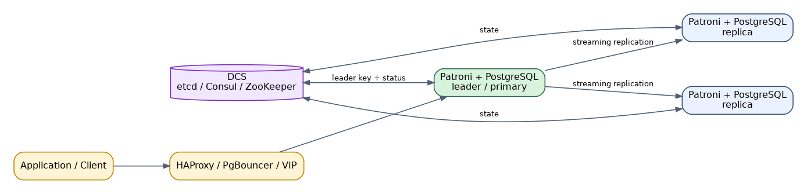

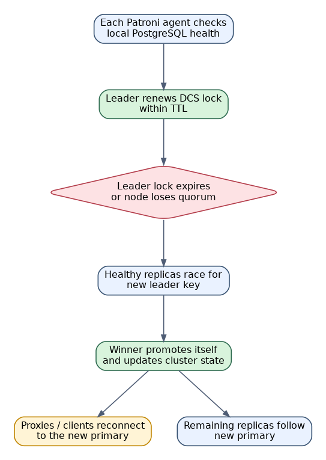

核心逻辑：

- Patroni 周期性检查本机 PostgreSQL 状态。
- 当前主库持有 DCS 中的 leader key，并按 TTL 续租。
- 主库故障或失去续租能力后，leader key 过期。
- 备库竞争 leader key，获胜节点执行 promote。
- 其他节点重新 follow 新主库。
- Patroni 可调用 `pg_rewind` 修复旧主库。
- 客户端通常通过 HAProxy、PgBouncer、VIP 或 Kubernetes Service 连接当前主库。

DCS 是防脑裂核心。只要 DCS 多数派不可被两个分区同时获得，Patroni 就能避免两个 PostgreSQL 同时成为主库。

### 4.2 etcd 集群准备

生产建议至少 3 个 etcd 节点：

```text
etcd1: 10.0.0.21:2379
etcd2: 10.0.0.22:2379
etcd3: 10.0.0.23:2379
```

etcd 需要满足：

- 节点数为奇数，通常 3 或 5。
- 网络延迟稳定。
- 独立磁盘，避免 fsync 延迟过高。
- 监控 leader、raft index、磁盘容量和请求延迟。

### 4.3 PostgreSQL 节点准备

示例：

```text
pg1: 10.0.0.11
pg2: 10.0.0.12
pg3: 10.0.0.13
cluster name: pg-ha
```

安装软件：

```bash
pip install patroni[etcd]
```

或使用发行版软件包安装 `patroni`、`postgresql`、`etcd-client`。

创建 PostgreSQL 操作系统用户和数据目录：

```bash
mkdir -p /data/postgresql
chown -R postgres:postgres /data/postgresql
```

### 4.4 Patroni 配置示例

`/etc/patroni/patroni.yml`：

```yaml
scope: pg-ha
namespace: /service/
name: pg1

restapi:
  listen: 10.0.0.11:8008
  connect_address: 10.0.0.11:8008

etcd3:
  hosts: 10.0.0.21:2379,10.0.0.22:2379,10.0.0.23:2379

bootstrap:
  dcs:
    ttl: 30
    loop_wait: 10
    retry_timeout: 10
    maximum_lag_on_failover: 1048576
    postgresql:
      use_pg_rewind: true
      use_slots: true
      parameters:
        wal_level: replica
        hot_standby: 'on'
        wal_keep_size: '2GB'
        max_wal_senders: 10
        max_replication_slots: 10
        synchronous_commit: 'on'
  initdb:
    - encoding: UTF8
    - data-checksums
  pg_hba:
    - host replication replicator 10.0.0.0/24 scram-sha-256
    - host all all 10.0.0.0/24 scram-sha-256
  users:
    admin:
      password: admin_password
      options:
        - createrole
        - createdb

postgresql:
  listen: 10.0.0.11:5432
  connect_address: 10.0.0.11:5432
  data_dir: /data/postgresql
  bin_dir: /usr/pgsql-14/bin
  authentication:
    superuser:
      username: postgres
      password: postgres_password
    replication:
      username: replicator
      password: replicator_password
  parameters:
    unix_socket_directories: '/var/run/postgresql'

tags:
  nofailover: false
  noloadbalance: false
  clonefrom: false
  nosync: false
```

其他节点修改：

- `name`
- `restapi.listen`
- `restapi.connect_address`
- `postgresql.listen`
- `postgresql.connect_address`

### 4.5 启动 Patroni

```bash
systemctl enable patroni
systemctl start patroni
```

查看集群：

```bash
patronictl -c /etc/patroni/patroni.yml list
```

手动切换：

```bash
patronictl -c /etc/patroni/patroni.yml switchover
```

故障转移：

```bash
patronictl -c /etc/patroni/patroni.yml failover
```

### 4.6 HAProxy 配置示例

HAProxy 通过 Patroni REST API 判断节点角色。

`/etc/haproxy/haproxy.cfg`：

```conf
global
    maxconn 4096

defaults
    mode tcp
    timeout connect 5s
    timeout client  60s
    timeout server  60s

listen postgres_primary
    bind *:5432
    option httpchk GET /primary
    http-check expect status 200
    server pg1 10.0.0.11:5432 check port 8008
    server pg2 10.0.0.12:5432 check port 8008
    server pg3 10.0.0.13:5432 check port 8008

listen postgres_replica
    bind *:5433
    option httpchk GET /replica
    http-check expect status 200
    server pg1 10.0.0.11:5432 check port 8008
    server pg2 10.0.0.12:5432 check port 8008
    server pg3 10.0.0.13:5432 check port 8008
```

应用写连接 `haproxy:5432`，读连接 `haproxy:5433`。

### 4.7 维护操作

查看状态：

```bash
patronictl -c /etc/patroni/patroni.yml list
curl http://10.0.0.11:8008/cluster
```

修改动态参数：

```bash
patronictl -c /etc/patroni/patroni.yml edit-config
```

重启某个节点：

```bash
patronictl -c /etc/patroni/patroni.yml restart pg-ha pg1
```

重建异常备库：

```bash
patronictl -c /etc/patroni/patroni.yml reinit pg-ha pg2
```

计划内主备切换：

```bash
patronictl -c /etc/patroni/patroni.yml switchover --master pg1 --candidate pg2
```

### 4.8 监控重点

- Patroni REST API 状态。
- etcd quorum、leader、磁盘和请求延迟。
- PostgreSQL replication lag。
- `maximum_lag_on_failover` 是否符合 RPO。
- HAProxy 后端健康状态。
- `pg_rewind` 是否可用，数据目录是否启用 checksums 或 `wal_log_hints`。

### 4.9 优点

- 自动 failover 成熟，社区使用广泛。
- 通过 DCS 提供较强脑裂防护。
- 支持 `pg_rewind`、复制槽、同步复制、动态配置。
- 能和 HAProxy、PgBouncer、Keepalived、Kubernetes 集成。
- 适合自建生产 PostgreSQL HA。

### 4.10 缺点

- 依赖 DCS，etcd/Consul 本身也要高可用。
- 配置项较多，对网络分区和超时参数敏感。
- 故障排查需要同时理解 PostgreSQL、Patroni、DCS 和代理层。
- 错误的同步复制配置可能导致写入阻塞。

---

<a id="5-repmgr-方案"></a>
## 📄 5. repmgr 方案

### 5.1 实现原理

repmgr 是 PostgreSQL 复制集群管理工具，基于原生流复制实现主备创建、注册、监控、switchover 和 failover。

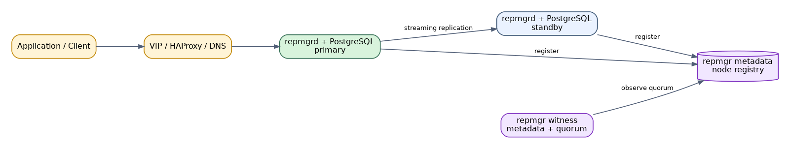

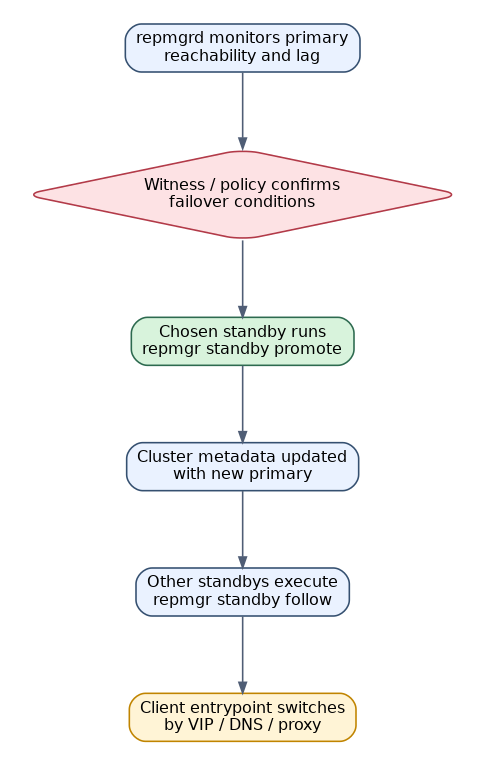

repmgr 使用自己的元数据表记录节点信息。`repmgrd` 进程监控主库可达性和复制状态，在满足条件时提升备库。

关键能力：

- `standby clone`：从主库克隆备库。
- `primary register` / `standby register`：注册节点。
- `standby switchover`：计划内切换。
- `standby promote`：提升备库。
- `repmgrd`：守护进程，执行自动 failover。
- witness server：仲裁节点，降低脑裂风险。

### 5.2 示例拓扑

```text
primary: 10.0.0.11 node_id=1
standby: 10.0.0.12 node_id=2
witness: 10.0.0.13 node_id=3
```

### 5.3 PostgreSQL 主库配置

创建用户和数据库：

```sql
CREATE USER repmgr WITH SUPERUSER LOGIN PASSWORD 'repmgr_password';
CREATE DATABASE repmgr OWNER repmgr;
```

`postgresql.conf`：

```conf
listen_addresses = '*'
wal_level = replica
max_wal_senders = 10
max_replication_slots = 10
wal_keep_size = '2GB'
hot_standby = on
shared_preload_libraries = 'repmgr'
```

`pg_hba.conf`：

```conf
host replication repmgr 10.0.0.0/24 scram-sha-256
host repmgr      repmgr 10.0.0.0/24 scram-sha-256
host all         repmgr 10.0.0.0/24 scram-sha-256
```

### 5.4 repmgr 主库配置

`/etc/repmgr/14/repmgr.conf`：

```conf
node_id=1
node_name='pg1'
conninfo='host=10.0.0.11 user=repmgr dbname=repmgr password=repmgr_password connect_timeout=2'
data_directory='/data/postgresql'

use_replication_slots=yes
failover=automatic
promote_command='repmgr standby promote -f /etc/repmgr/14/repmgr.conf --log-to-file'
follow_command='repmgr standby follow -f /etc/repmgr/14/repmgr.conf --upstream-node-id=%n --log-to-file'
monitoring_history=yes
log_level=INFO
log_file='/var/log/repmgr/repmgr.log'
```

注册主库：

```bash
repmgr -f /etc/repmgr/14/repmgr.conf primary register
repmgr -f /etc/repmgr/14/repmgr.conf cluster show
```

### 5.5 备库配置

在备库测试连接：

```bash
repmgr -h 10.0.0.11 -U repmgr -d repmgr -f /etc/repmgr/14/repmgr.conf standby clone --dry-run
```

执行克隆：

```bash
repmgr -h 10.0.0.11 -U repmgr -d repmgr -f /etc/repmgr/14/repmgr.conf standby clone
```

备库 `repmgr.conf`：

```conf
node_id=2
node_name='pg2'
conninfo='host=10.0.0.12 user=repmgr dbname=repmgr password=repmgr_password connect_timeout=2'
data_directory='/data/postgresql'

use_replication_slots=yes
failover=automatic
promote_command='repmgr standby promote -f /etc/repmgr/14/repmgr.conf --log-to-file'
follow_command='repmgr standby follow -f /etc/repmgr/14/repmgr.conf --upstream-node-id=%n --log-to-file'
monitoring_history=yes
log_file='/var/log/repmgr/repmgr.log'
```

启动备库并注册：

```bash
pg_ctl start -D /data/postgresql
repmgr -f /etc/repmgr/14/repmgr.conf standby register
```

### 5.6 witness 配置

witness 不保存业务数据，只参与仲裁。创建 repmgr 数据库并注册：

```bash
repmgr -f /etc/repmgr/14/repmgr.conf witness register -h 10.0.0.11
```

witness 可减少双节点集群网络分区时的误切换风险。

### 5.7 启动 repmgrd

```bash
systemctl enable repmgr14
systemctl start repmgr14
```

查看集群：

```bash
repmgr -f /etc/repmgr/14/repmgr.conf cluster show
repmgr -f /etc/repmgr/14/repmgr.conf service status
```

### 5.8 运维操作

计划内切换：

```bash
repmgr -f /etc/repmgr/14/repmgr.conf standby switchover --siblings-follow
```

手动提升备库：

```bash
repmgr -f /etc/repmgr/14/repmgr.conf standby promote
```

让其他备库 follow 新主：

```bash
repmgr -f /etc/repmgr/14/repmgr.conf standby follow --upstream-node-id=2
```

检查事件：

```sql
SELECT * FROM repmgr.events ORDER BY event_timestamp DESC LIMIT 20;
```

### 5.9 优点

- 比 Patroni 轻量，贴近 PostgreSQL 原生复制。
- 提供 clone、register、switchover、failover 等常用运维命令。
- 适合中小规模主备集群。
- 学习成本低于 Pacemaker。

### 5.10 缺点

- 防脑裂能力依赖 witness、网络设计和脚本策略。
- 自动 failover 严谨性通常弱于 Patroni + DCS。
- 客户端连接切换仍需 VIP、HAProxy、DNS 或应用层支持。
- 复杂异常场景下需要人工判断旧主处理方式。

---

<a id="6-pacemaker--corosync-方案"></a>
## 📄 6. Pacemaker + Corosync 方案

### 6.1 实现原理

Pacemaker 是通用 Linux HA 资源管理器，Corosync 提供集群通信和成员关系。PostgreSQL 被抽象为一个集群资源，VIP、文件系统、主备角色也可以由 Pacemaker 统一管理。

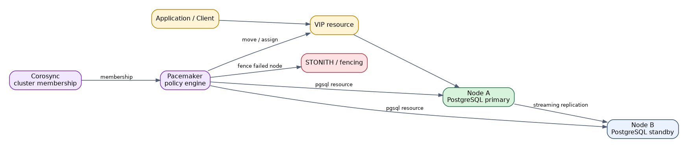

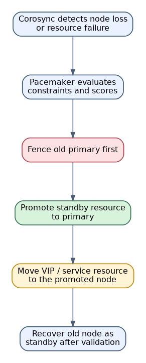

常见资源：

- PostgreSQL master/slave 资源。
- VIP 资源。
- fence / STONITH 资源。
- 可选共享存储、文件系统资源。

Pacemaker 的关键不是复制本身，而是资源编排和仲裁。PostgreSQL 复制仍基于流复制。

### 6.2 适用场景

- 企业已有 Pacemaker/Corosync 运维体系。
- 需要同时管理 VIP、数据库服务、共享存储、挂载点。
- 需要强制 fencing 防止脑裂。
- 团队能承担较高配置和排障复杂度。

### 6.3 基础配置步骤

安装组件：

```bash
yum install -y pacemaker corosync pcs resource-agents
```

设置 `hacluster` 密码，并启动 pcsd：

```bash
passwd hacluster
systemctl enable --now pcsd
```

节点认证：

```bash
pcs host auth pg1 pg2 -u hacluster
```

创建集群：

```bash
pcs cluster setup pgcluster pg1 pg2
pcs cluster start --all
pcs cluster enable --all
```

启用 STONITH，生产不建议关闭。测试环境可临时关闭：

```bash
pcs property set stonith-enabled=false
```

生产应配置 fence 设备，例如 IPMI、云厂商 fence agent 或电源控制设备。

### 6.4 PostgreSQL 复制配置

先按原生流复制搭建 primary/standby，确认复制正常。Pacemaker 不应在复制未验证时接管资源。

主库配置示例：

```conf
wal_level = replica
max_wal_senders = 10
max_replication_slots = 10
hot_standby = on
wal_keep_size = '2GB'
```

### 6.5 Pacemaker 资源配置示例

不同发行版的 PostgreSQL OCF agent 参数可能不同，部署时以本机 `pcs resource describe` 为准。

查看资源代理：

```bash
pcs resource describe ocf:heartbeat:pgsql
```

创建 PostgreSQL promotable 资源示例：

```bash
pcs resource create pgsql ocf:heartbeat:pgsql \
  pgctl='/usr/pgsql-14/bin/pg_ctl' \
  psql='/usr/pgsql-14/bin/psql' \
  pgdata='/data/postgresql' \
  config='/data/postgresql/postgresql.conf' \
  rep_mode='sync' \
  node_list='pg1 pg2' \
  master_ip='10.0.0.100' \
  repuser='replicator' \
  primary_conninfo_opt='password=replicator_password' \
  op start timeout=60s \
  op stop timeout=60s \
  op monitor interval=10s timeout=30s
```

创建可提升资源：

```bash
pcs resource promotable pgsql promoted-max=1 promoted-node-max=1 clone-max=2 clone-node-max=1 notify=true
```

创建 VIP：

```bash
pcs resource create vip ocf:heartbeat:IPaddr2 ip=10.0.0.100 cidr_netmask=24 op monitor interval=10s
```

约束 VIP 跟随主库：

```bash
pcs constraint colocation add vip with master pgsql-clone INFINITY
pcs constraint order promote pgsql-clone then start vip
```

### 6.6 维护操作

查看状态：

```bash
pcs status
crm_mon -1
```

迁移资源：

```bash
pcs resource move pgsql-clone pg2
```

清理失败状态：

```bash
pcs resource cleanup pgsql
```

维护模式：

```bash
pcs property set maintenance-mode=true
pcs property set maintenance-mode=false
```

### 6.7 优点

- 通用 HA 编排能力强。
- 可以统一管理 PostgreSQL、VIP、文件系统、共享存储、fencing。
- 配合 STONITH 时脑裂防护能力强。
- 适合传统企业基础设施。

### 6.8 缺点

- 配置和排障复杂。
- PostgreSQL 专用体验不如 Patroni。
- 不同发行版 OCF agent 差异明显。
- 没有成熟 fencing 时不建议用于生产自动 failover。
- 误配置约束可能导致资源无法启动或错误迁移。

---

<a id="7-pgpool-ii-方案"></a>
## 📄 7. pgpool-II 方案

### 7.1 实现原理

pgpool-II 位于应用和 PostgreSQL 之间，提供连接池、读写分离、健康检查、故障检测和 failover 脚本执行。

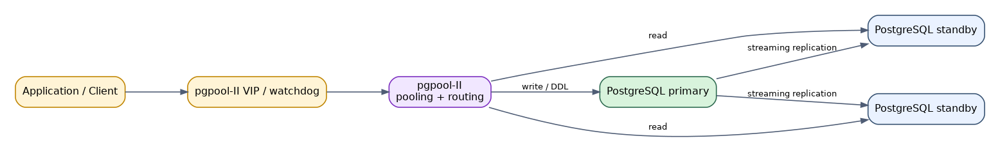

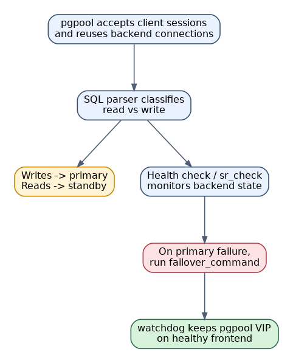

pgpool-II 本身不替代 PostgreSQL 复制。它依赖底层流复制，同时通过 SQL 解析将读请求路由到备库，将写请求路由到主库。

主要能力：

- connection pooling。
- load balancing。
- streaming replication health check。
- failover command。
- online recovery。
- watchdog，多个 pgpool-II 节点之间提供 VIP 和仲裁。

### 7.2 PostgreSQL 后端准备

先搭建原生流复制，确认主备状态正常。创建 pgpool 管理用户：

```sql
CREATE ROLE pgpool WITH LOGIN PASSWORD 'pgpool_password';
CREATE ROLE health_check WITH LOGIN PASSWORD 'health_password';
```

根据需要授予监控权限：

```sql
GRANT pg_monitor TO health_check;
```

### 7.3 pgpool-II 配置示例

`pgpool.conf`：

```conf
listen_addresses = '*'
port = 9999
pcp_listen_addresses = '*'
pcp_port = 9898

backend_hostname0 = '10.0.0.11'
backend_port0 = 5432
backend_weight0 = 0
backend_data_directory0 = '/data/postgresql'
backend_flag0 = 'ALLOW_TO_FAILOVER'

backend_hostname1 = '10.0.0.12'
backend_port1 = 5432
backend_weight1 = 1
backend_data_directory1 = '/data/postgresql'
backend_flag1 = 'ALLOW_TO_FAILOVER'

sr_check_period = 10
sr_check_user = 'pgpool'
sr_check_password = 'pgpool_password'
sr_check_database = 'postgres'

health_check_period = 10
health_check_timeout = 20
health_check_user = 'health_check'
health_check_password = 'health_password'
health_check_database = 'postgres'

load_balance_mode = on
master_slave_mode = on
master_slave_sub_mode = 'stream'

failover_command = '/etc/pgpool-II/failover.sh %d %h %p %D %m %H %M %P %r %R'
follow_primary_command = '/etc/pgpool-II/follow_primary.sh %d %h %p %D %m %H %M %P %r %R'
```

### 7.4 failover 脚本示例

`/etc/pgpool-II/failover.sh`：

```bash
#!/bin/bash
FAILED_NODE_ID="$1"
FAILED_HOST="$2"
NEW_PRIMARY_HOST="$6"
OLD_PRIMARY_NODE_ID="$8"

if [ "$FAILED_NODE_ID" = "$OLD_PRIMARY_NODE_ID" ]; then
    ssh postgres@"$NEW_PRIMARY_HOST" "/usr/pgsql-14/bin/pg_ctl promote -D /data/postgresql"
fi

exit 0
```

生产脚本必须增强以下检查：

- 确认旧主确实不可写或已隔离。
- 确认候选备库复制延迟可接受。
- 记录日志并告警。
- 处理 SSH 失败和 promote 超时。
- 防止多个 pgpool-II 同时执行冲突操作。

### 7.5 watchdog 和 VIP

多 pgpool-II 节点建议启用 watchdog：

```conf
use_watchdog = on
delegate_IP = '10.0.0.100'
wd_hostname = '10.0.0.31'
wd_port = 9000

other_pgpool_hostname0 = '10.0.0.32'
other_pgpool_port0 = 9999
other_wd_port0 = 9000

enable_consensus_with_half_votes = off
```

watchdog 提供：

- pgpool-II 节点间心跳。
- VIP 漂移。
- 仲裁和 split-brain 缓解。

### 7.6 维护操作

查看后端节点：

```bash
pcp_node_info -h 127.0.0.1 -p 9898 -U pgpool 0
pcp_node_info -h 127.0.0.1 -p 9898 -U pgpool 1
```

挂起节点：

```bash
pcp_detach_node -h 127.0.0.1 -p 9898 -U pgpool -n 1
```

重新挂载节点：

```bash
pcp_attach_node -h 127.0.0.1 -p 9898 -U pgpool -n 1
```

查看 SQL 路由：

```sql
SHOW pool_nodes;
```

### 7.7 优点

- 同时提供连接池、读写分离、负载均衡。
- 对应用入口透明，应用只连接 pgpool-II。
- watchdog 可提供 pgpool-II 自身 HA 和 VIP。
- 对读多写少场景有价值。

### 7.8 缺点

- SQL 路由复杂，存在误判或语义差异风险。
- failover 依赖脚本质量。
- 不是最强的 PostgreSQL HA 管理器。
- pgpool-II 自身成为关键组件，需要高可用。
- 复杂事务、临时表、函数副作用、会话状态可能影响读写分离正确性。

---

<a id="8-keepalived--vip--流复制方案"></a>
## 📄 8. Keepalived + VIP + 流复制方案

### 8.1 实现原理

Keepalived 使用 VRRP 在多台服务器之间漂移 VIP。应用连接 VIP，VIP 当前所在节点对外提供 PostgreSQL 服务。

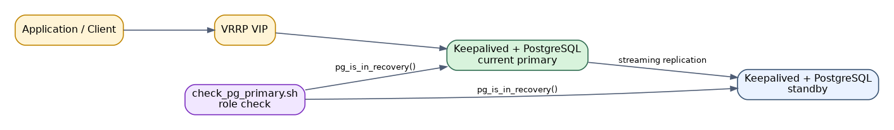

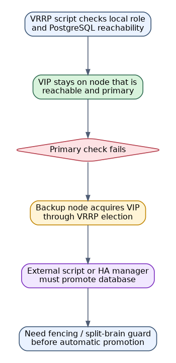

Keepalived 只负责 VIP 漂移，不理解 PostgreSQL 主备语义。要实现完整 HA，必须通过脚本检查数据库角色、复制状态，并在切换时执行 promote 或与其他 HA 管理器配合。

### 8.2 推荐用法

较安全的做法：

```text
Patroni/repmgr 负责 PostgreSQL 主备切换
Keepalived 只负责 VIP 指向当前主库
```

不推荐只靠 Keepalived 脚本完成复杂 failover，除非脚本经过充分演练并包含 fencing。

### 8.3 Keepalived 配置示例

主节点 `/etc/keepalived/keepalived.conf`：

```conf
vrrp_script chk_pg_primary {
    script "/etc/keepalived/check_pg_primary.sh"
    interval 3
    timeout 2
    fall 3
    rise 2
}

vrrp_instance VI_PG {
    state MASTER
    interface eth0
    virtual_router_id 51
    priority 100
    advert_int 1
    authentication {
        auth_type PASS
        auth_pass pg_vip_pass
    }
    virtual_ipaddress {
        10.0.0.100/24
    }
    track_script {
        chk_pg_primary
    }
}
```

备节点配置修改：

```conf
state BACKUP
priority 90
```

### 8.4 PostgreSQL 主库检查脚本

`/etc/keepalived/check_pg_primary.sh`：

```bash
#!/bin/bash
PGHOST=127.0.0.1
PGPORT=5432
PGUSER=postgres

IS_IN_RECOVERY=$(psql -h "$PGHOST" -p "$PGPORT" -U "$PGUSER" -Atc "SELECT pg_is_in_recovery()" postgres 2>/dev/null)

if [ "$IS_IN_RECOVERY" = "f" ]; then
    exit 0
fi

exit 1
```

此脚本只允许 VIP 落在当前主库。它不会自动 promote 备库。

### 8.5 自动 promote 脚本风险

如果在 Keepalived 的 `notify_master` 中执行 promote，必须处理：

- 旧主是否被隔离。
- 网络分区是否导致两边都认为对方故障。
- 备库 WAL 是否追平。
- promote 后其他备库如何 follow。
- 旧主恢复后如何 rewind 或重建。

缺少这些约束时，Keepalived 自动 promote 容易造成脑裂。

### 8.6 维护操作

查看 VIP：

```bash
ip addr show eth0
```

查看 Keepalived 状态：

```bash
systemctl status keepalived
journalctl -u keepalived -f
```

模拟主库降级：

```bash
pg_ctl stop -D /data/postgresql
```

验证 VIP 是否从旧主移除，并在新主 promote 后漂移到新主。

### 8.7 优点

- 简单，VIP 对应用透明。
- 可与 Patroni、repmgr、Pacemaker 配合。
- 适合传统网络环境。
- 部署和理解成本低。

### 8.8 缺点

- Keepalived 本身不理解 PostgreSQL 复制状态。
- 单独使用时脑裂风险较高。
- failover 脚本复杂且容易遗漏异常场景。
- 不负责旧主回归、备库重建、复制槽维护。

---

<a id="9-原生-logical-replication-方案"></a>
## 📄 9. 原生 Logical Replication 方案

### 9.1 实现原理

逻辑复制基于发布/订阅模型。发布端解码 WAL 中的逻辑变更，将行级 INSERT、UPDATE、DELETE 发送给订阅端。订阅端 apply worker 执行这些变更。

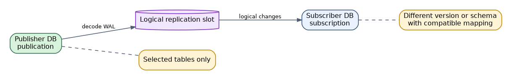

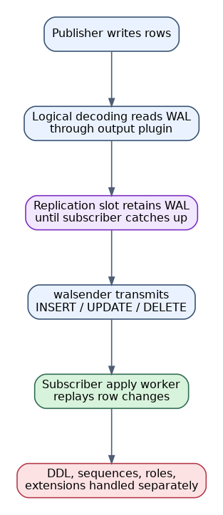

逻辑复制复制的是表数据变更，不是整个数据库实例的物理状态。因此它常用于：

- 跨大版本升级。
- 部分表同步。
- 数据汇聚或分发。
- 在线迁移。
- 异构环境同步。

它不是标准主备 HA 的首选，因为 DDL、序列、权限、扩展、全局对象等需要额外管理。

### 9.2 发布端配置

`postgresql.conf`：

```conf
wal_level = logical
max_replication_slots = 10
max_wal_senders = 10
```

`pg_hba.conf`：

```conf
host all repl_user 10.0.0.0/24 scram-sha-256
```

创建复制用户：

```sql
CREATE ROLE repl_user WITH LOGIN REPLICATION PASSWORD 'repl_password';
GRANT CONNECT ON DATABASE appdb TO repl_user;
GRANT USAGE ON SCHEMA public TO repl_user;
GRANT SELECT ON ALL TABLES IN SCHEMA public TO repl_user;
ALTER DEFAULT PRIVILEGES IN SCHEMA public GRANT SELECT ON TABLES TO repl_user;
```

设置副本标识。没有主键的表需要特别处理：

```sql
ALTER TABLE public.t1 REPLICA IDENTITY FULL;
```

创建 publication：

```sql
CREATE PUBLICATION app_pub FOR TABLE public.t1, public.t2;
```

或发布所有表：

```sql
CREATE PUBLICATION app_pub FOR ALL TABLES;
```

### 9.3 订阅端配置

订阅端先创建数据库、schema、表结构。逻辑复制不会自动复制 DDL。

```sql
CREATE SUBSCRIPTION app_sub
CONNECTION 'host=10.0.0.11 port=5432 dbname=appdb user=repl_user password=repl_password'
PUBLICATION app_pub
WITH (copy_data = true, create_slot = true, enabled = true);
```

查看状态：

```sql
SELECT * FROM pg_stat_subscription;
SELECT * FROM pg_subscription;
```

### 9.4 维护操作

增加发布表：

```sql
ALTER PUBLICATION app_pub ADD TABLE public.t3;
```

刷新订阅：

```sql
ALTER SUBSCRIPTION app_sub REFRESH PUBLICATION;
```

暂停订阅：

```sql
ALTER SUBSCRIPTION app_sub DISABLE;
```

恢复订阅：

```sql
ALTER SUBSCRIPTION app_sub ENABLE;
```

删除订阅：

```sql
DROP SUBSCRIPTION app_sub;
```

检查复制槽：

```sql
SELECT slot_name, plugin, slot_type, active, restart_lsn, confirmed_flush_lsn
FROM pg_replication_slots;
```

### 9.5 作为 HA 使用时的注意事项

如果尝试将订阅端作为故障切换目标，需要提前处理：

- DDL 变更同步。
- 序列值同步，例如 `setval()`。
- 用户、角色、权限、扩展同步。
- 触发器、函数、视图、物化视图同步。
- 未复制表和无主键表的更新删除行为。
- 应用写入切换后，旧发布端如何处理。

### 9.6 优点

- 支持跨 PostgreSQL 大版本复制。
- 可选择部分表复制。
- 适合在线迁移和数据分发。
- 对表结构兼容性要求低于物理复制。

### 9.7 缺点

- 不自动复制 DDL 和全局对象。
- 不适合作为完整数据库 HA 的唯一方案。
- 冲突处理能力有限。
- apply 延迟和复制槽 WAL 堆积需要监控。
- 序列同步容易被忽略。

---

<a id="10-bdr--pglogical--双向复制方案"></a>
## 📄 10. BDR / pglogical / 双向复制方案

### 10.1 实现原理

BDR、pglogical 等方案基于逻辑复制扩展，实现更复杂的复制拓扑，例如双向复制、多主复制、选择性复制和冲突处理。

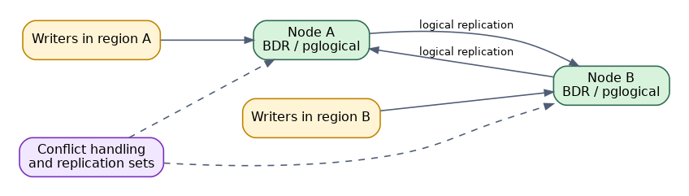

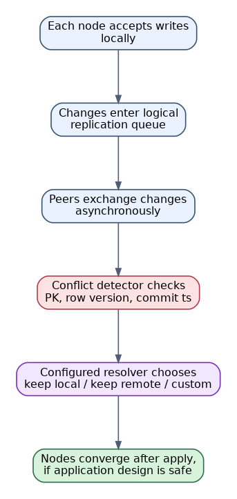

这类方案与传统主备最大的区别是：多个节点可能同时接受写入。为了保证可用性，系统必须处理写写冲突。

常见冲突包括：

- 两个节点插入相同主键。
- 两个节点更新同一行不同字段。
- 一个节点删除行，另一个节点更新同一行。
- 序列生成值冲突。
- DDL 顺序不一致。

### 10.2 典型配置思路

以 pglogical 类方案为例，配置通常包括：

发布端和订阅端均启用：

```conf
wal_level = logical
shared_preload_libraries = 'pglogical'
max_worker_processes = 20
max_replication_slots = 20
max_wal_senders = 20
track_commit_timestamp = on
```

创建扩展：

```sql
CREATE EXTENSION pglogical;
```

创建节点：

```sql
SELECT pglogical.create_node(
    node_name := 'node1',
    dsn := 'host=10.0.0.11 port=5432 dbname=appdb user=repl_user password=repl_password'
);
```

创建复制集：

```sql
SELECT pglogical.replication_set_add_all_tables('default', ARRAY['public']);
```

创建订阅：

```sql
SELECT pglogical.create_subscription(
    subscription_name := 'sub_node2',
    provider_dsn := 'host=10.0.0.12 port=5432 dbname=appdb user=repl_user password=repl_password'
);
```

实际 BDR 或 pglogical 配置会因版本和产品而异，应以对应产品文档为准。

### 10.3 应用设计要求

多主复制不应只靠数据库层兜底，应用需要配合：

- 避免多个地域同时写同一业务实体。
- 主键使用全局唯一 ID，例如 UUID、Snowflake、分段序列。
- 设计幂等写入。
- 明确冲突解决策略。
- 避免跨节点强一致事务假设。
- DDL 变更统一发布，不允许各节点随意修改结构。

### 10.4 维护操作

- 监控每个节点的复制槽、apply 延迟和冲突日志。
- 定期校验节点间数据一致性。
- 管理序列分段或全局 ID 生成器。
- DDL 必须走统一变更流程。
- 故障节点恢复后，需要确认复制来源和冲突处理结果。

### 10.5 优点

- 支持多地域写入或近似多活。
- 可提高局部故障下的写可用性。
- 支持复杂拓扑和选择性复制。
- 适合 SaaS 多租户、地域隔离写入等特殊场景。

### 10.6 缺点

- 冲突处理复杂，应用必须配合设计。
- 运维难度高于单主主备。
- 不适合强一致跨节点事务场景。
- DDL、序列、唯一约束冲突是长期维护成本。
- 产品版本和商业支持差异较大。

---

<a id="11-kubernetes-operator-方案"></a>
## 📄 11. Kubernetes Operator 方案

### 11.1 实现原理

PostgreSQL Operator 使用 Kubernetes CRD 描述数据库集群，Operator 控制器持续 reconcile 实际状态，使其符合声明式配置。

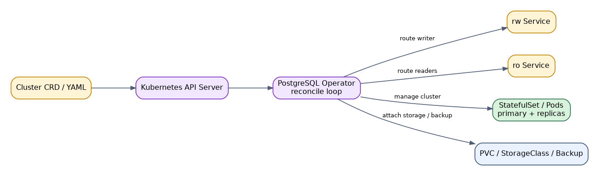

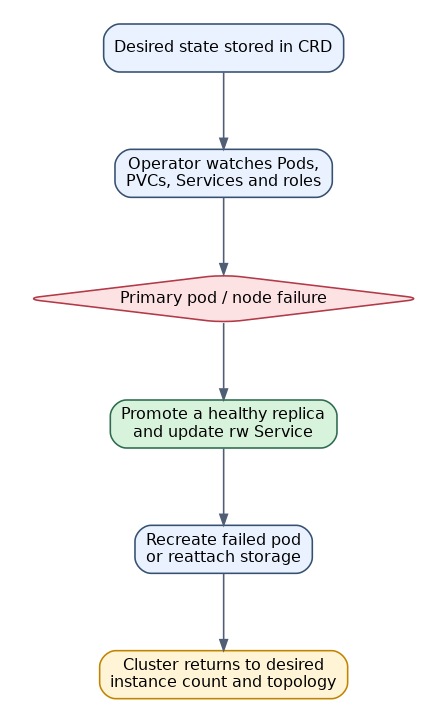

常见 Operator：

- CloudNativePG。
- Zalando Postgres Operator。
- Crunchy Postgres Operator。
- StackGres。

Operator 通常负责：

- 初始化 PostgreSQL 集群。
- 创建主备和复制用户。
- 自动 failover。
- Service 路由主库和只读副本。
- 备份恢复。
- 滚动升级。
- TLS、Secret、监控集成。

### 11.2 示例配置

以下示例采用通用表达，具体字段以所选 Operator 文档为准。CloudNativePG 风格示例：

```yaml
apiVersion: postgresql.cnpg.io/v1
kind: Cluster
metadata:
  name: pg-ha
spec:
  instances: 3

  imageName: ghcr.io/cloudnative-pg/postgresql:14

  storage:
    size: 200Gi
    storageClass: fast-ssd

  postgresql:
    parameters:
      max_connections: "300"
      shared_buffers: "4GB"
      wal_level: "replica"
      max_wal_senders: "10"
      max_replication_slots: "10"

  monitoring:
    enablePodMonitor: true

  backup:
    barmanObjectStore:
      destinationPath: s3://pg-backup/pg-ha
      s3Credentials:
        accessKeyId:
          name: s3-creds
          key: ACCESS_KEY_ID
        secretAccessKey:
          name: s3-creds
          key: ACCESS_SECRET_KEY
      wal:
        compression: gzip
```

创建集群：

```bash
kubectl apply -f pg-ha.yaml
```

查看状态：

```bash
kubectl get cluster pg-ha
kubectl get pods -l cnpg.io/cluster=pg-ha
kubectl get svc
```

### 11.3 服务访问

Operator 通常创建多个 Service：

```text
pg-ha-rw  -> 当前主库
pg-ha-ro  -> 只读副本
pg-ha-r   -> 任意实例
```

应用写连接 `pg-ha-rw`，读连接 `pg-ha-ro`。

### 11.4 维护操作

滚动重启：

```bash
kubectl rollout restart statefulset/pg-ha
```

查看事件：

```bash
kubectl describe cluster pg-ha
kubectl get events --sort-by=.lastTimestamp
```

进入 Pod 查询数据库：

```bash
kubectl exec -it pg-ha-1 -- psql -U postgres
```

备份恢复操作通常由 Operator 提供 CRD 或插件命令完成。

### 11.5 关键设计点

- 存储类必须可靠，数据库性能高度依赖 PVC 后端。
- PostgreSQL Pod 不应频繁被驱逐。
- 需要配置 PodDisruptionBudget。
- 需要合理设置资源 request/limit，避免 OOM kill。
- 节点故障、PVC attach/detach 时间会影响 RTO。
- Kubernetes 控制面自身必须高可用。

### 11.6 优点

- 声明式管理，自动化程度高。
- 与 Kubernetes Service、Secret、PVC、监控体系集成好。
- 易于标准化多套环境。
- Operator 通常内置 failover 和备份能力。

### 11.7 缺点

- 依赖 Kubernetes 和存储系统质量。
- 排障链路更长，涉及 Pod、PVC、CNI、CSI、Operator、PostgreSQL。
- 对高 IO 数据库负载，需要谨慎评估容器化收益。
- 不同 Operator 行为差异明显，迁移成本较高。

---

<a id="12-云厂商托管-postgresql-ha"></a>
## 📄 12. 云厂商托管 PostgreSQL HA

### 12.1 实现原理

云厂商托管 PostgreSQL 通常由控制面管理主备实例、存储、备份、监控和故障切换。用户只看到一个数据库实例或集群 endpoint。

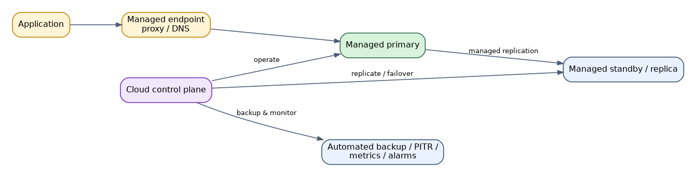

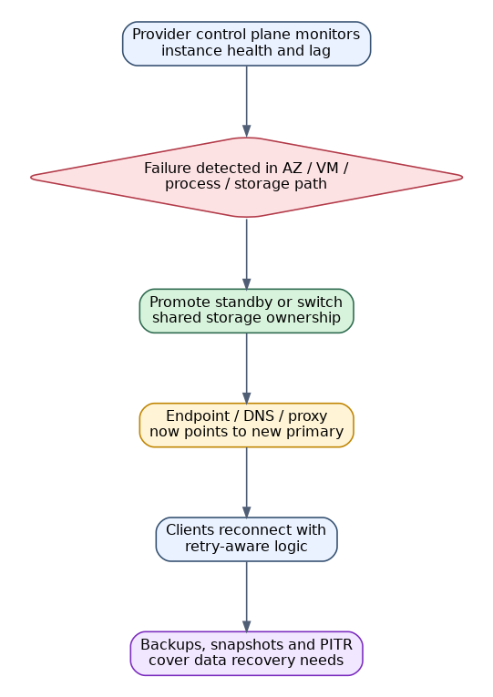

常见产品：

- AWS RDS for PostgreSQL / Aurora PostgreSQL。
- Google Cloud SQL for PostgreSQL / AlloyDB。
- Azure Database for PostgreSQL。
- 阿里云 RDS PostgreSQL / PolarDB PostgreSQL。
- 腾讯云、华为云等 RDS PostgreSQL。

### 12.2 配置步骤

通用配置流程：

1. 创建 PostgreSQL 实例或集群。
2. 开启多可用区或高可用部署。
3. 选择规格、存储类型、存储容量和 IOPS。
4. 配置 VPC、安全组、白名单或私网访问。
5. 配置参数组，例如连接数、日志、扩展、时区。
6. 开启自动备份和 PITR。
7. 创建只读实例或 reader endpoint。
8. 配置监控告警。
9. 执行 failover 演练，确认应用重连行为。

### 12.3 应用连接建议

- 使用云厂商提供的 writer endpoint，而不是固定连接某台实例 IP。
- 配置连接池超时和重试。
- 避免 DNS 缓存时间过长。
- 应用事务必须能处理连接断开和重试。
- 读写分离应使用 reader endpoint 或明确的只读实例 endpoint。

### 12.4 维护操作

- 定期检查备份可恢复性，不只检查备份任务成功。
- 关注维护窗口和小版本升级计划。
- 监控连接数、CPU、IOPS、存储容量、复制延迟。
- 定期演练主备切换。
- 检查参数组变更是否需要重启。
- 评估扩容对业务的影响。

### 12.5 优点

- 运维成本低。
- 自动备份、监控、故障切换能力完整。
- 与云网络、安全、审计、密钥管理集成。
- 适合多数业务系统。

### 12.6 缺点

- 成本高于自建。
- 可控性有限，部分参数、扩展、文件系统访问受限。
- 受云厂商实现和 SLA 约束。
- 跨云迁移成本较高。
- 深度排障能力弱于自建。

---

<a id="13-通用维护清单"></a>
## 🛡️ 13. 通用维护清单

无论采用哪种 HA 方案，都建议建立统一维护清单。

### 13.1 监控指标

PostgreSQL 指标：

- `pg_is_in_recovery()`。
- `pg_stat_replication` 复制状态。
- `pg_stat_wal_receiver` 接收状态。
- `pg_replication_slots` 中 inactive slot 和 WAL 保留量。
- 主备 LSN 差距。
- `now() - pg_last_xact_replay_timestamp()`。
- checkpoint、WAL 生成速率、归档失败次数。
- 连接数、锁等待、长事务、autovacuum 状态。

系统指标：

- CPU、内存、磁盘 IO、网络延迟。
- `pg_wal` 所在磁盘容量。
- 归档目录或对象存储容量。
- 时间同步状态。

HA 组件指标：

- Patroni REST API、DCS quorum。
- repmgrd 状态和事件表。
- Pacemaker resource 状态和 fencing 状态。
- pgpool-II 后端状态和 watchdog 状态。
- Keepalived VIP 所在节点。
- Kubernetes Pod、PVC、Operator reconcile 状态。

### 13.2 备份策略

HA 不能替代备份。建议同时具备：

- 周期性全量备份。
- 连续 WAL 归档。
- PITR 恢复能力。
- 备份加密和异地保存。
- 定期恢复演练。
- 备份保留策略和容量告警。

### 13.3 变更管理

- 数据库参数变更必须记录是否需要 reload 或 restart。
- 主备切换前确认复制延迟。
- 升级前确认备份可恢复。
- DDL 大变更前确认复制影响。
- 扩容、缩容、换盘、迁移前准备回退方案。

### 13.4 旧主回归原则

发生 failover 后，旧主恢复时必须遵循：

1. 不允许旧主直接以主库身份对外服务。
2. 确认旧主是否接受过未复制到新主的写入。
3. 优先使用 `pg_rewind` 回到新主时间线。
4. 不满足 rewind 条件时，重新做 `pg_basebackup`。
5. 确认复制正常后再加入负载均衡或只读池。

---

<a id="14-故障演练清单"></a>
## 🛡️ 14. 故障演练清单

### 14.1 主库进程故障

操作：

```bash
pg_ctl stop -D /data/postgresql -m immediate
```

验证：

- HA 组件是否检测到主库故障。
- 备库是否 promote。
- VIP、HAProxy、Service 是否切换。
- 应用是否自动重连。
- RTO 是否符合预期。

### 14.2 主库服务器宕机

操作：关闭主库服务器或隔离网络。

验证：

- 是否发生自动 failover。
- 是否有脑裂风险。
- 旧主恢复后是否被阻止对外服务。
- `pg_rewind` 或重建流程是否可执行。

### 14.3 网络分区

操作：阻断主库与备库、主库与 DCS、应用与主库之间的部分网络。

验证：

- DCS 或 witness 是否正确仲裁。
- 是否出现双主。
- 客户端连接是否稳定切换。
- HA 组件日志是否清晰。

### 14.4 复制延迟过大

操作：在备库制造 replay 延迟或主库执行大量写入。

验证：

- 监控是否告警。
- 自动 failover 是否受 `maximum_lag_on_failover` 等阈值保护。
- RPO 是否符合业务预期。

### 14.5 WAL 磁盘打满

操作：停掉备库或订阅端，使复制槽保留 WAL。

验证：

- 主库磁盘容量是否告警。
- 复制槽清理 Runbook 是否可执行。
- 是否有 `max_slot_wal_keep_size` 等保护参数。

---

<a id="15-总结"></a>
## ✅ 15. 总结

PostgreSQL 常用 HA 方案的核心差异不在于是否复制数据，而在于谁来完成故障判断、主库仲裁、客户端切换和旧主回归。

实践建议：

- 单纯学习或小规模环境：使用原生 Streaming Replication。
- 自建生产环境：优先选择 Patroni + etcd/Consul + HAProxy/PgBouncer。
- 轻量主备管理：可以选择 repmgr，但要配置 witness 和清晰 Runbook。
- 传统企业资源编排：可以选择 Pacemaker + Corosync，但必须重视 fencing。
- 连接池和读写分离：pgpool-II 有价值，但不建议只依赖它完成核心 HA。
- VIP 漂移：Keepalived 适合作为入口层，不适合单独承担数据库 failover 逻辑。
- 跨版本迁移或部分表复制：选择 Logical Replication。
- 多地域多写：BDR/pglogical 类方案只适合能处理冲突的业务。
- Kubernetes 环境：选择成熟 Operator，并重点评估存储和控制面稳定性。
- 云上业务：托管 PostgreSQL HA 通常是运维成本最低的选择。

任何 HA 方案都不能替代备份。生产系统至少应同时具备高可用、备份恢复、监控告警、故障演练和变更管理五个能力。
