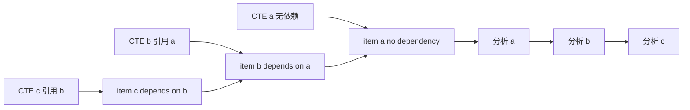
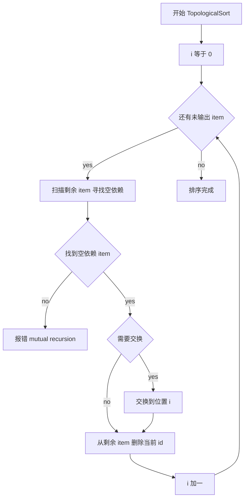
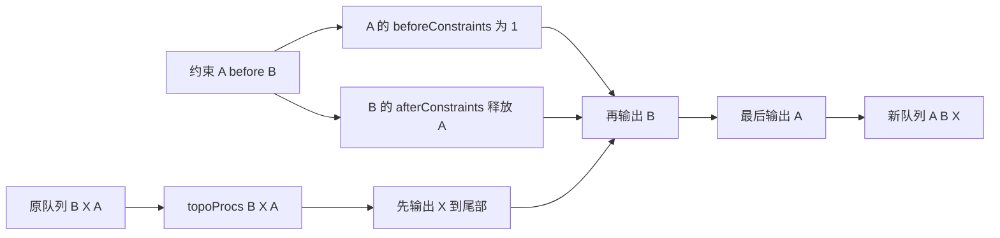
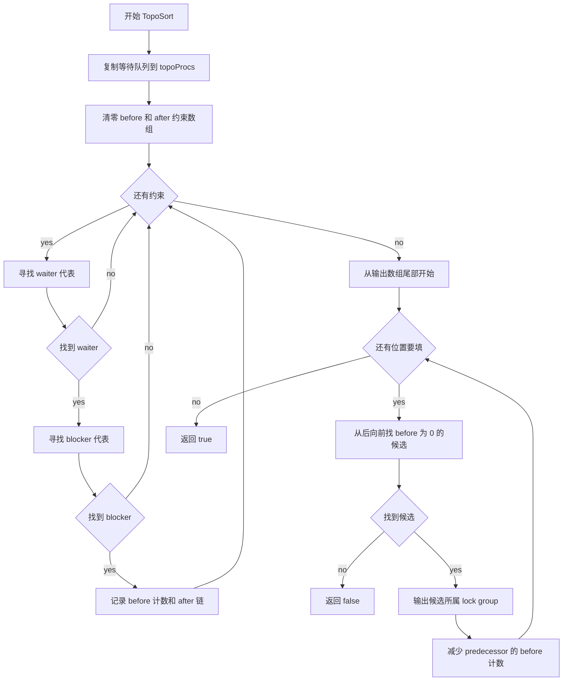
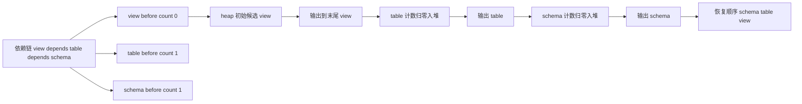
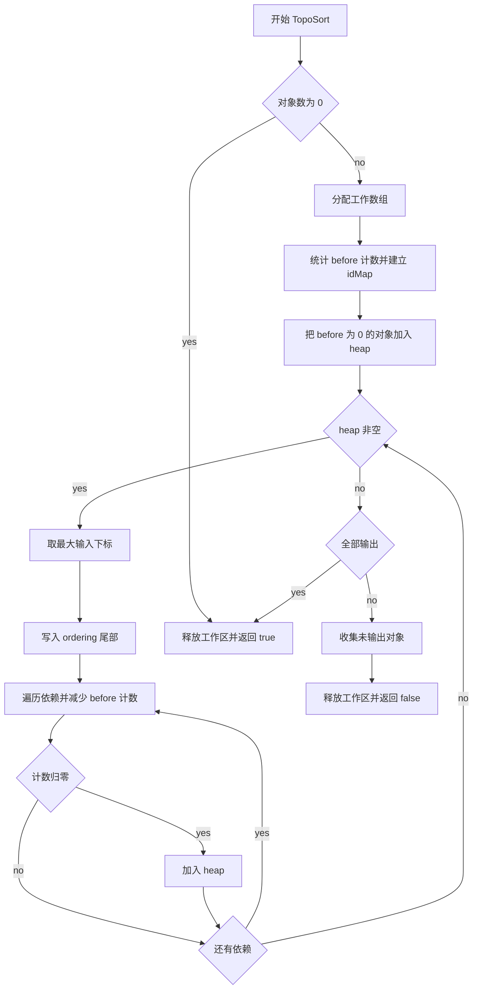

# 🔀 PostgreSQL 中 TopoSort 与 TopologicalSort 实现原理解析

> 📌 文档类型：算法分析 / 源码对比
> 👥 适用对象：源码阅读者、算法实现对比分享场景、工具链维护者。
> 🧭 阅读方式：建议先看三类实现的共同抽象，再逐个进入 `parse_cte.c`、`deadlock.c`、`pg_dump_sort.c`。

## 🧭 快速导航

- 🎯 1. 文章目标
- 📄 2. 拓扑排序在 PostgreSQL 中的共同抽象
- ⚙️ 3. 拓扑排序的常规实现
- 🌟 4. PostgreSQL 中拓扑排序的详细实现总览
- 📄 5. `parse_cte.c::TopologicalSort`：为 `WITH RECURSIVE` 找安全分析顺序
- 📄 6. `deadlock.c::TopoSort`：为死锁解除生成最小扰动的等待队列
- 📄 7. `pg_dump_sort.c::TopoSort`：面向全局 dump 对象的堆优化拓扑排序
- ⚖️ 8. 三个实现的关键差异
- 🗺️ 9. 逻辑图与流程图
- 📚 10. 阅读路线
- ✅ 11. 结论

---

## 🎯 1. 文章目标

这篇技术博客面向已经能阅读 PostgreSQL C 代码、但希望快速理解“拓扑排序在 PostgreSQL 中为什么会有多种实现”的读者。核心问题有三个：

- `TopologicalSort` 在解析 `WITH RECURSIVE` 时解决什么问题？
- `TopoSort` 在死锁检测和 `pg_dump` 中为什么看起来不一样？
- PostgreSQL 如何把教科书里的拓扑排序改造成符合工程目标的算法？

源码定位：

- `src/backend/parser/parse_cte.c::TopologicalSort`
- `src/backend/storage/lmgr/deadlock.c::TopoSort`
- `src/bin/pg_dump/pg_dump_sort.c::TopoSort`
- `src/backend/storage/lmgr/README` 中关于死锁等待队列重排的设计说明

> 命名说明：源码中没有小写 `toposort` 函数名，主要是两个 `TopoSort` 和一个 `TopologicalSort`。本文用 `TopoSort` 泛指源码中的两个同名静态函数，用 `TopologicalSort` 指 CTE 解析路径中的实现。

## 📄 2. 拓扑排序在 PostgreSQL 中的共同抽象

拓扑排序解决的是“给定一组偏序约束，输出一个满足约束的线性顺序”的问题。抽象成图：

- 顶点：要排序的对象，比如 CTE、等待进程、dump 对象。
- 边：约束关系，比如 “A 依赖 B”、“等待进程 A 必须排在 B 前面”。
- 成功：图无环，得到一个合法线性序。
- 失败：存在环或互相冲突的约束，需要报错、修复依赖或尝试其他方案。

PostgreSQL 的三个实现不是简单复用同一套库函数，因为它们的工程目标差异很大：

| 实现 | 场景 | 节点规模 | 主要目标 | 失败处理 |
| --- | --- | --- | --- | --- |
| `parse_cte.c::TopologicalSort` | `WITH RECURSIVE` CTE 分析顺序 | 通常很小 | 消除前向引用，发现未实现的互递归 | 直接报 SQL 错误 |
| `deadlock.c::TopoSort` | 重排单个锁等待队列 | 受 `MaxBackends` 限制 | 尽量少破坏原等待队列，保持 lock group 连续 | 返回 `false`，外层尝试其他约束组合 |
| `pg_dump_sort.c::TopoSort` | dump 对象恢复顺序 | 可能很大 | 全局依赖排序，并尽量保持初始 type/name 顺序 | 返回受阻对象，外层定位并修复依赖环 |

## ⚙️ 3. 拓扑排序的常规实现

拓扑排序最常见的输入模型是有向图 `G = (V, E)`。如果边 `u -> v` 表示“`u` 必须在 `v` 之前”，那么合法输出序列中 `u` 一定出现在 `v` 前面。如果图中存在环，就不存在合法拓扑序。

### 3.1 Kahn 算法：基于入度的广度式实现

Kahn 算法是工程代码中最常见的拓扑排序写法。它维护每个节点的入度，也就是“还有多少前置节点没有输出”。每轮取一个入度为 0 的节点输出，然后删除它的出边，并降低后继节点的入度。

典型伪代码如下：

```text
topological_sort_kahn(graph):
    indegree = map each node to 0

    for each edge u -> v:
        indegree[v] += 1

    ready = all nodes whose indegree is 0
    result = []

    while ready is not empty:
        u = remove one node from ready
        append u to result

        for each v in graph[u]:
            indegree[v] -= 1
            if indegree[v] == 0:
                add v to ready

    if len(result) != number_of_nodes:
        report cycle

    return result
```

这个版本的复杂度是 `O(V + E)`，前提是 `ready` 用普通队列、栈或链表维护。如果需要稳定排序或优先级排序，可以把 `ready` 换成堆、平衡树或按输入顺序扫描的结构，复杂度会随之变化。

Kahn 算法的工程关键点不在“减入度”本身，而在 `ready` 集合的选择策略：

- 使用队列：更接近广度遍历，结果与入队顺序有关。
- 使用栈：结果可能更深度优先。
- 使用最小堆或最大堆：可以稳定地按编号、名称或原始输入位置选择候选。
- 使用线性扫描：实现简单，适合节点数量很小或需要保留原始顺序的场景。

### 3.2 DFS 算法：基于访问状态的深度式实现

另一种常规写法是 DFS。它给每个节点维护三种状态：

- `unvisited`：尚未访问。
- `visiting`：当前递归路径上正在访问。
- `visited`：该节点及其后继已经处理完成。

当 DFS 遇到 `visiting` 状态的节点，说明存在回边，也就是有环。每个节点完成访问后压入结果栈，最后反转结果即可得到拓扑序。

伪代码如下：

```text
topological_sort_dfs(graph):
    state = map each node to unvisited
    result = []

    visit(u):
        if state[u] == visiting:
            report cycle
        if state[u] == visited:
            return

        state[u] = visiting
        for each v in graph[u]:
            visit(v)
        state[u] = visited
        append u to result

    for each node u:
        if state[u] == unvisited:
            visit(u)

    reverse(result)
    return result
```

DFS 版本同样是 `O(V + E)`，适合同时需要定位环路径的场景。但它依赖递归或显式栈，在系统代码里要额外考虑栈深度和错误恢复。PostgreSQL 的这三处拓扑排序都没有直接采用通用 DFS 版本，原因是它们各自需要更强的顺序控制或更贴近已有数据结构。

### 3.3 反向输出变体

常规 Kahn 算法通常从结果头部开始输出“没有前置依赖”的节点。PostgreSQL 的 `deadlock.c::TopoSort` 和 `pg_dump_sort.c::TopoSort` 则反过来：从结果尾部往前填。

反向输出时，计数含义也会反过来：

- 正向 Kahn：计数表示“当前节点还有多少前驱没输出”。
- 反向 Kahn：计数表示“当前节点还必须排在多少个后继之前”。

反向版本的伪代码可以写成：

```text
reverse_topological_sort(nodes, dependencies):
    before_count = number of nodes that each node must precede
    ready = all nodes whose before_count is 0
    result = array with length number_of_nodes
    pos = last index of result

    while ready is not empty:
        u = choose one node from ready
        result[pos] = u
        pos -= 1

        for each predecessor p that must be before u:
            before_count[p] -= 1
            if before_count[p] == 0:
                add p to ready

    if pos is not before the first index:
        report cycle

    return result
```

这个变体非常适合“尽量保留原顺序”的需求：如果多个节点都可以放到尾部，就优先选择原输入中更靠后的节点，这样它们仍然留在结果靠后的位置。`deadlock.c` 用从后往前扫描实现这个策略；`pg_dump_sort.c` 用最大堆实现这个策略。

## 🌟 4. PostgreSQL 中拓扑排序的详细实现总览

PostgreSQL 没有抽出一个通用 `toposort()` 工具函数，而是在不同模块中按业务语义内联实现。主要原因是每个场景的“节点”“边”“候选选择”和“失败处理”都不同。

### 4.1 三处实现的数据模型映射

| 通用图概念 | `parse_cte.c::TopologicalSort` | `deadlock.c::TopoSort` | `pg_dump_sort.c::TopoSort` |
| --- | --- | --- | --- |
| 节点 | `CteItem` | 等待队列里的 `PGPROC` 或 lock group 代表 | `DumpableObject` |
| 边 | 当前 CTE 依赖另一个 CTE | waiter 必须排在 blocker 前面 | 当前对象依赖某个 dumpId |
| 计数/依赖结构 | `Bitmapset *depends_on` | `beforeConstraints[]` 和 `afterConstraints[]` | `beforeConstraints[dumpId]` |
| 候选集合 | 剩余数组中 `depends_on` 为空的 item | 从队尾扫描到的 `beforeConstraints == 0` 进程 | `pendingHeap[]` 最大堆 |
| 输出位置 | 数组前缀，从前往后 | `ordering[]` 尾部，从后往前 | `ordering[]` 尾部，从后往前 |
| 环或冲突 | `ereport(ERROR)` | `return false` | `return false` 并返回未输出对象 |

### 4.2 为什么 `parse_cte.c` 保持最朴素

`parse_cte.c::TopologicalSort` 的核心任务是服务解析分析顺序。它的输入规模通常很小，且排序前已经通过 tree walker 得到了 `depends_on` bitmap。因此它不需要构造邻接表、入度数组或堆，只需要反复扫描剩余 item：

```text
for each output position i:
    find an item j in the remaining range with empty depends_on
    if no such item exists:
        report mutual recursion
    swap item j into position i
    remove item i id from all later depends_on bitmaps
```

这里的实现重点是“作用域准确性”而不是排序复杂度。真正容易出错的地方在 `makeDependencyGraphWalker()`：它必须判断一个未限定名称到底是外层 `WITH RECURSIVE` 里的 CTE，还是被内层 `WITH` 捕获的名字。只有依赖图构建对了，后面的朴素排序才有意义。

### 4.3 为什么 `deadlock.c` 用定制的反向排序

`deadlock.c::TopoSort` 的节点不是普通业务对象，而是锁等待队列里的进程。它要同时满足四个约束：

- 等待队列中的 soft edge reversal 必须被满足。
- 不相关的进程不应被无谓重排。
- lock group 成员应连续出现。
- 失败时不能直接报错，而要交给死锁检测外层搜索其他约束组合。

因此它把每条 `EDGE` 映射为“waiter 代表必须排在 blocker 代表之前”。代码先扫描等待队列，找出 waiter/blocker 在当前 lock 队列中的代表位置；然后把 waiter 的 `beforeConstraints` 加一，并把这条约束挂到 blocker 的 `afterConstraints` 链上。主循环从尾部开始找 `beforeConstraints == 0` 的候选，将它和同组成员一起输出，再沿 `afterConstraints` 释放 predecessor 的计数。

这个实现本质上是反向 Kahn 算法，但它不用堆。原因是等待队列长度受 `MaxBackends` 限制，且死锁相关约束通常很少；线性扫描更容易保持“尽量少改等待队列”的行为，也更容易把 lock group 语义塞进输出步骤。

### 4.4 为什么 `pg_dump_sort.c` 用最大堆

`pg_dump_sort.c::TopoSort` 的输入规模可能远大于 CTE 或单个 lock wait queue。`pg_dump` 先按对象类型和名称形成一个稳定的初始顺序，然后拓扑排序只做必要的移动。因此它选择最大堆维护候选对象：

```text
beforeConstraints[dep] counts how many objects still require dep to appear earlier
pendingHeap stores input indexes whose beforeConstraints is zero
removeHeapElement always returns the largest input index
ordering is filled from the end to the beginning
```

这几个选择配合起来，就得到“在所有可放到尾部的对象中，优先放原输入中最靠后的对象”的效果。这样既满足依赖，又尽量保留 type/name 排序带来的可预测输出。

失败处理也比 `parse_cte.c` 复杂：`TopoSort` 只负责把仍有 `beforeConstraints` 的对象收集到 `ordering[]` 前部，外层再用 `findDependencyLoops()` 定位具体环，并用对象语义修复依赖，例如 shell type、view rule、matview boundary 等特殊规则。

### 4.5 常规实现与 PostgreSQL 变体的对应关系

| 常规实现步骤 | PostgreSQL 中的对应实现 |
| --- | --- |
| 构建图节点 | `CteItem[]`、wait queue 中的 `PGPROC`、`DumpableObject **objs` |
| 构建边 | CTE tree walker 识别 `RangeVar`；死锁检测收集 soft edge；`pg_dump` 读取 `dependencies[]` |
| 统计入度或反向计数 | CTE 使用 `depends_on` bitmap；死锁和 `pg_dump` 使用 `beforeConstraints` |
| 选择入度为 0 的候选 | CTE 扫描空 bitmap；死锁从队尾扫描；`pg_dump` 从最大堆弹出 |
| 输出候选并更新边 | CTE 删除 bitmap 成员；死锁沿 `afterConstraints` 链减计数；`pg_dump` 遍历依赖数组减计数 |
| 判断环 | CTE 找不到空依赖直接报错；死锁返回失败给外层搜索；`pg_dump` 返回受阻对象给环修复逻辑 |

因此，PostgreSQL 的拓扑排序实现可以理解成“同一个 Kahn 思想的三种工程化落地”：`parse_cte.c` 是小规模正向扫描版，`deadlock.c` 是等待队列定制反向扫描版，`pg_dump_sort.c` 是全局对象排序的反向堆优化版。

## 📄 5. `parse_cte.c::TopologicalSort`：为 `WITH RECURSIVE` 找安全分析顺序

### 5.1 业务背景

`transformWithClause()` 处理 `WITH` 子句时，普通 `WITH` 和 `WITH RECURSIVE` 的可见性规则不同：

- 普通 `WITH`：前面的 CTE 对后面的 CTE 可见，按书写顺序分析即可。
- `WITH RECURSIVE`：同一层所有 CTE 对彼此都可见，解析器需要先找出依赖关系，再决定分析顺序。

源码先把 `WITH` 列表转换为 `CteItem` 数组。`CteItem` 保存三个关键字段：

```c
typedef struct CteItem
{
    CommonTableExpr *cte;
    int         id;
    Bitmapset  *depends_on;
} CteItem;
```

其中 `depends_on` 是一个 `Bitmapset`，记录“当前 CTE 依赖哪些其他 CTE”。自引用不放入 `depends_on`，而是标记 `cte->cterecursive = true`。

### 5.2 依赖图如何构建

`makeDependencyGraph()` 对每个 CTE 的 raw parse tree 做 walker。关键逻辑在 `makeDependencyGraphWalker()`：

- 遇到未限定 schema 的 `RangeVar`，它可能是 CTE 引用。
- 先检查这个名字是否被内层 `WITH` 捕获，避免把内层同名 CTE 错认为外层引用。
- 如果匹配当前 `WITH RECURSIVE` 列表里的其他 CTE，就把对方的 `id` 加入当前 item 的 `depends_on`。
- 如果匹配自身，就标记当前 CTE 是递归 CTE。

这段逻辑还专门区分内层 `WITH` 是否为 `RECURSIVE`：

- 内层 `WITH RECURSIVE`：同层所有名字都同时可见，所以整组压入 `innerwiths`。
- 内层普通 `WITH`：名字按顺序逐步可见，walker 每处理一个 CTE 后才把它加入当前内层可见集合。

这一步的重点不是排序，而是准确识别“这个 RangeVar 到底引用的是哪一层 WITH 名字”。如果作用域识别错了，拓扑排序再正确也会得到错误的依赖图。

### 5.3 排序算法

`TopologicalSort()` 是一个朴素但足够直接的 Kahn 算法变体：

```c
for (i = 0; i < numitems; i++)
{
    for (j = i; j < numitems; j++)
    {
        if (bms_is_empty(items[j].depends_on))
            break;
    }

    if (j >= numitems)
        ereport(ERROR, ... "mutual recursion between WITH items is not implemented");

    if (i != j)
        swap(items[i], items[j]);

    for (j = i + 1; j < numitems; j++)
        items[j].depends_on = bms_del_member(items[j].depends_on, items[i].id);
}
```

它把数组前缀 `[0, i)` 视为已经输出的结果区。每一轮：

1. 在剩余区 `[i, numitems)` 中寻找 `depends_on` 为空的 CTE。
2. 找不到则说明剩余依赖图有环。PostgreSQL 这里报 “mutual recursion between WITH items is not implemented”。
3. 找到后把它交换到位置 `i`。
4. 从剩余 CTE 的 `depends_on` 中删除刚输出 CTE 的 `id`。

举例：

```sql
WITH RECURSIVE
  c AS (SELECT * FROM b),
  b AS (SELECT * FROM a),
  a AS (SELECT 1)
SELECT * FROM c;
```

初始依赖大致为：

- `c -> b`
- `b -> a`
- `a -> none`

排序过程会先选择 `a`，再删除各节点对 `a` 的依赖；接着选择 `b`；最后选择 `c`。最终解析分析顺序是 `a, b, c`，不受书写顺序 `c, b, a` 的限制。

### 5.4 为什么互递归会失败

如果有如下结构：

```sql
WITH RECURSIVE
  a AS (SELECT * FROM b),
  b AS (SELECT * FROM a)
SELECT * FROM a;
```

`a.depends_on = {b}`，`b.depends_on = {a}`。每个剩余节点都还依赖别人，排序找不到空依赖节点，于是直接报错。这里要注意：PostgreSQL 支持单个 CTE 自递归，但不支持多个 CTE 之间的互递归。

### 5.5 复杂度与工程取舍

设 CTE 数量为 `V`，跨 CTE 依赖数为 `E`：

- 查找空依赖节点的双层扫描近似 `O(V^2)`。
- 删除依赖使用 `Bitmapset`，成本与 bitmap 表示有关；在通常很小的 CTE 列表中可以忽略。
- 实现极简，没有堆、队列或复杂图结构。

这是解析器路径里的典型取舍：CTE 个数通常很少，代码清晰和错误定位比渐进复杂度更重要。

## 📄 6. `deadlock.c::TopoSort`：为死锁解除生成最小扰动的等待队列

### 6.1 业务背景

死锁检测中存在两类等待边：

- hard edge：由于已经持有的锁造成阻塞，不能通过等待队列重排消除。
- soft edge：由于同一个锁等待队列中的先后顺序造成阻塞，可能通过重排队列消除。

当检测到含 soft edge 的环时，PostgreSQL 会尝试“反转”某些 soft edge。例如某个 soft edge 表示等待进程 A 被队列中更靠前的 B 阻塞，那么一个可能的修复是让 A 排到 B 前面。这个要求被表示成 `EDGE` 约束：

```c
typedef struct
{
    PGPROC *waiter;
    PGPROC *blocker;
    LOCK   *lock;
    int     pred;
    int     link;
} EDGE;
```

这里的 `waiter` 和 `blocker` 可能是 lock group leader。`TopoSort()` 的任务是：对某个 `LOCK` 的等待队列生成一个新顺序，使相关约束都满足，并尽量少改变原队列。

### 6.2 外层如何调用

`ExpandConstraints()` 会把一组 soft edge 反转约束展开成若干个等待队列的新顺序。它按 lock 分组，为每个受影响的 lock 调用一次 `TopoSort()`。如果任一 lock 的约束互相矛盾，`TopoSort()` 返回 `false`，外层就知道这组约束组合不可行。

设计说明在 `src/backend/storage/lmgr/README` 中也讲得很明确：等待队列重排要尽量保留到达顺序，因为无关进程不应该被无谓移动；拓扑排序失败意味着新加入的 soft edge 反转与已有约束冲突。

### 6.3 数据结构

`deadlock.c::TopoSort()` 使用几个预分配工作区：

- `topoProcs[]`：当前 lock 等待队列的数组副本。
- `beforeConstraints[]`：对每个队列位置，统计“它必须排在别人之前”的剩余约束数量。
- `afterConstraints[]`：对每个队列位置，挂一条约束链，表示“哪些 predecessor 在当前节点之后才能释放计数”。
- `constraints[i].pred` / `constraints[i].link`：复用 `EDGE` 中的两个工作字段，把约束串进链表。

这些空间在 `InitDeadLockChecking()` 中按 `MaxBackends` 预先分配。原因是死锁检测可能在很敏感的路径上运行，避免临时内存分配更稳妥。

### 6.4 为什么 `beforeConstraints` 方向看起来反直觉

常见 Kahn 算法会统计入度：一个节点有多少前驱还没输出。这里正好相反：`beforeConstraints[j]` 统计“位置 j 的进程还必须排在多少个别人之前”。

原因是该函数从输出数组尾部往前填：

- 如果某个进程不再需要排在任何人之前，就可以安全放到当前结果的最后。
- 放入它之后，所有“必须排在它之前”的 predecessor 的计数减一。

这与 `pg_dump_sort.c::TopoSort()` 的思路一致：反向输出可以自然表达“谁可以放最后”。

### 6.5 处理 lock group

PostgreSQL 的 lock group 让多个进程可以作为一组参与锁等待。约束里保存的可能是 group leader，但实际等待队列里可能有一个或多个 group member。

`TopoSort()` 为每个约束扫描 `topoProcs[]`，找到 waiter group 和 blocker group 在当前 lock 队列里的代表成员。它选择“数组里最后出现的成员”作为代表，其它同组成员的 `beforeConstraints` 标成 `-1`，表示这些成员不单独作为候选输出，而是在输出代表时一起输出。

这样做有两个好处：

- 所有约束稳定地挂到同一个代表位置上。
- 输出顺序保证同一 lock group 的成员连续，避免产生等价但更复杂的队列排列。

### 6.6 排序主循环

主循环从队列尾部向前扫描：

1. 找到最后一个 `topoProcs[j] != NULL && beforeConstraints[j] == 0` 的候选。
2. 如果找不到，说明约束冲突，返回 `false`。
3. 找到候选后，输出它所属 lock group 的所有成员，并把这些位置置为 `NULL`。
4. 沿 `afterConstraints[j]` 链表找到所有 predecessor，将它们的 `beforeConstraints[pred]--`。
5. 继续向前填输出数组。

“最后一个合法候选”是最小扰动策略的一部分：如果多个候选都可以放到结果尾部，就优先放原队列中更靠后的那个，这样更少改变原有等待顺序。

### 6.7 失败语义

这里的失败不是直接报死锁。它只表示“在当前这组 soft edge 反转约束下，这个 lock 的等待队列无法排出合法顺序”。外层递归搜索还可能尝试别的 soft edge 组合。只有确认没有可行重排，才会走硬死锁报告和事务中断路径。

### 6.8 复杂度与工程取舍

设单个 wait queue 长度为 `N`，相关约束数为 `C`：

- 为每条约束扫描队列寻找 waiter/blocker 代表，约为 `O(C * N)`。
- 输出时多次从尾部扫描候选，并为 group 扫描成员，最坏近似 `O(N^2 + E)`。
- 由于 `N <= MaxBackends`，且死锁环通常很小，源码注释也明确接受这种“简单但不最快”的实现。

这个实现最重要的不是理论复杂度，而是满足三个工程约束：少扰动、公平性、lock group 连续性。

## 📄 7. `pg_dump_sort.c::TopoSort`：面向全局 dump 对象的堆优化拓扑排序

### 7.1 业务背景

`pg_dump` 导出对象时必须保证恢复顺序合法。例如表依赖 schema，索引依赖表，触发器和外键通常要更晚恢复。`pg_dump` 先按对象类型和名称得到一个基础顺序，再用依赖信息做拓扑排序。

入口函数 `sortDumpableObjects()` 会按数据库兼容模式分发，但最终这些分支都进入同一个核心 `TopoSort()`。如果排序失败，外层循环调用 `findDependencyLoops()` 找环并调用修复函数，然后再次尝试排序：

```c
while (!TopoSort(objs, numObjs, ordering, &nOrdering))
    findDependencyLoops(ordering, nOrdering, numObjs);
```

### 7.2 数据结构

`pg_dump_sort.c::TopoSort()` 的关键工作区：

- `pendingHeap[]`：最大堆，保存“当前可以输出”的对象在 `objs[]` 中的下标。
- `beforeConstraints[dumpId]`：统计某个 dumpId 对象“必须排在多少对象之前”。
- `idMap[dumpId]`：从 dumpId 映射回输入数组下标。

注意 `DumpableObject` 的 `dependencies[]` 表示“当前对象依赖哪些对象”。如果 `obj` 依赖 `dep`，恢复时 `dep` 必须在 `obj` 之前。由于算法从输出数组尾部往前填，`dep` 在这里会得到一个 “必须排在别人之前” 的计数：

```c
for (j = 0; j < obj->nDeps; j++)
{
    k = obj->dependencies[j];
    beforeConstraints[k]++;
}
```

因此，`beforeConstraints[id] == 0` 的对象代表“没有其他对象要求它必须更早出现”，可以先放到最终结果的尾部。

### 7.3 最大堆如何保持最小扰动

如果多个对象都可以输出，`pg_dump` 希望尽量保留原始 type/name 排序。它的策略是：

- 从输出数组尾部往前填。
- 候选集合中优先选择原输入中下标最大的对象。
- 因为下标越大，越应该靠后；把它先放到结果尾部就能减少不必要移动。

`pendingHeap[]` 是最大堆，堆里存的是 `objs[]` 下标。`removeHeapElement()` 每次取最大下标；`addHeapElement()` 在某个对象的约束计数归零时把它插入候选堆。

### 7.4 排序主循环

核心循环：

1. 初始化 `beforeConstraints` 和 `idMap`。
2. 扫描所有对象，把 `beforeConstraints == 0` 的对象下标加入 `pendingHeap`。
3. 设 `i = numObjs`，表示输出数组剩余可填位置数。
4. 每次从堆里取最大下标 `j`。
5. 把 `objs[j]` 写入 `ordering[--i]`。
6. 遍历 `objs[j]->dependencies[]`，把这些依赖对象的 `beforeConstraints` 减一。
7. 如果某个依赖对象计数减为 0，说明它现在也可以放到更前一格的尾部候选集合中，于是加入堆。
8. 如果堆空时 `i == 0`，排序成功；否则存在依赖环。

### 7.5 失败输出与修复

失败时，函数把 `beforeConstraints[]` 仍非零的对象写入 `ordering[0..*nOrdering)`。这些对象不一定全都在环上，也可能只是依赖了环上的对象。外层 `findDependencyLoops()` 会进一步 DFS，找出具体环并尝试修复。

典型修复包括：

- 类型和 I/O 函数之间的循环：让函数改为依赖 shell type。
- view 和 ON SELECT rule 的循环：删除某些隐式依赖，或把 rule 拆成单独 dump 对象。
- matview / function 和 pre-data boundary 的复杂循环：通过移除边界依赖把定义推迟到 post-data 阶段。

这体现了 `pg_dump` 的特点：拓扑排序本身只负责发现“按现有边无法排序”，真正的数据库语义修复交给更高层。

### 7.6 复杂度与工程取舍

设对象数为 `N`，依赖边数为 `E`：

- 建表计数：`O(N + E)`。
- 每个对象最多入堆/出堆一次，堆操作 `O(log N)`，总计 `O(N log N)`。
- 遍历依赖更新计数：`O(E)`。
- 总体约 `O(N log N + E)`。

相比 `deadlock.c` 的局部双层扫描，这里更适合大规模对象集合。代价是需要 `maxDumpId + 1` 大小的数组；如果 dumpId 非常稀疏，内存会受 dumpId 最大值影响。不过在 `pg_dump` 的对象编号模型中，这通常可接受。

## ⚖️ 8. 三个实现的关键差异

| 对比点 | `parse_cte.c::TopologicalSort` | `deadlock.c::TopoSort` | `pg_dump_sort.c::TopoSort` |
| --- | --- | --- | --- |
| 输出方向 | 从前往后填 | 从后往前填 | 从后往前填 |
| 候选定义 | `depends_on` 为空 | 不再必须排在别人之前 | 不再必须排在别人之前 |
| 候选选择 | 扫描剩余数组第一个可选项 | 扫描队列最后一个可选项 | 最大堆取原输入下标最大项 |
| 依赖表示 | `Bitmapset` 保存 CTE id | `EDGE` + `pred/link` 链表 | `dependencies[]` + dumpId 数组 |
| 是否保序 | 基本保留剩余扫描顺序 | 强调尽量保留等待队列 | 强调尽量保留 type/name 初始顺序 |
| 环处理 | 直接 SQL ERROR | 返回 false 给外层搜索 | 返回受阻对象给外层修环 |
| 特殊语义 | 自递归与互递归区分 | lock group 成员连续 | 数据库对象语义修复 |

一个有趣的共同点：`deadlock.c` 和 `pg_dump_sort.c` 都选择“反向输出”。这让“可以放最后”的候选更容易表达，并且能自然实现“候选中取原顺序靠后的对象，从而少扰动原序”的策略。

## 🗺️ 9. 逻辑图与流程图

下面的图都使用 Mermaid，适合直接放到支持 Mermaid 的博客平台中。如果发布平台不支持 Mermaid，可以用这些图作为源稿导出为 PNG/SVG。

### 9.1 `TopologicalSort` 的 CTE 依赖逻辑图

`parse_cte.c::TopologicalSort` 的输入不是普通邻接表，而是 `CteItem[]`。每个元素通过 `depends_on` 记录它引用的其他 CTE。自引用只用于设置 `cterecursive`，不进入 `depends_on`。



这张图表达的是“引用方向”和“处理方向”的区别：`c` 引用 `b`，`b` 引用 `a`，但真正进入 `analyzeCTE()` 的顺序必须是 `a -> b -> c`。

### 9.2 `TopologicalSort` 流程图



这就是正向输出版本的 Kahn 算法：每次找一个当前不依赖任何剩余 CTE 的 item，放入结果前缀，再从剩余节点里删除它。

### 9.3 `deadlock.c::TopoSort` 的等待队列逻辑图

`deadlock.c::TopoSort` 处理的是单个 lock 的等待队列。约束来自 soft edge reversal：如果要反转 `A -> B` 这条 soft edge，就要求等待者 A 在新队列中排到阻塞者 B 前面。



这里的关键点是反向输出：`X` 与约束无关，可以先放到尾部；`B` 被输出后，会让“必须排在 B 前面”的 `A` 的计数减一；最后 `A` 才能输出到更靠前的位置。

### 9.4 `deadlock.c::TopoSort` 流程图



这张流程图里最容易误读的是 `beforeConstraints`：它不是“入度”，而是“当前进程还必须排在多少个别人之前”。所以计数为 0 的节点适合被放到结果尾部。

### 9.5 `pg_dump_sort.c::TopoSort` 的对象依赖逻辑图

`pg_dump_sort.c::TopoSort` 面向全局 dump 对象。它也采用反向输出，但候选集合用最大堆维护，以便在多个候选同时可输出时优先选择原输入顺序更靠后的对象。



如果有多个对象同时满足 `beforeConstraints[id] == 0`，最大堆会优先取 `objs[]` 中下标最大的对象。因为算法从尾部填 `ordering[]`，这个策略能尽量保持初始 type/name 排序。

### 9.6 `pg_dump_sort.c::TopoSort` 流程图



失败时返回的 `ordering[]` 不是最终顺序，而是“还没法输出的对象集合”。这些对象可能直接在环上，也可能依赖了环上的对象；外层 `findDependencyLoops()` 会继续定位具体循环并尝试修复。

## 📚 10. 阅读路线

建议按下面顺序读源码：

1. `src/backend/parser/parse_cte.c`
   - 先读 `CteItem` 和 `CteState`。
   - 再读 `transformWithClause()` 的 `withClause->recursive` 分支。
   - 然后读 `makeDependencyGraphWalker()` 和 `TopologicalSort()`。

2. `src/backend/storage/lmgr/README`
   - 重点读等待队列重排和 soft edge reversal 的设计说明。
   - 先理解为什么要“尽量保序”，再读代码会轻松很多。

3. `src/backend/storage/lmgr/deadlock.c`
   - 先读 `EDGE` 和 workspace 定义。
   - 再读 `ExpandConstraints()`。
   - 最后读 `TopoSort()` 主体。

4. `src/bin/pg_dump/pg_dump_sort.c`
   - 先读对象 type/name 初始排序。
   - 再读 `sortDumpableObjects*()` 的重试循环。
   - 最后读 `TopoSort()`、`addHeapElement()`、`removeHeapElement()` 和 `findDependencyLoops()`。

## ✅ 11. 结论

PostgreSQL 的这些实现展示了一个很典型的系统工程事实：算法名称相同，不代表实现应该相同。

- 解析器里的 `TopologicalSort` 追求小而直接，重点是语义正确和错误清晰。
- 死锁检测里的 `TopoSort` 追求局部、保序、可回退，并把 lock group 语义直接揉进排序过程。
- `pg_dump` 里的 `TopoSort` 面向更大对象集，用堆维护候选集合，并把环修复交给了解数据库对象语义的外层逻辑。

所以阅读 PostgreSQL 源码时，不要只问“这是不是拓扑排序”，更要问“这个场景下什么叫合法、什么叫少扰动、失败以后谁负责恢复”。这三个问题，基本就能解释三份代码为什么长成现在这样。
