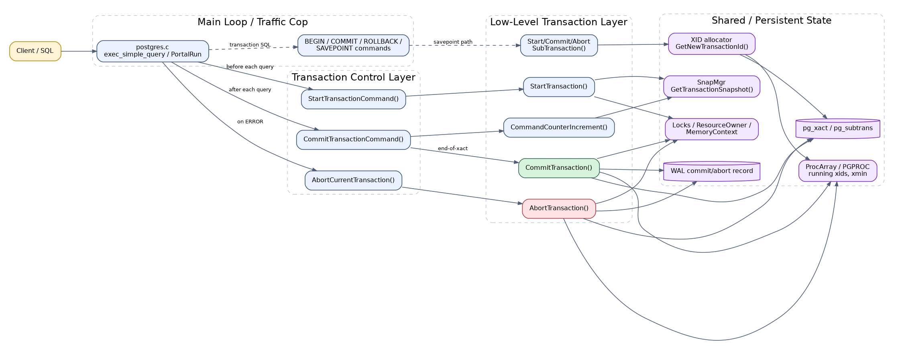
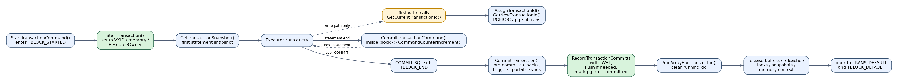
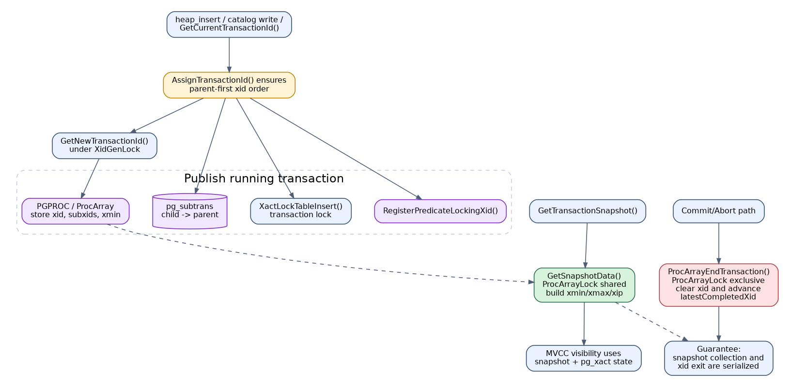
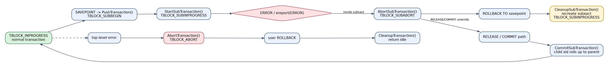

# 🔁 PostgreSQL 事务系统实现框架与源码级分析

> 📌 适用版本：PostgreSQL 14.x / 当前 IvorySQL Pro 代码基线  
> 👥 适用对象：数据库内核开发者、DBA、希望深入理解 PostgreSQL 事务实现的工程师  
> 🎯 阅读目标：从整体框架、执行流程、关键数据结构和核心实现块四个层面理解 PostgreSQL 事务系统
> 🧭 阅读方式：建议先看目录或总览，再进入实现细节、源码摘录和总结部分。

## 🧭 目录

- [🎯 1. 文档目标](#1-文档目标)
- [🧠 2. 一句话理解 PostgreSQL 事务系统](#2-一句话理解-postgresql-事务系统)
- [🗺️ 3. 整体实现框架](#3-整体实现框架)
- [🧩 4. 核心状态机与关键数据结构](#4-核心状态机与关键数据结构)
- [🏗️ 5. 正常事务的流程框架](#5-正常事务的流程框架)
- [🧱 6. 懒分配 XID、快照与可见性边界](#6-懒分配-xid快照与可见性边界)
- [⚙️ 7. 提交流程的源码级拆解](#7-提交流程的源码级拆解)
- [📄 8. 回滚与错误处理的源码级拆解](#8-回滚与错误处理的源码级拆解)
- [🌿 9. 子事务与 Savepoint 机制](#9-子事务与-savepoint-机制)
- [🧱 10. 事务系统和其他模块的边界](#10-事务系统和其他模块的边界)
- [💡 11. 源码阅读顺序建议](#11-源码阅读顺序建议)
- [✅ 12. 总结](#12-总结)

---

<a id="1-文档目标"></a>
## 🎯 1. 文档目标

本文不讲 SQL 层面的 `BEGIN` / `COMMIT` 用法，而是回答以下几个内核问题：

- PostgreSQL 事务系统在代码里分成哪几层。
- 一条事务从开始、执行、提交到清理，函数调用链是怎样的。
- 为什么 PostgreSQL 要把“事务块状态”和“真实事务状态”拆成两套状态机。
- 为什么事务不是一开始就分配 XID，而是延迟到真正需要时才分配。
- 快照获取、XID 分配、事务结束这三件事是如何互相配合保证一致性的。

本文主要围绕以下几个源码模块展开：

- `src/backend/access/transam/README`
- `src/backend/access/transam/xact.c`
- `src/backend/access/transam/varsup.c`
- `src/backend/utils/time/snapmgr.c`
- `src/backend/storage/ipc/procarray.c`

---

<a id="2-一句话理解-postgresql-事务系统"></a>
## 🧠 2. 一句话理解 PostgreSQL 事务系统

PostgreSQL 的事务系统不是“一个函数负责事务”，而是三层协作：

1. `postgres.c` 主循环在每条语句前后调用事务控制入口。
2. `xact.c` 维护事务块状态机、真实事务状态机、子事务栈、提交与回滚顺序。
3. `varsup.c`、`snapmgr.c`、`procarray.c`、`pg_xact`、`pg_subtrans`、WAL 共同提供 XID、快照、事务状态持久化与并发可见性。

事务系统总说明里对这个分层说得很直接：

```c
PostgreSQL's transaction system is a three-layer system.  The bottom layer
implements low-level transactions and subtransactions, on top of which rests
the mainloop's control code, which in turn implements user-visible
transactions and savepoints.

StartTransactionCommand
CommitTransactionCommand
AbortCurrentTransaction
```

这段话非常关键，因为它直接说明：

- 最底层是真正的 low-level transaction/subtransaction。
- 中间层是每条语句前后都会触发的事务控制函数。
- 最上层才是用户看到的 `BEGIN`、`COMMIT`、`ROLLBACK`、`SAVEPOINT`。

---

<a id="3-整体实现框架"></a>
## 🗺️ 3. 整体实现框架



从工程视角，PostgreSQL 事务实现可以拆成四块：

| 层次 | 代表入口 | 作用 |
| --- | --- | --- |
| 主循环层 | `postgres.c` 中的查询处理主循环 | 在每条语句前后挂接事务控制 |
| 事务控制层 | `StartTransactionCommand()`、`CommitTransactionCommand()`、`AbortCurrentTransaction()` | 根据当前事务块状态决定是启动事务、推进命令计数、提交、回滚还是清理 |
| 低层事务层 | `StartTransaction()`、`CommitTransaction()`、`AbortTransaction()`、`StartSubTransaction()` 等 | 真正初始化事务上下文、写提交/回滚 WAL、更新 pg_xact、清理资源 |
| 事务共享状态层 | `GetNewTransactionId()`、`GetTransactionSnapshot()`、`ProcArrayEndTransaction()` | 管理运行中事务、快照边界、XID 分配、提交状态与事务退出 |

README 里还给出了主循环与事务控制的典型配合方式：

```text
BEGIN
  StartTransactionCommand
  ProcessUtility
  CommitTransactionCommand

普通语句
  StartTransactionCommand
  执行查询或更新
  CommitTransactionCommand
  -> CommandCounterIncrement

COMMIT
  StartTransactionCommand
  ProcessUtility
  CommitTransactionCommand
  -> CommitTransaction
```

从这条链路可以直接看出三件事：

- `BEGIN` 不是一次性把整条事务生命周期都做完。
- 显式事务块中的普通语句结束时，一般只推进 `CommandCounterIncrement()`。
- 真正的提交动作发生在 `CommitTransactionCommand()` 驱动的 `CommitTransaction()` 里。

---

<a id="4-核心状态机与关键数据结构"></a>
## 🧩 4. 核心状态机与关键数据结构

### 4.1 两套状态机

PostgreSQL 同时维护两套状态：

- 低层事务状态 `TransState`
- 用户事务块状态 `TBlockState`

对应实现块如下：

```c
typedef enum TransState
{
    TRANS_DEFAULT,
    TRANS_START,
    TRANS_INPROGRESS,
    TRANS_COMMIT,
    TRANS_ABORT,
    TRANS_PREPARE
} TransState;

typedef enum TBlockState
{
    TBLOCK_DEFAULT,
    TBLOCK_STARTED,
    TBLOCK_BEGIN,
    TBLOCK_INPROGRESS,
    TBLOCK_IMPLICIT_INPROGRESS,
    TBLOCK_PARALLEL_INPROGRESS,
    TBLOCK_END,
    TBLOCK_ABORT,
    TBLOCK_ABORT_END,
    TBLOCK_ABORT_PENDING,
    TBLOCK_PREPARE,
    TBLOCK_SUBBEGIN,
    TBLOCK_SUBINPROGRESS,
    TBLOCK_SUBRELEASE,
    TBLOCK_SUBCOMMIT,
    TBLOCK_SUBABORT,
    TBLOCK_SUBABORT_END,
    TBLOCK_SUBABORT_PENDING,
    TBLOCK_SUBRESTART,
    TBLOCK_SUBABORT_RESTART
} TBlockState;
```

这两套状态分别回答两个不同问题：

- `TransState`：内核现在正在做什么。
- `TBlockState`：客户端事务块语义现在走到哪里。

### 4.2 `TransactionStateData`

事务栈节点的核心数据结构如下：

```c
typedef struct TransactionStateData
{
    FullTransactionId fullTransactionId;
    SubTransactionId subTransactionId;
    char       *name;
    int         savepointLevel;
    TransState  state;
    TBlockState blockState;
    int         nestingLevel;
    int         gucNestLevel;
    MemoryContext curTransactionContext;
    ResourceOwner curTransactionOwner;
    TransactionId *childXids;
    int         nChildXids;
    int         maxChildXids;
    Oid         prevUser;
    int         prevSecContext;
    bool        prevXactReadOnly;
    bool        startedInRecovery;
    bool        didLogXid;
    int         parallelModeLevel;
    bool        chain;
    bool        assigned;
    struct TransactionStateData *parent;
} TransactionStateData;
```

最值得关注的字段有：

- `fullTransactionId`：当前事务或子事务的 XID 身份。
- `state` / `blockState`：内核执行状态和客户端事务块状态。
- `curTransactionContext`：事务生命周期内存上下文。
- `curTransactionOwner`：事务拥有的资源。
- `childXids`：已 subcommit 的子事务 XID。
- `parent`：父事务指针。

这说明 PostgreSQL 的子事务实现是典型的“栈 + 父指针”模型，而不是一个简单标志位模型。

### 4.3 事务系统真正依赖的共享对象

除了 `TransactionStateData`，还要记住四个外部对象：

| 对象 | 作用 |
| --- | --- |
| `PGPROC / ProcArray` | 发布“哪些事务正在运行” |
| `pg_xact` | 保存事务提交/回滚状态 |
| `pg_subtrans` | 保存子事务到父事务的映射 |
| Snapshot | 保存 `xmin`、`xmax`、`xip[]` 等可见性边界 |

---

<a id="5-正常事务的流程框架"></a>
## 🏗️ 5. 正常事务的流程框架



### 5.1 `StartTransactionCommand()` 是高层调度器

它的实现不是“总是启动新事务”，而是先看 `blockState`：

```c
void
StartTransactionCommand(void)
{
    TransactionState s = CurrentTransactionState;

    switch (s->blockState)
    {
        case TBLOCK_DEFAULT:
            StartTransaction();
            s->blockState = TBLOCK_STARTED;
            break;

        case TBLOCK_INPROGRESS:
        case TBLOCK_IMPLICIT_INPROGRESS:
        case TBLOCK_SUBINPROGRESS:
            break;

        case TBLOCK_ABORT:
        case TBLOCK_SUBABORT:
            break;

        default:
            elog(ERROR, "StartTransactionCommand: unexpected state %s",
                 BlockStateAsString(s->blockState));
            break;
    }
}
```

这个实现块说明：

- 只有 `TBLOCK_DEFAULT` 才真正调用 `StartTransaction()`。
- 已经在事务块中时，不会重复开启底层事务。
- 已进入 abort 状态的事务块，也不会偷偷恢复，只能等 `ROLLBACK`。

### 5.2 `StartTransaction()` 做的是“建立事务环境”

`StartTransaction()` 的关键实现块如下：

```c
static void
StartTransaction(void)
{
    s->state = TRANS_START;
    s->fullTransactionId = InvalidFullTransactionId;

    s->nestingLevel = 1;
    s->gucNestLevel = 1;

    if (RecoveryInProgress())
    {
        s->startedInRecovery = true;
        XactReadOnly = true;
    }
    else
    {
        s->startedInRecovery = false;
        XactReadOnly = DefaultXactReadOnly;
    }

    XactDeferrable = DefaultXactDeferrable;
    XactIsoLevel = DefaultXactIsoLevel;

    s->subTransactionId = TopSubTransactionId;
    currentSubTransactionId = TopSubTransactionId;
    currentCommandId = FirstCommandId;
    currentCommandIdUsed = false;

    AtStart_Memory();
    AtStart_ResourceOwner();

    vxid.backendId = MyBackendId;
    vxid.localTransactionId = GetNextLocalTransactionId();
    VirtualXactLockTableInsert(vxid);
    MyProc->lxid = vxid.localTransactionId;

    AtStart_GUC();
    AtStart_Cache();
    AfterTriggerBeginXact();

    s->state = TRANS_INPROGRESS;
}
```

这里最重要的结论是：

- 事务开始时先初始化内存上下文、资源拥有者、GUC、cache、trigger。
- 事务开始时就会获得 VXID。
- 事务开始时还没有真实 XID，`fullTransactionId` 仍是 invalid。

### 5.3 `CommandCounterIncrement()` 推进的是事务内可见性

实现块如下：

```c
void
CommandCounterIncrement(void)
{
    if (currentCommandIdUsed)
    {
        if (IsInParallelMode() || IsParallelWorker())
            elog(ERROR, "cannot start commands during a parallel operation");

        currentCommandId += 1;
        if (currentCommandId == InvalidCommandId)
            ereport(ERROR,
                    (errmsg("cannot have more than 2^32-2 commands in a transaction")));

        currentCommandIdUsed = false;

        SnapshotSetCommandId(currentCommandId);
        AtCCI_LocalCache();
    }
}
```

这个函数做的事情很明确：

- 增加 `currentCommandId`
- 把新的 command id 同步给快照系统
- 把本地 catalog / cache 可见性推进到下一条命令

因此它是“事务内部语句边界推进器”，不是提交。

### 5.4 `CommitTransactionCommand()` 只是总控，不是 durable commit 本体

实现块如下：

```c
void
CommitTransactionCommand(void)
{
    switch (s->blockState)
    {
        case TBLOCK_STARTED:
            CommitTransaction();
            s->blockState = TBLOCK_DEFAULT;
            break;

        case TBLOCK_BEGIN:
            s->blockState = TBLOCK_INPROGRESS;
            break;

        case TBLOCK_INPROGRESS:
        case TBLOCK_IMPLICIT_INPROGRESS:
        case TBLOCK_SUBINPROGRESS:
            CommandCounterIncrement();
            break;

        case TBLOCK_END:
            CommitTransaction();
            s->blockState = TBLOCK_DEFAULT;
            break;

        case TBLOCK_SUBBEGIN:
            StartSubTransaction();
            s->blockState = TBLOCK_SUBINPROGRESS;
            break;

        case TBLOCK_SUBRELEASE:
        case TBLOCK_SUBCOMMIT:
            ...
            break;
    }
}
```

它说明：

- 普通事务块中的普通语句结束时，只是 `CommandCounterIncrement()`。
- 只有 `TBLOCK_END` 才真正进入 `CommitTransaction()`。
- 子事务的提交和释放也是在这里统一推进的。

---

<a id="6-懒分配-xid快照与可见性边界"></a>
## 🧱 6. 懒分配 XID、快照与可见性边界



### 6.1 为什么 PostgreSQL 不在事务开始时就分配 XID

事务系统说明里有一段非常关键的话：

```c
Transactions and subtransactions are assigned permanent XIDs only when/if
they first do something that requires one --- typically, insert/update/delete
a tuple, though there are a few other places that need an XID assigned.
If a subtransaction requires an XID, we always first assign one to its
parent.
```

这几句话说明了 PostgreSQL 的基本策略：

- XID 是懒分配的。
- 典型写路径第一次真正需要事务身份时才分配。
- 如果子事务需要 XID，父事务必须先有 XID。

### 6.2 `GetCurrentTransactionId()` 通过 `AssignTransactionId()` 触发懒分配

实现块非常直接：

```c
TransactionId
GetCurrentTransactionId(void)
{
    TransactionState s = CurrentTransactionState;

    if (!FullTransactionIdIsValid(s->fullTransactionId))
        AssignTransactionId(s);
    return XidFromFullTransactionId(s->fullTransactionId);
}
```

也就是说：

- 当前事务已经有 XID 时，直接返回。
- 当前事务还没有 XID 时，现场补分配。

### 6.3 `AssignTransactionId()` 做了哪些关键动作

关键实现块如下：

```c
static void
AssignTransactionId(TransactionState s)
{
    bool isSubXact = (s->parent != NULL);

    if (isSubXact && !FullTransactionIdIsValid(s->parent->fullTransactionId))
    {
        ...
        while (parentOffset != 0)
            AssignTransactionId(parents[--parentOffset]);
    }

    s->fullTransactionId = GetNewTransactionId(isSubXact);
    if (!isSubXact)
        XactTopFullTransactionId = s->fullTransactionId;

    if (isSubXact)
        SubTransSetParent(XidFromFullTransactionId(s->fullTransactionId),
                          XidFromFullTransactionId(s->parent->fullTransactionId));

    if (!isSubXact)
        RegisterPredicateLockingXid(XidFromFullTransactionId(s->fullTransactionId));

    XactLockTableInsert(XidFromFullTransactionId(s->fullTransactionId));
}
```

这段实现块体现出四个关键约束：

1. 子事务必须遵守“父先子后”的 XID 顺序。
2. 顶层事务和子事务的 XID 落地路径不完全一样。
3. 子事务需要写 `pg_subtrans` 父子映射。
4. 分配完 XID 后，还要在事务锁表中发布 XID 锁。

### 6.4 `GetNewTransactionId()` 不只是 `nextXid++`

实现块如下：

```c
FullTransactionId
GetNewTransactionId(bool isSubXact)
{
    LWLockAcquire(XidGenLock, LW_EXCLUSIVE);

    full_xid = ShmemVariableCache->nextXid;
    xid = XidFromFullTransactionId(full_xid);

    ExtendCLOG(xid);
    ExtendCommitTs(xid);
    ExtendSUBTRANS(xid);

    FullTransactionIdAdvance(&ShmemVariableCache->nextXid);

    if (!isSubXact)
    {
        MyProc->xid = xid;
        ProcGlobal->xids[MyProc->pgxactoff] = xid;
    }
    else
    {
        ...
        MyProc->subxids.xids[nxids] = xid;
        pg_write_barrier();
        MyProc->subxidStatus.count = substat->count = nxids + 1;
    }

    LWLockRelease(XidGenLock);
    return full_xid;
}
```

这说明一个新 XID 的发布至少包括：

- 在 `XidGenLock` 下读取并推进 `nextXid`
- 确保 `pg_xact` / `pg_subtrans` / `commit_ts` 页面已可用
- 在退出锁之前，把顶层事务或子事务身份发布到 `PGPROC / ProcArray`

这里的设计目标非常明确：

- 一个事务一旦进入“running”集合，快照系统就必须能看见它。

### 6.5 `GetTransactionSnapshot()` 如何区分隔离级别

实现块如下：

```c
Snapshot
GetTransactionSnapshot(void)
{
    if (!FirstSnapshotSet)
    {
        InvalidateCatalogSnapshot();

        if (IsolationUsesXactSnapshot())
        {
            if (IsolationIsSerializable())
                CurrentSnapshot = GetSerializableTransactionSnapshot(&CurrentSnapshotData);
            else
                CurrentSnapshot = GetSnapshotData(&CurrentSnapshotData);

            CurrentSnapshot = CopySnapshot(CurrentSnapshot);
            FirstXactSnapshot = CurrentSnapshot;
            FirstXactSnapshot->regd_count++;
            pairingheap_add(&RegisteredSnapshots, &FirstXactSnapshot->ph_node);
        }
        else
            CurrentSnapshot = GetSnapshotData(&CurrentSnapshotData);

        FirstSnapshotSet = true;
        return CurrentSnapshot;
    }

    if (IsolationUsesXactSnapshot())
        return CurrentSnapshot;

    InvalidateCatalogSnapshot();
    CurrentSnapshot = GetSnapshotData(&CurrentSnapshotData);
    return CurrentSnapshot;
}
```

从这段实现块可以直接得出：

- `READ COMMITTED`：每次调用都重新 `GetSnapshotData()`
- `REPEATABLE READ` / `SERIALIZABLE`：第一次获取后复制保存，后续重用
- `SERIALIZABLE`：快照还要经过 predicate locking 的包装流程

### 6.6 `GetSnapshotData()` 和 `ProcArrayEndTransaction()` 的互锁关系

快照构造时：

```c
Snapshot
GetSnapshotData(Snapshot snapshot)
{
    ...
    LWLockAcquire(ProcArrayLock, LW_SHARED);
    ...
    latest_completed = ShmemVariableCache->latestCompletedXid;
    myxid = other_xids[mypgxactoff];
    ...
    xmax = XidFromFullTransactionId(latest_completed);
    TransactionIdAdvance(xmax);
    ...
}
```

事务退出时：

```c
void
ProcArrayEndTransaction(PGPROC *proc, TransactionId latestXid)
{
    if (TransactionIdIsValid(latestXid))
    {
        if (LWLockConditionalAcquire(ProcArrayLock, LW_EXCLUSIVE))
        {
            ProcArrayEndTransactionInternal(proc, latestXid);
            LWLockRelease(ProcArrayLock);
        }
        else
            ProcArrayGroupClearXid(proc, latestXid);
    }
}

static inline void
ProcArrayEndTransactionInternal(PGPROC *proc, TransactionId latestXid)
{
    ProcGlobal->xids[pgxactoff] = InvalidTransactionId;
    proc->xid = InvalidTransactionId;
    proc->lxid = InvalidLocalTransactionId;
    proc->xmin = InvalidTransactionId;
    ...
    MaintainLatestCompletedXid(latestXid);
    ShmemVariableCache->xactCompletionCount++;
}
```

这两段实现块组合在一起，表达的约束是：

- 快照构造期间，事务不能一边被扫描、一边从 running set 里悄悄消失。
- 事务退出 running set 时，要和快照构造用 `ProcArrayLock` 串行化。
- 这样 `xmin` / `xmax` / `xip[]` 才不会出现不一致边界。

---

<a id="7-提交流程的源码级拆解"></a>
## ⚙️ 7. 提交流程的源码级拆解

### 7.1 `CommitTransaction()` 的总体顺序

`CommitTransaction()` 的关键实现块如下：

```c
static void
CommitTransaction(void)
{
    for (;;)
    {
        AfterTriggerFireDeferred();
        if (!PreCommit_Portals(false))
            break;
    }

    CallXactCallbacks(...XACT_EVENT_PRE_COMMIT);

    if (IsInParallelMode())
        AtEOXact_Parallel(true);

    PreCommit_FdwXact(is_parallel_worker);
    AfterTriggerEndXact(true);
    PreCommit_on_commit_actions();
    smgrDoPendingSyncs(true, is_parallel_worker);
    AtEOXact_LargeObject(true);
    PreCommit_Notify();

    if (!is_parallel_worker)
        PreCommit_CheckForSerializationFailure();

    HOLD_INTERRUPTS();
    AtEOXact_RelationMap(true, is_parallel_worker);

    s->state = TRANS_COMMIT;
    s->parallelModeLevel = 0;

    if (!is_parallel_worker)
        latestXid = RecordTransactionCommit();

    ProcArrayEndTransaction(MyProc, latestXid);

    ResourceOwnerRelease(...RESOURCE_RELEASE_BEFORE_LOCKS...);
    AtEOXact_Buffers(true);
    AtEOXact_RelationCache(true);
    AtEOXact_Inval(true);
    AtEOXact_MultiXact();
    ResourceOwnerRelease(...RESOURCE_RELEASE_LOCKS...);
    ResourceOwnerRelease(...RESOURCE_RELEASE_AFTER_LOCKS...);

    smgrDoPendingDeletes(true);
    AtCommit_Notify();
    AtEOXact_GUC(true, 1);
    AtEOXact_SPI(true);
    AtEOXact_Snapshot(true, false);
    AtCommit_Memory();

    s->state = TRANS_DEFAULT;
    RESUME_INTERRUPTS();
}
```

这个顺序可以概括成三段：

1. pre-commit 阶段：触发器、portal、FDW、NOTIFY、序列化检查
2. durable commit 阶段：`RecordTransactionCommit()` + `ProcArrayEndTransaction()`
3. 后清理阶段：释放 buffer pin、relcache、锁、快照、内存

### 7.2 `RecordTransactionCommit()` 才是“真正提交点”

关键实现块如下：

```c
static TransactionId
RecordTransactionCommit(void)
{
    TransactionId xid = GetTopTransactionIdIfAny();
    bool markXidCommitted = TransactionIdIsValid(xid);
    ...
    nrels = smgrGetPendingDeletes(true, &rels);
    nchildren = xactGetCommittedChildren(&children);
    wrote_xlog = (XactLastRecEnd != 0);

    if (!markXidCommitted)
    {
        ...
    }
    else
    {
        BufmgrCommit();
        START_CRIT_SECTION();
        MyProc->delayChkpt = true;

        SetCurrentTransactionStopTimestamp();

        XactLogCommitRecord(xactStopTimestamp,
                            nchildren, children, nrels, rels,
                            nmsgs, invalMessages,
                            RelcacheInitFileInval,
                            MyXactFlags,
                            InvalidTransactionId, NULL);
    }

    if ((wrote_xlog && markXidCommitted &&
         synchronous_commit > SYNCHRONOUS_COMMIT_OFF) ||
        forceSyncCommit || nrels > 0)
    {
        XLogFlush(XactLastRecEnd);
        if (markXidCommitted)
            TransactionIdCommitTree(xid, nchildren, children);
    }
    else
    {
        XLogSetAsyncXactLSN(XactLastRecEnd);
        if (markXidCommitted)
            TransactionIdAsyncCommitTree(xid, nchildren, children, XactLastRecEnd);
    }

    if (wrote_xlog && markXidCommitted)
        SyncRepWaitForLSN(XactLastRecEnd, true);
}
```

这段实现块对应的结论非常清晰：

- 提交不是“改一个状态位”。
- 标准提交路径一定先写 WAL commit record。
- 需要同步提交时，先 `XLogFlush()`，再 `TransactionIdCommitTree()`。
- 异步提交时，不立即 flush，但也不会直接丢掉事务状态，而是登记 async commit LSN。
- 同步复制开启时，还要继续等待 standby 确认。

### 7.3 为什么 `ProcArrayEndTransaction()` 必须早于锁释放

在 `CommitTransaction()` 里，顺序是：

```c
latestXid = RecordTransactionCommit();
ProcArrayEndTransaction(MyProc, latestXid);

ResourceOwnerRelease(...RESOURCE_RELEASE_BEFORE_LOCKS...);
AtEOXact_Buffers(true);
AtEOXact_RelationCache(true);
AtEOXact_Inval(true);
AtEOXact_MultiXact();
ResourceOwnerRelease(...RESOURCE_RELEASE_LOCKS...);
```

这说明 PostgreSQL 的设计意图是：

- 先对外宣布“我已经不是 running transaction”。
- 然后再逐步释放 buffer pin、relcache、锁。

这样等待本事务锁的其他 backend 在被唤醒时，能看到一致的事务完成状态。

---

<a id="8-回滚与错误处理的源码级拆解"></a>
## 📄 8. 回滚与错误处理的源码级拆解



### 8.1 `AbortCurrentTransaction()` 是高层调度器

关键实现块如下：

```c
void
AbortCurrentTransaction(void)
{
    switch (s->blockState)
    {
        case TBLOCK_STARTED:
        case TBLOCK_IMPLICIT_INPROGRESS:
            AbortTransaction();
            CleanupTransaction();
            s->blockState = TBLOCK_DEFAULT;
            break;

        case TBLOCK_INPROGRESS:
        case TBLOCK_PARALLEL_INPROGRESS:
            AbortTransaction();
            s->blockState = TBLOCK_ABORT;
            break;

        case TBLOCK_ABORT_END:
            CleanupTransaction();
            s->blockState = TBLOCK_DEFAULT;
            break;

        case TBLOCK_SUBINPROGRESS:
            AbortSubTransaction();
            s->blockState = TBLOCK_SUBABORT;
            break;

        case TBLOCK_SUBBEGIN:
        case TBLOCK_SUBRELEASE:
        case TBLOCK_SUBCOMMIT:
        case TBLOCK_SUBABORT_PENDING:
        case TBLOCK_SUBRESTART:
            AbortSubTransaction();
            CleanupSubTransaction();
            AbortCurrentTransaction();
            break;
    }
}
```

这段实现块说明：

- SQL 报错后，不一定立刻回到 idle。
- 显式事务块报错时，系统会进入 `TBLOCK_ABORT`，后续命令基本都被拒绝，只等用户 `ROLLBACK`。
- 子事务报错时，可以先停留在 `TBLOCK_SUBABORT`，由 savepoint 逻辑继续处理。

### 8.2 `AbortTransaction()` 的目标是“尽快止血”

关键实现块如下：

```c
static void
AbortTransaction(void)
{
    HOLD_INTERRUPTS();

    AtAbort_Memory();
    AtAbort_ResourceOwner();

    LWLockReleaseAll();
    pgstat_report_wait_end();
    pgstat_progress_end_command();
    AbortBufferIO();
    UnlockBuffers();
    XLogResetInsertion();
    ConditionVariableCancelSleep();
    LockErrorCleanup();
    reschedule_timeouts();
    PG_SETMASK(&UnBlockSig);

    s->state = TRANS_ABORT;

    SetUserIdAndSecContext(s->prevUser, s->prevSecContext);
    ResetReindexState(s->nestingLevel);
    ResetLogicalStreamingState();
    SnapBuildResetExportedSnapshotState();

    if (IsInParallelMode())
    {
        AtEOXact_Parallel(false);
        s->parallelModeLevel = 0;
    }

    AfterTriggerEndXact(false);
    AtAbort_Portals();
    smgrDoPendingSyncs(false, is_parallel_worker);
    AtEOXact_LargeObject(false);
    AtAbort_Notify();
    AtEOXact_RelationMap(false, is_parallel_worker);
    AtAbort_Twophase();
    AtEOXact_FdwXact(false, is_parallel_worker);

    latestXid = RecordTransactionAbort(false);
    ProcArrayEndTransaction(MyProc, latestXid);
}
```

可以看到它更像“故障清理脚本”而不是“正常收尾逻辑”：

- 先释放 LWLock 和等待现场，尽快止血
- 再恢复用户态与安全上下文
- 再处理 trigger、portal、notify、relation map、FDW
- 最后写 abort record，并从 running transaction 集合中退出

### 8.3 `RecordTransactionAbort()` 为什么不用像 commit 那样 flush

关键实现块如下：

```c
static TransactionId
RecordTransactionAbort(bool isSubXact)
{
    TransactionId xid = GetCurrentTransactionIdIfAny();
    ...
    if (!TransactionIdIsValid(xid))
        return InvalidTransactionId;

    START_CRIT_SECTION();

    XactLogAbortRecord(xact_time,
                       nchildren, children,
                       nrels, rels,
                       MyXactFlags, InvalidTransactionId,
                       NULL);

    if (!isSubXact)
        XLogSetAsyncXactLSN(XactLastRecEnd);

    TransactionIdAbortTree(xid, nchildren, children);

    END_CRIT_SECTION();
    latestXid = TransactionIdLatest(xid, nchildren, children);
    ...
}
```

这里和提交路径的最大区别是：

- abort 写 WAL，但默认不要求像 commit 那样先 flush 到磁盘再更新事务状态。
- 原因是系统崩溃后的保守默认就是“这笔事务没提交成功”，因此 abort 不需要 commit 那样强的持久化语义。

---

<a id="9-子事务与-savepoint-机制"></a>
## 🌿 9. 子事务与 Savepoint 机制

### 9.1 子事务本质上是一条事务状态栈

事务系统说明里有这样一段：

```c
Subtransactions are implemented using a stack of TransactionState structures,
each of which has a pointer to its parent transaction's struct.
```

这句话已经把模型讲完了：

- 每个子事务就是一个新的 `TransactionStateData`
- `parent` 指向父事务
- `CurrentTransactionState` 永远指向当前栈顶

### 9.2 `SAVEPOINT` / `RELEASE` / `ROLLBACK TO` 的真实推进方式

`CommitTransactionCommand()` 里的子事务推进实现块如下：

```c
case TBLOCK_SUBBEGIN:
    StartSubTransaction();
    s->blockState = TBLOCK_SUBINPROGRESS;
    break;

case TBLOCK_SUBRELEASE:
    do
    {
        CommitSubTransaction();
        s = CurrentTransactionState;
    } while (s->blockState == TBLOCK_SUBRELEASE);
    break;

case TBLOCK_SUBCOMMIT:
    do
    {
        CommitSubTransaction();
        s = CurrentTransactionState;
    } while (s->blockState == TBLOCK_SUBCOMMIT);
    if (s->blockState == TBLOCK_END)
        CommitTransaction();
    break;

case TBLOCK_SUBRESTART:
    AbortSubTransaction();
    CleanupSubTransaction();
    DefineSavepoint(NULL);
    StartSubTransaction();
    s->blockState = TBLOCK_SUBINPROGRESS;
    break;
```

这几段合在一起，可以得出两个结论：

- `RELEASE SAVEPOINT` 本质是把子事务栈逐级折叠回父事务。
- `ROLLBACK TO SAVEPOINT` 不是“回到原对象”，而是把目标层 abort 掉之后，再重新创建一个同名的新子事务层。

### 9.3 子事务提交时，child xid 如何上传给父事务

实现块如下：

```c
static void
AtSubCommit_childXids(void)
{
    ...
    s->parent->childXids[s->parent->nChildXids] =
        XidFromFullTransactionId(s->fullTransactionId);

    if (s->nChildXids > 0)
        memcpy(&s->parent->childXids[s->parent->nChildXids + 1],
               s->childXids,
               s->nChildXids * sizeof(TransactionId));

    s->parent->nChildXids = new_nChildXids;
    ...
}
```

这个实现块说明：

- 子事务提交时，不是立刻像顶层事务那样写最终 commit 状态。
- 它先把自己的 xid 和已经 subcommit 的 child xid 归并到父事务。
- 这样顶层 `RecordTransactionCommit()` 才能一次性处理整棵事务树。

### 9.4 内部子事务和用户 savepoint 不完全一样

事务系统说明里还有这样一段：

```c
Other subsystems are allowed to start "internal" subtransactions, which are
handled by BeginInternalSubTransaction.  This is to allow implementing
exception handling, e.g. in PL/pgSQL.
```

这说明：

- 除了用户显式 `SAVEPOINT`，系统内部也会创建子事务。
- 典型用途就是 PL/pgSQL 异常处理和 SPI 内部隔离错误。
- 这类内部子事务在状态推进时更直接，不一定走完整的 SQL savepoint 语义路径。

---

<a id="10-事务系统和其他模块的边界"></a>
## 🧱 10. 事务系统和其他模块的边界

事务系统本身并不独立完成所有事务语义，它更像总控层，真正效果依赖多个模块协作：

| 模块 | 事务系统调用点 | 作用 |
| --- | --- | --- |
| WAL | `XactLogCommitRecord()` / `XactLogAbortRecord()` | 持久化事务结束事件 |
| `pg_xact` | `TransactionIdCommitTree()` / `TransactionIdAbortTree()` | 保存提交或回滚状态 |
| ProcArray | `GetSnapshotData()` / `ProcArrayEndTransaction()` | 维护运行中事务集合 |
| SnapMgr | `GetTransactionSnapshot()` | 事务级或语句级快照 |
| Lock Manager | `XactLockTableInsert()` / 事务结束释放锁 | 阻塞与并发控制 |
| Predicate Locking | `RegisterPredicateLockingXid()` / `PreCommit_CheckForSerializationFailure()` | Serializable 隔离级支持 |
| ResourceOwner | `ResourceOwnerRelease()` | 统一释放 buffer pin、锁、catcache 引用等 |
| MemoryContext | `AtStart_Memory()` / `AtCommit_Memory()` | 事务级内存生命周期 |

所以想真正理解 PostgreSQL 事务，必须同时知道：

- 事务控制不等于 MVCC。
- MVCC 不等于 WAL。
- WAL 也不等于锁管理。

它们是分层协作关系。

---

<a id="11-源码阅读顺序建议"></a>
## 💡 11. 源码阅读顺序建议

如果准备从源码真正把事务系统读透，建议按这个顺序：

1. 先读 `README`  
   先把三层模型、两阶段 commit/abort、子事务栈的总体概念建立起来。

2. 再读 `xact.c` 里的状态机和调度入口  
   重点看：
   - `TransState`
   - `TBlockState`
   - `TransactionStateData`
   - `StartTransactionCommand()`
   - `CommitTransactionCommand()`
   - `AbortCurrentTransaction()`

3. 再读启动、提交、回滚三个低层函数  
   - `StartTransaction()`
   - `CommitTransaction()`
   - `AbortTransaction()`

4. 再读 XID 分配  
   - `GetCurrentTransactionId()`
   - `AssignTransactionId()`
   - `GetNewTransactionId()`

5. 再读快照和 ProcArray 互锁  
   - `GetTransactionSnapshot()`
   - `GetSnapshotData()`
   - `ProcArrayEndTransaction()`

6. 最后再看 Serializable、Two-Phase Commit、Logical Decoding 等扩展路径  
   否则很容易在主线没建立前就陷进大量分支细节。

---

<a id="12-总结"></a>
## ✅ 12. 总结

PostgreSQL 事务系统的关键设计可以浓缩成五句话：

1. 事务控制分三层，用户 SQL、事务块控制、低层事务实现各司其职。
2. PostgreSQL 同时维护 `TransState` 和 `TBlockState`，分别描述内核执行状态和客户端事务块语义。
3. XID 是懒分配的，事务开始时先有 VXID，不一定立刻有真实 XID。
4. 快照获取和事务退出通过 `ProcArrayLock` 互锁，保证 MVCC 可见性边界一致。
5. 真正 durable commit 的核心在 `RecordTransactionCommit()`，而不是 `COMMIT` 语句本身。

如果把源码主线压缩成一条路径，就是：

```text
StartTransactionCommand
-> StartTransaction
-> GetTransactionSnapshot
-> 按需 AssignTransactionId
-> 每条语句后 CommandCounterIncrement
-> CommitTransactionCommand
-> CommitTransaction
-> RecordTransactionCommit
-> ProcArrayEndTransaction
-> 释放锁和资源
```

回滚路径则是：

```text
ERROR / ROLLBACK
-> AbortCurrentTransaction
-> AbortTransaction
-> RecordTransactionAbort
-> ProcArrayEndTransaction
-> CleanupTransaction
```

这就是 PostgreSQL 事务系统最核心的实现框架和流程框架。
